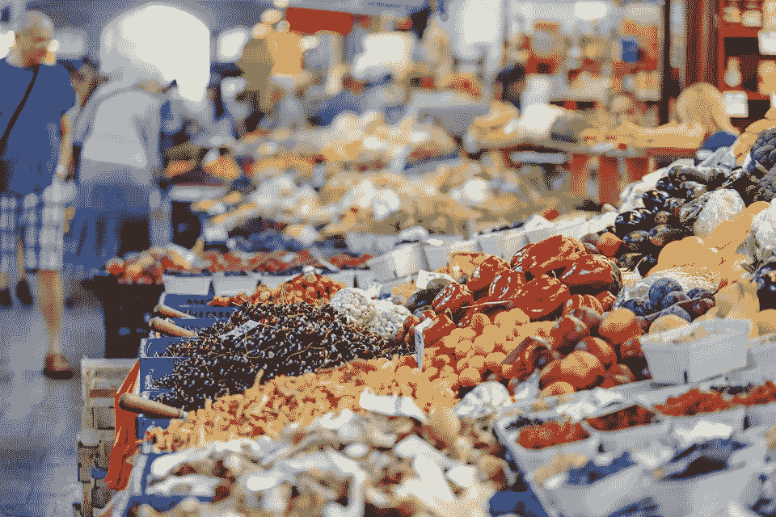

# 不断增长的全球人口呼唤更好的食品生产技术

> 原文：<https://medium.com/hackernoon/growing-global-population-food-production-technology-8a8b686e5958>

世界人口的增长带来了很多问题。联合国经济和社会事务部的一项研究预测，到 2050 年，世界人口将达到 112 亿；比今天的 70 亿有了显著的增长。

尽管人口在增长，但全球食品供应链并没有相应增长。

联合国进行的另一项研究，这次是由 T2 粮食和农业组织进行的，表明世界饥饿人口也在增加。报告指出，营养不良的人数每年都在增加，最新数据显示，多达 8 . 15 亿人很少或根本无法获得稳定的营养食品。

# **不断增长的需求应该会推动投资……但是**

粮农组织认识到这个问题会随着时间的推移而恶化——粮食生产能力必须随着人口的增长而增长。粮农组织指出…“如果世界人口达到 91 亿，那么今天的粮食产量应该增加 70%才能完全满足日益增长的需求。”

不言而喻，为了增加粮食产量，各种食物链部门也必须承诺增加对生产能力的投资。

然而，许多公司似乎不愿意在不清楚预期回报的情况下进行重大投资。从纯商业的角度来看，这当然是可以理解的——但这不会帮助养活很多饥饿的人。

阻碍产能增长的还有各国政府实施所谓的环保法律。例如，美国希望减少温室气体排放，但是这样做的话，农民将不得不减少或淘汰一些老的屡试不爽的方法。

例如，氮肥已经被广泛使用，因为它们相对便宜并且非常有效。然而，它们会产生大量的温室气体排放，因此生产商不能过量使用。

# **通过可持续、生态友好的室内水产养殖帮助养活世界**

虾业是一个富含蛋白质的食品行业，近年来生产率一直很低，可以使用创新的解决方案来解决这个问题。

根据粮农组织的数据，2016 年全球养殖的虾数量停滞不前，或者实际上有所下降。这主要是由于持续的虾病和其他相关问题影响了亚洲和中南美洲的虾数量，这个问题今天仍然存在。

然而，像 [NaturalShrimp，Inc.](http://naturalshrimp.com/) (OTCQB: SHMP)这样的行业领导者可能是解决部分全球食品供应链问题和虾短缺的关键之一。

# **正在申请专利，专有技术**

该公司开发了正在申请专利的专有技术，可以在世界任何地方，在室内循环海水设施中持续经济地种植新鲜的美食级虾，完全不使用抗生素或有害化学物质。

这种革命性的新系统被称为弧菌抑制技术(VST)，它可以排除和抑制细菌等有害生物，同时避免硝酸盐和亚硝酸盐的产生和积累，这两类化学副产品在历史上一直是旧技术的问题。

NaturalShrimp 还使用专有的计算机化系统仔细监控水的喂食、氧化和温度，该系统每天 24 小时提供实时反馈。该公司的自动化监测和控制系统是在几年的时间内开发的，有助于在最少的人力投入下管理全尺寸生产设施中的 24 个生长罐。

每个 NaturalShrimp 工厂设计为每周生产 6000 磅新鲜、全天然的太平洋白虾(每磅 18-22 支)，从 10 天大的后期幼虾(PL10s)开始。每个“作物”的生长过程需要 24 周的培养时间

与其他常见的冷冻虾产品相比，其高级鲜虾应具有显著的溢价，并向其他水产养殖生产商证明，创新技术确实可以提供投资回报，以证明在其特定领域增加投资是合理的。

作为生态友好和可持续水生生物养殖的领导者，人们只能希望 NaturalShrimp 激励更多的企业家加入到养活不断增长的世界人口的努力中来。