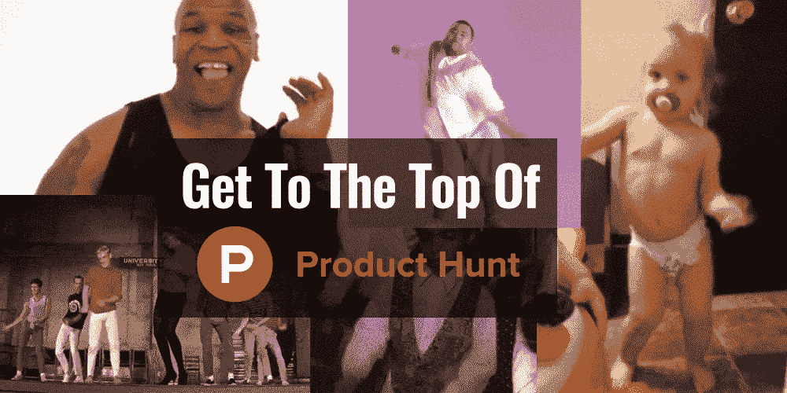

# 成长让你登上产品搜寻的巅峰

> 原文：<https://medium.com/hackernoon/growth-hack-your-way-to-the-top-of-product-hunt-2f09e925cc06>

在我告诉你如何到达产品搜索的顶端之前，我为什么不先和你分享一下大多数人是如何到达顶端的(并且悲惨地失败，随后哭着入睡)。

# 大多数傻瓜在寻找产品时会做什么

1.  谷歌“如何在产品搜索中获得第一”
2.  阅读 2-3 篇博客文章，每篇包含 5-10 条建议
3.  实施 5 个最简单的技巧
4.  …等等…
5.  失败(例如，甚至上不了头版)
6.  哭
7.  甚至不知道他们错在哪里

# 100%肯定火绝对有可能死的方式达到产品搜索的顶端(并赢得你跳胜利舞的机会)

让我们面对它，产品搜寻是一个“零和游戏”，它是二元的。要么你是在头版，并获得回报，要么你不是，并获得所有的流量。因此，我们需要保证我们在头版(至少)，并希望在前 3 名。

**免责声明:**如果你的产品绝对烂，这就没用了。*尽管*你的产品有一点烂，但它可能仍然有效。

**第二个免责声明**:有些信息是 12-18 个月前的，但应该还是相当准确的。做你自己的功课，仔细检查，并发现任何新的黑客。

1.  研究网上每一篇关于产品搜索排名的文章，并在电子表格中列出“排名因素”
2.  **观察产品搜寻 2 周**，记录你看到的赢家做的每一个模式，同时也观察输家，看看他们做错了什么(再次添加到你的电子表格中)
3.  **联系你网络中所有已经开始寻找产品的人**，询问他们的策略是什么(即使是那些失败的人，相信我，失败也是学习)——添加到你的电子表格中
4.  **接触那些你甚至不知道已经进入前三名的创始人，询问他们的策略，添加到你的电子表格中**
5.  **联系顶级猎头**，询问他们关于排名的建议(建立关系，你很快就会发现‘猎人’是成功的首要因素，所以其中一个对你至关重要)——添加到电子表格中
6.  **在你的电子表格中增加两栏**，“潜在影响”和“易于实施”。这些问题的得分为 1-10 分。你要乘以这个分数，这样你就知道*低挂水果*是什么了。

# 低垂的果实法

因此，你现在有一个电子表格，其中至少有 10-20 个(可能有 50 个)因素会影响你在产品搜索中的排名。不，这不全是关于选票的问题，这比 T21 要复杂得多。现在就去那里，你会注意到这个顺序不仅仅是基于赞成票。

## **潜在影响**

有些因素比其他因素更重要。没错，upvotes 是一个主要的，但猎人也是，其他很多东西也是。我心情很好，所以我会给你一份启动这个项目的因素清单，但我不会把我研究出来的所有东西都给你，因为我希望那些真正把工作放在 T3 的人会赢，而不仅仅是那些能看懂一篇该死的文章的人……(尽管如此，我还是会给你一些帮助)

*(严厉的爱，对)*

我们希望对 3 个因素的潜在影响进行排序:
1。**确定性**——我们有多确定这个*实际上*很重要。这来自于我们如何不断地听到这一因素(从文章，我们的[网络](https://hackernoon.com/tagged/network)，我们与之交谈的任何人，我们实际上看到它发生了多少)

2.**力量**——我们认为这会将指针移动多少？如果这是我们唯一需要的东西(也就是说，如果我们合法地获得了 10，000 张选票),这足以让我们单独排名吗？那就是 10 分了。如果这是一个基本的小事情，可能会像 1%那样移动指针，那么它就是 1。

**3。对其他因素的影响**——这是创始人完全忽略的一个常见因素——一些因素会影响其他因素。我给你举个例子——最好的方法之一是在一天中正确的时间(新的一天开始寻找产品的时候)发帖。这让你在竞争中领先一步，让你在他们上线之前获得更多的支持票；这意味着你在首页的排名更高，并且因为你的排名得到更多的支持票。因此，这个看似很小的因素会影响其他因素，因此具有很高的过度影响分数。

## 易于实施

这个问题比较容易解决——需要做多少工作。如果要花掉你整整一周的时间(如果你真的想在[初创企业](https://hackernoon.com/tagged/startup)的世界中获胜，应该是 80 多个小时)，那么它就是 1。如果不到 10 分钟，那就是 10 分。

需要考虑的一件事是——你能做到吗，或者你是否依赖于他人。如果有什么事情需要我管理/与其他人沟通，我会马上得到一个 sh！ttier 评分(我和别人玩的不好)。

## 成功倍增——“总分”栏

将两个分数相乘。这给出了你的总分。分数越高，优先级越高。

*举几个例子，这样就比较清楚了:*

**因素:使用 GIF 而不是静态图像**(更好地吸引眼球，更高的点击率=影响算法)

*影响得分:* ***2***
它得到的是 2 而不是 1，因为如果你获得更高的 CTR，它实际上会影响产品搜索算法。

*轻松实现评分:* ***7*** 又不是弄个 10，因为你得把它弄得实际好看点，然后压缩什么的。如果你不擅长这个，你可能需要用一个设计师；他们必须知道如何处理视频/动画。不过还是很简单。

*总分:****14***(7 x2 = 14，快速数学，Skrrat，skidi-kat-kat)

因素:找一个好的猎人(他们的等级更高，这绝对重要)

*影响评分:* ***10***
除了 Upvotes 之外，没有什么比这个更重要的了，而且它们相互关联很多，原因很多我后面会讲到。

*轻松实现评分:* ***6*** 这个对我来说是 6。这不像给几个人发邮件那么简单，你可能需要建立关系。我们在封闭测试版上进行了测试，还增加了一些额外的好处。你还需要研究。你想要一个猎人，持续地把他们的东西放在头版，对你做的事情感兴趣，然后伸出手。所以不是*说*容易说实话。

总分: **60** (轰！)

所以很明显，如果我们必须选择，我们会努力得到那个猎人，而不是做一个花哨的 GIF。事情是这样的，你想要尽可能多的触及*因素*，同时从顶部开始检查你的优先级列表。

# 但是该死的杰瑞德，那有很多工作要做！

现在你可能在想，天哪，Jared，这是一个很大的工作量，不是吗？是的，但是产品搜寻是有回报的。

排名第一帮助我们登上了 TechCrunch(在那里，我连续 4 天获得第一名的文章——如果你想要完整的方法，可以查看我的网站[**【www.newhackeveryweek.com】**](http://www.newhackeveryweek.com)——尽管是付费会员)，并带来了 8 位数的估值和 7 位数的投资；所以是值得的。产品搜寻是许多发布活动的重要组成部分。所以只管做那该死的工作。

# 等等，这个对其他东西有用吗？

是的。

低挂水果法适用于一切，从操纵媒体，到脸书，到搜索引擎优化。

这是真正的‘成长黑客’，*弄脏你该死的手*并学习**关于你想玩的平台的一切**。

如果你在每一个方面(即每一个因素)都比竞争对手做得更好，你就不可能赢。(故意说糟糕的英语是我经常做的事情——我讨厌我高中的英语老师，所以现在我在使用糟糕的语法和拼写时确保自己是一个联合作者——去你妈的卡拉汉学院的安·罗斯，你是个黑客)

# 杰瑞德，你能让我的生活简单点，给我一些因素吗？

我学到的一件事(艰难的方式)是**我不能让某人成功**。我指导*所以*很多人，这完全取决于他们。但是，我可以给你一个很棒的提示。

我真的坐在这里很矛盾。因为我知道，如果我把它交给你，99.947%读过《T4》的人甚至不会去读它。或者他们会半途而废，这更糟糕，因为你得到低劣的结果，但它仍然花费你的时间。

但是去他妈的。

# 产品搜寻的主要因素

## 找个好猎手

**冲击:10，轻松:6，总体:60**

我知道我以前提到过这个，但我想多解释一点。

要找到优秀的猎人，请点击这里:[http://500hunters.com/](http://500hunters.com/)

合适的猎人会做很多事情:

1.  他们用 PH 算法做得更好
2.  他们甚至会给你发邮件，或者在他们的社交媒体上发帖——如果你选择了一个合适的人(做好你的功课！)
3.  他们可能会帮助你获得投资(我们间接获得了投资——他为我们做了很棒的介绍，这导致了我们的主要投资者——我知道这不会影响 PH，但仍然很棒)
4.  主要一:ProductHunt 会在日常邮件中向这个猎人的追随者推广你。
5.  如果你有合适的搜索者，产品搜索实际上可能会发关于你的推文(加上其他原因，但这是我们在研究中发现的一个重要因素)

不要半吊子工作出正确的猎人。不要给他们发愚蠢的邮件。他们时间紧迫，所以要冷静。

你的电子邮件应该有点像这样，应该在你真正想被追捕前 2 周发出。如果他们是顶级猎人，他们通常是非常成功的(即忙碌)，所以给他们时间来回应，如果他们拒绝，也有时间去你的后备计划。如果他们拒绝了，不要犯傻，无论如何都要感谢他们的时间— *创业社区很小，我们会聊天。*

> 嘿 XYZ！
> 
> 只是想联系一下，因为我们很快就要推出 ProductHunt，如果你能成为我们的猎人，我们会很高兴。
> 
> 我注意到你最近在追踪 ABC 初创公司——我们的公司实际上非常相似，但不同之处在于我们<insert one-sentence="" pitch="">。</insert>
> 
> 如果你愿意，我可以让你提前进入，我会给你一切你需要的东西去猎捕它。
> 
> 如果你感兴趣，就告诉我。我们有一天/一段时间想要猎杀它，如果你愿意，我们很乐意告诉你细节。
> 
> 又及:我注意到你是 XYZ 的球迷，当他们在 4 月 1 日打 ABC 时，你有空吗？如果是这样，我有两张票，上面有你的名字；)

注意:我没有赠送任何门票，如果我真的想要猎人，我会这样做。我们有三个潜在的选择，我们免费得到了第一个选择。

## **适时推出**

**影响力:10，轻松度:9，综合:90**

你想在太平洋标准时间午夜发布，这样你就可以在美国的竞争中领先一步，并从欧盟的流量中获得更多的选票。这将让你得到一个最高的排名，这当然意味着更多的能见度，和更多的投票。这种提前启动使得那些晚启动的公司几乎不可能赶上。

## **建立一个清单——带上你自己的支持票(下雨吧，孩子)**

**影响力:10，轻松度:4，总体:40**

*无论如何你都应该这么做！*

但基本上，如果你有一个发布前的名单，比如说，1000 人，你甚至可以得到 200 人的支持(特别是如果你让他们在一天的早些时候这样做)，你将有一个巨大的开端。

使用类似 viral-loops.com 的东西(我们这样做，但定制我们的)。

**专业提示:**我们发现 ProductHunt 首页的 CTR(点击率)很重要。你想让你的观众去首页，滚动到你，点击你。然后，在你的页面里给你投票。不要直接发送到你的页面，这样影响较小。

## 回复评论(快速)

**影响:3，缓解:10，总体:30**

听着，如果你不打算这么做，你就是个混蛋。但我觉得有必要提一下，因为它实际上是 Product Hunt 算法的一个因素。迅速回复评论也会给你带来好感，并让你有更大的机会让这些人分享你的狩猎。

**专业提示**:实际上在评论上下点该死的功夫。这不是走捷径的时候，这些人可能是你的福音传播者；我们的一些评论者给了我们很大的帮助。

**亲亲提示**:赶紧对所有评论者做功课。如果他们有一个体面的追随者(1k+)，给他们发 DM，让他们为你分享到社交媒体上。再说一次，保持冷静。(这真的可以很好地工作)

## 发表第一条评论

**影响:2，缓和:10，总体:20**

我们利用这个机会链接到我们的媒体文章，新闻资料袋，并给出一个更长更全面的描述。我们这样做是因为我们发现很多顶尖的人都在这么做，而且做起来超级简单。

这也表明你很投入，并准备回答人们在评论区的任何问题——通过鼓励评论，你会得到更多，这是一个排名因素。

## 周四或周五发布

**影响:2，缓解:10，总体:20**

从我们的研究中，我们得出结论，这有最大的回报(最多的整体投票)，这意味着更多的竞争，但也有更多的回报(即流量)

## **接近多个猎人进行评论**

**影响:5，缓和:7，总体:45**

你知道谁用产品搜索最多吗？受欢迎的猎人。

不要发邮件要求他们投赞成票。取而代之的是，给他们发电子邮件，请他们检查一下并给出反馈。自然，很多人会投赞成票。

*猎人的排名越高，他们的评论对算法的影响就越大*——所以通过评论表明你想要他们的反馈，这样你就可以公开地参与进来。

如果他们真的喜欢，他们也可能会在社交媒体上分享。

## 你的整个团队打过朋友/家人吗

**冲击:4，轻松:6，总体:24**

让每个人在社交媒体上联系他们认识的每个人去投票支持它。记住，把它们放在首页，而不是你的真实页面，这真的很重要。

## 病毒机器人战役(建立 FB 信使列表)

**影响力:10，轻松度:6，总体:60**

我发明了一个病毒机器人竞赛方法，它是杀手。无论如何，举办一场比赛，并从中建立一个 FB messenger 列表，然后当你在 PH 上启动时，让列表转到首页，滚动到你，点击你，然后投票支持你(是的，所有这些步骤，我们听说过直接流量到你的页面算作零票，因为他们的反欺诈-愚蠢的我知道，但它就是这样)

这里有一个关于如何进行这项比赛的视频:

This works basically every time. Just do it, Nike style.

# 其他因素:

1.  **写下你的单行描述**——(60 个字符的限制)——使用表情符号，让它突出出来。
2.  **使用 GIF 截图**——这样更吸引人
3.  **使用视频**——如果可以，使用视频
4.  **将展示图片制作成 GIF**——这让它更加突出
5.  **使所有图像都合适** —使尺寸合适，并确保它们适合视网膜显示。看看上面的人在做什么，模仿一下。

我只能给你这么多。还有更多——去把它解决掉。自己研究吧。如果你不愿意那样做，无论如何你也不愿意遵循我的建议，你这个懒虫。

# 重要的是:不要拥抱黑暗面

作为一个成长黑客，我一直在寻找黑 sh 的方法！所以当我第一次看到 Product Hunt 的时候，我想“哦，是的，我会得到一堆虚假的支持票，然后统治这个——笨蛋！”。

但后来我做了功课，发现了一些事情:

1.  他们有强有力的反欺诈措施——你可能会被抓住
2.  你没有第二次机会。你被抓了，你的产品搜索就完了，而且上了他们的黑名单。
3.  你不需要做它。如果你做了我上面概述的所有事情，并且你的产品不是一坨屎，无论如何你都会做得很好。

# 想要更多的黑客？

去 www.NewHackEveryWeek.com 吧，在那里(这可能会让你震惊)，你每周都能得到一个新的黑客。还能看到我的牛逼档案。

**给我掌声！** *(像那些 20-50 的冤大头)*