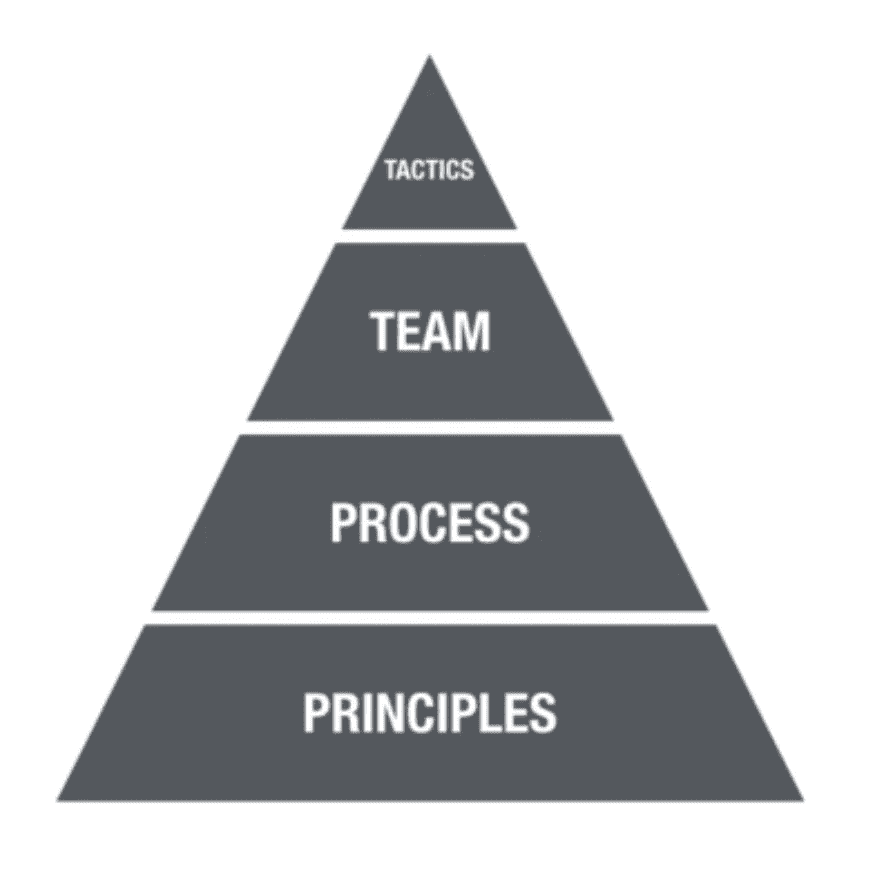
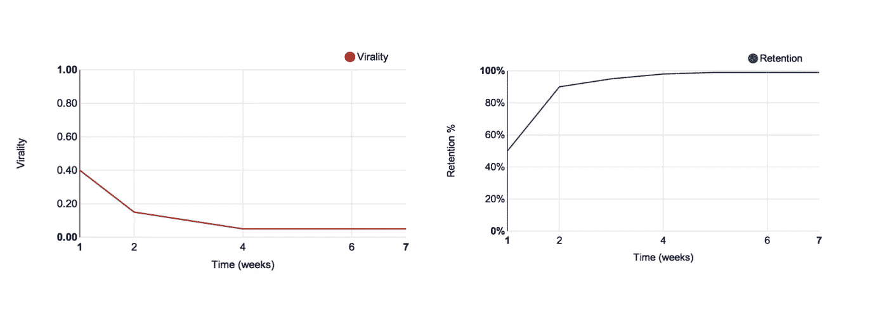
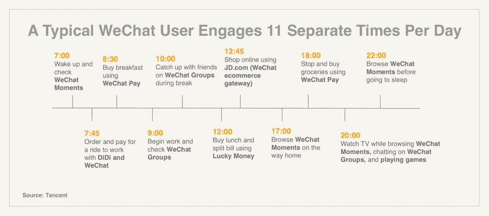
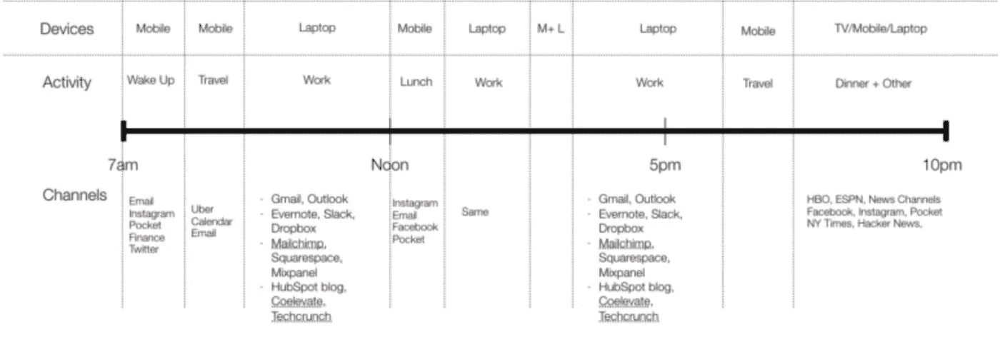

# 成长不仅仅是成长。

> 原文：<https://medium.com/hackernoon/growth-is-not-just-growth-947afb25edb4>

## 成长涉及的远不止是增长保持、转化或增加任何具体行动

[Source](https://media.licdn.com/mpr/mpr/AAEAAQAAAAAAAA1FAAAAJDI5NjNmZmE1LTQ5YWYtNDEyYi1iMzEyLWJiOWYzMzgxM2ZjNQ.png)

> *这里* *可以阅读葡萄牙语版* [***。***](/@arthurklose/growth-é-muito-mais-que-growth-ce5784f2e761)

我知道你像以前一样一直在倾听和观察*成长*。提高转换率的策略增长了 X%，保持率增长了 Y%，许多其他数字都基于明智的行动而增长。

但是在一天结束时，我们需要在开始之前讨论和准备很多东西，并分析行为和数字以优化增长。

当我在 1 月份里约热内卢产品竞技场的第一次移动增长研讨会上开始谈论它时，学生们看我就像一个陌生人。在我举了很多例子、练习和讨论之后，他们明白了*成长基础的重要性。*

有助于理解这一点的是 Brian Balfour 在他的一篇关于增长的文章中解释的增长金字塔:

**Source:** [Brian Balfour's blog](https://brianbalfour.com/growth-machine/principles-process-team-tactics/)

一旦每个产品的所有策略都不相同，那么从原则而不是策略出发就有意义了。当然，你知道你的产品，你的观众，你的用户，和客户的旅程是如此不同，对不对？

而不是询问:

*   帮助 X%主动更快服务的策略；或者
*   将保留率提高了 Y%的策略，

人们应该问:**成长的原则是如何产生的，又是如何保持运作的？**

而且，金字塔还有其他要点:

*   **过程:**帮助定位/优先假设和焦点，当然还有对齐；
*   团队:定义过程对创建你的团队是如此重要；
*   **战术:**是“动手”部分。团队的不断完善和发展。良好的流程和合适的团队是在这里取得成功的关键。

> 想了解更多关于成长金字塔的知识，更多阅读 [**这里**](https://brianbalfour.com/growth-machine/principles-process-team-tactics/) 和 [**这里**](https://brianbalfour.com/growth-machine/principles-process-team-tactics/) **。**

好，然后……？

# 我们可以用最少的资源集中精力的最关键的领域是什么？

十亿美元的问题有助于定义很多事情。例如:

我们会在用户的**激活**还是新用户的**获取**上投入精力？

当然，这两种说法都有道理。但是，如果你没有足够的资源，优先考虑什么呢？如果新用户不回来，获取他们有意义吗？

这就是为什么**留存才是王道！**(我推荐你阅读[的这篇关于保留的文章](http://andrewchen.co/retention-is-king/)作者[陈楚翔](https://medium.com/u/8edc94d7a232?source=post_page-----947afb25edb4--------------------------------)和[这篇关于我在 ProductCamp 上的主题演讲的文章](https://brasil.uxdesign.cc/retenção-vs-engajamento-quando-tudo-começa-pela-emoção-46344fb81679)

Virality Vs. Retention. [**Source:** Andrew Chen's Blog](http://andrewchen.co/retention-is-king/)

> PS:你知道吗，留住一个用户比获得一个新用户要便宜 25 倍？来源: [*哈佛商业评论*](https://medium.com/u/7ddfe8a6bc4f?source=post_page-----947afb25edb4--------------------------------)

关于它，还有两个话题需要注意: ***北极星度量*** 和 ***唯一重要的度量*** 。

*   **北极星指标**是**衡量你的产品交付给用户的价值的最佳指标**，以及
*   **唯一重要的度量**是目前需要关注的**唯一的**数字*(也许在未来的***，你需要其他的 OMTM)**

*基本上， *OMTM* 是帮助你的[创业](https://hackernoon.com/tagged/startup)下一次融资的数字， *NSM* 将帮助你的创业长期定位。*

**北极星度量*的例子:*

*   *[**脸书:**](https://blog.growthhackers.com/what-is-a-north-star-metric-b31a8512923f) 每日活跃用户(更多用户访问，更多信息/状态用户查看，当然，更多细分他们拥有的广告)*
*   *[**Airbnb**](https://growthhackers.com/articles/north-star-metric)**:**预订的住宿(对主人和客人的价值)*

**唯一重要的度量标准的例子:**

*   ***中:** [总时间读数](/data-lab/mediums-metric-that-matters-total-time-reading-86c4970837d5)；*
*   ***SumoMe** : [一年十亿浏览量](https://rockboost.com/en-us/blog/your-first-growth-hack--one-metric-that-matters?utm_campaign=Submission&utm_medium=Community&utm_source=GrowthHackers.com)*

> *如果你想进一步了解这些话题，我鼓励你去[读一下](https://blog.growthhackers.com/what-is-a-north-star-metric-b31a8512923f)关于 [**NSM**](https://blog.growthhackers.com/what-is-a-north-star-metric-b31a8512923f) 和[这一本](https://blog.growthhackers.com/what-is-a-north-star-metric-b31a8512923f)关于 [**OMTM**](/@joshelman/the-only-metric-that-matters-ab24a585b5ea) **。***

**

*As soon users exposed to these value, the conversion grow. [**Source:** Inside Intercom Poadcast](https://blog.intercom.com/siqi-chen-postmates-growth-team/)*

*对于**我们可以用最少的资源集中精力的最关键领域是什么，你可能有很多答案？**喜欢:*

*   *激活(入职)；*
*   *收购(新用户)；*
*   *保留*

*前 Postmates 增长副总裁，[陈思琪](https://medium.com/u/3826ffde6e14?source=post_page-----947afb25edb4--------------------------------)在[播客内部通话](https://blog.intercom.com/siqi-chen-postmates-growth-team/)的采访中分享了一个关于入职的有趣例子。Postmates 允许从任何地方获得任何东西，比如塔吉特百货的任天堂 Switch。如果你比较像 UberEats 这样的竞争对手，这是一个优势。(此外，在巴西，我们有一家创业公司做同样的 Postmates，叫做 [*Rappi*](https://medium.com/u/839ed45f6707?source=post_page-----947afb25edb4--------------------------------) *)。因此，一旦用户接触到这些价值，转化率就会增长。**

# *下一阶段的增长*

***成长不仅仅是成长具体行动**的另一个好例子是*微信。*亚洲的*神像，*最近[达到 10 亿月活跃用户](https://technode.com/2018/03/05/wechat-1-billion-users/)，相反他们认为只是让用户发送更多消息，微信试图增加用户日常生活中可以通过应用程序完成的**任务数量。***

**

*Crazy, no? **Source:** [Y-Combinator](https://blog.ycombinator.com/lessons-from-wechat/)*

*要这样想，你需要你的**成长基础准备好**。但是，你可以退一步理解**如何**和**其中**你的客户使用一个简单的框架，称为*用户渠道图与你的产品/服务互动。*复制一份应用于您的产品并获得一些见解:*

*[下载用户频道地图模板](https://goo.gl/kQpBNN)*

**

*User Channel Map — Source: [Growth Series by Reforge](https://www.reforge.com/growth-series/)*

# *要继续:*

*   *更好的问题总是带来更好的答案。不要忘记成长不仅仅是策略；*
*   *尽快找到你的 NSM，定位你公司的未来；*
*   *NSM 和 OMTM 不一样；*
*   *了解你的客户在一天中做了什么可以带来很多的洞察力，让你的产品更上一层楼；*
*   *定义*增长的基础/原则*有助于更好的测试、假设以及最好的结果和速度。*

# *那么，你准备好成长了吗？🤓*

## *如果你喜欢，别忘了👏👏👏👏👏👏👏👏👏👏👏👏👏👏*

*您可以查看文章中或下面链接的所有参考资料:*

*   *[关于成长:来自微信](http://blog.ycombinator.com/lessons-from-wechat/)的 7 个教训 [Y Combinator](https://medium.com/u/cb8adc841a29?source=post_page-----947afb25edb4--------------------------------)*
*   *[post mates 前增长副总裁陈思琪通过](https://blog.intercom.com/siqi-chen-postmates-growth-team/)[对讲机](https://medium.com/u/7ca8972daf76?source=post_page-----947afb25edb4--------------------------------)谈论增长团队*
*   *[Reten ao e Engajamento—Quando tudo comea pela emo](https://brasil.uxdesign.cc/retenção-vs-engajamento-quando-tudo-começa-pela-emoção-46344fb81679)作者 [@arthurklose](https://medium.com/u/990e7599ce69?source=post_page-----947afb25edb4--------------------------------)*
*   *[留人为王](http://andrewchen.co/retention-is-king/)由[陈楚翔](https://medium.com/u/8edc94d7a232?source=post_page-----947afb25edb4--------------------------------)*
*   *不要让你的北极星度量欺骗你*
*   *北极星指标是否过于简化了增长？由[肖恩·埃利斯](https://medium.com/u/8ee94400f4fb?source=post_page-----947afb25edb4--------------------------------)*
*   *[重要的媒介指标:总时间读数](/data-lab/mediums-metric-that-matters-total-time-reading-86c4970837d5)作者[皮特·戴维斯](https://medium.com/u/96d3d431164e?source=post_page-----947afb25edb4--------------------------------)*
*   *[什么是北极星公制](https://blog.growthhackers.com/what-is-a-north-star-metric-b31a8512923f)？由[肖恩·埃利斯](https://medium.com/u/8ee94400f4fb?source=post_page-----947afb25edb4--------------------------------)*
*   *[唯一重要的指标](/@joshelman/the-only-metric-that-matters-ab24a585b5ea)作者[乔希·埃尔曼](https://medium.com/u/3fca1ea3f7bf?source=post_page-----947afb25edb4--------------------------------)*
*   *[建造成长机器](https://brianbalfour.com/growth-machine/)作者[布莱恩·鲍尔弗](https://medium.com/u/cae0f48dccf6?source=post_page-----947afb25edb4--------------------------------)*
*   *[原理、过程、团队和战术](https://brianbalfour.com/growth-machine/principles-process-team-tactics/)作者[布莱恩·鲍尔弗](https://medium.com/u/cae0f48dccf6?source=post_page-----947afb25edb4--------------------------------)*

* [## 增长-黑客正午

### 阅读《黑客正午》中关于成长的文章。黑客如何开始他们的下午？

hackernoon.com](https://hackernoon.com/tagged/growth)  [## 增长黑客-黑客正午

### 阅读《黑客正午》中关于增长黑客的文章。黑客如何开始他们的下午？

hackernoon.com](https://hackernoon.com/tagged/growth-hacking)*