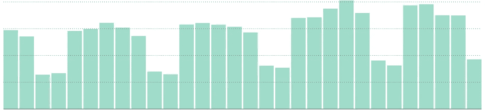

# 中型企业的成长秘诀

> 原文：<https://medium.com/hackernoon/growth-tips-for-your-medium-profile-537df0709aeb>

## 增加流量的 11 个简单技巧

我已经使用[总是在你故事的标题/副标题下添加一张图片。对我来说，最好的图像尺寸是 1250x500，因为它覆盖了屏幕的整个宽度，并位于您的个人资料页面下方。此外，当读者打开你的故事，文本立即可见。在所有的故事上有一个恒定的图像尺寸增加了个人资料页面的质量。](https://medium.com/u/504c7870fdb6#1 包含故事图片</strong></h1>
</h1>
 这可以对读者产生连锁反应，让他/她读更多你的故事。

# **#8 加盟刊物**

出版物会对你的个人资料[增长](https://hackernoon.com/tagged/growth)产生很大的影响。尤其是如果你加入了一个有很多追随者的出版物。这是因为出版物可以有大量的每日访客，也可以实施自己的营销策略来增加故事。

创建一个最大的出版物列表，这些出版物发布的故事与你的类别相同。然后，开始给所有人写信，看看你会在哪里被录取。永远不要离开你的故事没有一个好的出版物。

就我而言，加入[**Hackernoon**](https://hackernoon.com/)**成为作家将我的故事推向了天空。**

**谢谢你的那本[通过研究我在 Medium 上的统计数据，我注意到周六和周日的覆盖率比工作日低 70%。这是一个巨大的差异。但是，我写的大部分都是关于编程的。不确定这是否是其他类别的情况，但你一定要检查你的统计数据。如果你有和我一样的统计数据，我会建议你在工作日发表你的故事。](https://medium.com/u/4a8a924edf41#9 周末不要发表故事</strong></h1>
</h1>
</h1>
</h1>
</h1>
</h1>
</h1>
</h1>
</h1><p id=)**

** [## 足球比分预测赌注

### 我们提供专业的足球比分预测投注提示，胜率高。每个比赛模拟包含一个…

apps.apple.com](https://apps.apple.com/app/football-score-prediction-bets/id1517623538)  [## BetScore:Google Play 上的足球博彩技巧、比分和赔率应用

### 我们提供高胜率的专业足球技巧。每个比赛模拟包含三个预测…

play.google.com](https://play.google.com/store/apps/details?id=betting.tips.goals)  [## Google Play 上的篮球、曲棍球和手球应用程序的下注技巧

### 超过 500，000 名职业博彩客户、体彩投注者和体育博彩爱好者信任我们的日常体育博彩…

play.google.com](https://play.google.com/store/apps/details?id=betting.tips.sportsbet)  [## Instagram 的长视频故事

### Instagram 的 Long Story 是一个非常棒的工具，允许您录制或选择任意长度的视频并进行转换…

apps.apple.com](https://apps.apple.com/app/long-video-story-for-instagram/id1511499427) **