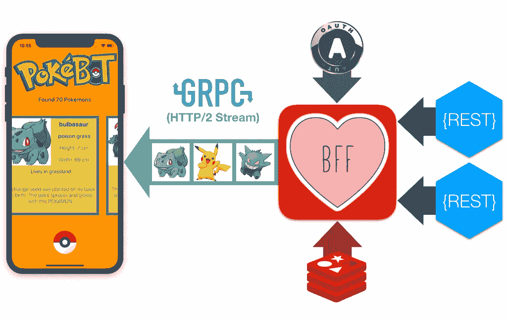
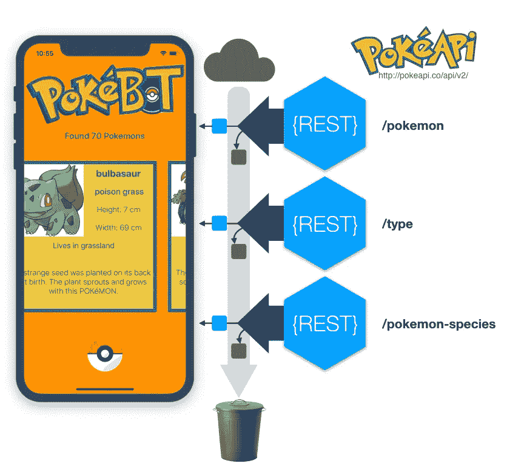

# Swift iOS 应用的 GRPC BFF

> 原文：<https://medium.com/hackernoon/grpc-bff-for-swift-ios-app-efdd52df7ce2>

## 使用 gRPC(带 HTTP/2 流)进行移动后端联网，以优化 UX 响应性/反应性，并简化移动应用程序开发，而无需触及您的后端 REST Api。



# gRPC 移动 BFF

本教程的重点是*后端对前端(BFF)设计模式*如何代表[移动](https://hackernoon.com/tagged/mobile)应用开发者“永远的好朋友”,特别是不同的技术如何帮助实现最佳 BFF，从而为移动应用带来最佳*反应和响应*。

一般来说，BFF 的目标是简化客户端应用程序开发时间，分离“服务 API”调用，潜在地减少调用的数量，并最终在不同的客户端实现之间共享一些逻辑，优化一般网络和数据转换，同时添加数据连接、分页、缓存、同步、流等的共享功能。最后实施安全和其他策略。

互联网上已经有很多教程介绍这种现在很常见的设计模式。在这里，我们不讨论多通道、微服务、api 网关、服务网格，也不使用任何其他现代“服务器”术语，我们只是说 BFF 是移动应用程序和移动应用程序需要在云上或内部调用的每个“服务 API”之间的“中间件”。

本教程更具体地关注 BFF 模式如何有助于简化对这些服务 API 接口的访问，以及特别是 gRPC 协议的采用如何有助于减少数据量、优化网络以及实现和加强大量共享基础设施功能。

当然，和许多其他领域一样，这里没有灵丹妙药。GraphQL 等其他接口可以在某些场景下提供其他优势，而 URLSession 等特定移动技术在 ios 上的后台下载任务可以在特定移动环境下提供非常强大的网络优化控制(即有限的多任务处理)

# 样本问题:必须抓住他们！

在本教程中，我们将创建一个移动应用程序和一个 BFF 服务器来实际演示这种设计模式的优势。

我们将创建一个 Pokédex 移动应用程序，使用公开可用的[http://pokeapi.co/](http://pokeapi.co/)REST API 将允许用户按名称或类型搜索口袋妖怪，它将为每个找到的口袋妖怪显示以下信息:

*   名字
*   图像
*   所有类型
*   身高和体重
*   他住的地方
*   物种栖息地的完整文本描述(风味文本)

为了获得所有这些数据，将使用以下后端 REST APIs:

*   **/口袋妖怪**:获取特定口袋妖怪名称的基本口袋妖怪数据
*   **/口袋妖怪-物种**:获取特定口袋妖怪的栖息地信息
*   **/type** :获取特定类型名称的所有口袋妖怪列表

# 为什么我们需要一个好朋友？

但是等一下？这些口袋妖怪 API 只是简单的 REST APIs，我可以很容易地从移动应用程序本身直接调用它们。为什么我需要 gRPC，更重要的是为什么要使用 BFF？

没错。这些 API 可以被手机应用程序直接使用，但是让我们看看下图中这些简单方法的缺点。



首先，我们可以看到，即使这个超级简单的应用程序也需要协调来自三个不同网络 API 调用的数据。

基本上，为了搜索特定类型的所有口袋妖怪，我们需要首先调用/type Rest API 来获得口袋妖怪名称或 Id 的列表，然后对于该列表中的任何单个口袋妖怪，我们需要调用/pokemon Rest API 来获得基本信息，如名称、类型、高度和宽度，还需要调用/pokemon-species Rest API 来获得栖息地信息。

除了需要“编排”对不同 Rest API 的调用之外，另一个需要关注的非常重要的事情是，所有这些 pokemon Rest APIs 都返回了更多的数据，这些数据实际上是我们渲染应用程序用户界面所真正需要的。

事实上，在这个示例 iOS 移动应用程序中，我们将使用一个非常经典的 UICollectionView 接口，我们将需要在集合单元格中只显示我们上面介绍的口袋妖怪信息(名称、图像、类型等。).这些 pokemon Rest APIs 将通过网络(可能在蜂窝网络上)传输我们在简单的应用程序中根本不需要的许多其他数据。

# Node.js 中的经典 BFF

现在，BFF 服务器在简化不同后端 API 调用的编排，以及在网络上过滤和向移动应用传输应用严格需要的数据方面的作用是否更加清晰了？


现在有很多不同的技术可以用来实现这个 BFF 服务器。原生 iOS 移动应用开发者现在甚至可以在 Linux 和服务器框架(如 Kitura 或 Vapor)上使用 [Swift](https://hackernoon.com/tagged/swift) 来轻松实现这些 BFF。在这些 Swift 服务器框架的即将到来的新版本中采用苹果开源 Swift Nio 库也将很快提供更多的效率和可扩展性(参见[https://medium . com/@ JMangia/Apple-Swift Nio-netty-vert-x-grpc-and-service-mesh-ab 5840 C1 b 71 c](/@JMangia/apple-swiftnio-netty-vert-x-grpc-and-service-mesh-ab5840c1b71c))。

Node.js 也是实现这种 BFF 服务器最常用的平台之一，因为它提供了极大的简单性，并从采用事件循环架构及其单线程异步 I/O 支持中获得了许多好处。

用 Node.js 和 Express.js 之类的 Javascript 框架超级容易实现这种 BFF 服务器。在与本教程相关的 Github 存储库中，您可以在 BFF/Rest 文件夹下找到这个 REST BFF 服务器的 Node.js 简单实现。

正如我们之前在本教程的介绍中所讨论的，BFF 也是实现基础设施功能的地方，例如认证、授权、缓存和其他通用功能。在我们的 BFF Node.js 实现中，特别是使用 Javascript Node-Cache 包实现了本地内存缓存，以便在本地存储从后端 PokeApi 返回的数据，并减少向后端的网络流量。

# 简化的 API

我们已经说过，BFF 也可以为移动应用程序提供一个简化的 API 接口。在我们的具体情况下，我们的 BFF 公开了一个独特和通用的/Search API，移动应用程序使用它来搜索单个特定的口袋妖怪名称或搜索特定类型名称的所有口袋妖怪。

下图说明了这个单一客户端 API 的伪代码实现，特别是它如何编排对我们前面已经介绍过的不同 PokeApi 调用的调用。


有了这样的通用/搜索 API，我们的移动应用程序的用户界面可以简化很多，基本上提供了一个单一的用户体验，可以同时搜索每个口袋妖怪类型或每个口袋妖怪的名字，而不必要求用户点击屏幕上的任何其他按钮，而是让移动应用程序本身在 BFF 的帮助下，理解用户只是搜索名字的简单通用意图。

无论如何，BFF 引入的这个新的抽象层与这个优化和简化的/Search API 一起产生了关于最终用户体验的以下非常关键的问题:移动应用现在需要等待 BFF /Search API 输出的执行和网络传输，然后才能获得重新加载和呈现 UICollecionView 所需的所有数据。

基本上，在开始向用户显示新数据之前，移动应用程序需要等待 BFF 从缓存或调用 PokeApi 后端 Rest API 收集满足搜索请求所需的所有数据。

# Node.js 中的 gRPC BFF

最后，我们将看到采用 gRPC 协议在我们的移动应用程序的响应性和反应性方面带来的好处。

本教程的目的不是全面介绍 gRPC 网络协议和协议缓冲数据协议。互联网上已经有很多很棒的教程。

这里，我们将简单地集中于现代 HTTP/2 网络协议的“透明”采用可以为我们的 BFF 实现以及移动应用和 BFF 之间的通信提供的优势，只需简单地使用将支持优化的 HTTP/2 流联网的 gRPC 服务接口。

下图基本上预测了 BFF 模式的这一新功能，它使用 gRPC 协议直接将*流*到客户端集合，查看从缓存或从对 PokeApi 后端的 Rest API 调用收集的数据，并立即持续地及时向用户提供反馈，而无需等待全部时间来执行整个搜索操作。


# Protobuf gRPC 接口

这基本上是为我们的 BFF 搜索服务定义的 ProtoBuf/GRPC 接口。

正如你所看到的， *searchPokemon* gRPC API(在第 24 行)被定义为一个服务器到客户端的流 gRPC 接口，它将*流*在同一个 protobuf 文件中描述的 *Pokemon* 类型的对象(第 5–15 行)。

# Swift gRPC 客户代码

一旦我们有了描述原始数据结构的 protobuf 文件和 BFF API 的 gRPC 服务接口，我们就可以生成相应的 Swift 文件，并与整个 Swift gRPC 包堆栈一起纳入我们的 iOS Swift 移动应用程序项目。

一旦安装了 gRPC 运行时、Swift ProtoBuf 和 GRPC 插件(遵循 Swift GRPC github 网站的说明),您就可以轻松执行以下命令行来生成这些 Swift 输出文件，以包含在 XCode 项目中:

```
protoc <your proto files> \
    --swift_out=. \
    --swiftgrpc_out=.
```

以下 Swift PokemonDataSource 类简单地包装了对 protocol/grpc 自动生成的 Swift 文件的访问，以便简化从实现 UICollectionView 的视图控制器对 gRPC 接口的访问。

以这种方式，Swift 视图控制器类将简单地调用 data source . search new Pokemon gRPC 包装方法，并且对于通过 gRPC-HTTP/2 网络接口从 BFF 服务器流出的任何 pokemon 数据，从视图控制器传递的*完成块*将被回调。

# Node.js gRPC BFF 代码

Swift gRPC 堆栈目前也支持服务器端代码生成，但为了本示例教程的完整性，我选择再次使用 Node 和 Javascript 来编码以下 gRPC BFF 实施:

# 完整源代码

本教程针对客户端和 BFF 项目的完整源代码在 GitHub repo: