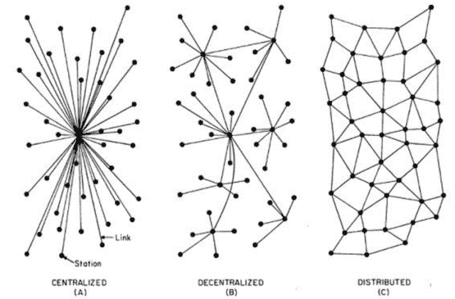
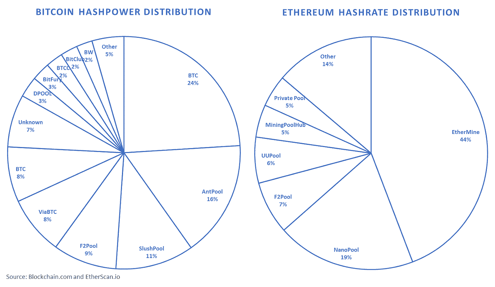

# 你猜怎么着？比特币不是去中心化的

> 原文：<https://medium.com/hackernoon/guess-what-bitcoin-isnt-decentralized-ecab67de653d>

区块链的一个重要特征是它是分散的。这种属性不仅支持点对点交易，还希望实现一个生态系统，让许多玩家可以平等地参与和分享。这种乌托邦式的理想，就像经常发生的那样，在实践中并没有实现。但是在我们继续之前……

图片摘自维塔利克·布特林的中篇文章《权力下放的意义》

从历史背景来看，在云计算出现之前，集中化(A)是提供服务的一种自然状态。你不得不去商店为你的下一个假期买票。互联网改变了这一点，但即使在最初，它也是集中的。这是因为服务器需要安装到位，公司才能正常运转。这使得系统非常脆弱，容易停机。关闭服务器意味着该公司的重大失败，因为这意味着无法提供服务。云计算的出现以一种非常优雅的方式解决了这个严重的漏洞。它将(B)服务提供分散到多个服务器上。这意味着，如果一台服务器出现故障，该公司仍然可以在线运营，尽管速度较慢。区块链比云计算更大。它通过在网络的所有成员之间分配一个共享数据库来扩展去中心化的思想。这进一步减少了网络中的关键阻塞点，并有效地将停机时间减少到零。同时，它使网络具有以下两个优点:

1.  没有中介的计算机间的直接通信；和
2.  如果服务器关闭或不可访问，它不会损坏数据库的内容，因为所有其他计算机共享同一个数据库。

这是区块链的两个最重要的属性，因为它们将物流问题的复杂性和安全性降低了几个数量级。以从美国向印度尼西亚汇款为例。为了使交易发生，需要许多银行(其中包括两家各自的中央银行)来协调资金的转移。这就是为什么交易时间往往需要数周才能发生。寄钱，听起来很琐碎，却是一个极其复杂的物流问题。使用区块链技术进行同样的交易只需几秒钟，而且不需要任何中介。这之所以可能，正是因为有一个共享的数据库(对于加密货币，如[比特币](https://hackernoon.com/tagged/bitcoin))使网络能够在不需要第三方的情况下验证交易。因此，区块链将中介的数量从“n”方减少到“2”，这也是它特别适合解决复杂的物流问题的原因。权力下放至关重要。

喜欢你读的吗？ [**报名参加我们的快讯**](https://digicor.io/pages/newsletter) ！

# 但是……是去中心化了吗？

不幸的事实是，从理论到实践有一条鸿沟。矿业背后的经济激励——这种机制赋予了区块链分散化和安全的属性——重金奖励了早期进入者。这导致区块链主要网络的大部分计算能力被集中，偏离了多样化市场环境的最初理想。事实上，秘密采矿业感觉更像是寡头垄断，而不是一个完全竞争的市场，如果它真的是分散的话。在以太坊的案例中，网络 63%的计算能力仅由两个矿工控制[【2】](https://blog.digicor.io/the-miners-dilemma/#_ftn2)，而在比特币的网络中，大约四个矿工拥有同样的能力。这归结为一个不幸的事实:加密资产并不像人们想象的那样分散。

在回答这个问题之前，让我们先来探索一下区块链网络是如何作为一种给出答案上下文的方式来工作的。如果不深究技术细节，一般来说，每个网络都有两个角色。负责监督代码维护和升级的开发团队，以及为网络的存在和运行提供计算能力的矿工。这两个群体有一种共生关系。开发人员需要矿工来运行他们的代码，矿工也需要代码来运行。不幸的是，这两个群体经常发生冲突。这是因为他们各自的动机非常不同。开发团队希望改进产品并降低使用网络的成本。矿商希望通过提高交易费用和阻止地层奖励来增加他们的回报。

你问为什么这很重要？因为对于发生的代码升级/改变，矿工必须首先同意使用新的代码。这一过程被称为“共识”，是区块链网络治理的重要特征。开发者和矿工经常意见不一致，这也是为什么会出现[硬分叉](https://blog.digicor.io/the-battle-of-consensus-a-tale-of-bitcoin-forks/)的主要原因之一。因此，如果一个网络的计算能力是集中的，那么大型矿工在加密货币的方向上有很大的杠杆作用。这是一个问题，因为矿工的动机不太可能与区块链网络的整体愿景保持一致。这就像问一个矿工煤应该用来做什么。他们可能有想法，但这不是一个科学家或工程师可以拥有的愿景。这就是为什么意识到这些潜在的动力很重要。在 DigiCor，我们仔细分析这些动态，因为它们提供了关于治理结构状态和加密资产长期可持续性的重要线索。

# 结论

正如经常发生的那样，理论必须适应它所处的现实。因此，至少比特币和以太坊不是真正的去中心化网络。值得一提的是，区块链开发团队很清楚这个问题，并且他们正在采取措施来减轻这个问题。例如，在以太坊网络[【4】](https://blog.digicor.io/the-miners-dilemma/#_ftn4)中部署利益证明算法来清算交易。开发工作受到矿工的影响。因为归根结底，没有矿工，就没有网络。因此，在为任何数字资产起草投资案例的过程中，了解矿工与开发团队的动态是至关重要的。

喜欢你读的吗？ [**报名参加我们的快讯**](https://digicor.io/pages/newsletter) ！

DigiCor 近期 [**出版物**](https://blog.digicor.io/category/publications/) :

[**共识之战——有时候你只需要把它叉出来**](https://blog.digicor.io/the-battle-of-consensus-a-tale-of-bitcoin-forks/)

为什么会出现硬分叉，当出现硬分叉时，原币的价格会发生什么变化？

[**安全第一:穿越无政府状态的密码**](https://blog.digicor.io/how-to-keep-your-crypto-safe-in-the-wild-west-crypto-world/)

许多投资者心中的疑问是:我的比特币有多安全？

[**浴火重生——比特币崩盘的故事**](https://blog.digicor.io/rising-from-the-ashes-a-tale-of-bitcoin-crashes/)

比特币崩溃的历史是怎样的，它们如何累积到 2018 年的那一次。

在你的投资组合中加入一些密码怎么样？

你应该投资加密吗？如果应该，你应该分配多少比例的投资组合？

[**美国密码管制:我们要去哪里？**](https://blog.digicor.io/u-s-crypto-regulation-where-are-we-going/)

目前，美国加密货币监管在多个联邦机构之间重叠，造成了市场的混乱和不确定性。这对今天的密码市场有何影响。

[**DigiCor 论文——为什么我们认为每个人都应该投资加密**](https://blog.digicor.io/the-digicor-thesis/)

[【1】](https://blog.digicor.io/the-miners-dilemma/#_ftnref1)这意味着许多博弈论模型可以用来理解潜在的可持续性、稳健性和加密采矿行业的相互作用。一个很好的例子是芝加哥大学布斯商学院的布迪什最近的一篇论文，

[【2】](https://blog.digicor.io/the-miners-dilemma/#_ftnref2)这些很多都是矿池。然而，因为池的所有者控制着使计算机能够加入挖掘池的软件，我们相信他们可以被认为是同一个实体。因为归根结底，是软件的所有者，即采矿公司，将决定哪个代码被接受。

[【3】](https://blog.digicor.io/the-miners-dilemma/#_ftnref3)至少在数量上控制着计算能力的实体。

[【4】](https://blog.digicor.io/the-miners-dilemma/#_ftnref4)这是否真的会创造一个更加公平的竞争环境，或者只是简单地将中央集权转移到其他矿商身上，还有待观察。

***重要交底***

*本出版物包含从被认为是真实可信且备受推崇的来源获得的信息。转载材料经许可使用，并注明出处。我们已经尽了合理的努力来发布可靠的数据和信息，但作者不能对所有材料的有效性或其使用的后果承担责任。此处包含的某些信息可能已经过时，不再适用:信息来源在最初发布时被认为是可靠的，但不能保证。*

*本文包含的观点是作者的观点，但不一定是 DigiCor Asset Management 的观点。这些观点可能会在不通知的情况下发生变化。本出版物仅用于教育目的，不应被视为投资建议或对任何特定证券、策略或投资产品的推荐。*

*对特定数字资产的引用仅用于说明目的，并非旨在也不应被解释为购买或出售此类证券的建议。作者或 DigiCor Asset Management 可能拥有也可能不拥有或曾经拥有引用的数字资产，如果拥有此类数字资产，并不表示将继续持有此类数字资产。*

*本材料包含假设的插图，本材料的任何部分都不代表任何 DigiCor 资产管理产品或服务。此处包含的任何内容都不构成会计、法律、税务、证券或投资建议，也不构成关于任何投资的适当性的意见，也不构成任何类型的招揽。读者应该意识到所有的投资都有风险。*

*原载于 2018 年 6 月 15 日*[*blog . digicor . io*](https://blog.digicor.io/the-miners-dilemma/)*。*