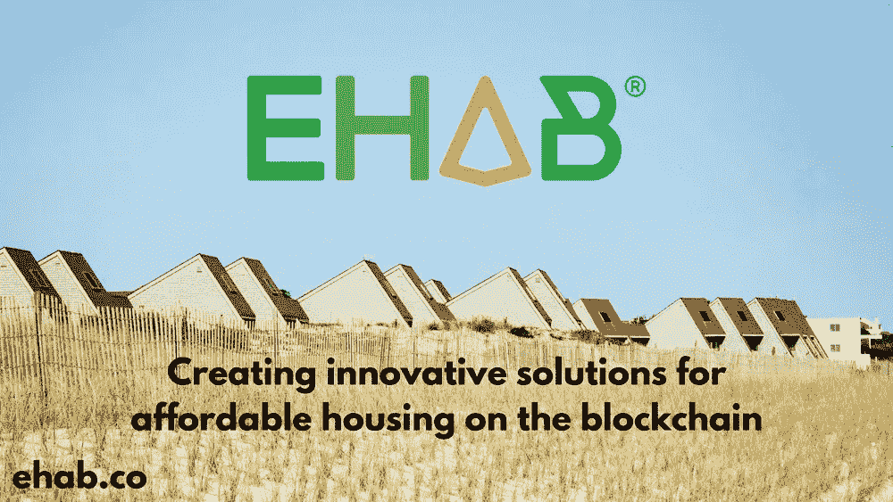
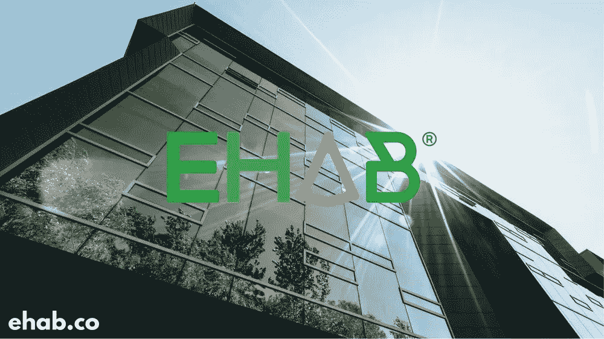

# 嘉宾博客:区块链上的经济适用房

> 原文：<https://medium.com/hackernoon/guest-blog-affordable-housing-on-the-blockchain-dd05472953aa>

**本周开篇，我们欢迎**[**@ joshmcgraham**](https://twitter.com/joshmcgraham)**作为我们的博主嘉宾，介绍来自**[**【ChelleKButler**](https://twitter.com/ChelleKButler)**——欣赏！**

*最近区块链有很多媒体，主要集中在比特币和以太坊等加密货币上，这种数字货币完全存在于网上和银行系统之外。无论你认为这是一种时尚还是真正的革命性发展，区块链技术都非常聪明，可以用于各种情况，而不仅仅是数字货币，甚至可以造福于社会中最弱势的群体。*

*把区块链想象成一个巨大的数据社区，由一些复杂的算法安全地保护着，受一系列虚拟检查点的控制，没有真正的进入壁垒。人们可以看到你是它的一部分，并向你发送请求，但你只能用非常安全的私钥打开你的那部分，如果你忘记了，你就惨了。很整洁，是吧？*

**[*EHAB*](https://twitter.com/ehabplatform)*的创始人乔希·格拉汉姆一直致力于采用这种技术来解决经济适用房问题。在这篇博客中，他解释了更多关于 EHAB 的事情，以及为什么它会改变游戏规则，不仅仅是英国的房地产，而是整个世界。***

****

> *****Ehab 是一个分散的平台和生态系统，它使人们能够合作创建和资助经济适用房项目。我们的使命是解决全球住房危机，并在此过程中开发一种工具，用于以人为本的宜居智能城市的共同创造。*****

**在建造经济适用房方面，我们有三个主要目标**

1.  *****增加供应量*****
2.  *****提高质量*****
3.  *****创造独特且可持续的融资方案*****

**没有简单的解决方案可以满足这些目标，但我们相信，通过基于区块链的独特技术组合，可以最好地满足这些目标。**

****

*   *****安全透明地存储合同、投资和可交付成果*****

**这些信息构成了一个所有各方都需要信任的系统的基础，这使得各种各样的利益相关者之间能够进行大规模的协作，而几乎没有额外的管理成本。**

*   *****促成基于共识、协同决策*****

**利用分散的自治组织原则，区块链可以通过安全的匿名投票和项目反馈，促进基于共识的决策，以实现共同目标。**

*   *****减少施工期间的管理成本和付款延迟*****

**借助我们的智能合同层，我们可以自动执行施工期间发生的大量耗时且成本高昂的任务。最大的节省可以通过自动和即时付款来实现。**

*   *****以超过银行的利率从全球投资者那里筹集发展资金*****

**通过我们的代币系统，我们可以消除边界，允许任何地方的任何人投资创新和负担得起的财产。这一系统使融资变得更容易、成本更低，也让投资者更容易进出他们的投资。**

**系统的规则是硬编码的，如果你使用我们的平台，绕过这些规则并欺骗系统是非常非常困难的。这在房屋建筑行业欺诈更为普遍的市场中有着最大的好处。**

*   *****建立一个可信的声誉系统，这将提高整个行业的标准*****

**利用反馈和评论，我们为服务提供商建立声誉。区块链证明，这些评论来自于一起工作过的人，并完全消除了机器人或假账户留下评论的可能性。**

****

**短期内，我们希望帮助住房协会削减成本。我们可以消除营销成本，降低管理成本，并获得更好的开发贷款利率。通过我们的令牌，我们还可以让 HAs 提供完全灵活的共享所有权方案，以释放更多资本。这有助于刺激供应。**

**从长远来看，在降低成本的同时提高质量的最佳方式似乎是转向主要使用模块化房屋和工厂制造的精密房屋的房屋行业。这些技术已经很有竞争力，但是需要扩大规模，变得更加便宜，以增加采用率。我们专注于与使用这些技术的开发商合作，为他们提供长期的项目渠道，以便他们能够提高产量、降低成本，并最终成为房地产行业的重要组成部分。**

**从中长期来看，我们希望创造一些全新的融资解决方案，进一步增强住房协会的能力。目前看起来很有希望的想法是一个分散化版本的建筑协会，它允许人们储蓄并更好地获得资金，以及创建数字社区土地信托计划，其中一群数字投资者拥有房屋下的土地，并根据那些能够负担得起在土地上建造房屋并居住的人的负担能力收取租金。**

****

**[评论](http://www.bromfordlab.com/labblogcontent/2018/1/29/guest-blog-creating-innovative-solutions-for-affordable-housing-on-the-blockchain#comments-outer-wrapper)**

***最初发表于*[T5【www.bromfordlab.com】](http://www.bromfordlab.com/labblogcontent/2018/1/29/guest-blog-creating-innovative-solutions-for-affordable-housing-on-the-blockchain)*。***