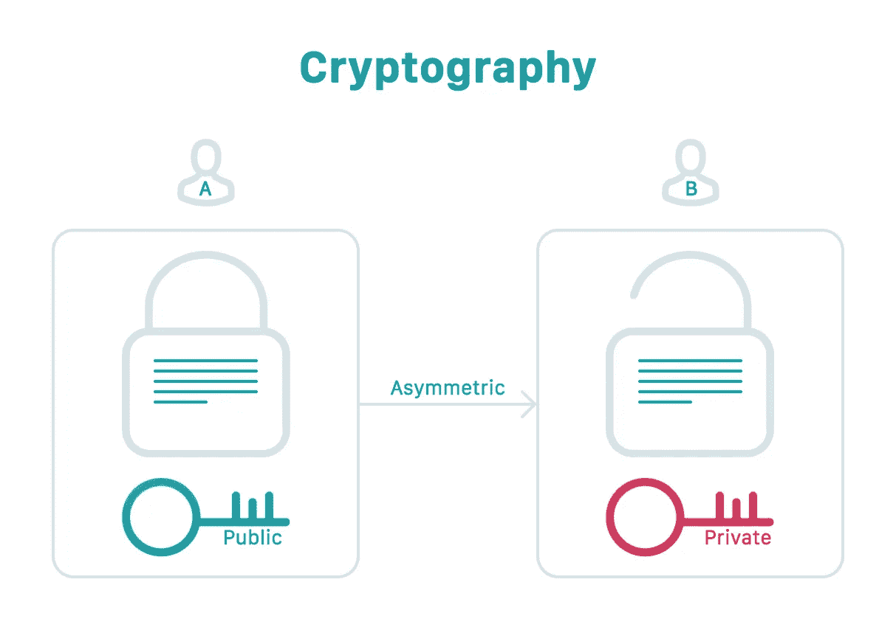
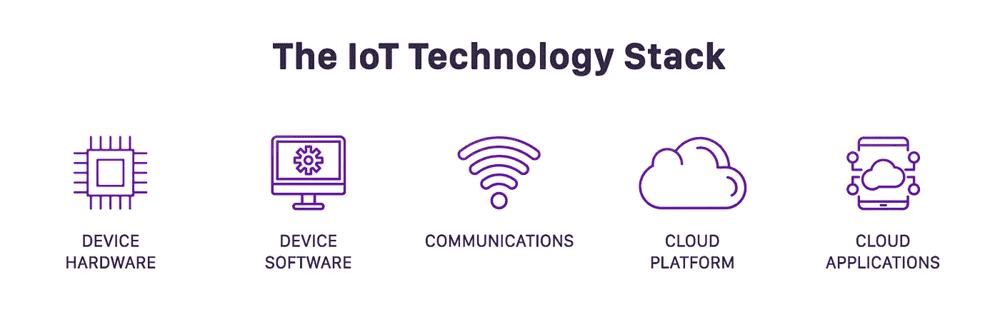
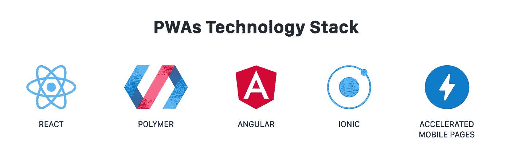
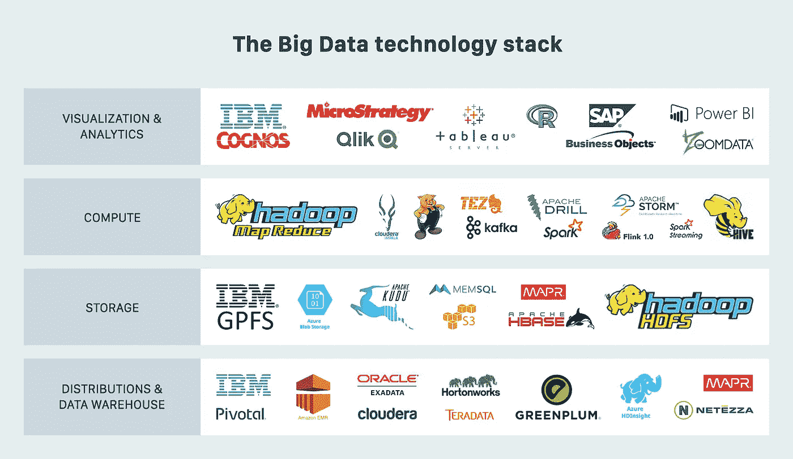

# 自由职业者指南:2019 年获得项目的五大技能

> 原文：<https://medium.com/hackernoon/guide-for-freelance-skills-to-land-a-project-in-2019-2791d8abfefc>

在自由职业者行业，优秀的技能总是需要的，这样才能完全按照预期交付项目。这些技能是不断变化的，全世界的自由职业者都必须相应地进化。

客户要求卓越，任何不足都是不可接受的。这些期望是在市场上获取新技能的推动力。

## 软件和 Web 开发行业概述

近年来，web 和移动应用程序开发行业正经历着巨大的增长。Web 和移动应用程序开发自由职业者现在的任务是提供一流的应用程序，具有出色的用户体验和很少或没有错误。

有趣的是，由于新技能不断涌现，这个行业的竞争也越来越激烈。同样值得注意的是，这个行业的自由职业者在各种自由职业平台上都是收入最高的，因为这个行业需要大量的专业知识。此外，由于技术和数字全球化的发展趋势，该行业的工作岗位数量每天都在增加。

但是，为了能够恰当地享受这个行业提供的好处，你必须保持领先。你需要用必要的、最新的知识来武装自己，并且不断地将这些技能付诸实践。如果你不知道对你的期望是什么，这是可以理解的，所以在 2019 年，检查那些可以帮助自由职业者在网络开发项目中表现更好的技能是很自然的。

## 2019 年落地网络和移动应用项目所需的技能

2019 年能够持续落地本行业高价值项目所需的必备技能有 5 项；

1.  区块链密码学
2.  人工智能 Python
3.  物联网(IoT)技术堆栈
4.  构建渐进式 Web 应用程序
5.  大数据分析工具

这些是 web 和移动应用程序开发行业的每个开发人员都应该学习的主要技能。我们现在开始研究为什么这些技能会成为 2019 年最受欢迎的技能。

## 区块链密码学

今年，我们已经看到了几种加密货币的兴衰。但更重要的是，我们已经看到一大批由区块链支持的项目正在涌现。可以说，区块链技术已经改变了许多行业的面貌，web 开发部门也不例外。2019 年，我们将看到对了解区块链的程序员的需求呈指数级增长。

你需要学习的是在加密共识算法上完成交易的知识，实现设备的点对点交互。

据信，加密算法将使分布式和分散式数据库成为可能，这将保证安全性。事实上，我们可以预计，在今年年底之前，将有大量的程序员会继续学习如何与区块链合作，只是为了接下项目。

## 用于人工智能的 Python

如果你一直没有关注人工智能领域，你现在需要开始关注了。看看最近五年的增长就知道了。这足以告诉你，机器学习不仅仅是一个花哨的关键词，它是真本事。在人工智能领域寻找程序员的主要问题是因为这个领域相对年轻。言下之意是，我们几乎从来没有看到有长期经验的专业人士。

你应该知道的一个核心能力是使用 Python 进行人工智能。语法非常简单，可以在平台上实现多种算法。用于科学计算的 NumPy 和用于机器学习的 Pybrain 等函数库也极大地简化了开发人员的学习过程。

## 物联网(IoT)技术堆栈

物联网的概念有望彻底改变应用程序的开发方式。目标是为几乎每个对象配备网络连接。基本上，把它想象成让你的烤面包机、冰箱、汽车，甚至你的恒温器发送和接收数据。作为一名网络开发人员，你很荣幸站在这一浪潮的前沿，当务之急是你要了解更多关于如何在 2019 年利用机会的方法。

物联网有三层；嵌入物体中的传感器、微控制器、互联网连接以及为客户服务的数据和服务平台。理想情况下，你应该有一个大致的概念，以及它是如何融入 web 开发的。

## 构建渐进式 Web 应用程序

[渐进式网络应用](https://dashbouquet.com/blog/frontend-development/progressive-web-apps-vs-native-apps)是一个新的概念，最近刚刚推出。其目的是引入本地网站和移动应用程序的优点，然后将其结合到一个应用程序中，同时消除各自的缺点。这是自由职业者在 2019 年学习的另一项非常重要的技能，因为用户因为这款应用的轻量级本质而大声疾呼。

## 大数据分析工具

由于大数据，企业现在可以创建一个数据驱动的网页设计。这样做必然会带来出色的用户体验，而且不仅仅是在功能方面。本质上，数据驱动的网站设计将帮助组织监控如何获得更多的流量，线索，甚至转换。事实上，研究表明，恰当地转向数据驱动的网页设计的企业会享受到更多的流量，从而带来更好的投资回报。

有一些工具，如亚马逊 S3、MongoDB、Hadoop HDFS，以及许多其他帮助数据存储的工具。我们还有 PostgreSQL、Apache Spark 和 Amazon Redshift 来帮助进行数据处理和基于云的分析。随着你计划在 2019 年承担更多项目，这些技能将会派上用场。

作为一名网站开发人员，如果你想出类拔萃并为你的企业带来更多的利润，掌握这项技能是一个必要的属性。

## 结论

由于这个行业的技术性，开发人员可能会被他们需要学习的大量复杂技能所淹没。然而，上面列出的技能代表了每个希望在 2019 年持续落地项目的网络和移动应用开发者的一个伟大起点。

[*德米特里·布科*写的](https://www.linkedin.com/in/dmitrybudko/%5C)