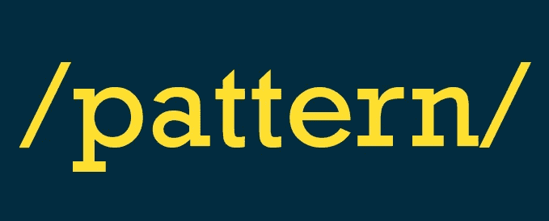

# JS 正则表达式小指南

> 原文：<https://medium.com/hackernoon/guide-for-regular-expressions-in-js-2a33620ca1cf>

这将是一个关于*正则表达式*的小指南，这是一般编程中非常重要的一部分。

我会尽量简单明了。

我希望你喜欢它😊



# **什么是正则表达式？**

**模式是用来在一个文本串中寻找某个字符组合**的吗？在 JavaScript 中，正则表达式也是对象。

## 简单创作:✍️

*推荐方式* ✔️: ️ `let re = /good/;`

*不那么推荐的方式* ❌: `let re = new RegExp(/good/);`

## 什么时候使用文字方式更好，还是使用 RegExp 构造函数更好？❓

当正则表达式将成为常量**时，使用**文字表达式**，因为这种方式可以在脚本加载时立即编译正则表达式。**

当正则表达式将要**改变**或者用户将要决定模式时，使用 **RegExp** 构造函数。

# 让我们从方法和属性开始:👊🏻

## 证明正则表达式的方法:

**exec:** 如果存在匹配则返回一个**数组**，如果不存在匹配则返回空值**。**

```
console.log(re.exec('good bye'));
  -> [ 'good', index: 0, input: 'good bye' ]
```

于是我们得到: *[ 'good '，index: 0，input: 'good bye' ]*

```
'good' -> is the regular expression.
index: -> Is when the regular expression starts.
input: -> Is the actual exec text.
```

**测试:**如果存在匹配则返回**真**，否则返回**假**。

```
console.log(re.test('good job!'));
  -> true
console.log(re.test('nice job!'));
  -> false
console.log(re.test('Good bye'));
  -> false
```

在最后一个例子中，我们得到了 **false，**也许你会问如果包含单词‘good’为什么会这样，这里的事情是**正则表达式像默认的**一样区分大小写，稍后，当我们了解到**标志**时，我们将修复这个问题。

**match:** 返回一个**数组**或 **null** 。

```
let str = 'goodbye for everyone';
console.log(str.match(re));
  -> [ 'good', index: 0, input: 'good bye for everyone' ]
```

这个非常类似于 *exec* ，不同之处在于我们改变了正则表达式的测试方式。

**搜索:**返回第一个匹配的**索引**，如果没有匹配返回 **-1**

```
let str = 'goodbye for everyone';
console.log(str.search(re));
  -> 0 (because 'good' starts at the beginning of the text)let str2 = 'that is not good';
console.log(str2.search(re));
  -> 12
```

**替换:**如果找到正则表达式，返回一个**新字符串**。

```
let str = 'good job everyone!';
console.log(str.replace(re, 'nice'));
  -> nice job everyone!
```

## **标志:**🚩

这些标志包含在正则表达式的末尾:

**字面表达:** `let re = /pattern/flags;`

**带正则表达式:**

**有四个标志可以使用:**

`**g**` **:** 为全局搜索。这意味着它将匹配所有事件，而不仅仅是第一个。

```
let str = 'aaa';
console.log(str.match(/a/g));
  -> [ 'a', 'a', 'a' ]// Without the g flag
console.log(str.match(/a/));
  -> [ 'a', index: 0, input: 'aaa' ]
```

`**i**` **:** 表示不区分大小写。

```
let re = /good/i;
console.log(re.test('Good bye'));
  -> true
```

**还有两更:**

`**m**`:多行搜索。

`**y**` **:** 调用 Sticky，只从这个正则表达式的`lastIndex`属性指示的索引中匹配。(还不是标配)。

# 属性:🌳

## 获取源文本:

```
let re = /good/;
console.log(re.source);
  -> good
```

## 返回正则表达式具有的标志:

```
let re = /good/i;
console.log(re.flags);
  -> i
```

## **验证正则表达式是否区分大小写(I):**

```
let re = /good/i;
console.log(re.ignoreCase);
  -> truelet re2 = /good/;
console.log(re2.ignoreCase);
  -> false
```

## 验证正则表达式是否有全局(g)标志:

```
let re = /good/g;
console.log(re.global);
  -> true
```

## 验证正则表达式是否有 multiline (m)标志:

```
let re = /good/m;
console.log(re.multiline);
  -> true
```

## 验证正则表达式是否有 sticky (y)标志:

```
let re = /good/y;
console.log(re.sticky);
  -> true
```

# 元字符符号:🔱

在构建正则表达式时，有相当多的特殊字符会对我们有很大的帮助。

`**^**` **:必须以:**开头

```
let re = /^j/;
console.log(re.test('javascript'));
  -> true
console.log(re.test('object'));
  -> false
```

`**$**` **:结尾为:**

```
let re = /.com$/;
console.log(re.test('germancutraro@hotmail.com'));
  -> true
console.log(re.test('germancutraro@hotmail'));
  -> false
```

`**.**` **:任意一个字符:**

```
let re = /go.od/;
console.log(re.test('go@od'));
  -> true 
console.log(re.test('go@#od'));
  -> false
```

`*****` **:任意字符，可以重复 0 次或多次:**

```
let re = /go*od/;
console.log(re.test('good'));
  -> true
console.log(re.test('goXdod'));
  -> false
console.log(re.test('god'));
  -> true
```

`**?**` **:定义可选字符:**

```
let re = /go?o?d/; 
console.log(re.test('god'));
  -> true 
console.log(re.test('grfy'));
  -> false
```

`**\**` **:转义符:**

```
let re = /go?o\?d/; 
console.log(re.test('god'));
  -> false 
```

`**[]**` **:字符集:**

```
let re = /gr[ae]y/;
console.log(re.test('gray'));
  -> true
console.log(re.test('grey'));
  -> true
console.log(re.test('grty'));
  -> false
```

`**[^*characters*]**` : **匹配除*以外的所有字符:***

```
let re = /[^F]riday/;
console.log(re.test('Friday'));
  -> false
console.log(re.test('Nriday'));
  -> true
```

`**[*range*]**` **:匹配一系列字符**

```
let reU = /[A-Z]riday/; // any capitalize letter ([A-Z])
console.log(reU.test('Friday'));
  -> true
let reL = /[a-z]riday/; // any lower case letter ([a-z])
console.log(reL.test('friday'));
  -> true
let reUL = /[A-Za-z]riday/; // any letter
console.log(reUL.test('%riday'));
  -> false
let reAny = /[0-9]riday/; // any number
console.log(reAny.test('3riday'));
  -> true
```

`**{}**` **:**

```
let re = /go{2}d/;
console.log(re.test('good'));
  -> true
console.log(re.test('god'));
  -> false// In this case means that the string must have two 'o' (the character before the curly braces).let re2 = /go{2,4}d/;
console.log(re.test('good'));
  -> true
console.log(re.test('god'));
  -> false
console.log(re.test('goood'));
  -> true// Now, in re2, could be between 2 and 4 'o' (be careful with the space, {2,4} is not valid -> **the space after the coma is not valid**) let re3 = /go{2,}d/;
console.log(re3.test('goooooooooood'));
  -> true
console.log(re3.test('god'));
  -> false// In the last example could be 2 or more.
```

# **速记:**🔑

## 一些班级人手不足:

`/\a/`:文字或数字(字母数字)。

`/a+/`:一个或多个。

`/\W/`:非文字字符。

`/\d/`:匹配任意数字。

`/\d+/`:匹配任意数字 0 次以上。

`/\D/`:非数字位数。

`/\s/`:匹配空格。

`/\S/`:非空白。

`/y(?=e)/`:仅当“y”后跟“e”时匹配

`/y(?=!e)/`:仅当‘y’是**而不是**后跟‘e’时匹配

关注我: [Github](https://github.com/germancutraro)

*还有更多关于正则表达式的内容，但我希望这可能有所帮助！*

**我想提及并感谢:** [布拉德·特拉弗斯](https://medium.com/u/b828435e71d8?source=post_page-----2a33620ca1cf--------------------------------)