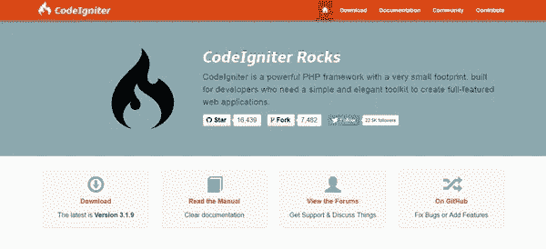
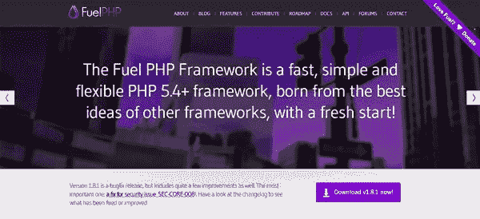
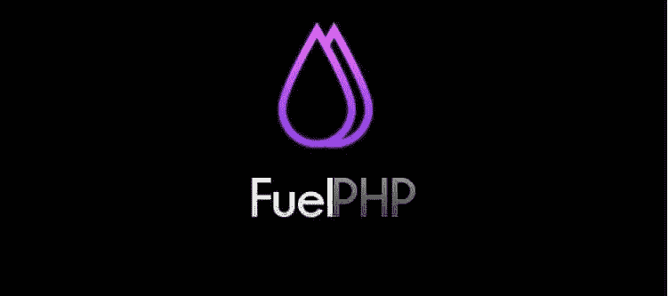
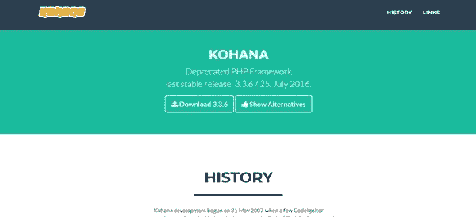
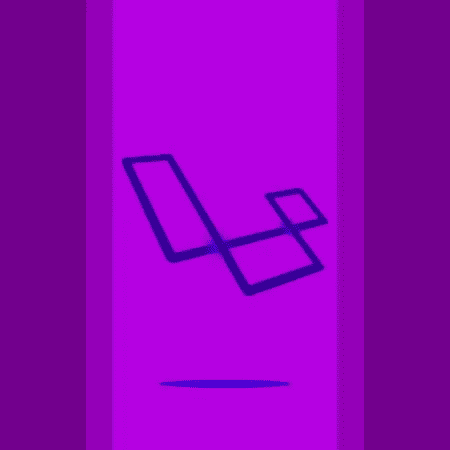
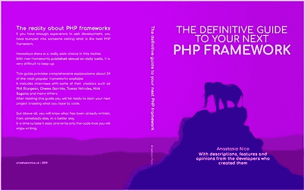

# 24 种 PHP 框架指南[第 2 部分]

> 原文：<https://medium.com/hackernoon/guide-to-24-php-frameworks-part-2-6d0f5b11de9d>

# 跟随系列…

这篇博文是“**下一个 PHP 框架的权威指南**”的第二部分

还没看？

要对这个话题有一个完整的了解，请看一下[这篇文章的第一部分](http://anastasionico.uk/blog/guide-to-php-frameworks-part-1)

以下部分将在接下来的几周内发布，或者你可以

点击下面的链接下载 Kindle 图书的完整版本“[下一个 PHP 框架的权威指南](https://www.amazon.co.uk/dp/B07G1YDL1L)

# 第二部分介绍

如果你已经阅读了本文的第一部分，现在当你的同事问你什么是[框架](https://hackernoon.com/tagged/framework)以及为什么 [PHP](https://hackernoon.com/tagged/php) 有这么多框架时，你应该已经足够自信了。

如果你是这个主题的新手，你想提升你的 web 开发技能，或者你是一个老手，你想探索更多的选择，

下面，你会发现其他几个框架的评论，让你决定下一步使用哪一个。

尽情享受吧！

# 代码点火器

我需要诚实地说，这是我的第一个框架，正如他们所说，你永远不会忘记你的初恋。

当我第一次从使用其他框架的 PHP 开发人员那里了解 MVC 环境时，

试图理解将代码放在哪里，以及为什么需要额外的努力将 PHP、MySQL 和 HTML 页面安排在项目文件夹的不同部分，是一场斗争。

后来我发现了 CodeIgniter，具体来说，

我见过它教程的前 4/5 页。

突然间，一切都变得清晰起来，在几个小时内，我就能够重新创建功能，按照代码的方式正确地划分代码，当我学习更高级的框架时，这对我帮助很大。

CodeIgniter 在 2006 年发布时已经很老了，但是在被不列颠哥伦比亚理工学院的人接管后，它仍然经常更新。

其实在我写作的时候，**最后一个版本(3.1.8)是 2018 年 3 月底发布的**。

最重要的特点是轻便和处理数据的速度，因此，它是勒多夫先生个人最喜欢的框架。

在这篇文章描述的框架中，它看起来不太像一个框架。

按照其他 PHP 框架，即使是 **CodeIgniter splits 也有清晰易懂的文件结构**，

它有非常详细的文档，许多用户和公司仍在使用它，可以提供帮助和支持。

如果你觉得已经准备好了，并且对普通 PHP 有足够的经验，这绝对是一个不错的选择。

相信我

有了这个框架，你就可以更进一步了。

[https://codeigniter.com/](https://codeigniter.com/)
https://github.com/bcit-ci/CodeIgniter

# Drupal

前言:

Drupal 不是一个真正的 PHP 框架，**它更像是一个高级的 CMS** 或者更好，一个 CMF(内容管理框架)。

Drupal 是由 Dries Buytaert 在比利时创建的，他开发了一个留言板来与他的朋友们保持联系。

它的第一个域名是 drop.org，其受欢迎程度增长如此之快，以至于在 2001 年 1 月，他决定将网站改名为 Drupal 后正式推出。

顺便说一下，Drupal 在荷兰语中是“掉落”的意思，它的标志就是从这里来的。

与其他流行的基于 PHP 的 CMS 不同，Drupal 需要更多的时间才能被完全理解

有更大的学习曲线，但是几个开发者的反应是，过了一段时间，流程就很流畅了。

它运行在大多数 PHP web 服务器上，如 Apache、Nginx 和 Microsoft IIS。

它还支持最重要的数据库，如 MySQL、MariaDB、PostgreSQL、SQLite、Microsoft SQL Server、Oracle 和 MongoDB。

**PHP 代码被安排在模块**中，它们可以根据用户的选择被启用和禁用。

构建框架核心的主要模块称为核心，

这个核心可以扩大安装扩展开发和可用的 drupal.org。

比如现在，

有超过 38000 个免费模块可用，因此你需要的一切都已经存在。

像后端一样，甚至前端也可以改进，就像模块一样，**有几个主题可以启用。**

互联网上至少有 2.3 %的网站是使用 Drupal 构建的，这一成功的原因在于一些特性。

它的可靠性是在近 20 年前建立的，有很多时间来改进和创造一个强大和安全的产品。

它也非常适合各种不同的项目，从网站、博客、论坛到电子商务和社交网络。

它们可以通过添加必要的模块来进行横向扩展。

还有一个持续增长的社区，每天都在创建和部署大量的资源。

总之，

这是一个非常好的 CMS，如果你有时间花在学习上，这将是值得的。

[https://www.drupal.org/](https://www.drupal.org/)T17[https://github.com/drupal/drupal](https://github.com/drupal/drupal)

# 无脂肪 PHP 框架

Fat-Free 是一个由菲律宾网站开发者和顾问 Bong Costa 创建的微型框架。

顾名思义，**微框架的关键在于它的大小**

我只包含最少的代码，允许你的项目在不增加任何不必要的结构的情况下运行。

使用这种骨架有许多优点

项目的重量，其实**无脂不到 55kb，而且有非常轻松的学习曲线**，

对开发人员来说，这意味着不要浪费时间去学习事物是如何工作的，要把所有的时间都放在代码上。

Fat-Free 需要 PHP 5.3 或更高版本，并支持 SQL 和 NoSQL 数据库，它还内置了一个 ORM。

在关键特性中，它允许路由，并且有一个与视图连接的好的模板引擎。

尽管有很好的理由使用微框架，

当项目需要扩展或者有不止一个 web 开发人员在工作时，您必须考虑到这可能会被视为限制。

另一个小限制是**无脂没有固定的结构，但是你需要根据你的需要来创造它**，如果在开始的时候，这可能是复杂的。

[https://fatfreeframework.com/3.6/home](https://fatfreeframework.com/3.6/home)T10[https://github.com/bcosca/fatfree](https://github.com/bcosca/fatfree)

# 燃料电池

最有趣的(在我看来)PHP 框架之一是 Fuel。

它是由几个多年工作和构建 PHP 框架的 web 开发人员创建的，

丹·霍里根和菲利普·斯特金(因在 CodeIgniter 上的贡献而闻名)等。

**Fuel 似乎是 CodeIgniter 3.x 和 Kohana 2.x 的良好混合物**取长补短。

结果是一个非常快速的结构。

它被设计成完全支持分层模型视图控制器原理，

这意味着选定的代码可以在整个项目的几个页面中使用，就像购物车或博客帖子一样。

不要忘记呈现模型的存在，也称为视图模型，它基本上在视图和控制器之间增加了另一个层次。

FuelPHP 的**文件结构的想法是从 Kohana** 复制并改进而来的，这是对名称空间和自动加载的明智使用，它允许调用类的速度明显快于父类。

它还预装了两个软件包，分别是 ActiveRecord 和 Oil，后者是一个非常有用的命令行工具。

FuelPHP 是由肯定知道他们在做什么的人开发的，它采用了 Kohana 最好的特性之一，即它的文件结构，并将其与 CodeIgniter 混合，如上所述，CodeIgniter 是十年来的杰作。

但是现在，随着 PHP 7 的发布，它开始感觉到自己的年龄了。

它的缺点可能是社区从来没有增长那么多，因此很难从其他开发者那里找到支持和问题的答案。

当我询问关于这个框架的信息时，Phil Sturgeon 非常友好地回复了我的邮件。

他说开发团队工作的**高峰是在 2011/2012** 年，尽管代码仍然可以在网上获得，但该项目在 2015 年被正式放弃。

他还将我链接到他写的一篇博客文章，日期是 2011 年 1 月，在这篇文章中，他向全世界介绍了 Fuel PHP。

我在上面强调了我认为最重要的信息，但如果你想查看他的帖子，这里有链接:

[斯特金介绍燃料 PHP](https://philsturgeon.uk/fuelphp/2011/01/04/introducing-fuelphp/)

他发给我的另一份外部参考资料是 Dwayne Charrington 写的一篇博客文章，他在文章中仔细比较了燃料和 CodeIgniter 的主要特性。

[Codeigniter vs Fuel PHP](https://ilikekillnerds.com/2012/10/codeigniter-vs-fuelphp-revisited/)

我发现它真的很有趣，我热情地建议你也看看这个。

不幸的是，在我们聊天的时候，菲尔他正在度假。

但和往常一样，他从不休息，所以他给了我一份他目前正在做的几个项目的清单。

他现在主要在纽约的 Wework 公司工作。

在他的项目中，你可以找到:

Speccy
Rails-sunset
Faraday-sunset
We-call

他们在 GitHub 上都有仓库。

他正在创建工具来帮助用户了解 API 规范和 API 交互。

这里有几篇文章的链接，供想了解更多相关知识的人参考。

[https://blog.apisyouwonthate.com/](https://blog.apisyouwonthate.com/)

# 陀螺仪

另一个迷人的框架，至少就其构成而言，是陀螺仪。

它由 Antradar 开发，已经有一段时间了，事实上，**它的首次发布可以追溯到 9 年多以前。**

它支持 5.4 和最新版本的 PHP，在它的优点中，有小于 200 千字节的大小，因此，它的速度。

与我们刚刚看到的之前的框架不同，**陀螺仪使用 LCHH 架构，而不是更流行的 MCV。**

在这个体系结构中，使用之前选择的数据填充具有唯一 id 的 div 标签。

这些数据调用客户机，客户机向服务器端发送 AJAX 请求，PHP 完成创建、删除等工作，并更新视图。

这使得路径等同于 HTTP 请求，这对性能和调试都有好处。

如果选择使用陀螺仪，您可能会遇到一些问题，那就是支持很少或者根本没有支持，

官方网站上的文档和一个从未真正成长起来的社区一起过时了。

我的最后一个想法是，如果您想在 PHP 世界中探索更多，了解 LCHH，尝试一下是很好的。

但同时要意识到，正如您从这篇文章中看到的，可以做出更高级的选择。

[http://www.antradar.com/gyroscope](http://www.antradar.com/gyroscope)
https://github.com/antradar/gyroscope

# 果酱室

Jamroom 于 2003 年 7 月发布，是 CMS 类别的另一个元素。

现在它的第六个版本是由 Talldude Networks 开发的，附带了 Mozilla 公共许可证。

Jamroom 与你在这里看到的其他产品非常不同。

**它由模块架构组成，允许结构增加或减少其功能。**

Jamroom 的另一部分是它的皮肤，它们允许改变网站的功能和外观。

**里面的东西不是模块就是皮肤。**

一个相关的事件是，它一直在 Flash 上运行，直到第 5 版，这带来了一些关于移动响应的问题。

现在，这个问题已经成功地解决了，所有上传的多媒体数据都被转换成多种格式。

[https://www.jamroom.net/](https://www.jamroom.net/)

# 卡乔纳

这是另一个内容管理框架。

这是一个 LGPL 许可的项目，这意味着外部开发人员可以通过添加和改进实现和功能来增强代码。

卡乔纳是在 2004 年由几个剧本组成的，

第二个版本部署于 2005 年，紧接着是 2006 年的版本 2.1，

目前，这个 CMS 是一个健全的框架，已经到了第六个版本。

**系统分为两个主要部分:后端是用来维护网站的部分，门户是用来展示内容的部分。**

该门户网站具有内置的页面内编辑功能，当鼠标悬停在可编辑的元素上时，可以更新其内容，结果将在运行中看到。

从 web 开发人员的角度来看，这个架构看起来像一个普通的 MVC，三层之间有很好的区别。

Kajona 支持 MySql、MariaDB、PostgreSQL、Oracle 和 SQLite。它还提供了一个模板引擎来呈现前端的内容。

总而言之，**这是一个非常可靠的 CMS，它的代码可以以非常流畅的方式进行调整和编辑。**

它不是主流，所以你不会找到很多支持，但它附带了一个很好的文档。

如果你需要一个类似的产品，并且你不想使用 WordPress，这是值得一试的。

[https://www.kajona.de/](https://www.kajona.de/)
https://github.com/kajona/kajonacms

# 科哈纳

我在上面几行描述 FuelPHP 的时候已经提到了这个框架。

是的，我写的是，Kohana 是一个非常好但非常不幸的框架。

它的开发始于 2007 年 5 月底，来自一些 CodeIgniter 成员的计划，它的名字叫做 BlueFlame。

几个月后发布了第一个官方版本，没有任何文档。

经过内部团队的几次手忙脚乱，第二个版本于同年 11 月发布。

当时是用 PHP 5.0 写的。

这个 PHP 框架的第三个也是最后一个版本于 2009 年 9 月 9 日正式发布，从那时起，它的发展一直非常缓慢，直到 2016 年 7 月 25 日，最后一个版本 3.3.6 才发布。

Kohana 于 2017 年 7 月 1 日被正式宣布弃用。

已经尝试了几种复兴的意图，目前最接近的继承人是 Koseven。

我已经和切马·加里多谈过了，

他是 Koseven 的负责人，他说这个框架是 Kohana 的兼容替代品，

这使得不想迁移到 Kohana 的用户能够保持应用程序的无 bug 性，由于发布了安全修补程序并与 PHP 的最新版本兼容，所以是最新的。

他还建议使用更现代的产品，他和我一样，是 Laravel 的粉丝，

你将在下一节中读到更多相关内容。

[https://kohanaframework.org](https://kohanaframework.org/)
[https://github.com/kohana/kohana](https://github.com/kohana/kohana)
[https://KOS even . ga](https://koseven.ga/)

# 拉勒韦尔

这是清单的展示品。

在我看来，Laravel 无疑是所有框架中最有趣的。

它的成长和功能列表简直令人难以置信。

作为改进 CodeIgniter 的实验，Laravels 于 2011 年 6 月首次发布。

由于缺少控制器，它不是一个真正的 MCV，但有许多内部功能，如身份验证、会话、路由和本地化。

**Laravel 的第二个版本带来了一些增强，它最终支持控制器、IoC 原则和 Blade 模板系统，允许开发人员更好地将 PHP 集成到视图中。**

Laravel 3 于 2012 年 2 月发布

在某种程度上，这可以被认为是一个小小的突破。

作为主要功能，有 **Artisan 一个全新的 CLI** (命令行界面)，加上数据库迁移，事件处理和捆绑，一个打包系统。【2013 年 5 月，奥特威尔发布了《照亮》( Illuminate ),这是为《拉腊维尔 4》选择的昵称。

经过前几年的成功，

它被完全重写并通过 Composer 作为一个包分发。

有了 Laravel 的第四个版本，开发人员可以真正证明这个项目现在已经成长为世界级的了。

在它的新特性中，**我可以强调数据库播种，它允许从一开始就填充数据库，支持不同类型的电子邮件，软删除和消息队列。**

更不用说为次要版本发布的发行版了。

基本上，

从这个版本开始，每六个月左右会有一个新的次要版本。

Laravel 5 于 2015 年 3 月亮相，几乎没有利用以前看到的打包方法。

这个版本包括用于远程存储的 Flysystem、处理包资产的 Elixir、用于认证的 Socialite 和用于…

你猜怎么着？

调度任务！

此时，Laravel 已经是最流行的 PHP 框架。

长期支持(LTS)的第一个版本是 Laravel 5.1，随后在 5.5 版本中再次推出的计划是分别在两年和三年内支持安全性和 bug 修复。

撰写本文时，Laravel 的版本为 5.6，已于 2018 年 2 月 7 日正式发布。

除了创作者和贡献者令人难以置信的高质量和辛勤工作，我认为 Laravel 改变了 web 开发人员写作和思考工作的方式。

举个例子，

使用像雄辩的 ORM(活动记录)这样的特性将数据库表表示为类使得开发过程变得更加容易，从而使开发人员的生活变得更加容易。

参加美国或欧洲版本的 Laracon 是大多数开发者至少曾经梦想要做的事情。

Laravel News 将让您和您的同事始终了解围绕该框架正在发生的事情，

最后但并非最不重要的是，Laracasts 有成千上万分钟的免费视频，由 Jeffrey Way 和 Envato tuts+的前顶级开发人员编辑。

如你所见，选择 Laravel 意味着选择整个生态系统。

加入一个大家庭，

一个庞大的开发人员社区，即使你没有意识到，也会在未来的一年里让你的工作做得更好。

[https://laravel.com](https://laravel.com/)
https://github.com/laravel/laravelhttps://laracasts.comhttps://laracon.eu/2018T12)https://laracon.net

# 未完待续…

这篇博客文章是 Kindle 书籍“**下一个 PHP 框架的权威指南**”的第二篇

看一看

[24 个 PHP 框架指南第 1 部分](http://anastasionico.uk/blog/guide-to-php-frameworks-part-1)

查看本文的介绍和其他一些框架综述

以下部分将在接下来的几周内发布，或者你可以

单击下面的链接下载完整版本。

# 现在轮到你了

我希望你喜欢我的框架比较。

下一部分即将出版。

但是现在

我想听听你的意见:

哪个 PHP 框架最吸引你？你会尝试上面列出的其中一种吗？