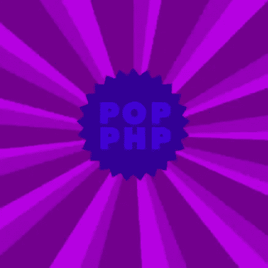
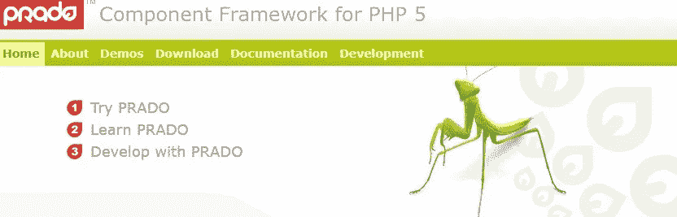
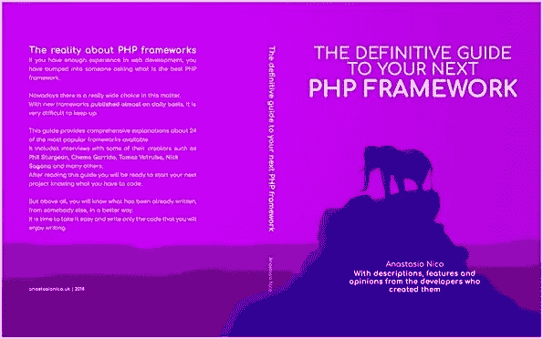

# 24 种 PHP 框架指南[第 3 部分]

> 原文：<https://medium.com/hackernoon/guide-to-24-php-frameworks-part-3-880ea250e3dc>

# 跟随系列…

这篇博文是“**下一个 PHP 框架的权威指南**”的第三部分

还没看？

为了对这个话题有一个完整的理解，请看一下[PHP 框架简介](http://anastasionico.uk/blog/guide-to-php-frameworks-part-1)和[PHP 框架指南第二部分](http://anastasionico.uk/blog/guide-to-24-php-frameworks-part-2)

# 第三部分介绍

到目前为止，如果您已经阅读了本文的前两部分，那么您应该掌握了使用 [PHP](https://hackernoon.com/tagged/PHP) 框架的艺术。

没有压力地工作，只写你想要的而不是你需要的。

你开始使用 PHP 框架了吗？

这种感觉很好，不是吗？

我告诉过你！

我认为我们还在中途，下面还有大量的框架有待发现。

我相信你会找到最适合你的

**目录**

*   [Li₃](http://anastasionico.uk/blog/guide-to-24-php-frameworks-part-3#li)
*   [网络框架](http://anastasionico.uk/blog/guide-to-24-php-frameworks-part-3#nette)
*   [费尔康](http://anastasionico.uk/blog/guide-to-24-php-frameworks-part-3#phalcon)
*   [Pop PHP](http://anastasionico.uk/blog/guide-to-24-php-frameworks-part-3#pop)
*   普拉多
*   [石英玻璃](http://anastasionico.uk/blog/guide-to-24-php-frameworks-part-3#silex)
*   [银条纹](http://anastasionico.uk/blog/guide-to-24-php-frameworks-part-3#silverstripe)
*   [结论](http://anastasionico.uk/blog/guide-to-24-php-frameworks-part-3#KindleBook)

# Li₃

正如我们在上面看到的，

几个框架正在重构版本或新项目，大量基于其他 PHP 框架。

Li₃也不例外。

它诞生于 2009 年 10 月，取名为 Cake3，源于 **Garrett Woodworth 和 Nate Abele 的想法，他们是 CakePHP** 的项目经理和开发者。

从 PHP 5.3 开始，Li₃声称自己是第一批为 web 开发者带来突破性技术的框架之一。

这个项目还设法获得了几个重要的赞助，如 Engine Yard(位于旧金山的 PaaS)、approval 和 Atelier Disko。

在其更相关的技术中，

**不得不提它的 API** ，

可能是第一个同时支持关系和非关系数据库及其类结构的。

事实上，

他们用灵活性做它的战马

类的结构允许你以一种非常简单的方式组织你的项目或者替换和覆盖内置的类。

它对闭包和匿名函数的使用也允许开发人员绑定方法调用。

Li₃包括 MySql、MongoDB、CouchDB 和 Redis，

支持 Cassandra 和 ElasticSearch 以及 PHP ActiveRecords 和 Doctrine 2。

当我问 Radify 的创始人兼首席执行官 Nate Abele 先生

(一家开发自动化软件的科技公司，Li₃的首席开发者)

他是如何看待框架以及如何选择最佳方案的，他给了我一个非常有趣的引用:

“这就像问什么是最好的食物。**不同的框架适用于不同类型的应用和不同的思考问题的方式。**

当然有一些重叠，但我不认为有人会说所有这些中的某一个是最好的。"

毫无疑问，Li₃是一个很好的框架，它周围似乎有一个相当大的社区，

按照其他框架，你需要进入并从你自己的经验看你是否喜欢它。

[Li₃官网](http://li3.me/)
[GitHub 资源库](https://github.com/UnionOfRAD/lithium)

# 网络框架

由大卫·格鲁迪创建，然后由一个大团队进一步开发，

不应将 Nette 视为一个框架，而是不同服务的组合。

它包括:

**Latte** 这种高科技的模板语言，绝对胜过 Smarty/Twig；

一个专有的依赖容器；

**测试人员**一个 PHP 单元测试套件；

**Tracy** 一个调试工具和；

依赖注入服务的 PHP 容器，当然还有开源框架。

框架本身也被分成小的包，你可以找到:

网络/应用；

nette/di；

网络/邮件；

nette/utils，

等等。

每个包都有自己的发布周期，需要的时候就会发布。

**有了这些包，你几乎可以构建任何东西，API，个人网站，和中型项目。**

Nette 本身是一个构建任何东西的伟大框架，因为它有一个非常酷的架构。

你可以把它系统的每一部分都换成不同的。

例如 DB，您可以轻松地使用 Doctrine 或有一个名为 Nette Database 的活动记录层。

如果你想在 PSR 7 上创建 API，你可以！

该小组在 PSR-7 上开发了许多项目，即使 Nette 与 PSR-7 不兼容。

它是一个支持 PHP 5 和 PHP 7 的 MVC 框架。

制作干(不要重复自己)和吻(保持简单，愚蠢)[编程](https://hackernoon.com/tagged/programming)原则其核心特点

这是一个易于使用和快速的 PHP 框架。

按照其他人的说法，即使是 **Nette 也有 BSD 许可证，它施加了最小的限制，增加了开发人员改进内部代码质量的机会。**

Nette 框架(我指的是所有的包)在 2.4 主线中是当前的。

之前的版本是 2.3、2.2、2.1 和 2.0。

目前，该团队正在准备 Nette 3.0，提供全面的(PHP 7.1)支持。

但是，如前所述，所有的 Nette 包都是 PHP 7.2 兼容的。

现在，

整个 Nette 团队大约有 6 个人，根据 SitePoint 调查，它似乎在整个东欧被广泛使用，被评为 2015 年第三大使用框架。

不幸的是，

即使有非常好的文档，对这个框架也没什么好说的。

但很明显，背后的团队正在努力提高产品及其周围环境的质量，其开源许可证对此帮助很大。

就像我给其他人的建议一样，你需要亲自动手去了解 Nette 是否是一个适合你的框架。

我有机会与 Nette 社区中最杰出的两个人聊天，他们的名字是**TomáVotruba**和**Milan ulc**。

只要看看他们在 GitHub 项目上做出的令人印象深刻的贡献，你就会明白你在和一个了解他们的人交谈。

由于 Nette 在过去两年中发布了数量有限的新功能，Tomá将大部分时间用于 Symfony 和博客写作。

关于这个话题，他想与我们分享的一个惊人的帖子是他首选的 3 个框架之间的比较；

[Symfony vs Laravel vs Nette](https://www.tomasvotruba.cz/blog/2018/05/31/symfony-vs-laravel-vs-nette-which-php-framework-you-should-choose.)

米兰的主要目标是改进文档，它是用捷克语或英语写的。

他对这个部门的贡献是巨大的。

他强调了 Nette 社区的发展，特别是在捷克共和国，该团队每月都会组织一次名为 PoSobota 的聚会。

每年夏天，他们都会聚在一起“网上露营”，一边编码一边喝酒(不确定他们的比例)。

[Nette 官网](https://nette.org/en/)
[GitHub 资源库](https://github.com/nette/nette)

# 法尔孔

当你看到一个产品时，很容易理解它的目的，当它被如此强调时，就更容易理解了。

Phalcon 的第一个也是最重要的目的是速度。

开发商安德烈斯·古铁雷斯(Andres Gutierrez)以一种与众不同的方式启动了这个项目。

事实上，

Phalcon PHP 是一个网络服务器扩展**它是用 C 和 Zephir** 这样的低级编程语言编写的，

它提供了用高级语言创建并编译成 PHP 的能力。

这个过程简化了开发，减少了编码时间。

Phalcon PHP 的测试版(名为 Spark)于 2011 年发布。

第一个版本的日期是 2012 年 11 月。

在这里，有一个非常快速的 ORM，缓存元素，它的基本代码遵循 MVC 模式。

在接下来的版本中，公布了其他功能，如 PHQL，这是 MySql 的一种方言，可以加快对数据库和模板引擎的查询和请求。

支持 LTS 的第一个 Phalcon 版本是 3.0.0，它支持 PHP 7。

来自 Phalcon 团队的一个引人注目的辅助项目是 Phalcon Slayer，

重构支持 Composer 的框架的包装器。

正如该团队所宣称的并在官方网站上强调的那样，

**这个框架专注于速度，因此它是最快的 PHP 开发框架之一。**

[Phalcon 官网](https://phalconphp.com/)
[GitHub 资源库](https://github.com/phalcon)

# Pop PHP

Nick Sagona 是新奥尔良 LA 的首席开发人员，他想出了重构几个旧 PHP 库并整合成一个开源项目的主意。

Pop PHP 的第一个版本于 2012 年 3 月 19 日发布。

**他的工作重点是将这些库合并到一组 MVC 组件中，以便以一种简单的方式创建一个 web 应用程序。**

第二个版本不再受支持，但仍然可用，于 2015 年 7 月发布，开发时采用了 PHP 5.4 和 Composer 的先进技术。

一年后发布的版本 3 对之前的版本进行了一些更新，并支持 PHP 7 和 PHP 5.6 中实现的新特性。

现在从官网和 GitHub 上可以得到的最新版本是 3.6.5。

这是非常好的产品，

它多次被评为最佳 PHP 框架，而且它目前包含了大得多的框架可以访问的大多数特性。

路由、服务定位器、事件管理器、表单生成器、自动电子邮件、PDF 生成器、缓存、调试、日志。

对于这个列表，

我需要添加 **Popcorn，这是一个基于 REST 的微框架，用于部署快速 web 应用程序。**

Nick 非常友好地回答了我关于 Pop PHP 的问题，

他说的是，这个项目始于他编写的一个小型组件库，用来处理他当时正在开发的网站和应用程序。

基于扩大的需求以及对行业趋势和标准的关注，它从那时起发展得非常快。

他当然投入了大量的个人时间，但他补充说，如果他能有更多的时间来营销或推广这个框架，他会很高兴。

[Pop PHP 官网](https://www.popphp.org/)
[GitHub 资源库](https://github.com/popphp)

# 普拉多美术馆

有时候，项目一开始就出师不利，你能做的很少。

普拉多似乎就是其中之一。

这个项目最初是由薛强发起的，他是一位在开源软件方面有丰富经验的中国软件工程师。

这个框架是受 Asp.net 和德尔福的启发而产生的。

这个产品的第一个版本发布于 2004 年 6 月，它是用 PHP 4 编写的。

由于这个原因，这个版本的质量受到了很大的限制，并引发了一些问题。

Qiang 使用更现代的 PHP 5 对其进行了重构，有了新版本，**他赢得了 2004 年 Zend PHP 编码大赛的冠军**，赢得了公众和评委的投票。

2005 年 5 月，开发团队决定从头开始重新编写框架，以修复第二个版本中发现的几个问题。

从版本 3 开始，这个项目变得更加稳定，

它的代码之前被转移到 Google code，之后被转移到 GitHub，这种转移导致更多的贡献者能够修复问题，从而成为一个更好的产品。

2008 年 10 月，开发团队发布了 Yii ，这是一个 PHP 框架，它继承了 Prado 留下的页面/事件的概念，专注于 MVC 设计模式。

现在，很多人仍然在提供帮助和开发新的特性，尽管现在大部分工作都集中在 Yii 上，我将在下一集描述它(所以订阅我的时事通讯，以便在它发布时得到通知)。

[普拉多官网](http://www.pradoframework.net/site/)
[GitHub 资源库](https://github.com/pradosoft/prado)

# Silex

杨奇煜·普登西耶是 Symfony 的创始人，你将在本文后面看到，Symfony 是这个列表中最好和最受欢迎的 PHP 开发框架之一。

Silex 与 Symfony 共享同一个创建者，于 2010 年最后一个季度首次发布，现在是 2.0 版本。

Silex 是一个基于 Symfony 的微框架，主要用于创建小型 web 应用和 REST APIs。

Silex 有两种不同类型；

**超薄的**，它只有一个基本的路由引擎，一个内置的安全功能，会话和 cookies 处理程序和一些其他的小功能，但速度极快，随时可用。

第二个版本叫**胖**，顾名思义就是两者的打包版。

它包括 Twig，一个模板引擎，Doctrine，一个数据库抽象，以及其他从母框架 Symfony 继承过来的特性。

目前， **Silex 被认为是最好和最快的微框架之一**，这是过去几年的几项基准测试所证明的。

如果你需要构建一个非常小的应用或者 API，花一些时间学习 Silex 是一个明智的选择。

最终的结果将是非常好的，你将开始了解 Symfony 的基础知识，如果你想扩大你的应用程序，这是很好的。

[Silex 官网](https://silex.symfony.com/)
[GitHub 资源库](https://silex.symfony.com/)

# 银色条纹

**这是另一个属于 CMS 类别**的项目，一个 BSD 许可下的开源软件。

SilverStripe 可以被认为是 CMS，因为它的管理面板允许用户编辑网站的部分内容，也可以被认为是 PHP SilverStripe 框架的核心，

该软件最初是由 SilverStripe Limited 开发的，它是一家最初位于新西兰和澳大利亚的网络公司。

利用 PHP 5 的一些新特性的第二个版本的开发始于 2005 年末，最终在 2007 年 2 月 3 日发布。

2010 年，该软件被下载了 25 万次，达到了一个巨大的里程碑。

SilverStripe 3.0 和 3.1 分别于 2012 年 6 月和 2013 年 10 月发布，现在支持 API 可用性、Composer、YAML，并改进了上传功能。

**与其他内容管理系统的一大区别是，负责创建内容的作者与必须改变网站结构的开发人员/设计人员之间有明确的界限。**

这种突出的分离为作者提供了一个易于使用的界面，同时也为 web 开发人员提供了更多的灵活性。

技术上是一个很好的软件开发在 PHP5.3 使用面向对象的设计，它遵循 MVC 模式和对象关系映射器。

在它的特性中，你可以看到 TinyMCE 的定制版本，SEO 友好的 URL，对 UTF-8 和国际化的支持，以及数百个模块，小部件和主题，可以用来扩展应用程序的核心。

总而言之，

**SilverStripe 是一个非常好的 CMS，可以作为一个合适的框架来使用和编辑**，

这些年来，由于其代码的良好质量和他们赢得的几个价格，这赢得了信任。

[SilverStripe 官网](https://www.silverstripe.org/software/framework/)
[GitHub 资源库](https://github.com/silverstripe/silverstripe-framework)

# 不要错过下一集…

这篇博客文章是 Kindle 书籍“**下一个 PHP 框架的权威指南**”的第三部分

检查:

*   [24 个 PHP 框架指南第 1 部分](http://anastasionico.uk/blog/guide-to-php-frameworks-part-1)
*   24 种 PHP 框架指南第 2 部分

查看本文的介绍和其他一些框架的评论

最后一部分将在接下来的几周内出版，或者你也可以。

# 现在轮到你了

我希望到目前为止你喜欢我的框架比较。

下一部分即将出版。

但是现在，

我想听听你的意见:

*如你所见，现在有很多 PHP 开发框架。你打算先试哪一个？*