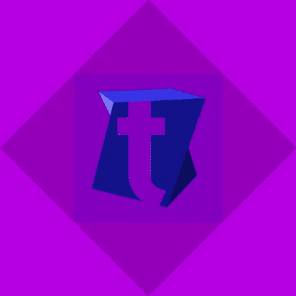

# 24 种 PHP 框架指南[第 4 部分]

> 原文：<https://medium.com/hackernoon/guide-to-24-php-frameworks-part-4-9addd6da4170>

# 跟随系列…

这篇博文是“**下一个 PHP 框架的权威指南**”的第四部分，也是最后一部分

如果你还没有读它

你可以点击下面的链接查看其他博客文章
[PHP 框架介绍](http://anastasionico.uk/blog/guide-to-php-frameworks-part-1)、
[PHP 框架指南第二部分](http://anastasionico.uk/blog/guide-to-24-php-frameworks-part-2)和
[PHP 框架指南第三部分](http://anastasionico.uk/blog/guide-to-24-php-frameworks-part-3)

# 第四部分也是最后一部分的介绍

我们终于到了。

现在，你可以认为自己是一个真正的 PHP 框架大师。

如果你遵循了前面的部分，你会发现有几种不同类型的 PHP 应用程序可以加速你的 web 项目或网站的开发过程。

下面你会发现最后几个元素，我认为是今天可用的 24 个框架中最好的。

我的建议是，再次通读这些帖子中的所有评论，知道你需要什么来为你的项目选择最适合的。

让我们开始:

**目录**

第四部分:

*   [*智能框架*](http://anastasionico.uk/blog/guide-to-24-php-frameworks-part-4#smart)
*   [*Symfony*](http://anastasionico.uk/blog/guide-to-24-php-frameworks-part-4#symfony)
*   [*TwistPHP*](http://anastasionico.uk/blog/guide-to-24-php-frameworks-part-4#twist)
*   [*错别字流*](http://anastasionico.uk/blog/guide-to-24-php-frameworks-part-4#typo)
*   [*Yii*](http://anastasionico.uk/blog/guide-to-24-php-frameworks-part-4#yii)
*   [*曾德*](http://anastasionico.uk/blog/guide-to-24-php-frameworks-part-4#zend)
*   [*结论*](http://anastasionico.uk/blog/guide-to-24-php-frameworks-part-4#conclusion)
*   [*特别感谢*](http://anastasionico.uk/blog/guide-to-24-php-frameworks-part-4#thanks)

一览表

*   [*PHP Frameworks 简介*](http://anastasionico.uk/blog/guide-to-php-frameworks-part-1#Introduction)
*   [*Agavi*](http://anastasionico.uk/blog/guide-to-php-frameworks-part-1#Agavi)
*   [*CakePHP*](http://anastasionico.uk/blog/guide-to-php-frameworks-part-1#CakePHP)
*   [*CodeIgniter*](http://anastasionico.uk/blog/guide-to-24-php-frameworks-part-2#CodeIgniter)
*   [*Drupal*](http://anastasionico.uk/blog/guide-to-24-php-frameworks-part-2#Drupal)
*   [*Fat Free*](http://anastasionico.uk/blog/guide-to-24-php-frameworks-part-2#FatFree)
*   [*FullPHP*](http://anastasionico.uk/blog/guide-to-24-php-frameworks-part-2#FuelPHP)
*   [*陀螺仪*](http://anastasionico.uk/blog/guide-to-24-php-frameworks-part-2#Gyroscope)
*   [*Jamroom*](http://anastasionico.uk/blog/guide-to-24-php-frameworks-part-2#Jamroom)
*   [*Kajona*](http://anastasionico.uk/blog/guide-to-24-php-frameworks-part-2#Kajona)
*   [*Kohana*](http://anastasionico.uk/blog/guide-to-24-php-frameworks-part-2#Kohana)
*   [*Laravel*](http://anastasionico.uk/blog/guide-to-24-php-frameworks-part-2#Laravel)
*   [*Li3*](http://anastasionico.uk/blog/guide-to-24-php-frameworks-part-3#li)
*   [*可爱的框架*](http://anastasionico.uk/blog/guide-to-24-php-frameworks-part-3#nette)
*   (T56) (T57) (Phalcon) (T58) (T59)
*   [*Pop PHP*](http://anastasionico.uk/blog/guide-to-24-php-frameworks-part-3#pop)
*   [*【Prado】*](http://anastasionico.uk/blog/guide-to-24-php-frameworks-part-3#prado)
*   [*西里克斯*](http://anastasionico.uk/blog/guide-to-24-php-frameworks-part-3#silex)
*   [*银条纹*](http://anastasionico.uk/blog/guide-to-24-php-frameworks-part-3#silverstripe)
*   [*智能框架*](http://anastasionico.uk/blog/guide-to-24-php-frameworks-part-4#smart)
*   [Symfony](http://anastasionico.uk/blog/guide-to-24-php-frameworks-part-4#symfony)
*   [*TwistPHP*](http://anastasionico.uk/blog/guide-to-24-php-frameworks-part-4#twist)
*   [*错别字流*](http://anastasionico.uk/blog/guide-to-24-php-frameworks-part-4#typo)
*   [*Yii*](http://anastasionico.uk/blog/guide-to-24-php-frameworks-part-4#yii)
*   [*Zend*](http://anastasionico.uk/blog/guide-to-24-php-frameworks-part-4#zend)
*   [*结论*](http://anastasionico.uk/blog/guide-to-24-php-frameworks-part-4#conclusion)

# 智能框架

互联网上没有太多关于这个框架的信息。

该项目于 2009 年至 2011 年间由 UNIX-world 启动，这是一家从事网络工作超过 15 年的软件公司。

它的首次发布日期是 2012 年 2 月，而且似乎经常更新，

目前最新的稳定版本是 2018 年 4 月 25 日发布的 3.7.5。

正如您之前看到的一些内容，它是一个免费的开源产品，BSD 许可，并且通过混合多层和中间件遵循 MVC 架构。

它最重要的特性之一是广泛支持不同类型的数据库，如 MySql、SQLite、MongoDB、PostgreSQL、几个 JavaScript 组件、内置地图处理程序(Google maps 和 Bing maps)和 Redis 缓存。

为什么你想选择它而不是其他的？

在官方网站上，**所有者声称这个框架比其他更受欢迎的框架快很多倍，比如 Zend 和 Laravel。**

这可能是一个尝试它的好理由。

尽管如此，作为开始的一个缺点，您需要看一下文档，在这种情况下，这些文档可能看起来有点混乱。

[智能官网](http://demo.unix-world.org/smart-framework/)

[GitHub 资源库](https://github.com/unix-world/Smart.Framework)

# Symfony

这是顶层框架俱乐部的另一个成员。

2005 年，SensioLabs 和 Blackfire.io 的首席执行官杨奇煜·波蒂斯创立了 Symfony

在其第一个版本中，Symfony 支持 PHP 5.0 和几个功能，从那以后，它越来越受欢迎，越来越可靠，现在**成为仅次于 Laravel 和 CodeIgniter** 的三个最受欢迎的软件之一，并且是企业公司中使用最多的软件。

Symfony 由几个 PHP 组件组合而成，这些组件合并在一起形成了框架。

自最初发布以来，它定期出版，每年至少有两个新版本。

直到现在，

所有不同的版本都有至少八个月的支持，在某些情况下，甚至长达三年，

有 4 个不同的版本目前在 LTS 发布；2.7 和 2.8 均于 2015 年发布，而 3.4 和 4.0 版本于 2017 年 11 月发布。

在撰写本文时，下一个版本将是 4.1，它将于 2018 年 5 月发布，并将支持 PHP 7.1.3 和更新版本。

正如我前面所说的，**这个框架包含了大量的组件**，超过 30 个，解释它们超出了本文的范围。

但是有些真的很有意思，值得在这里提一下。

其中，我们发现缓存组件提供了一个扩展的 **PSR-6 和 PSR-16，用于为应用**添加缓存，控制台组件是不言自明的，

PHPUnit 桥，报告遗留测试和废弃代码，以及安全性、翻译、路由和验证器组件。

**这个框架的一个惊人特点是它的文档化。**

开发这个项目的人不仅创建了一个非常详细的项目，而且对每个组件都有一个**解释。**

也有很多人在谈论这个框架和一个巨大的社区，所以文档和支持永远不会是一个问题，这是想开始使用它的人应该考虑的事情。

我应该学 Symfony 吗？

为了回答这个问题，我将描述一个关于投资的著名规则。

这条规则说，专注于蓝筹公司是一个非常好的想法，拥有非常著名的品牌和几十年成功的分账支付。

**这里，我们有一个蓝筹 PHP 框架，其他不同的框架都是从这个框架中诞生的。**

例如，Laravel，尽管有一个更现代的风格，开始并仍然大量基于 Symfony 组件。

这证明，如果你喜欢它的传统风格，Symfony 无疑是开始的框架。

[Symfony 官网](https://symfony.com/)

[Symfony GitHub 库](https://github.com/symfony/symfony)

# TwistPHP

这是一个使**易用性成为其商标的小框架。**

这是一个在 GNU 许可下发布的开源框架。

它包含几个几乎只用几行代码就可以实现的特性。

TwistPHP 最初是一个私人项目，随着改进的进行，它的源代码公开了，并于 2014 年 7 月转移到 GitHub 仓库。

2014 年 11 月 TwistPHP 2.3.4 发布了第一个正式版本。

这些年来，这个软件有足够的时间来改进，现在随着它的最后一个稳定版本(3.0.5)，它有一个完整的 MVC 架构，面向对象的设计，和全新的方法来连接到数据库和创建 MySql 查询，它已经建立的方式促进了它的可扩展性和可靠性。

基本上，

**它可以被认为是一个现代化的框架。**

如果你想尝试一下或者帮助项目发展，你可以通过下面的 GitHub 库来支持它

[Twistphp 官网](https://twistphp.com/)

[TwistPHP GitHub 库](https://github.com/TwistPHP/TwistPHP)

# TYPO3 流量

为了有效地描述这个框架，故事需要从 TYPO3 开始。

**它是 20 多年前开发的免费开源 CMS**(1998 年首次发布)。

多用于德语国家，但也有 50 多种语言版本，

TYPO3 用于构建任何类型的网站。

仅仅是为了了解这个 CMS 有多大，它的代码已经被 300 多个贡献者编辑和改进，目前它已经被安装了超过 500000 次。

TYPO3 流是 TYPO3 的一个分支，该团队希望创建一个现代的产品，可以独立于 TYPO3 使用。

经过几个月的开发，测试版于 2011 年 8 月发布，它也是一个开源产品。

最新版本为 4.2.4，发布日期为 2017 年 10 月 18 日。

该代码是 TYPO3 Neos 的基础代码，但如前所述，即使没有 CMS 也可以使用。

它遵循了所有最新的编码原则，如 MVC 范式、AOP(面向方面编程)、DDD(领域驱动设计)和 TDD(测试驱动开发)等。

因此，该软件需要版本 5.3 或最新版本。

**根据数据库，它使用教义 2，可以与 MySql 和 PostgreSQL 接口。**

关于 TYPO3 流的另一个有趣的特征是流体；

流体是它的模板引擎。

它支持[编程](https://hackernoon.com/tagged/programming)语言的所有逻辑结构，如条件、迭代、循环等，通过**提供一个非常简单的语法并避免在模板文件中使用 PHP。**

我设法与社区联系人 Christian Müller 先生进行了交谈，他强调说**在我编写 Neos 项目(包括流程框架)时，TYPO3 项目已经分离出来，现在正式独立为 Neos 项目。**

流动框架现在可以在“近地天体流动”的名称下找到，或者如果知道上下文，就只称为流动。

除了几个比特的共享代码外，不再有与 TYPO3 的连接。

也就是说，就框架而言，目前只有小的变化。

Christian 和他的团队试图获得更多的 PSR 兼容性，越来越多地使用 composer，总体上对软件包更加开放，并增加了社区的规模。

他个人致力于重构、SQL 改进和发布。

[流量官网](https://flow.neos.io/)

[流 GitHub 库](https://github.com/neos/flow)

# Yii

Yii 是一个 PHP 框架，由 Prado 的同一批创建者开发。

**说实话，它的诞生是为了尝试修复所有普拉多的问题**(见[普拉多评论](http://anastasionico.uk/blog/guide-to-24-php-frameworks-part-3#prado) ) **。**

像其他框架一样，它是在新的 BSD 许可下发布的，因此，可以免费使用它和创建开源 web 应用程序。

经过几个月的开发，第一个测试版本于 2006 年发布，随后在 2008 年 12 月发布了正式的 1.0 版本。

2010 年 1 月发布了一个更完整的版本，它包括一个表单生成器、ActiveRecord、一个内部单元测试库和几个更多的特性，这些特性使 Yii 成为一个比它的前身更完整的 PHP 框架。

从一开始，开发人员就决定用最新的技术来维护这个项目。

目前，当前版本 2.0.15 已于 2018 年 3 月发布，全面支持 PHP 7。

没有特别的特性或特殊之处，但**它是一个非常坚实的框架**，最新版本的特性包括:

MVC 设计模式、国际化和使用 I18N 和 L10N 本地化，这些允许翻译文本和格式化时间和日期、错误处理程序和日志、针对 XSS 和跨站点请求伪造的安全措施，加上 PHPUnit 和 Selenium 的测试功能。

正如你在上面多次看到的，当我需要决定是否开始使用一个新的 PHP 框架时，我考虑的一个要点是文档。

**Yii 的文档是首屈一指的。**

我并不是说他们有世界上最好的文档，但这是非常广泛和深思熟虑的。

它分为两部分，

**指南**和 **API** 上的相关部分，它们中的每一个都按照概念进行了划分，这使得特定功能的研究变得更加容易，并且它还提供了多种语言，包括西班牙语、中文和波兰语。

说到社区，Yii 的家伙们把它带到了一个新的高度，通过创建一个他们称之为扩展的**整体部分，完全由用户贡献合成。**

我请 Alex Makarov，Yii PHP 框架 7 年多的核心维护者之一，给我们谈谈他对这个框架的印象，他是这样说的:

*“我认为，总体而言，YII 是记录最多的框架之一。*

*我们正在为我们发布的所有产品编写优秀的 API 文档，有时还会扩充指南。*

*对于刚开始的人来说，学习曲线很低，但是对于使用 Yii 的大型项目的架构来说，学习曲线很高。*

*总的来说，Yii 非常适合快速的应用程序原型开发，而且，你可以在之后真正地增强这个原型，而不是扔掉它重新编写。*

有许多开箱即用的工具。

*比很多框架都快，缓存也不多。*

此外，如果出现错误，也很容易调试。灵活的同时又不会太有层次感。”

总之，

我认为 Yii 从 Prado 项目中吸取了教训，尽管网上仍然有对框架质量的质疑，但你肯定能尝到他们投入的努力。

[YII 官网](https://www.yiiframework.com/)

[YII GitHub 知识库](https://github.com/yiisoft/yii2)

# Zend 框架

关于 Zend 和它的整个环境有很多争议，

**它被认为是当今最流行的 PHP 开发框架之一**(大量的安装证实了这一点)。

它于 2006 年 3 月首次发布，是在新 BSD 许可下许可的开源产品。

最初，它是一种独特的产品，

在 2.5 版本之后，开发人员决定创建一个更加模块化的产品，所以他们将框架分成几个组件，它变成了一个 PHP 包的集合。

有 60 多个组件和插件可供选择。

其中最重要的是身份验证、Crypt、Json、Mail、Math、分页器、序列化器和验证器。

使用 Zend 的另一个优势是它容易受到 TDD(测试驱动开发)的影响，

Zend 实现了 Zend_test，它使用 PHPUnit，它允许你使用控制器、模型和库。

为了在项目中实现 PHPUnit，您需要使用 Zend_tool，这是 Zend 的标准搭建工具。

和往常一样，我特别关注文档和教程，这里 Zend 是最好的。

他们不仅有令人惊叹的文档，而且还通过创建培训日、会议(ZendCon)和一套全球公认的认证，更进一步。

所有这些都伴随着巨大的开发者社区，他们每天都在使用它并分享它的知识。

如我所说，

**这是一个很好的 PHP 框架**，

但是它也有缺点(代码的质量还有待提高，它肯定不是本文中列出的最快的框架)，但是总的来说，它是一个很好的框架，它对市场营销的关注得到了回报(谁能责怪他们呢)?).

更不用说，

对于一些人力资源经理来说，PHP Zend 证书相当于一个计算机科学学位。

[Zend 官网](http://www.zend.com/)

[Zend GitHub 资源库](https://github.com/zendframework/zendframework)

[Zend 认证](http://www.zend.com/en/services/certification)

# 结论

我相信我们都至少听过一次人们说 **PHP 已经死了**，或者类似这样的句子:

*现在有 Python*，

*。NET 是新的 PHP* "，

"*你试过 Ruby 吗，太神奇了*"，

“*我已经知道了 JavaScript，所以在过去几年里我选择了 NodeJS* ”。

事实是 PHP 已经改变了，而且现在仍在改变。

有一段时间，5.5 版本(2013 年 6 月发布)似乎是最后一个版本，

废弃的 6.x 版本，然后升级到 7.0 版本，这非常慢，这给了其他后端语言上升和变得更受欢迎的时间。

然而，

**这次暂停的结果是 PHP 有史以来最快的版本**，它的一系列特性实现了它巨大的，平均来说是 PHP 7.1 和其他任何蓝象语言之间的基准测试。

通读 2015 年 12 月发布的文档，我和世界各地的数千名其他开发人员都松了一口气，带着喜悦的微笑。

Null Coalesce 操作符、飞船、生成器、匿名类是这种语言的特征，它们将帮助开发人员在未来几年内创建令人惊叹的项目。

**特别感谢** [**作曲家**](https://getcomposer.org/) ，Nils Adermann 和 Jordi Boggiano 的努力令人难以置信，这个依赖管理器永远改变了我们编码的方式。

只需在我们的项目根目录下添加几个文件，并在终端上运行几个命令，释放的能量就有可能让您创建新的脸书(至少在纸上)。

关于框架，

正如我们所看到的，“哪一个是最好的 PHP 开发框架”这个问题没有唯一的答案。

为了回答这个问题，要提出很多问题；

你需要创造什么？

你的最后期限是多远？

你希望你的项目以多快的速度交付？

真的这么好用吗？

我需要多少时间来学习新的语法？

有没有好的文档可以借鉴？

我的建议是每次对每个项目评估所有这些问题。

尝试一下你觉得更有趣的，选择那些让你感觉正确的。

**同时不要忘记 PHP 开发框架来来去去**，

始终专注于学习主要的语言特性，并跟上每次新版本的更新。

附加提示:

## 不要忘记阅读

*“当我还是个孩子的时候，我真的有很多梦想，我认为其中很大一部分源于我有机会大量阅读的事实。”*

比尔·盖茨-商业大冒险。

现在，

我相信我们都同意，花时间在屏幕前，无论是编码还是玩云服务、版本控制网站等等，都将提高你作为 web 开发人员的能力。

但是正如比尔在约翰·布鲁克斯写的书中所说的那样，另一个提高的方法是读书，这对我帮助很大。

从四人组写的“**设计模式:可重用面向对象软件的元素**”到 PHP The Right Way 的负责人 Josh Lockhart 写的“**现代 PHP** ”，有大量的资源可供学习。

像比尔一样。

# 特别感谢

我要特别感谢下面这些人，尽管他们一直致力于实现和改进我们全世界的开发人员和公司每天都在使用的框架，但他们还是抽出时间回答了我的一些问题，这些问题提高了本文的质量。

它们是:

菲尔·斯特金

[https://philsturgeon.uk/](https://philsturgeon.uk/)

WeWork 的软件工程师

用于**燃料 PHP** 和**点火器**

加里多化学公司

[https://chema.ga/](https://chema.ga/)

Yclas 创始人兼首席技术官

对于 **Kohana**

**托马什·沃特鲁巴**

[https://www.tomasvotruba.cz/](https://www.tomasvotruba.cz/)

Notino 社交媒体和内容营销主管

米兰舒尔茨

https://f3l1x.io/

自由作家 DevNinja

对于**内特**

尼克·萨戈纳

[https://nicksagona.com/](https://nicksagona.com/)

准时抽象公司高级软件开发员

对于 **POP PHP**

**克里斯蒂安·米勒**

[https://www.flownative.com/](https://www.flownative.com/)

TYPO3、Flow 和 Neos 的免费代码创建器

对于**类型 3 流量**

**亚历山大·马卡罗夫**

[https://en.rmcreative.ru/](https://en.rmcreative.ru/)

Skyeng 首席 PHP 后端开发人员

对于 **YII**

内特·阿贝尔

[http://radify.io/](http://radify.io/)

Radify.io 首席技术官

对于 Li₃

# 下一个 PHP 框架的权威指南

这篇博客文章是 Kindle 书籍“**下一个 PHP 框架的权威指南**”的第三部分

检查:

*   [24 PHP 框架指南第 1 部分](http://anastasionico.uk/blog/guide-to-php-frameworks-part-1)
*   [24 PHP 框架指南第 2 部分](http://anastasionico.uk/blog/guide-to-24-php-frameworks-part-2)
*   [24 PHP 框架指南第 3 部分](http://anastasionico.uk/blog/guide-to-24-php-frameworks-part-3)

查看本文的介绍和其他一些框架的评论

你可以点击下面的链接下载完整版本。

# 现在我想听听你的意见…

我希望你喜欢我的框架比较。

你为你的下一个项目选择了哪个 PHP 框架？