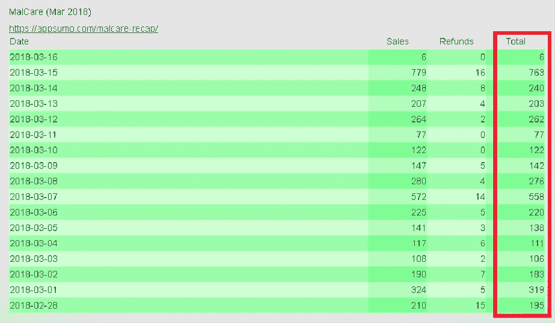
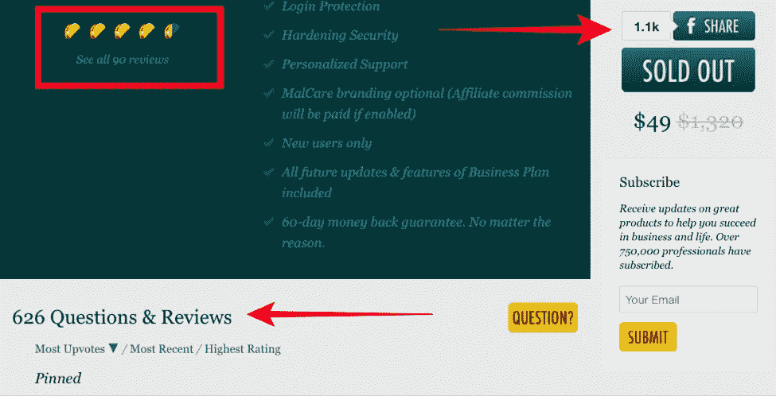
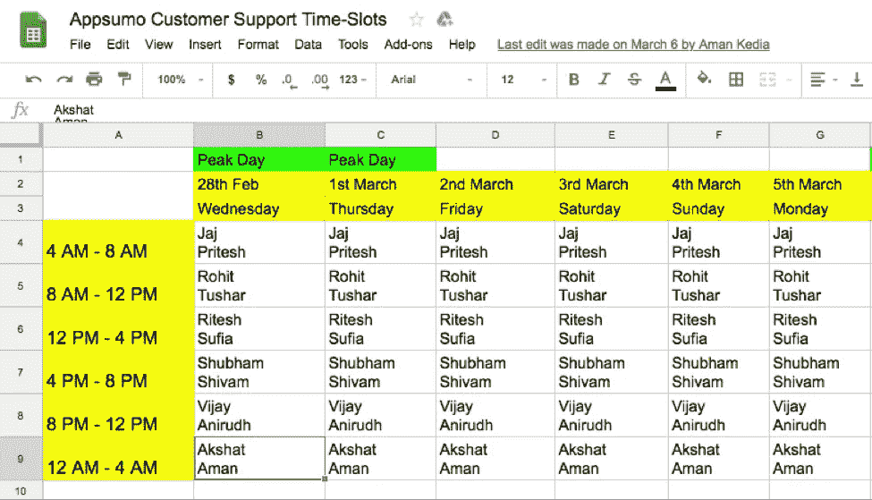
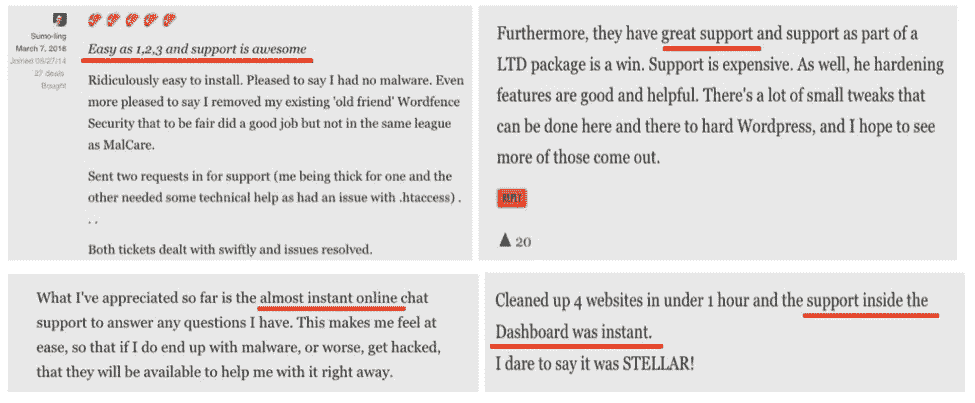
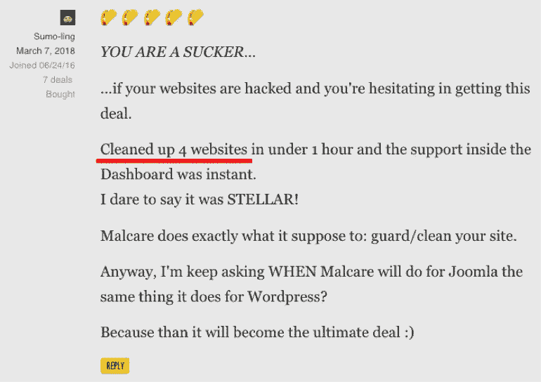
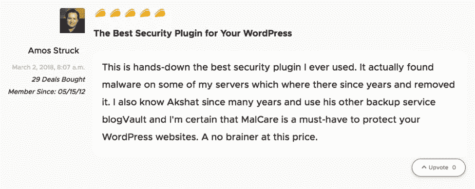
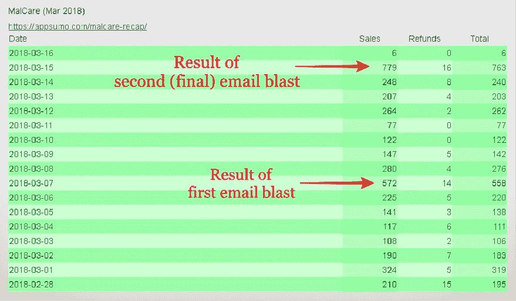
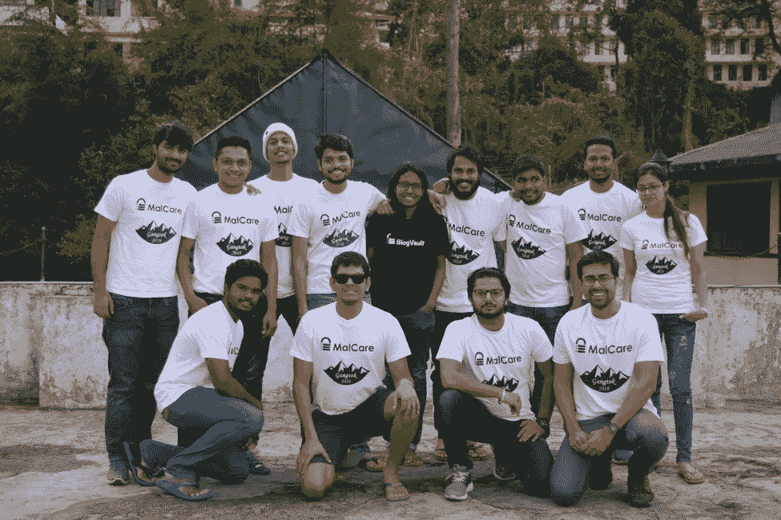

# 超级成功的 AppSumo 推广指南

> 原文：<https://medium.com/hackernoon/guide-to-a-super-successful-appsumo-promotion-506b9f383851>

首先，你为什么要听我们的故事？

AppSumo 的发布仅在两周内就为我们带来了 20 万美元的巨额销售额！

**这就是为什么你应该听听我们的故事…**

现在，你是一个梦想家吗？

我们也是！我们是梦想家和骗子。

但是我们不只是做梦。我们活着是为了通过制造一些坚实的技术产品来实现我们的梦想。

我们的最新产品， [MalCare](https://appsumo.com/malcare/) (一个完整的 WordPress 安全解决方案)于今年早些时候在 [AppSumo](https://appsumo.com/) 上发布。

我们带着许多担忧走进去，因为一个 [WordPress](https://hackernoon.com/tagged/wordpress) 安全解决方案以前从未在 [AppSumo](https://hackernoon.com/tagged/appsumo) 上出现过。我们的怀疑程度如此之高，以至于我们原本预计只卖出 500 笔交易，**但结果却卖出了 4000 多笔交易！**

查看我们的销售仪表板:

这是我们 AppSumo 推广的结果:

*   **4000 多笔交易成交**
*   **20 万美元的销售额**
*   **超过 1100 人分享了我们的交易页面(感谢所有人^_^)**
*   回答了 626+个问题… Phewwww！
*   70 多名出色的顾客给了我们整整 5 份玉米卷
*   **来自社区的数百条宝贵反馈和支持**
*   最棒的是，来自 AppSumo 社区的令人谦卑的热情是被接受的标志

(*AppSumo 分配的是玉米卷而不是星星)

# 我们在找什么？

当然是顾客！

我们花了数年时间创建 MalCare，这是世界现在真正需要的一站式 WordPress 安全解决方案。但是在开发了产品之后，我们不知道如何将 MalCare 带给那些需要一个好的安全解决方案的人。

因此，我们开始寻找合适的用户。我们寻找合适的分销渠道，很快就找到了

相扑。AppSumo 是一个令人惊叹的日常交易平台，为近**100 万活跃用户**带来最具创新性和高质量的软件。他们有一个非常严格的挑选产品的过程，这保证了如果我们通过挑选，我们将会有大量的顾客。

虽然用户数量很诱人，但我们想确保 AppSumo 是发布我们产品的合适平台。因此，我们从这样一个平台上列出了我们的目标:

*   **在短时间内接触大量受众—** AppSumo 每月吸引数百万访问者，并拥有近百万活跃订户
*   **获得大量用户反馈——他们有一个非常活跃的用户群体。相信我说的话…**
*   **多倍加速产品开发周期——来自 AppSumo 紧密团结的社区的质量反馈将帮助我们实现这一目标**

**根据我们的评估，AppSumo 是推出 MalCare 的最佳平台。所以我们卷起袖子准备推广相扑。**

# **作最坏的打算**

**我们联系了 AppSumo 团队，为他们的观众达成了一笔完美的交易。注意:他们喜欢我们的产品，但也告诉我们**一个 WordPress 安全解决方案以前从未出现在 AppSumo 上。****

**老实说，这让我们很紧张。**

**没有办法知道 Sumolings 对我们这样的产品会有什么反应。所以我们保持很低的期望，真的很低— **正如我们之前所说的，我们预计我们的销售额最多能达到 500 笔。****

****此外，我们不喜欢以 49 美元的一次性终身价格放弃我们价值 259 美元的年度商业计划！这真的让我们很犹豫。****

**最后，我们决定看看事情会如何发展，并大胆尝试。**

****

# **发布前的忙碌**

**2 月 28 日——我们被告知 AppSumo-MalCare 交易页面将上线。我们只有一周的准备时间。**

**在 AppSumo 这样的平台上准备上线，一周时间有点少。我们听说人们花了长达一个月的时间来准备。说我们有点害怕是一种保守的说法。**

**为了抑制我们的恐惧，我们 13 人的小团队挤在一个小房间里，头脑风暴了几个小时。最终，一个对抗阿扑索摩巨人的战斗计划被制定出来。**

**我们明确了优先事项，开始为 AppSumo 推广活动做准备:**

# **1.客户入职体验**

**想象一下，你对一个产品印象深刻，买了它，然后不断地得到 404 分。兴奋很快就被烦恼取代了！**

**我们知道，一旦交易页面上线，数百名客户将同时注册我们的系统。这可能会导致系统失败并阻碍入职流程。**

**拥有一个无缝的入职流程非常重要，因为它会让客户满意。考虑到这一点，我们做的第一件事就是提升我们的入职体验(即注册、添加网站、安装插件等)。)针对新用户。**

****

# **2.支持所有人**

**理想情况下，客户希望有好的产品和好的支持。我们打造了一款优秀的产品，希望为新的 MalCare 用户和潜在买家提供最佳的客户支持。**

**AppSumo 推广活动仅持续两周，在此期间，从字面上看，成千上万的问题从宇宙的各个角落涌入。作为一个 13 人的小团队，回答数千人的问题的前景令人望而生畏。但我们知道，提供出色的支持将有助于我们克服其他方面的任何不足。此外，我们期待着对产品或文档的任何反馈，如果我们做了适当的支持工作，这将是可能的。**

**因此，我们决定为每一个向我们伸出援手的人提供积极的支持。**

**我们想出了一种方法，通过将我们 13 人的小团队分成 6 个小组来提供全天候支持。因此，每天有 2 人进行 4 小时的支援值班。**

# **3.创建支持担保品**

**使用新产品可能会有点麻烦。准备好正确的文档可以让客户的工作更轻松。**

**前面我们谈到了为成千上万的新客户提供支持。由于我们在创建宣传资料方面付出的努力，无论何时需要，支持人员都能够为客户提供正确的文档。它有助于快速跟踪流程，并使我们能够以同样的响应能力处理更多的客户。**

**在很短的时间内，我们创建了 3 种类型的文档:**

## **一、交易前文件**

*   **[**帮助文档**](https://malcare.freshdesk.com/support/solutions/35000131188) **带视频覆盖 53 个问题和答案。这些文件解释了如何有效地使用产品。****
*   **[**常见问题**](https://www.malcare.com/faq/) **涵盖了 119 个问题和答案。**详尽的常见问题解答，涵盖关于我们产品的所有疑问。它有助于客户更好地了解 MalCare 的可用性。**

## **二。交易文件**

**我们创建了针对此交易的**帮助文档和常见问题解答** — [AppSumo-MalCare 交易常见问题解答页面](https://www.malcare.com/appsumo-faq/) (38 个问题和答案)和带视频的 [AppSumo 可堆叠交易帮助文档](https://www.malcare.com/appsumo-stackable-deal-help-doc/)。FAQ 页面提供了对交易和产品的更好理解。帮助文档具体介绍了如何兑换交易代码。**

**我们创建的另一个极其重要的内部文档是**常见问题&答案纸**。在最初的几天里，我们注意到问题中的一种模式。本质上，许多 Sumolings 都在问同样的问题。通过为这些常见问题创建一个通用答案，我们不仅能够按时回答，还能确保团队不会给出相互矛盾的答案。**

## **三。交易后文件**

**反馈，无论多么苛刻，对产品的成长都是必不可少的。交易结束后，我们回到一般帮助文档和常见问题。多亏了这些反馈，我们才能够发现文档中的不足之处。我们着手改进这些文件。**

# **令人抓狂的上市前三天**

**你可以想象当 2 月 28 日[交易页面](https://appsumo.com/malcare-deal/)上线时，我们的心是如何跳动的。头三天是最紧张的，也是一次非常累人的经历。以下是最初几天发生的一瞥。**

# **1.支持是情感的过山车**

**页面一上线，查询的闸门就打开了。问题开始像猛烈的瀑布一样涌入。文件准备好了，我们就有了解决问题的工具，但是速度太快了，跟不上。尽管面临重重障碍，我们还是继续前进。**

**我们最终支持了 4000 多家新客户和潜在客户。**仅仅两周的时间就能获得超过一年的支持！****

**支持是一个情感强烈的旅程，但我们设法回答了大多数人的问题，并尽我们所能帮助他们。**

**最终，我们让客户感到满意，并因我们的快速响应而受到称赞。**

****

# **2.早期采用者开启了这一进程**

**该交易的早期采用者立即开始使用 MalCare。一些人入侵了网站，他们急于清理这些网站，使其恢复正常。**

****

**使用我们的工具[一键清理他们的网站](https://www.malcare.com/malware-clean/)，让他们非常高兴，他们不仅开始公开谈论这件事，还在 AppSumo 页面上留下了一些慷慨的评论，以帮助其他人做出决定。对 MalCare 持怀疑态度的人现在很好奇，甚至渴望试用我们的产品。那些早期采用者所制造的轰动效应帮助销售一飞冲天。**

**对我们来说，这些早期的回顾是情感上最充实的经历之一，因为我们终于可以看到我们多年的努力得到了回报。最重要的是，我们很高兴能在 WordPress 社区中有所作为，我们与他们有着如此深厚的关系和如此深厚的爱。**

**拥有 30，000 名订户的受人尊敬的 WordPress 影响者 Adam Preiser 告诉他的追随者 MalCare 是如何不同的:*“MalCare 变得更聪明(指 mal care 的人工智能)。这是那些(其他)基于插件的解决方案所不具备的。”***

**其他几个 Sumolings 称赞 MalCare 是 WordPress 最好的安全插件。**

****

**Some love from an AppSumo customer**

# **3.请求支援**

**我们有另一个非常受欢迎的产品叫做 BlogVault，一个完整的 WordPress 备份和站点管理服务。在过去的 7 年里，我们已经为成千上万快乐的客户提供了 WordPress 备份。**

**在交易开始后的几分钟内，Sumolings 很快意识到 MalCare 来自 BlogVault，并开始呼吁进行备份。这是我们没有预料到的。对后援的需求变得如此强烈，以至于我们不得不停下来考虑。**

**随之而来的是，在一周的中间，12 个愤怒的男人 Style(好吧，13 个男人和女人)坐在一个圆桌上，激烈地争论着我们是否应该提供一个备份附加。以低得多的价格赠送一个成熟的产品是一场艰苦的战斗，比听起来要困难得多。**

****但是，顾客才是王道(永远)……****

**因此，在 AppSumo 向其近 100 万订户发送电子邮件的前一天，我们宣布了我们的特别备份附加服务，以帮助每个人充分利用这笔交易。**

# **4.关于脸书集团的讨论让我们回到了起点**

**在过去的八年里，AppSumo 已经成功地建立了一个非常活跃和活跃的社区。不足为奇的是，他们有一个官方的[脸书小组](https://www.facebook.com/groups/OfficialAppSumo/)，人们在那里就任何正在进行的 AppSumo 推广进行非常激烈的讨论。我们一直在跟踪那里以及脸书上其他 WordPress 相关群组的对话。**

**这是非常有成效的，因为我们了解了人们喜欢和不喜欢 MalCare 的地方。例如，我们了解到他们中很少有人不喜欢出现在使用该服务的网站页脚处的默认 MalCare 徽章(尽管交易中明确提到了它)。**

**这一发现让我们后退了一步。我们必须解决这个问题以及脸书团体中出现的其他问题。感谢我们的工程团队，我们反应迅速，一天之内就在仪表板上推出了 MalCare 徽章禁用按钮。唷……**

**经验教训:非常重要的一点是，要密切关注，尽可能多地跟踪对话。他们不仅为你提供了一些很好的反馈，而且还能通过即时回应你的担忧来帮助你避免灾难。**

# **电子邮件爆炸让不可思议的事情发生了**

**AppSumo 并不秘密的武器是它的**近百万电子邮件用户群**。在两周的时间里，AppSumo 向其订户发送了两封电子邮件，告知他们正在进行的交易。第一封邮件在交易页面上线一周后发送，第二封邮件在交易结束前一天发送。**

**在这两种情况下，销售额飙升至前所未有的高度。**

**对于 AppSumo-MalCare 交易:**

*   ***第一封邮件群发:销售额从* ***225 跃升至 572*****
*   ***第二封邮件群发:销售额从* ***248 跃升至 779*****

****

# **MalCare AppSumo 促销活动的主要收获**

**AppSumo 推广活动持续了 2 周，在这短短的时间里，我们学到了通常需要几个月甚至几年才能学会的东西。其中一些经验如下:**

# **1.差评有好处**

**每个产品都有缺点。即使有这些知识，被告知我们的产品缺少某个特性或者不够好，还是会让人伤心。很多。**

**许多 Sumolings MalCare 没有达到他们的期望，他们对此直言不讳。但是最后我们知道了，差评不是世界末日。如果有的话，它告诉我们有改进的空间。**

**通过选择正面接受差评，我们能够看到未来改进产品的许多方法。**

# **2.依靠声誉**

**在网上购物时，人们总是对相对不知名的新产品持怀疑态度。对那些以一次性价格提供服务的鲜为人知的企业的恐惧是很普遍的。这就是为什么一些潜在客户向我们的支持人员询问公司的过去和未来计划。虽然 AppSumo 是一个值得信赖的平台，但了解到我们已经在这个行业工作了很长时间，有助于培养对我们产品的信任。**

**BlogVault 是我们第一个也是最受欢迎的服务。它是七年前推出的。我们有成千上万相信我们产品的顾客。因此，我们能够向那些与我们接触的人保证，我们将长期参与其中。**

# **3.曝光培养朋友**

**我们之前提到过对这笔交易的期望值非常低。我们没有料到会有成千上万新顾客，我们当然也没有料到人们会拥护我们的产品。向在脸书各种团体中拥护 MalCare 的[罗宇胜·洛萨诺](https://www.facebook.com/techiepinoy)、[江泽龙·拉加德](https://www.facebook.com/jflagarde)、[阿伦·帕特奈克](https://www.facebook.com/arunpattnaik)、[拉金德拉·佐雷](https://www.facebook.com/rajendra.z)和[伊维卡·德利奇](https://www.facebook.com/ivica.delic)大声喊出来！我们真诚地爱你们，你们是真正的摇滚明星！**

**由于 AppSumo 给了我们曝光率，人们突然开始向我们寻求合作或媒体机会。在不止一个案例中，我们得到了我们追踪了几个月的人的主动回复。**

**很甜蜜…不是吗？**

# **遗言**

**我们取得了超出预期的成绩，现在几乎是飘飘然了！**

**经过几个星期的辛劳，付出我们的血汗，攀登 AppSumo 推广活动，我们攀登了喜马拉雅山！为了庆祝我们意想不到的超级成功，MalCare 团队去了雪山静修。**

****

**Team MalCare, enjoying the mountains**

***原载于* [*MalCare 博客*](https://www.malcare.com/blog/2018/07/23/200k-in-18-days-our-guide-to-a-super-successful-appsumo-promotion/) *。***