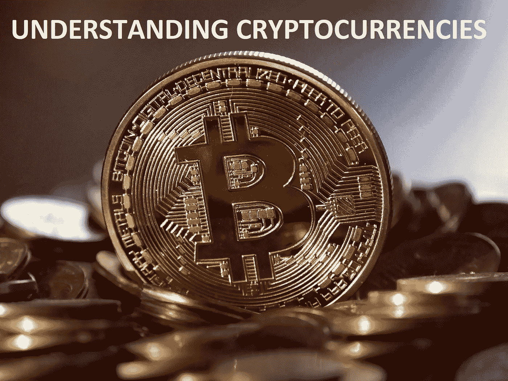
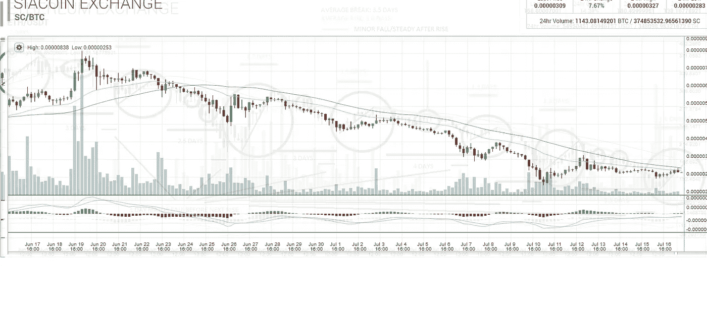

# 加密交易指南第 1 部分:日内交易——如何选择硬币

> 原文：<https://medium.com/hackernoon/guide-to-crypto-trading-part-1-day-trading-how-to-pick-a-coin-a572c6431ca9>

Trading can be simple when you follow your basic rules

在之前的一篇文章中，我写了关于[理解加密货币](/@mappopk/understanding-your-cryptocurrency-investment-4f47615c31ad)和投资时应该寻找什么，以及[理解交易所的买/卖墙](/@mappopk/guide-to-crypto-trading-part-2-day-trading-the-great-buy-wall-523d7c4d31b)。这仍然留下了一个问题，当选择一个硬币来做日内交易时，我应该寻找什么？

现在我需要暂停一下，我不是一个合格的财务顾问。下面的信息纯粹是我的教训，观察和经验，在密码世界，我想传递。如果你决定投资加密货币，只投资你愿意失去的。做你自己的研究，向尽可能多的人学习，以获得对加密货币交易的全面了解。

你必须有坚强的毅力来经受住这个市场的波动。我在几个小时内损失了几千美元，但是通过坚持和保持坚挺，它又回来了。
由于密码世界的波动性，如果你有足够的经验，你可以从市场上的几乎任何硬币中获利。但是即使是我也没有足够的经验。因此，我将处理低风险交易硬币的想法，以及如何确保你总能获得一些利润。

第一件要做的事，我在以前的文章中也提到过，就是弄清楚你日内交易的目标是什么？是每个月赚 5%的利润而风险不大，还是每个月让你的钱翻倍而在风险面前笑逐颜开？或者可能是为了建立一个良好的基础，开始将你的投资组合分散到其他硬币中？不管什么原因，重要的是识别它，记住它。这将为你的决策提供方向和坚实的基础。没有它，你会发现自己漂浮在价格波动的汪洋大海中，被每一次涨跌来回撞击。你需要一个定位点，这将是你的目的。一旦你明确了日内交易的目标，我也建议你弄清楚你想多快到达那里(如果你还没有)。这将有助于确定你的风险状况。如果你想在一周内让你的钱翻倍(可能有点不现实),那么你可以把风险扔出窗外，疯狂地交易……可能不会过度盈利，但如果你想要缓慢而稳定的利润增长，那么你可以放松下来，满足于低风险交易的低风险硬币。
接下来的几个步骤可以按任何顺序进行，但我会给出我建议按以下顺序进行的理由。

在决定了你的目的之后，甚至在你选择你的硬币之前，首先要做的事情之一就是决定你想使用的交易所。在选择交易所时，你需要考虑三个主要方面。
首先，确保其拥有种类繁多的流行币，且交易量高。这确保了交易所有足够的交易活动。一家典型的成熟交易所的最低交易额应该至少为 2 亿美元。理想情况下，你会看到每 24 小时有 50 万到 100 万美元的交易量。我目前与币安进行交易，该公司在过去 24 小时内交易了 190 万美元，拥有近 250 个不同的交易对。

交易所的第二件事是交易费用。有时，交易所对同一交易所收取不同标准的不同费用。例如，在币安，如果你用交易的当地货币支付，他们会收取 0.1%的交易费；但是，如果你用币安硬币支付，那么第一年的费用将减半，每次交易只收取 0.05%的费用。其他交易所通常会根据你是“做市商”还是“收市商”来收取不同的费用。“做市商”是指提出交易请求但不能立即完成的人，因此他们是“做市商”买卖订单的一部分。“接受者”是指提出交易请求来履行他人交易订单的人，因此你是在“拿走”一个买入/卖出订单。“接受者”的费用通常高于“制造者”。当看到 0.1%、0.25%、0.5%等费用时，你可能会认为这是微不足道的，真的无关紧要。如果你打算做长期交易，我怎么强调都不为过。如果你是一个盈利的交易者，从 100 美元开始，每天盈利 2.5%，我们在 1 年的交易中以复利计算，那么假设你每天做一笔交易，每天必须支付 0.5%的费用，这将使你的利润减少几十万美元。这听起来很疯狂，但是你算一下，结果是一样的。计算出你交易的频率，比如每天，每两天，每周等等。并找出在哪个交易所的哪种策略会把你的费用降低到你能接受的水平。
第三件要看的事情是从这个特殊的交易所提取资金有多容易。检查费用、标准、验证、限额等。一旦你有了利润，你会希望能够收回它们，而没有问题或支付大量的费用。

**硬币**
接下来我建议你关注的是硬币的价格和交易量。这些方面既可以单独看，也可以放在一起看。价格可能与你的风险状况有关。我这样说很不严谨，但这是一个小指标。一般来说，如果一枚硬币非常便宜，那么风险可能会更大，原因有两个。首先，低价可能表明社区信任度低或项目管理/沟通差。这造成了低需求，从而降低了硬币的价值。第二个原因是，如果一枚硬币的价值是 0.02 美元，而它只下跌了 1 美分，那么你的投资就会像这样减少一半。

我并不是说不要投资便宜的硬币，只是要意识到这涉及到更多的风险。另一方面，牵涉到更多的利润。毕竟，如果你在 0.01 美元买入，你只需要增加 1c 就能让你的钱翻倍。
关于硬币的交易量，概念类似于交易所。你想要每个人都在买/卖的东西，因为它显示了一定程度的社区信心，以及流动性——快速实现利润或将利润转化为可用资金的能力。

不要被愚弄的一个方面是看到一枚交易量很高的硬币，但随后你看到它真的很贵，并认为它不具有流动性。例如，一枚硬币的交易量为 100 万美元，但你看到每枚硬币的交易量为 1000 美元。这意味着 24 小时内只有 1000 枚硬币被交易。相比之下，一枚硬币的交易量相同，但硬币成本为 1 美元，这意味着每天有 100 万枚硬币交易。这不应该影响你的决定，主要是因为你交易的金额保持不变，不是硬币的数量。你在昂贵硬币中的 100 美元，在廉价硬币中仍然只值 100 美元。我目前正在交易 KNC/ETH，交易量为 170 万美元，价格为 3.75 美元

一旦你根据上述标准缩小了硬币的范围(当然要确保硬币是在你选择的交易所以你想要的交易对进行交易),那么是时候开始更详细地观察事情了。在这里，你可以看到项目本身、硬币的年代、背后的团队、社区参与度等等。这有助于你了解硬币的寿命，以及硬币的整体价值是否有可能增加。通过观察所谓的“路线图”,通常可以确定项目更新或发布的时间线上的关键日期。这可能是持有而不是交易的好时机，因为这会使价格上涨一点。但是请记住，每一次突然的价格上涨都是由于一次“修正”，我将在后面的文章中对此进行更深入的探讨。

**模式**
现在我们已经选择了一枚硬币，我们可以开始观察交易模式了。我建议你观察几个星期，了解它对一天和一周的某些时间的反应，以及它对新闻等的反应。这将帮助你最大化你的交易，并限制可预见的坏交易的突然损失。

An example of things you can look for in trading charts. This is an old pattern for ETH/USDT

This shows how SIA has a similar price pattern to ETH (shown in background)

例如，对于 KNC/ETH 对，通常在 AEST 时间上午 9 点和下午 7 点有积极的活动，而周日/周一的活动通常很少。此外，当 KNC 在 twitter 上发布重大声明时，大约需要 15-20 分钟市场才会做出反应。我不会提供这方面的证据，因为这篇文章涉及的内容太多了，但是这应该会让您对正在寻找的模式有所了解。如果硬币相对较新，那么与旧硬币相比，图案会不太明显。

**结论**
当你开始日内交易时，阅读新闻，看网上文章，订阅硬币的时事通讯，在推特上注册，参加论坛。尽你所能先获得信息，以便从市场波动中获益。我最后的智慧之珠是这个。不要试图获得绝对的最佳利润和每次上涨和下跌。最好的交易者总是获取他们所能获得的利润，小而稳定的利润会很快增加。在第二部分[中，我更深入地讲述了如何阅读图表，寻找趋势和交易策略。但是首先要做的是入门，哪怕是几块钱，入门就好。](/@mappopk/guide-to-crypto-trading-part-2-day-trading-the-great-buy-wall-523d7c4d31b)

*Joshua (Mappo)从 2013 年开始投资和交易法定货币。他最近进入了加密领域，将投资组合扩展到长期硬币投资、ico 和日内交易。*