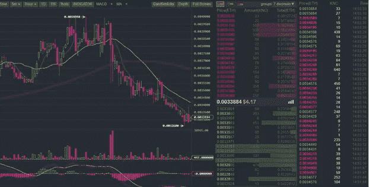
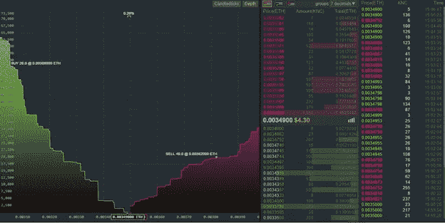

# 加密交易指南第 2 部分:日内交易——买入长城

> 原文：<https://medium.com/hackernoon/guide-to-crypto-trading-part-2-day-trading-the-great-buy-wall-523d7c4d31b>

如果你参与了股票、法定货币或加密货币的交易，那么你可能会遇到“买墙”或“卖墙”这个术语。在一个句子中抛出它当然有助于让你看起来聪明，但它实际上意味着什么呢？像你我这样的普通交易者如何利用这些知识呢？

为了回答这些问题，我们需要后退一步，先看看什么是买入/卖出订单。当你想购买一些硬币时，这并不像在交易所设立一个账户，然后从机构那里购买硬币那么简单。交易所只是两个用户见面交换资产的场所。你想用另一个有价值的硬币(通常是 ETH 或 BTC)购买他们的硬币，他们想卖掉他们的硬币，用 BTC 或 ETH 作为交换。当你同意一个价格时，交易就完成了，每个相关用户的钱包都会调整以反映交易的完成。这听起来非常复杂和乏味。如果你必须做所有的工作。但你没有。你所需要做的就是提出一个请求，选择硬币，每枚硬币的数量和价格。这被称为购买订单。对于那些想卖出的人来说，情况完全相同，但这被称为卖单。通常这些将被设置为列表，直到被取消，这意味着它将保持为一个未完成的订单，直到它被填充或您取消它。现在你可以想象，成千上万的人在交易所里下买卖订单，创造了无数的订单。然后，交换会自动匹配任何重叠部分。其余的公开上市，直到填补或取消。

*Figure 1\. On the inner right side there are unfilled sell orders (above — red) and buy orders (below — green) listed and the far right lists all the completed orders chronologically — newest first.*

由于所有重叠的订单都是自动完成的，所以很容易设置并忘记，直到您的订单被完成。有时，对于一个大的买入(或卖出)订单，可能需要多个较小的订单来完成，这可能意味着您会看到您的订单部分完成，然后再多一点，直到完全完成。从本质上来说，最高买入订单和最低卖出订单之间总会有差距。这种差距基本上是目前硬币价格的位置。通常这将是最后完成的订单价格。这就是市场推动硬币价格上涨或下跌的方式。

现在我们了解了买卖订单的工作原理，我们可以看看什么是买墙/卖墙。

*Figure 2\. On the right side you can see the combination of the buy orders in the green pile, compared to the sell orders in the red pile.*

图 2 显示了买入/卖出深度。这意味着与卖出指令相比，买入指令更多，因为绿色指令堆比红色指令堆大。当有一个大的购买订单，那么绿色桩将垂直增加，而不是小增量。它看起来像一个大台阶——或者…一堵墙！这意味着，如果在 0.003 ETH 有一个 10，000 个硬币的大规模买入订单，而大多数卖出订单只有 10 个或 100 个硬币，那么履行这个订单将非常困难。如果这个订单不能完成，那就意味着低于这个墙价的订单不会被完成，实质上阻止了价格跌破墙。当出现卖出墙时，同样的事情也会发生。

现在，当一堵买入墙建立起来时，每个订单低于这一价格的人都知道他们的订单不太可能被满足，任何希望快速买入的人也知道他们必须以高于该墙的价格下单，以确保订单首先被满足。这将推动价格上涨，因为由于环境需求，人们可以开始以更高的价格下单。卖出墙会产生相反的效果，降低价格。

这些墙上有一点背景。

其中一些墙是合法的，这只是意味着许多人或一个有很多钱的人认为在特定价格购买是正确的决定，但有时这些墙是操纵价格的企图。

在硬币市场占有很大份额的人被称为鲸鱼——他们是海里的大鱼，会引起轰动。因此，当一只巨鲸有足够的资金下一大笔买入订单时，它们就可以单枪匹马地创建一堵买入墙。他们这样做是为了试图操纵市场，制造虚假宣传。我说是假的，因为他们从来没有打算以这么高的价格买这么多硬币。但是他们可能已经拥有了一些早先以低价购买的硬币。因此，通过下这个“假”购买订单，他们希望推动价格上涨，然后允许他们出售目前拥有的硬币，以获得可观的利润。这一大堆硬币会让市场意识到虚假宣传，并使价格暴跌。这允许鲸鱼用他们刚刚赚到的利润购买更多的硬币。有时候事情并不总是按计划进行。如果买入墙没有操纵价格上涨，那么如果价格太低，鲸鱼将取消大规模订单，他们的订单可能会开始被满足。这可能会产生相反的影响，导致价格下跌，因为人们认为这个大订单已经完成，每个人都想在价格进一步下跌之前出售。这甚至可能是鲸鱼一直以来的计划，为了买一些便宜的硬币。

本质上，我想说的是，一个假的买入墙可能会出现，要么推高价格，要么拉低价格。这就是为什么你不能单独用它来指导你的交易选择。接受这个建议，有一件事要注意。如果你的订单低于买入订单或高于卖出订单，可能意味着你会错过一些利润。这样做的原因是，如果买入墙成功地将价格推高/保持稳定，那么您的订单将永远不会实现，因此您可以通过将您的买入订单价格仅推高几个点来参与，使其等于或略高于该墙。另一方面，如果买入墙被移除后成功地压低了价格，那么价格可能会下跌几个点。因此，您的订单将被执行，但如果您进一步降低购买订单的价格，它也会被执行。

这些墙可能看起来非常坚固和不可动摇，甚至有时是对抗的。但是如果你看到一个买入/卖出墙，一定要留意它，因为它们可以在几秒钟内被取消和重置。事实上，你会经常看到它们随着当前价格上下波动。例如，假设我想将价格从 1.00 美元推高到 1.20 美元，而不是保持稳定或下降。我将我的买入墙设置在 0.99 美元，这将迫使其他人在这个价格之上下单，比如从 1.00 美元到 1.05 美元。然后我把我的买入墙重新设置在 1.04 美元，再次迫使其他人在这个价格之上下单，从 1.05 美元到 1.10 美元不等。我再次继续，直到价格达到 1.20 美元，然后提出了一些中等卖单，以便不扰乱高价，但允许我出售我的硬币。然后下更大的卖单，当我准备好价格再次下跌时，完全取消我的买单。然后我可以重新开始这个过程。

即使你做的是基本的日内交易，而这些墙是你寻求帮助下单的少数几样东西之一，那么你会比忽视它们做得好得多。将这一点与其他一些基本交易原则相结合，你一定会开始获利，因为波动的硬币运动是交易者的天堂。

Joshua (Mappo)自 2013 年以来一直投资和交易法定货币。他最近进入了加密领域，将投资组合扩展到长期硬币投资、ico 和日内交易。