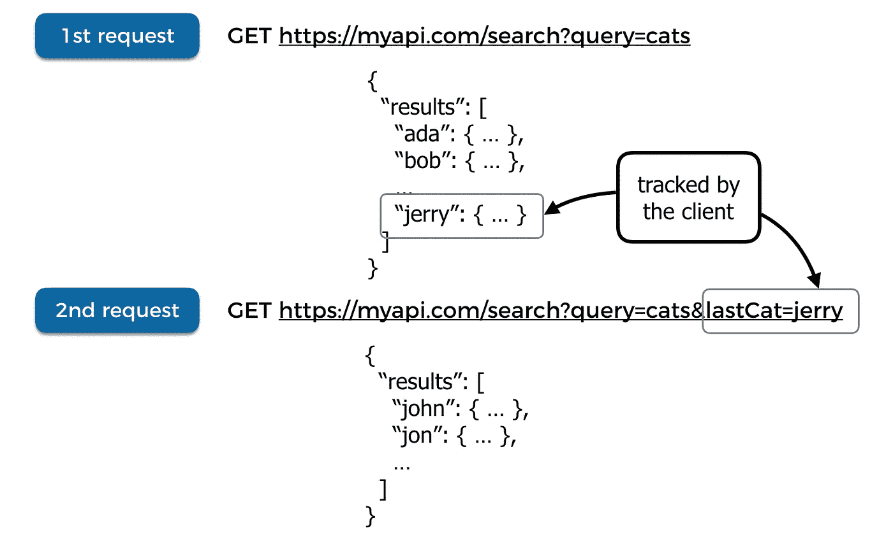
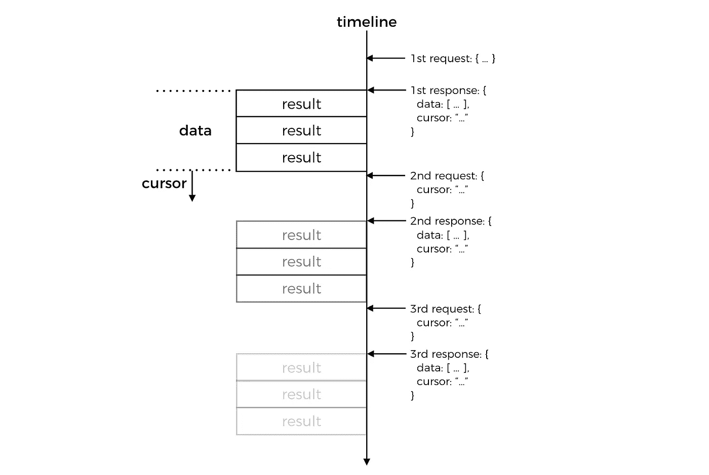
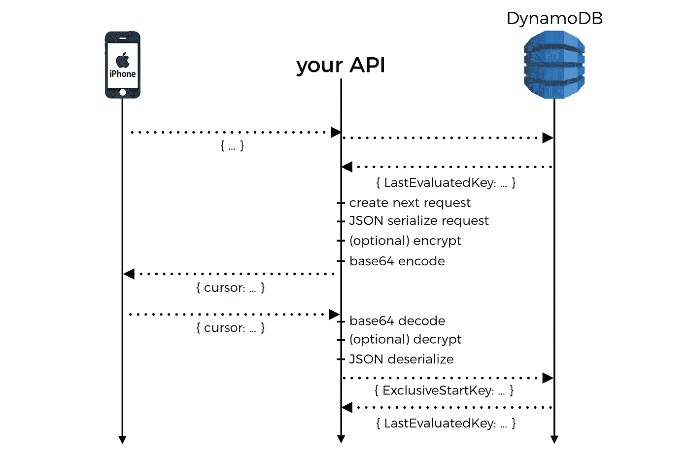
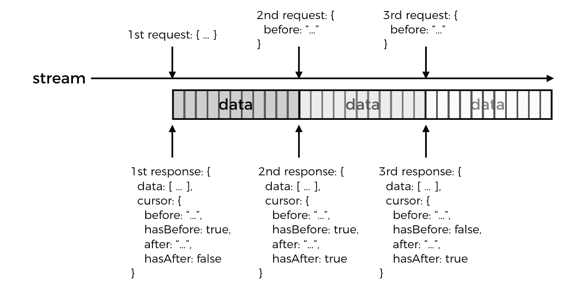
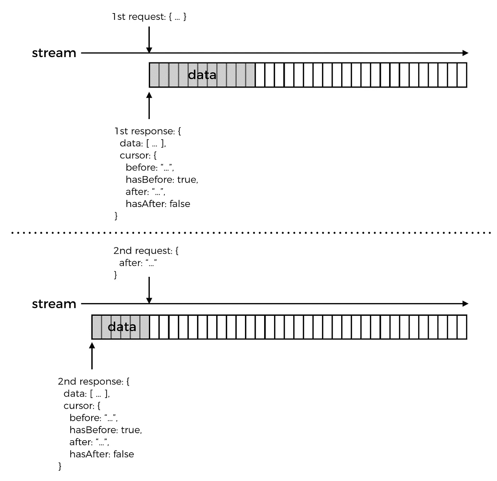
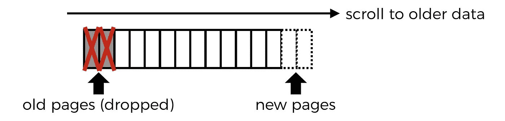
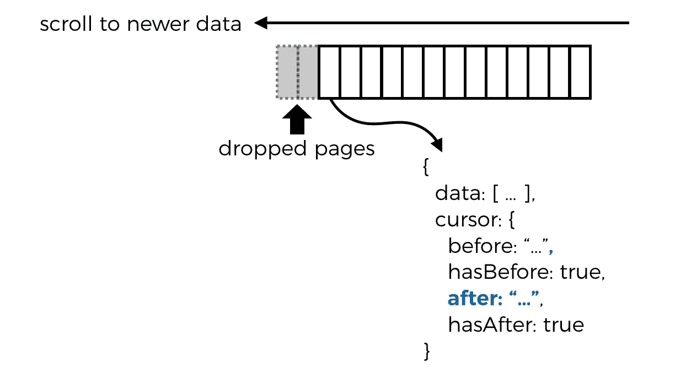
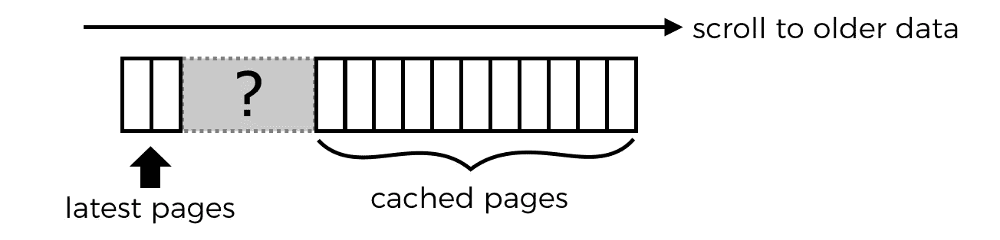

# “伙计们，我们的分页做错了…”

> 原文：<https://medium.com/hackernoon/guys-were-doing-pagination-wrong-f6c18a91b232>

在我的职业生涯中，由于对分页在几个项目中的实现方式不满，我不得不多次抱怨这些话。

尽管如此，当我偶尔不得不问*“为什么这个 API 没有分页?”时，这种不满与我的感受相比不算什么..?"*

因此，从我通常的无服务器漫谈中休息一下，让我们来谈谈分页:-)

## 单向和双向分页

一般来说，我看到两种常见的分页类型:

*   简单、单向地浏览静态结果集，这些结果太长或效率太低，无法一次返回，例如 twitter 关注者列表或 Google 搜索结果列表
*   通过某种提要或流进行双向分页，在收到第一页结果后可以添加新的结果，例如您的 twitter 时间表或通知

## 避免抽象泄漏

我看到的一个常见错误是，分页 API 要求调用者提供用来对结果进行排序的“键”,这就产生了一个泄漏的抽象。然后，调用者必须理解服务用来对其结果进行分页的底层机制——例如，通过时间戳或字母顺序。

DynamoDB 的[查询](https://docs.aws.amazon.com/amazondynamodb/latest/APIReference/API_Query.html) API 就是一个很好的例子。要浏览查询结果，调用者必须在后续请求中指定 [ExclusiveStartKey](https://docs.aws.amazon.com/amazondynamodb/latest/APIReference/API_Query.html#DDB-Query-request-ExclusiveStartKey) 。然而，服务也在响应中返回了 [LastEvaluatedKey](https://docs.aws.amazon.com/amazondynamodb/latest/APIReference/API_Query.html#DDB-Query-response-LastEvaluatedKey) 。

因此，在实践中，您几乎可以*将 *LastEvaluatedKey* 视为一个令牌或光标，您只需在下一个请求中传递它。除此之外，它不仅仅是一个标记，它还是 *DynamoDB* 表中一个实际的排序键，而且属性名已经给出了实现细节。*

就其本身而言，这不是什么大事。然而，不幸的是，它通常会产生连锁效应，鼓励应用程序开发人员在这个实现细节的基础上构建他们的应用程序级分页。除了这一次，他们没有在响应中返回 *LastEvaluatedKey* ，客户端现在负责跟踪这条信息。



恭喜您，您的数据库用来支持分页的底层机制现在已经泄露到您的前端了！

## 使分页意图明确且一致

我看到的另一个常见趋势是，您必须一遍又一遍地向分页 API 发送相同的请求参数，例如:

*   每页的最大结果数
*   分页的方向(如果是双向的)
*   原始查询(在 *DynamoDB* 的情况下，这包括多个属性，如 *FilterExpression* 、 *KeyConditionExpression* 、 *ProjectionExpression* 和 *IndexName*

我不认为这是一个错误，因为有时这是设计使然，但更多时候，我认为这是缺乏设计的结果。

在我遇到的所有分页 API 中，预期的行为总是为一个查询获取下一组结果，而不是中途开始一个不同的查询。这是没有意义的，你甚至不能称之为分页，更像是导航！我的意思是，*您上一次启动 DynamoDB 查询，然后不得不在结果分页的中途更改任何请求参数是什么时候？*

也就是说，从先前接收的页面改变分页的方向*是有正当理由的。当我们在本文后面讨论双向分页时会有更多的介绍。*

## 用光标进行单向分页

对于单向分页，我的首选方法是使用简单的游标。这里重要的细节是**让** `**cursor**` **变得毫无意义**。

就客户端而言，当有更多结果要获取时，它只是服务器在响应*中返回的一个 blob。客户端不应该能够从它那里得到任何实现细节，并且它唯一能够*让*对这个`cursor`做的事情就是在下一个请求中发送它。*



fig. 1 — flow of request & responses for a series of paginated requests

> 但是 API 如何知道从哪里开始获取下一个页面呢？

一个简单的方法是:

1.  创建一个 JSON 对象来捕获获取下一页所需的数据——例如，如果您使用 DynamoDB，那么这可以是下一页的请求对象(包括`ExclusiveStartKey`)
2.  base64 编码 JSON 字符串
3.  将 base64 blob 作为`cursor`返回

当我们接收到获取下一页的请求时，我们可以应用相反的过程来取回我们之前创建的请求对象。

> 这难道不会泄露更多的信息吗——例如，您正在使用 DynamoDB、表名、模式等。—如果有人对你的 blob 进行 64 位解码呢？

当然，这就是为什么你也可以选择先加密 JSON。您也不必使用 DynamoDB [查询](https://docs.aws.amazon.com/amazondynamodb/latest/APIReference/API_Query.html)请求作为基础。

注意在`fig. 1`和`fig. 2`中，客户端只在后续请求中发送`cursor`？

**这是设计好的**。

正如我前面提到的，客户端已经在第一个请求中告诉了我们查询，分页机制应该*只*提供获取结果的后续页面的方法。

对我来说，这意味着它不应该*为*提供任何其他行为(这个词又出现了，[在这里阅读](http://theburningmonk.com/2015/04/random-thoughts-on-api)以了解**启示**的思想如何应用于 API 设计)，因此不需要除了之前响应中的`cursor`之外的任何其他信息。

这反过来意味着我们需要在`cursor`中捕获原始查询或意图，这样我们就可以构造相应的 DynamoDB 请求。或者，我们可以在`cursor`中捕获实际的 DynamoDB 请求，这看起来是一个简单、实用的解决方案。



fig. 2 — interaction between client, API and DynamoDB

## 使用光标进行双向分页

使用双向分页，您需要能够及时向前翻页(当新的推文添加到您的时间线时)以及向后翻页(获取旧的推文)。所以一个简单的字符串`cursor`已经不够了，取而代之的是我们需要两个光标，每个方向一个，例如…

```
{
  "before": "ThlNjc5MjUwNDMzMA...",
  "after": "ADfaU5ODFmMWRiYQ..." 
}
```

此外，当向前翻页时，即使现在没有更多的结果，我们仍然必须返回一个游标，因为新的结果可以在以后添加到提要中。因此，我们还应该在响应中包含一对布尔标志。

```
{
  "before": "ThlNjc5MjUwNDMzMA...",
  "hasBefore": true,
  "after": "ADfaU5ODFmMWRiYQ...",
  "hasAfter": true
}
```

当客户端及时向前翻页并接收到作为`false`的`hasAfter`时，它知道现在没有更多可用的结果。因此，它可以主动停止*获取下一页结果，并且更加被动，仅周期性地轮询新结果。*

*让我们来看一个简单的例子，想象一下，如果你在你的时间线中获取推文，API 将首先返回最新的推文。*

**

*fig. 3 — paginate backward in time to fetch older data*

1.  *客户端发出第一个请求*
2.  *API 用一个`cursor`对象响应，`hasAfter`是`false`,因为 API 已经用最新的结果响应，但是`hasBefore`是`true`,因为有旧的结果可用*
3.  *客户端发出第二个请求，并在请求中只传递*和*光标`before`，使其意图清晰明确*
4.  *API 用另一个`cursor`对象来响应，这次`hasBefore`和`hasAfter`都是`true`，因为我们就在这个结果流的中间*
5.  *客户端发出第三个也是最后一个请求，再次只传递从上一个响应接收到的`before`光标*
6.  *API 用一个`cursor`对象响应，其中`hasBefore`是`false`，因为我们现在已经收到了最早的可用结果*

*好，现在让我们来看另一个例子，这次我们将向前翻页。*

**

*fig. 4 — paginate forward in time to fetch newer data*

1.  *客户端发出第一个请求*
2.  *API 用一个`cursor`对象响应，`hasAfter`是`false`，因为 API 已经用最新的结果响应，但是`hasBefore`是`true`，因为有旧的结果可用*
3.  *一段时间过去了，有了更多的结果*
4.  *客户端发出第二个请求，并在请求中只传递光标`after`，使其意图清晰明确*
5.  *API 仅用*响应*客户端尚未收到的较新的结果，并且`cursor.hasAfter`是`false`，因为这些是此时此刻可用的最新结果；如果客户机从这个响应向后翻页(在时间上),那么它将收到与来自 API 的第一个响应相同的结果*

*现在，让我们回到我前面提到的关于偶尔需要在分页中途改变方向的问题。*

*我们需要分页的原因是因为它通常不切实际，效率低下，并且在某些情况下不可能返回一个查询的所有可用结果——例如，在撰写本文时，Katy Perry 有 1.08 亿 Twitter 粉丝，试图在一个请求-响应周期中检索她的所有粉丝会使服务器和客户端应用程序崩溃。*

*除了限制在一个请求-响应周期中可以返回多少数据，我们还需要**为客户端应用程序缓存多少数据设置一个上限，以保护用户体验并防止客户端应用程序崩溃**。*

**

*这意味着，在某种程度上，当用户不断滚动旧的推文时，客户端需要开始丢弃已经获取的数据，否则就会面临内存不足的风险。这意味着，当用户向上滚动以查看最新的 tweets 时，客户端将需要重新获取已经被丢弃的页面，从而反转分页的原始方向。*

**

*幸运的是，上面概述的方案足够灵活，允许您这样做。结果的每一页都有一个相关联的`cursor`,允许您从任一方向获取下一页。因此，如果您需要重新获取被删除的页面，只需用您缓存的最新页面的`after`光标发出分页请求即可。*

**

## *处理“差距”*

*继续以 Twitter 为例。如果你在一段时间后打开 Twitter 移动应用程序，你会看到已经被缓存的推文，但应用程序也意识到已经过了很长时间，从缓存的数据一直分页到最新数据是不可行的。*

*相反，客户端将通过非分页请求获取最新的 tweets。当你向下滚动时，客户端*可以按照`fig. 3`自动获取旧页面，并逐渐填补空白，直到它与缓存的数据结合。**

**

*随着时间的推移，Twitter 移动应用的行为已经发生了变化，我看到的另一个策略是在时间轴中为丢失的推文放置一个可视(可点击)标记。这使得用户开始翻阅旧推文以填补空白成为一个明确的动作。*

*现在你有了它，一个简单有效的实现单向和双向分页 API 的方法，希望你觉得它有用！*

**

*嗨，我的名字是**崔琰**。我是一个 [**AWS 无服务器英雄**](https://aws.amazon.com/developer/community/heroes/yan-cui/) 和 [**量产无服务器**](https://bit.ly/production-ready-serverless) 的作者。我已经在 AWS 中运行了近 10 年的大规模生产工作负载，我是一名架构师或首席工程师，涉足从银行、电子商务、体育流媒体到移动游戏等多个行业。我目前是一名专注于 AWS 和无服务器的独立顾问。*

*你可以通过[邮箱](mailto:theburningmonk.com)、 [Twitter](https://twitter.com/theburningmonk) 和 [LinkedIn](https://www.linkedin.com/in/theburningmonk/) 联系我。*

*查看我的新课程，[**AWS 步骤功能完整指南**](https://theburningmonk.thinkific.com/courses/complete-guide-to-aws-step-functions) 。*

*在本课程中，我们将介绍有效使用 AWS Step Functions 服务所需了解的一切。包括基本概念、HTTP 和事件触发器、活动、设计模式和最佳实践。*

*点击获取您的副本[。](https://theburningmonk.thinkific.com/courses/complete-guide-to-aws-step-functions)*

**

*来了解 AWS Lambda: CI/CD 的操作性**最佳实践**，本地测试&调试功能、日志记录、监控、分布式跟踪、金丝雀部署、配置管理、认证&授权、VPC、安全性、错误处理等等。*

*代码 **ytcui** 还可以获得**票面价格 6 折**。*

*点击获取您的副本[。](https://bit.ly/production-ready-serverless)*