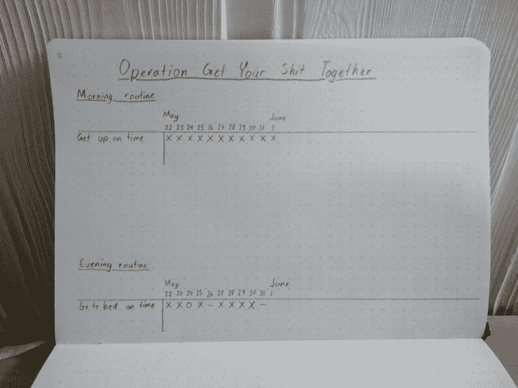

# 习惯惯例——自我提高的简单方法

> 原文：<https://medium.com/hackernoon/habit-routines-the-easier-way-to-self-improvement-6bd166f93b82>

为了变得有条理并保持高效，我们需要每天做一些我们不一定想做的事情。我们必须学会“需要做”先于“想做”。这很难。这就是为什么有大量的自助书籍和网站。[所以现在我要彻底解决全球所有人的这个问题](https://xkcd.com/927/)。

嗯，也许不是。但是它可能对除了我之外的*某人*有用，这就是为什么我发表这个。

# 忘记动机，培养良好的习惯

习惯是你没有真正思考就去做的事情。即使你没有动力去做，你也要去做，这是关键；不要依赖动机，因为动机本质上是不可靠的——你不会总是被激励去做你需要做的事情。所以忘记动机，养成好习惯。我会告诉你怎么做。

This is Doug. Doug says that motivation is bullshit. In this case Doug happens to be correct, but make no mistake — Doug is still a bastard.

# 我们的目标是什么

所有这些的目标是建立好习惯的**惯例**，我们在不同的时间点都要经历。举例来说，你可以有一个每天都要经历的**早上的例行程序**和**晚上的例行程序**。每个常规由一个或多个**习惯**组成，比如“闹钟响了马上起床”或者“牙线”。

此外，你可以在工作之余制定一个**例行程序**，在工作日执行，其中可能包括诸如“洗衣服”或“确保厨房台面没有脏盘子”之类的习惯。在周末，你可能会有一个更全面的周末日程安排，包括诸如“打扫房间”这样的习惯，或者更普通的习惯，比如“做任何需要做的家务”。关键是要养成习惯去做你应该做的事情，否则你就不会去做。这样，你就可以享受你的空闲时间，知道你已经做了你需要做的事情；现在你可以做你想让 T21 做的事情了。拖延症是向未来的自己借时间，你通过内疚来支付利息。未来--你不会比现在更想做这件事，所以就去做吧，把它做完。这个方法有助于解决这个问题。

# 从小处着手

如果你试图同时养成太多的习惯，你最终可能会感到不知所措，尤其是当新鲜感消失的时候。所以不要一开始就制定由十个习惯组成的庞大程序。从小事开始，你有信心能连续做 10 次(如果是日常工作，就是连续 10 天)而不会错过任何一件事——这意味着你应该从小事和容易的事情开始。我从以下两个套路开始:

## **早上的例行公事**

*   起床不要晚于 06:30

## **晚上的例行公事**

*   睡觉不要晚于 22:00(也就是熄灯，睡觉)

所以，两个简单的惯例，每个惯例包含一个习惯，我很确定我可以连续坚持 10 次而不会失败。如果你觉得 10 太低或太高，那就用你觉得合适的数字。但是如果你选择一个太低的数字，你就有试图在太短的时间内养成太多习惯的风险，所以你最终会不知所措。如果这个数字太高，在你的日常生活中增加新习惯会花费更多的时间。

# 用习惯跟踪器记录你的进步

拿一张纸(最好是正方形或点状的)，写下你的开始例程和他们的习惯。将日期列在它们的右边。确保你在每个常规下留有空间，这样你最终可以添加更多的习惯。这张纸现在是你的习惯跟踪器。

每成功完成一个习惯的一天，在习惯的那一行，日期的那一栏标上“X”。每次失败时，用“-”(破折号)标记。记住，当这种情况发生时，不要评价自己。它**偶尔会**发生，这是可以预料的。记下它，然后继续前进。

A paper habit routines tracker

每次例行公事后更新你的习惯跟踪器是非常重要的，因为它会让你更容易记住你为什么要做这件事，以及它的重要性。

# 那么什么时候可以添加更多的习惯呢？

当你连续 10 次成功完成例行程序中的所有习惯后(也就是说，当你连续 10 次在例行程序中没有任何破折号时)，你可以在例行程序中再添加一个习惯(T4)，因为这意味着你现在已经建立了这些习惯，你已经准备好扩展它们了。恭喜你，干得好！

# 如果我没有养成一个习惯，但这并不是我的错，该怎么办？

有时生活发生了变化，由于你无法控制的原因，你当天无法完成一个习惯。也许你被邀请去参加一个聚会，那天你没有时间打扫房间。那绝对没问题。当这种情况发生时，就在这一天打个零分，不要认为这是一个完成，但也不要认为这打破了你的记录。所以，如果你有“X X 0 X”，这仍然意味着你有四个 X 在一排。尽你所能防止这种事情经常发生。

# 想有每天不经历的套路怎么办？

没问题。对我来说，我一周有两个工作日要参加 Shorinji Kempo 练习，这意味着我在那几天没有时间做我的下班后的例行工作。在这样的日子里，我只是在你的习惯跟踪器上给这样的习惯打个“0”，就好像你因为一些你无法控制的事情而错过了一个习惯一样。

# 我如何避免忘记完成我的日常工作？

这是一个非常现实的问题。即使有最好的意图和坚持到底的意志力，你仍然可以忘记例行公事。这就是[习惯触发](https://jamesclear.com/habit-triggers)的地方。这个概念背后的想法是，为了不忘记做一些你想变成习惯的事情，你应该有一个“触发器”。触发点可能是你经常做并且不会忘记的事情，或者是自动发生的事情。

比如，大多数人每天晚上都不会忘记刷牙。但是我们大多数人都忘了用牙线洁牙。因此，如果我们试图每天晚上都在刷牙后直接使用牙线，那么刷牙的行为就会成为使用牙线的习惯触发器。一个你可以用来触发习惯的“自动”的例子是你设置在每天特定时间响起的电话闹钟，或者使用“下班回家”作为习惯触发器来记住开始你下班后的例行工作。

# 可以建议一些有用的习惯套路吗？

当然可以！对于工作日，我建议这样:

## **早晨的例行公事**

*   习惯触发器:你的起床闹钟
*   准时起床
*   力量练习 10 分钟
*   5 分钟拉伸/柔韧性练习
*   淋浴
*   早餐时读一些有价值的东西

## **下班后的例行公事**

*   *习惯触发器:下班回家*
*   做和/或吃晚餐
*   照看好柜台上的任何盘子
*   检查一下是否有衣服要洗
*   花一个小时做你的待办事项
*   *一旦你完成了这个程序，你就有希望自由地享受剩下的夜晚，直到你晚上的程序开始*

## **晚间常规**

*   *习惯触发:21:00 的电话闹铃*
*   写/更新明天的待办事项
*   冥想 10 分钟
*   刷牙并用牙线清洁
*   读一些有价值的东西，直到睡觉的时候
*   按时上床睡觉

那是工作日的事。我还建议制定一个周末计划，你可以在周六或周日进行，无论哪一天在这一周最合适。

## **周末惯例**

*   习惯触发器:早上醒来
*   吃早餐
*   打扫你的家
*   做任何需要洗的衣服
*   花两个小时做你的待办事项
*   为你的家做一个半永久性的改善，比如放一个需要放的架子，或者修理一些坏掉的东西
*   当你完成后，享受一天剩下的时光

Doug thinks that productivity is for losers, and that you’re all a bunch of pansies. Yeah. I told you he’s a bastard.

*这个故事最初是由同一作者在 www.operationgyst.com***发布的，作为“让你的屎在一起”行动项目的一部分。**