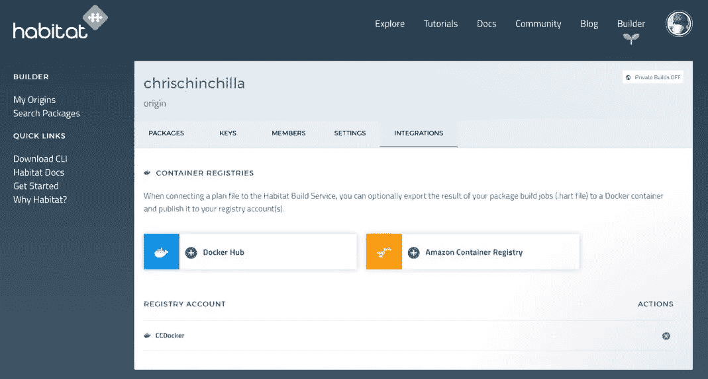
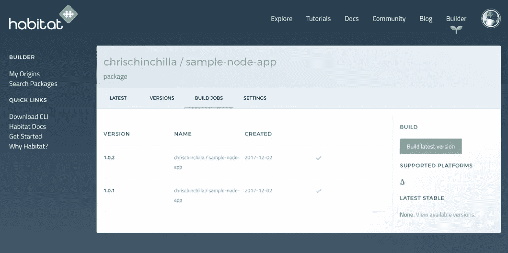
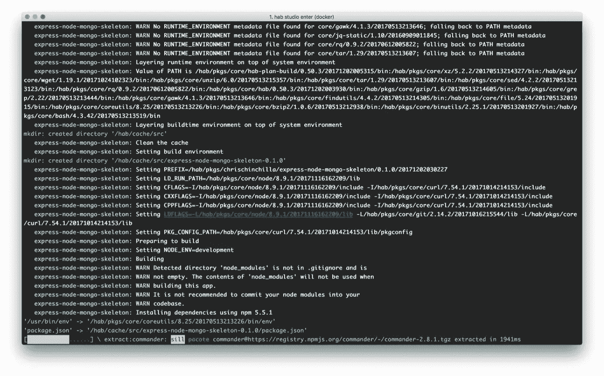

# Chef 的栖息地:构建、部署和管理您的云服务

> 原文：<https://medium.com/hackernoon/habitat-from-chef-build-deploy-and-manage-your-cloud-services-f35ecf60e25a>

Habitat 允许您构建自己的包，[但也提供了数千个自己的包，](https://bldr.habitat.sh/#/explore)，提供了一种独立的包存储库形式，您可以将其部署到任何生产环境中。Habitat 的核心概念是一个 [*plan.sh*](http://plan.sh/) 文件，其中包含了 Habitat 构建一个包所需的细节，还有[大量的变量](https://www.habitat.sh/docs/reference)你可以添加到一个。幸运的是，有一套工具可以帮助你摆脱定义计划文件的苦差事，包括用于 Linux、macOS 和 Windows 的 CLI 工具。

# 创建一个计划

在一个项目的目录中，您想要启用 Habitat，发出以下命令，Habitat 将尝试为您建立一个计划:

```
hab plan init
```

我尝试在现有节点中运行这个命令。JS 项目和 Habitat 生成了以下计划文件:

```
pkg_name=express-node-mongo-skeleton 
pkg_origin=chrischinchilla 
pkg_version="0.1.0" 
pkg_scaffolding="core/scaffolding-node"
```

以上是一个简单的计划文件，而 Habitat 允许你设置复杂的变量并使用逻辑和迭代，在[关于计划](https://www.habitat.sh/docs/developing-packages/#write-plans)的 Habitat 文档中找到更多细节。

# 构建包

有几种不同的方法来构建您的包，使用基于 GUI 的构建器服务，或者手动使用 Habitat studio。

要使用构建器构建一个包，[登录到服务](https://bldr.habitat.sh/#/origins)，创建一个“origin”并向其添加集成点，这些集成点目前是 Docker Hub (DH)或 Amazon Container Registry (ACR)。您的包的来源只能是 GitHub 存储库，因为 Habitat 利用一个小应用程序来监视您指定的存储库中的变化。也许将来你的包裹会有其他来源。



点击 *Build Jobs* 选项卡下的 *Build latest version* 按钮构建您的包，或者每当您将更改推送到主分支时。如果您配置了到 DH 或 ACR 的集成，那么您总是可以在那里找到您的软件包的最新版本，或者您可以使用以下命令在任何安装了 habitat 的平台上手动安装一个:

```
hab install chrischinchilla/express-node-mongo-skeleton
```

默认情况下，您创建的任何包对任何其他 habitat 用户都是公开可用的。



studio 是一个运行在 Docker 容器中的虚拟环境，在这里您可以迭代地构建、测试和运行包，并将它们导出到容器注册表中。在您的源文件夹中，启动 Habitat Studio，这是一个自包含的最小 shell 环境，您可以在其中开发、构建和打包软件，而不受应用程序计划中未指定的任何依赖项的影响。

```
hab studio enter
```

在 studio 中，运行:

```
build
```

studio 将开始为您下载依赖项来测试您的应用程序。当您准备好发布时，导出包:

```
hab pkg export chrischinchilla/express-node-mongo-skeleton
```



# 连接包

当然，现代应用程序很少孤立运行，为了允许 habitat 包彼此共享资源，您在 [*plan.sh*](http://plan.sh/) 文件中定义了什么是可共享的。

您定义一个包可以与`pkg_exports`共享什么，例如，端口:

```
pkg_exports=( 
  [port]=app.port 
)
```

以及一个套餐可以从其他带`pkg_binds`或者`pkg_binds_optional`的套餐里消费什么:

```
pkg_binds=( 
  [port]=app.port 
)
```

您甚至可以在代码中使用环境变量和包来访问这些绑定，例如 JavaScript 中的 [dotenv](https://www.npmjs.com/package/dotenv) 。

```
var port =process.env.PORT
```

# 运行包

您可以用无数种可能的方式将您的包作为 Docker 容器运行，包括 Docker Compose，以及在它们之间共享绑定变量。这同样适用于在 ACR 上运行 habitat-powered 容器；您可以将创建的任何包作为容器运行，并通过使用环境变量在它们之间共享详细信息。

# 进一步探索

我在 Habitat 遇到的最大问题之一是理解它的能力。它的特性集如此丰富，探索完全可能的东西是很困难的。我联系了社区，询问他们设计 Habitat 的目的，得到了类似的回答。

Habitat 融合了构建系统、CI 工具、服务发现等功能。该项目还处于早期阶段，所以我建议您在转移所有工具之前运行测试项目，但是我很想听听您对该工具的想法以及它将如何帮助您。

*最初发表于*[*dzone.com*](https://dzone.com/articles/habitat-from-chef-build-deploy-and-manage-your-clo)*。*