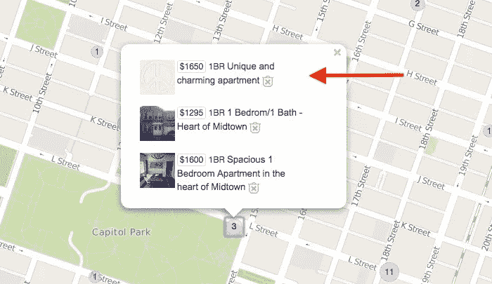
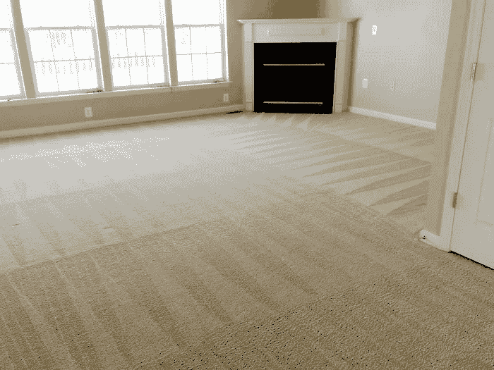

# 黑掉你的竞争对手:Craigslist 公寓出租

> 原文：<https://medium.com/hackernoon/hack-your-competition-craigslist-apartment-rentals-992b8c793596>

在任何一个城市找到一套出租公寓都是一件痛苦的事情。走进一个大城市，你的问题会变得异常困难。如果你有后者的经验，很有可能你去了一个开放日，却发现 15 个技术人员都在争着达成交易。他们一个月赚的钱比你一年赚的还多。他们的信用评分让你看起来像一个吸毒成瘾的老流浪汉。

你需要以一种别人不喜欢的方式接近寻找公寓出租的[。你需要有创造力，而且毫不夸张地说，**要像打猎一样对待它。你的关注点不能是镇上最理想的地方，最便宜的租金，或者最漂亮的建筑。你的焦点——你的猎物**——是租公寓的人。当你利用后者时，前者很快就符合了。](https://hackernoon.com/tagged/hunting)

以下 3 个公寓租赁技巧帮助我在旧金山(下海特，2013 年)和萨克拉门托(中城，2015 年)找到了令人惊叹的公寓。当时，这两个市场竞争非常激烈，我每小时分别赚 13 美元和 20 美元。(逻辑上)没有人应该租给我，但我最终找到了很好的住处和令人印象深刻的价值。

# 没有照片的租赁

> 这似乎是一个疯狂的建议，但是花点时间想想你是如何寻找公寓的。在数字时代，我们已经习惯于期待一切都有照片。你想先看看你未来的住所，然后再投入工作去得到它。我不怪你——每个人都想那样。

当你在 Craigslist 上找到一个没有照片的公寓出租时，你会遇到:

*   较少竞争
*   议价能力(观看的人越少，你达成交易的几率就越大)
*   更快的决策

在我的案例中，两个房东年纪都比较大，根本不知道如何把照片从手机上传到电脑。此外，我在第一次拜访时就被提供了两套公寓(当然是在信用调查期间)。不是因为我是唯一申请的人，而是因为我扮演了这个角色。

# 扮演角色

> 大约需要 1/10 秒的时间，有人会看着你并做出判断。更糟糕的是，可信度位居糟糕判断之首。你必须反驳这个事实。

当你出现在你的公寓租赁预约时，你应该:

*   穿着职业
*   覆盖纹身
*   愚蠢的面部穿孔移除
*   修剪得很好，而且不是一个穿着漂亮衣服的瘾君子(即使那正是你)

我的第一堂也是最有价值的商业课来自于我在海湾地区一家漂亮酒店做地毯清洁工的时候。一开始，我花了很长时间来整理房间，因为我希望它们干净，就好像我必须睡在里面一样。直到我的老板给我上了一课——感知决定一切。

当你清洁地毯时，你会在地毯上留下美丽的 V 形图案。毫无疑问，地毯可能很脏(在合理的范围内),当酒店经理看到这种图案时，他们非常满意。他们看到了这种模式，并且**察觉到了**的洁癖。不用说，我打扫房间的速度更快了。

# 有备而来

> 记住，这是一个公寓**亨特**。你唯一的任务就是利用人性和不可避免的感知。这并不意味着不道德或卑鄙。简单来说就是**虚张声势一点点**没关系。

在寻找公寓时，每次约会都带上这些东西:

*   **信用报告** —你有权每 12 个月从三家全国性的信用报告公司获得一份免费的信用报告。这不会让你免于向房东支付 35 美元进行信用检查。同样，如果你有不良信用，你只能靠自己。
*   **预填申请**——老实说，如果你面对的是不能上传照片的人，这种情况就不太常见了。提前打电话，要求通过电子邮件发送一份电子版。
*   **支票簿** —如果你喜欢租赁，在参观结束时拿出支票簿和一支笔。看着房东的眼睛，问押金和第一个月的租金是多少。你得到的反应是滑稽的，但却是无关紧要的。这种虚张声势仅仅是一种兽性的虚张声势展示，它将表明你的优势、意图和可信度。虽然你应该做好开支票的充分准备，但没有哪个理智的房东会在没有经过适当审查的情况下把房子租给别人。但你已经知道了，野兽。

# **结论**

Craigslist 公寓出租狩猎是残酷的。你正与一群狼争夺马斯洛需求层次的第一位:庇护所。在每一步，你都必须**确定你的竞争对手缺少什么，并抓住它**。你必须了解人类是如何思考的，并让这些认知对他们不利。

我也写类似这样的东西@ [书呆子会议记录](https://www.nerdyminutes.com)。