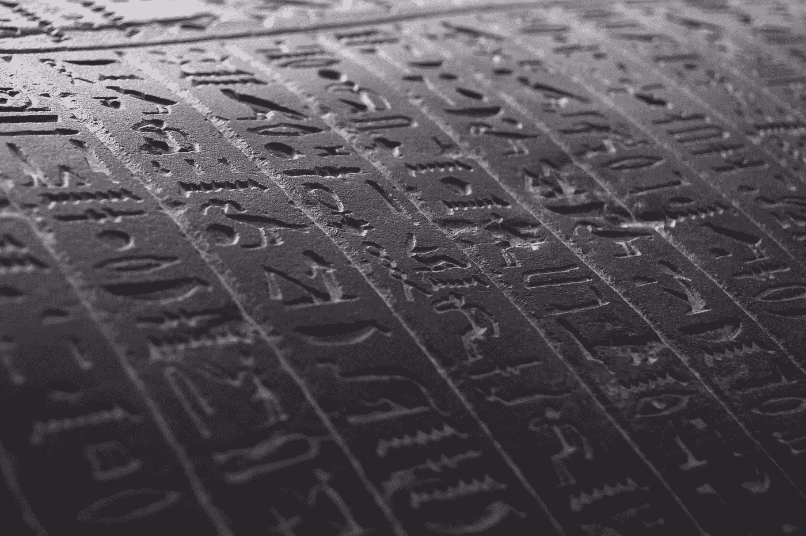

# 在我睡觉时被黑了

> 原文：<https://medium.com/hackernoon/hacked-in-my-sleep-c9f954dfb194>

我低头看了看手表，突然意识到如果我不快点，我就要错过航班了。喝下我的咖啡，我迅速从我独自坐的咖啡店的桌子上收拾我的东西。就在我这么做的时候，一个路过的陌生人停下来，掏出手机，热情地叫道:“嘿，我的手机和你的有一样的外壳。你介意我看看你的吗？”

没等我回答，那人拿起我的手机，开始翻来覆去地仔细检查。我吃了一惊，但这个人的热情似乎是真诚的，这是可以理解的，因为我的手机壳是一个经典，它使我的手机免于多次摔落。于是我收拾完东西，拎起包，从陌生人手里接过手机，匆匆离开。当我冲出咖啡店时，我看到我的老板坐在另一张桌子旁。他指着我说，“你怎么能把你的手机给一个陌生人？”

我向他挥手，但没有停下来，因为我已经晚了我的航班。然而，我跑的时候低头看了一眼手机屏幕。令我惊恐的是，所有的图标都不见了。我所能看到的只是几行细小的象形文字在白色屏幕上慢慢滚动。

如果我连给银行打电话都办不到，我怎么能让我的信用卡失效呢？我的意思是，我怎么能用一部像砖头一样好的手机做任何事情。

我的心脏开始怦怦直跳，我坐起来，意识到我在床上。这只是一场梦，虽然看起来如此真实。电话窃听一直让我担心。甚至该男子声称拥有相同的手机壳也是消除我怀疑的正确方式，因为我通常会向我遇到的任何 iPhone 6S+用户强烈推荐这种情况。

尽管如此，我童年噩梦中的无脸怪物被无脸黑客取代还是很奇怪。

当我辗转反侧试图入睡时，我回想起曾读到过梦见“迟到”象征着对生活改变的渴望。我哥哥刚刚告诉我他已经升级到了 XS，而我已经决定在原则和价格上坚持使用 6S+。

我的梦想的意义是想换个手机吗？

忘记潜意识广告，这是一个全新的水平。苹果黑了我的梦想！

救命啊！