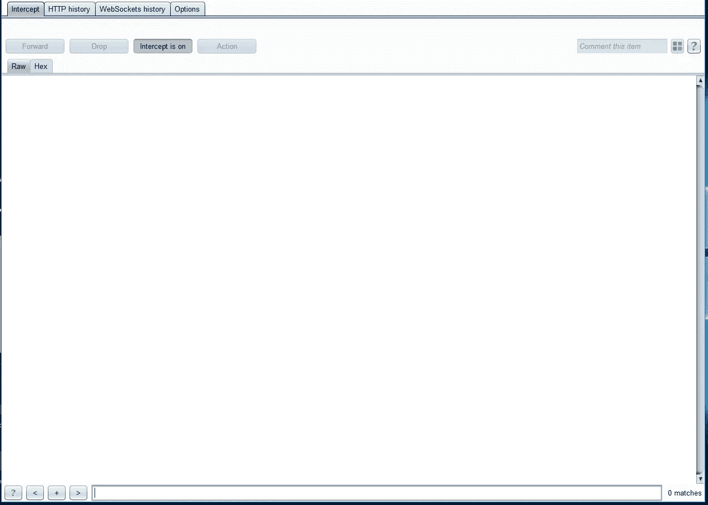
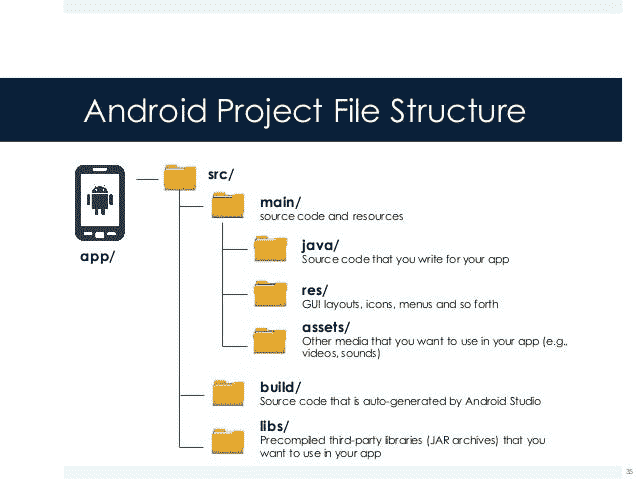
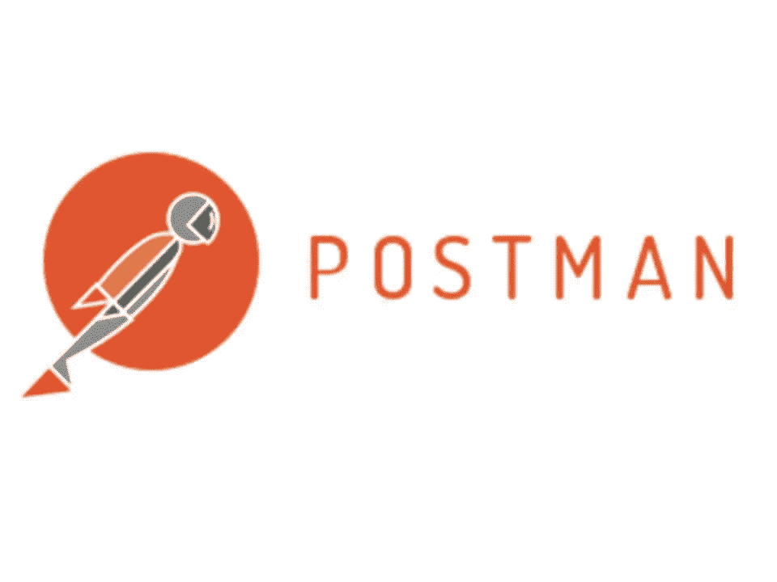
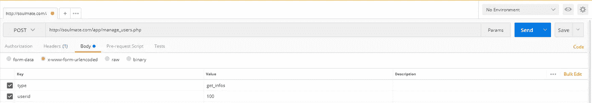

# 黑客之爱，或者我如何接管了一个约会应用程序，并可能与任何人匹配

> 原文：<https://medium.com/hackernoon/hacked-love-or-how-ive-taken-over-a-dating-app-and-could-possibly-match-with-anybody-6f8c0acc3f47>

> 我不被允许透露任何关于我刚刚入侵的公司的信息。我已经告诉他们所有导致我被利用的漏洞，他们仍在努力修复。

故事开始于一周前，看了另一个 Youtube 视频。

烦人的广告开始了，还剩 5 秒钟，我会旁若无人地拖延。

等等，我看到了什么？一家公司刚刚开始在我的国家为其新的[约会](https://hackernoon.com/tagged/dating)应用做广告！

我将最终浏览整个广告，而不会跳过它，它并不太坏。所以我决定继续下去，装在手机上。再一次，这个应用很酷，没有花哨的东西，但是还可以。

我忍不住想“嗯，这有用吗？”第一场比赛没有出现。

Oh boy, don’t you know my hacking skills

我最近在电视上听说**爱情**可能发生在工作、健身房、活动等场合。

**利用弱点来寻找我的灵魂伴侣怎么样？**

# 整个过程

然而，另一个无偿赏金和打嗝套件社区版推出。

我把我的 Android 手机配置成使用 Burp Proxy，并启动了我们称之为 **SoulMate 的约会应用。**

根本没有拦截任何请求。

我花了几分钟时间试图找出为什么应用程序完美运行时请求没有被拦截。

懒得去问 StackOverflow，我决定走另一条路来提高侦查阶段的效率。

> Jadx，你在这里

Abstract taken from [http://www.javadecompilers.com/apk](http://www.javadecompilers.com/apk)

当你使用 Jadx 时会发生这样的事情:

Actually this happens perfectly only if there’s no hard security strategy at APK level (uglifying, minimizing, refactoring processes = lot of stuff to make code neither readable nor understandable)

现在使用这个反编译器，我开始深入代码行。一个文件接一个文件，从资源到实际的 Java 逻辑。

由于我的工作一直在处理 [Android](https://hackernoon.com/tagged/android) 移动应用，所以我熟悉文件结构和常用库。

我很幸运地得到了几乎所有可读和可理解的东西。

Credits to ma-polimi : [https://www.slideshare.net/ma-polimi/how-to-create-an-application-in](https://www.slideshare.net/ma-polimi/how-to-create-an-application-in)

太令人兴奋了！我的侦察阶段终于步入正轨。

在收集 Java 源代码时，我偶然发现:

进一步看，这是我的发现:

That’s my boy !!!

# 邮差推出

如果您对这个工具不熟悉，我会把它描述为创建 HTTP 请求和分析响应的最好的 GUI。它有很多特性，我花了 99%的时间在上面测试我的 REST APIs。

我等不及了，所以我在《邮差》上做了一个无声的复制请求，就在这里:

你猜怎么着？？？

That’s my boy !!!!

到目前为止，我对我的发现感到非常高兴。我可以用 Python 脚本遍历所有的 userid (1 到 5000 ),并获得所有的数据(我没有这样做)。

# 一切都可能就此停止

我决定更进一步，在我看来密码似乎是 MD5 散列，所以我继续[**MD5 解密**](http://md5decrypt.net/en/) **。**

万岁！！！密码在哈希数据库中。

我现在可以登录这个应用程序的几乎所有账户。

这意味着我实际上可以:

*   发送和阅读信息
*   就像我自己的个人资料在几秒钟内被匹配
*   删除或修改帐户
*   盗用电子身份

# 我可以就此打住吗？

这个问题现在很严重。

来吧，我的第一个目标是找到我的灵魂伴侣，那些家伙只是给了我一张免费票，让我可以无限制地与我国最美丽的女孩比赛。

我想知道:“老兄，(实际上是在自言自语)你认为这些用户在这个应用程序和他们的邮件帐户上都有相同的密码吗？”

How kind of you ❤️

一切都变得真实了。

老实说:毕竟，这只是我日常黑客习惯的一个日常挑战。然而，出于好奇，我尝试并成功登录了 45 个测试邮件账户中的 30 个。

结果是可怕的。

如果一顶黑帽子偶然发现了这样一个弱点，对于那些只想寻找爱情的受害者来说，这可能是一场巨大的灾难。

# 临终遗言

我就这个问题联系了公司，得到的回复是“我们会解决的，非常感谢”。

该公司没有运行一个 bug 赏金项目，但我仍然梦想着未来几周能有这样的事情发生:

“Close-up of a man's hands holding a bundle of dollar bills and a cigarette” by [Jeremy Paige](https://unsplash.com/@eatenbyflowers?utm_source=medium&utm_medium=referral) on [Unsplash](https://unsplash.com?utm_source=medium&utm_medium=referral)

我不会讨论保护机制，因为对我来说，在这种情况下唯一要做的事情就是用任何东西(JWT、http 头、GET 参数中的访问密钥、**任何东西**)实现认证过程，或者对数据传输进行加密。

关于 Android 应用程序，proguard 子句中的一行可能会让我迷惑:`minifyEnabled: true`

保管好你的个人信息。

不要在任何地方使用相同的密码。

请停止使用“azerty”和“12345678”。(《阿泽 12》也是如此)

# 感谢阅读

这是我第一次写这类文章，我当然希望你会喜欢。

欢迎致电**David . mell ul @ outlook . fr**

“Cappuccino in a white mug with white foam art on a wooden table” by [wu yi](https://unsplash.com/@takeshi2?utm_source=medium&utm_medium=referral) on [Unsplash](https://unsplash.com?utm_source=medium&utm_medium=referral)