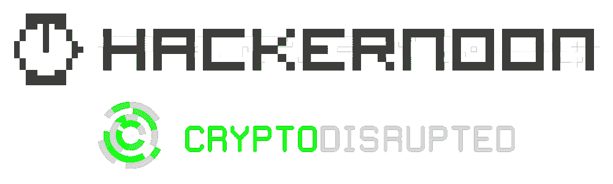

# 黑客正午收购加密中断，由特伦特拉平斯基播客

> 原文：<https://medium.com/hackernoon/hacker-noon-acquires-crypto-disrupted-the-podcast-by-trent-lapinski-7374b9bd69d1>

## *加密货币播客将加入黑客正午制作一个更主流的科技播客——****黑客正午播客！***

**

*特伦特·拉平斯基将接任即将到来的每周黑客午间播客的主持人。第一集将于 9 月下旬上映。你可以通过访问 https://Podcast.HackerNoon.com 来订阅。*

*在过去的一年里(8 月 17 日至 8 月 18 日)，黑客正午的故事已经产生了 95，000，000+的浏览量。迄今为止，这一直是文本故事，但在最近的黑客正午调查中，71%的读者说他们想听黑客正午播客。我们还将在音乐家德里克·伯纳德的帮助下提升播客的制作价值。*

## *新的黑客正午播客的早期嘉宾承诺包括:*

*   *项目 Include 和 Arena Summit(前身为 Pinterest、USDS 和 Quora)的创始顾问 Tracy Chou*
*   *[John Cutler，](https://hackernoon.com/@johnpcutler)Amplitude 的产品布道者*
*   *[Suhail Doshi](https://twitter.com/Suhail?ref_src=twsrc%5Egoogle%7Ctwcamp%5Eserp%7Ctwgr%5Eauthor) ，Mixpanel 创始人&投资人*
*   *SVB 金融公司早期实践副总裁娜塔莉·弗拉托*
*   *约瑟夫·弗莱厄蒂，内容社区&的创始人集体董事(前《连线》杂志作家)*
*   *丹尼尔·杰弗里斯，作家、未来学家和思想家。*
*   *[布雷特·吉布森](https://www.linkedin.com/in/brettdgibson/)，初始资本合伙人*
*   *托尼·莱恩(Toni Lane)是“文化”——一项旨在创造更加自由的人类的全球运动的创始人。*
*   *Greg Osuri ，超频实验室的首席执行官，Akash 网络的创建者*
*   *[泰勒·皮尔森](https://hackernoon.com/@ctaylormpearson)，作者*
*   *首席执行官 IwriteICOWhitePapers.com*
*   *[希滕·沙阿](https://twitter.com/hnshah)，投资人&企业家*
*   *[陈嘉上](https://twitter.com/garrytan)，初始化资本合伙人*
*   *[亨特·沃克](https://twitter.com/hunterwalk)，家酿风投的合伙人(前 YouTube、谷歌和第二人生产品负责人)*
*   *蒂尔堡大学商业和金融教授埃里克·维穆伦*
*   *梅尔罗斯公关公司首席执行官凯利·韦弗*
*   *Twitch 的高级产品经理 Peter Yang*

*Trent Lapinski 第一次对硅谷产生影响是在他十几岁的时候，他报道了史蒂夫·乔布斯的主题演讲，后来在他二十多岁的时候，他创办了科技创业公司。现在 30 出头的特伦特是一名关注未来的技术专家、记者、黑客和前创业公司创始人，并成功退出。*

*[黑客正午播客](https://Podcast.HackerNoon.com)将探索新的媒介来传递科技行业实际运作的真相。阅读新闻:科技创业，商业报道*

## *如果你想赞助这个播客，请发电子邮件给[Partners@HackerNoon.com。](mailto:Partners@HackerNoon.com.)*