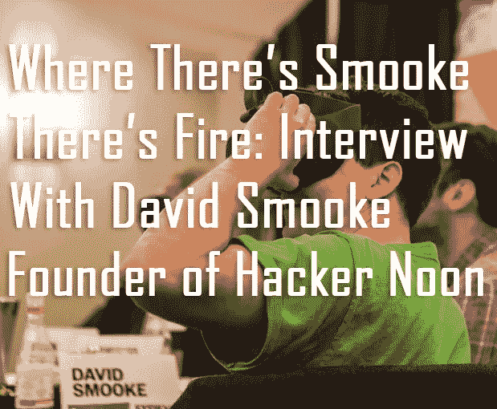

# 黑客正午创始人访谈&本周更多顶级科技故事

> 原文：<https://medium.com/hackernoon/hacker-noon-founder-interview-more-top-tech-stories-this-week-df7c036b116c>

[Image Credit, CoinStrategy.io](https://www.coinstrategy.io/single-post/2018/07/19/Where-Theres-Smooke-Theres-Fire-Interview-With-David-Smooke-Founder-of-Hacker-Noon)

[***pub nub***](http://bit.ly/2NdvdN2)*，我们的每周赞助商，让您构建身临其境的互动应用。聊天、地图、仪表盘、智能设备控制—由 API 提供支持，通过全球基础设施交付。* [***了解更多。***](http://bit.ly/2NdvdN2)

## Heyo 读者，想了解更多关于黑客正午是如何运行的？我和 [Pirate Beachbum](https://hackernoon.com/@piratebeachbum) 做了一个 [5k+单词的采访(24 分钟阅读)](https://bit.ly/2O3spng)，在那里我谈论了 Hacker Noon 的未来，启动我的业务，成长，灵感，一点点篮球，以及科技的下一步:[哪里有 Smooke 哪里就有火:采访 Hacker Noon 的创始人 David Smooke](https://bit.ly/2O3spng)。

# 本周 33 大科技新闻:

[**区块链 101:Ledger to HyperLedger**](https://hackernoon.com/blockchain-101-ledger-to-hyperledger-36836c4db1c1)**by[Aayush Joglekar](https://medium.com/u/ab06b4cb99fe?source=post_page-----df7c036b116c--------------------------------)【11 分钟阅读】**

**[**做出正确的事情——一个 5 步计划到坚如磐石的产品路线图**](https://hackernoon.com/build-the-right-things-a-5-step-plan-to-a-rock-solid-product-roadmap-23a7c3fbd8d7) 作者[埃里克·韦斯](https://medium.com/u/2f7a1d96516c?source=post_page-----df7c036b116c--------------------------------)【10 分钟阅读】**

**[**用 AWS Lambda 和 AWS SES**](https://hackernoon.com/building-a-serverless-contact-form-with-aws-lambda-and-aws-ses-fbf01d523678) 构建无服务器联系表单作者[Adnan rahi](https://medium.com/u/d1aeac7eadae?source=post_page-----df7c036b116c--------------------------------)【7 分钟阅读】**

**[**ContractPedia:40 个智能合约平台的百科全书**](https://hackernoon.com/contractpedia-an-encyclopedia-of-40-smart-contract-platforms-4867f66da1e5)**by[vasa](https://medium.com/u/2bfdd6540157?source=post_page-----df7c036b116c--------------------------------)【53 分钟阅读】****

****[**加密网络效果**](https://hackernoon.com/crypto-network-effects-37962671998a) 作者[托拜厄斯 a .胡伯](https://medium.com/u/89324ad3e8a6?source=post_page-----df7c036b116c--------------------------------)【5 分钟阅读】****

********作者[杰克·瑞恩](https://medium.com/u/426293777e64?source=post_page-----df7c036b116c--------------------------------)【10 分钟阅读】********

******[**弹力栈——简介**](https://hackernoon.com/elastic-stack-a-brief-introduction-794bc7ff7d4f) 作者[乌尔菲娜·埃拉希](https://medium.com/u/69964ffd3f9d?source=post_page-----df7c036b116c--------------------------------)【6 分钟阅读】******

****[**分布式账本技术如何颠覆世界货币体系**](https://hackernoon.com/how-distributed-ledger-technologies-are-set-to-disrupt-the-worlds-monetary-system-3078ce96ef94) 亚历山大·容克[托马斯·布克](https://medium.com/u/73355f23196b?source=post_page-----df7c036b116c--------------------------------)【31 分钟阅读】****

****[**区块链技术是如何工作的？**](https://hackernoon.com/how-does-blockchain-technology-work-ceeeee47eaba) 作者[泰勒·皮尔森](https://medium.com/u/b6343375a907?source=post_page-----df7c036b116c--------------------------------)【29 分钟阅读】****

****[**我是如何添加令人敬畏的多线程特性来表达 JS**](https://hackernoon.com/how-i-added-awesome-multi-threaded-features-to-express-js-753452a1c10e) 作者[Steve Konves](https://medium.com/u/c694eb00b4a0?source=post_page-----df7c036b116c--------------------------------)【6 分钟阅读】****

****[**我如何建立一家估值 1.3 亿美元的公司**](https://hackernoon.com/how-i-built-a-company-with-a-130m-valuation-b112b166bb49) 作者[霍华德·马克斯](https://medium.com/u/612939bd0962?source=post_page-----df7c036b116c--------------------------------)【12 分钟阅读】****

****[**我是如何被谷歌聘用的，为什么离开，为什么选择加入 OKCoin**](https://hackernoon.com/how-i-got-hired-by-google-why-i-left-and-why-i-chose-to-join-okcoin-7af99c1d9c4f) 作者:[亚历克斯·范伯格](https://medium.com/u/64100295293?source=post_page-----df7c036b116c--------------------------------)【8 分钟阅读】****

****[**如何通过三个步骤构建路线图**](https://hackernoon.com/how-to-build-a-roadmap-in-3%C2%BD-steps-5a887747cea6) 作者:[莫姆契洛·达基奇](https://medium.com/u/5248f90c1e00?source=post_page-----df7c036b116c--------------------------------)【11 分钟阅读】****

****[**如何以非技术型企业家的身份创办软件公司**](https://hackernoon.com/how-to-start-a-software-company-as-a-non-technical-entrepreneur-dc4c7eda93fa) 作者[安德鲁·加兹代基](https://medium.com/u/a3814fbd82ee?source=post_page-----df7c036b116c--------------------------------)【5 分钟阅读】****

****[**编码是不是已经过时了？**](https://hackernoon.com/is-coding-becoming-obsolete-part-i-54e65781acf1) (上篇)由[沛](https://medium.com/u/498584201108?source=post_page-----df7c036b116c--------------------------------)【7 分钟读完】****

****[**NEO:加密令牌的劳斯莱斯(这是一件坏事)**](https://hackernoon.com/neo-the-rolls-royce-of-crypto-tokens-and-thats-a-bad-thing-7915f23339a0) 作者[大卫·吉尔伯森](https://medium.com/u/f735d3b0f2f3?source=post_page-----df7c036b116c--------------------------------)【4 分钟阅读】更多[加密冒险。](https://hackernoon.com/crypto-traders-diary)****

****[**关于网状网络你需要知道的 9 件事**](https://hackernoon.com/9-things-you-need-to-know-about-mesh-networks-f61a77e5751a) 作者[Lara De Schutter-hype labs](https://medium.com/u/826b1f597dc5?source=post_page-----df7c036b116c--------------------------------)【9 分钟阅读】****

****预测市场现在很热。 由[伊戈尔·费勒](https://medium.com/u/3aaa9431f15b?source=post_page-----df7c036b116c--------------------------------)【5 分钟阅读】****

****[**量子计算是薛定谔的机会**](https://hackernoon.com/quantum-computing-is-schr%C3%B6dingers-opportunity-5c1f2ef18695)by[aze em](https://medium.com/u/83723c0aa9f9?source=post_page-----df7c036b116c--------------------------------)【7min read】****

****[**Reacting to react . js**](https://hackernoon.com/reacting-to-react-js-10ff1d50a36c)**by[蒲彦伟](https://medium.com/u/9a37785ddbf2?source=post_page-----df7c036b116c--------------------------------)【8 分钟阅读】******

******[**所以，你想当 PM，但你不是技术型的。读读这个。**](https://hackernoon.com/so-you-want-to-be-a-pm-but-you-arent-technical-read-this-316bad449279) 作者[斯蒂芬·科涅塔](https://medium.com/u/829d5c865a60?source=post_page-----df7c036b116c--------------------------------)【5 分钟阅读】******

****[tensor flow Vs Keras？—通过建立图像分类模型进行比较。](https://hackernoon.com/tensorflow-vs-keras-comparison-by-building-a-model-for-image-classification-f007f336c519) by [DataTurks:数据标注制作超级容易](https://medium.com/u/b8f26a8373c0?source=post_page-----df7c036b116c--------------------------------)【9 分钟阅读】****

****[**市场 Vs 前沿**](https://hackernoon.com/the-market-vs-the-frontier-d6d24da47695) 由[方正集体](https://medium.com/u/f49435c6fa9?source=post_page-----df7c036b116c--------------------------------)【4 分钟阅读】****

********[亚当·扎克里·乏色曼](https://medium.com/u/6ca2e74d71f5?source=post_page-----df7c036b116c--------------------------------)【3 分钟阅读】********

******[**访问深度网页时要避免的事情**](https://hackernoon.com/things-to-avoid-while-accessing-the-deep-web-4829b77505ab) 作者[Hardik Patel](https://medium.com/u/78ee28184594?source=post_page-----df7c036b116c--------------------------------)【4 分钟阅读】******

****[**Twitter 数据黑客:产生更好创业洞察力的秘诀**](https://hackernoon.com/the-1-twitter-hack-to-speed-any-startups-growth-684817c8bff2) 作者[肯尼李](https://medium.com/u/f9523f18e303?source=post_page-----df7c036b116c--------------------------------)【9 分钟阅读】。通过[AMIpolls.com](http://AMIpolls.com)在你的推特上投票****

****[**理解 Javascript 中的承诺**](https://hackernoon.com/understanding-promises-in-javascript-13d99df067c1) 由[Gokul N K](https://medium.com/u/32d167073cdb?source=post_page-----df7c036b116c--------------------------------)【15 分钟阅读】****

****[**使用 Pa11y CI 和无人机作为可访问性测试的把关者**](https://hackernoon.com/using-pa11y-ci-and-drone-as-accessibility-testing-gatekeepers-a8b5a3415227)**by[Dominic Fraser](https://medium.com/u/7ca0743c1c3b?source=post_page-----df7c036b116c--------------------------------)【8 分钟阅读】******

******[**区块链手机 app 开发者的钱在哪里？**](https://hackernoon.com/where-is-the-money-for-mobile-app-developers-in-blockchain-75960e106214) 由[哈马德·塔里克](https://medium.com/u/368d58f0d7fa?source=post_page-----df7c036b116c--------------------------------)【9 分钟阅读】******

****[**我为什么在周游世界的时候离开三藩市建立我的新公司**](https://hackernoon.com/why-i-left-san-francisco-to-build-my-new-startup-while-traveling-the-world-64207fb260c2) 作者[Ariel Camus](https://medium.com/u/81ef90d0b982?source=post_page-----df7c036b116c--------------------------------)【9 分钟阅读】****

****[**Python 为什么这么慢？**](https://hackernoon.com/why-is-python-so-slow-e5074b6fe55b) 由[安东尼·肖](https://medium.com/u/ec39004dd57f?source=post_page-----df7c036b116c--------------------------------)【8 念心经】****

****[**为什么你的“软技能”在建立成功文化中很重要**](https://hackernoon.com/why-your-soft-skills-matter-in-building-a-culture-of-success-6c7376444348) 埃里克·维穆伦【6 分钟阅读】****

********[克里斯·库尼](https://medium.com/u/a24afa9d46d9?source=post_page-----df7c036b116c--------------------------------)【10 分钟阅读】********

## ******希望你喜欢这 6 小时 7 分钟的[黑客午读](http://hackernoon.com)。******

******直到下一次，不要把世界的现实想当然。******

******诚挚的问候******

******大卫·斯穆克 [ [24 分钟阅读](https://bit.ly/2O3spng)******

*******p . s .**[***PubNub***](http://bit.ly/2NdvdN2)*，我们每周一次的赞助商，让你打造身临其境的、互动的应用。聊天、地图、仪表盘、智能设备控制—由 API 提供支持，通过全球基础设施交付。* [***了解更多。***](http://bit.ly/2NdvdN2)*******

**********