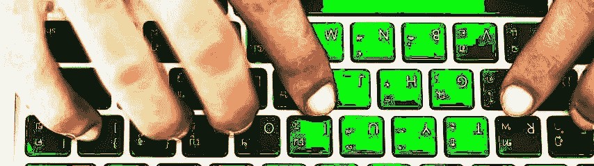

# 黑客正午读者调查

> 原文：<https://medium.com/hackernoon/hacker-noon-reader-survey-14060d66027b>

嘿，了不起的黑客午间读者。我们想通过让你回答几个关于你自己和你的阅读偏好的简单问题来改善你在 Hacker Noon 上的阅读体验。本次调查不到两分钟，将选出三名幸运的获奖者作为奖品，包括一次对 Hacker Noon 主编 David Smooke 的采访，该采访将出现在 Hacker Noon 主页的顶部(获得最有趣/最有想法的反馈)，以及两个 0.5ETH 奖(随机选择)。测绘快乐！