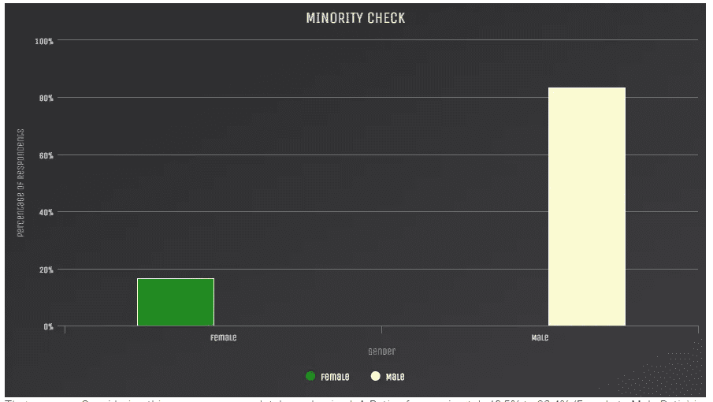
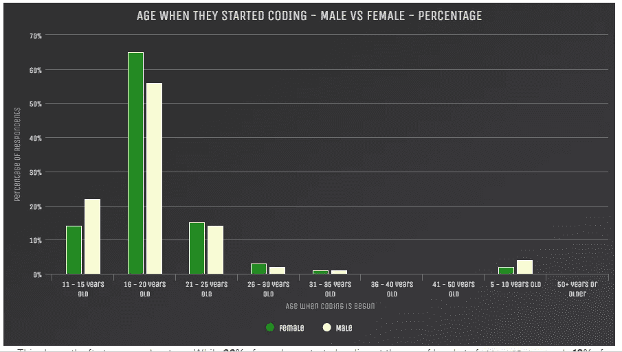
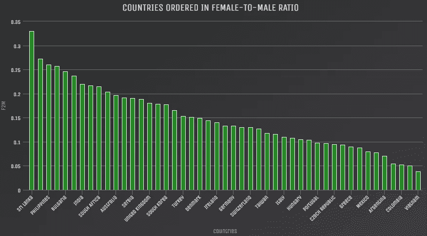
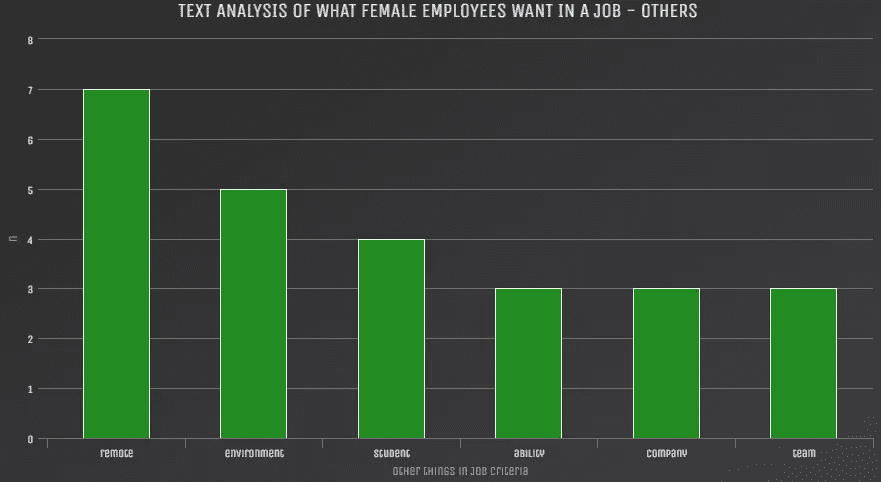

# Hackerrank 2018 调查分析——关注性别的见解

> 原文：<https://medium.com/hackernoon/hackerrank-2018-survey-analysis-gender-focused-insights-65403f11f4ad>

竞争编码平台 Hackerrank 对其开发人员进行了一项调查，以下是 Hackerrank 在 Kaggle Datasets 平台上开源的数据集的分析结果。

# 关于数据集和调查

*   共有 25，090 名专业和学生开发人员完成了我们 10 分钟的在线调查。
*   该调查于 2017 年 10 月 16 日至 11 月 1 日进行。
*   该调查由 SurveyMonkey 主持，我们通过超过 340 万成员的社区电子邮件和社交媒体网站招募了受访者。

# 本次分析的重点

虽然这是一个一般的调查数据集，但该分析的重点是了解科技行业中的女性。

# 突出

*   一个非常明确的行动就是从小激励和欣赏女生码。比尔·盖茨和马克·扎克伯格在高中时就开始编程了。致力于提高技术多样性的组织应该从这里开始。**学校**。此外，应该教育父母让他们的女儿学会编程是多么重要

*   计算机科学学位一直被认为是男生擅长的事情。大学需要向所有人推销计算机科学学位。它应该让女孩们相信这绝对是她们喜欢的东西。**大学计算机科学学位营销**增加强制性的女性配额以提高课堂的多样性可能会有所帮助。
*   与过去相比，女学生的比例似乎在提高。重要的是要保护他们，磨练他们，并让他们继续前进，而不是因为缺乏适当的指导而放弃。因此，像 **Hacker Rank** 这样的社区应该在这些人中组织编码意识活动，以确保他们的信心。

*   发展中国家——尤其是非洲国家——在男女比例上处于领先地位。针对他们的特定调查以及与他们的焦点小组讨论可以帮助我们改善更大的社区。
*   帮助女性从初级开发人员晋升到高级开发人员非常重要。这正是他们在个人生活中充满承诺的时候。重要的是，要推动那些希望提高多样性的组织为那些希望长期休假并在回来后有工作保障的女性提供休假，并在职业空缺后让女性重返工作岗位。

*   综上所述，启用**远程/灵活的**工作环境也将有助于实现更大的目标。
*   为新来者定义一个清晰的**学习路径**—特别是关于市场上需求的语言——Javascript/Python。我不得不提到**免费代码营**在这方面做得非常出色——完全免费。
*   在教授编程的同时，推广和维护像 github 或博客这样的在线作品集是很重要的。因为正如 *Cal Newport* 所说*“不生产，就不会兴旺”*。因此，项目(小型/大型)或他们的任何其他工作，无论是以代码或博客帖子的形式，都应该在网上发布。
*   除了技术技能，招聘经理显然还看重良好沟通和学习新事物的能力。这使得帮助新学员学习软技能变得非常重要。

**元:**

上述见解源自使用托管在 [Kaggle 内核](https://www.kaggle.com/nulldata/hacker-women-bad-past-but-a-sign-of-hope)上的 Rmarkdown 执行的分析。该分析使用 R 编程进行数据分析，并使用围绕着 javascript 库的 R 包装器来交互绘图。