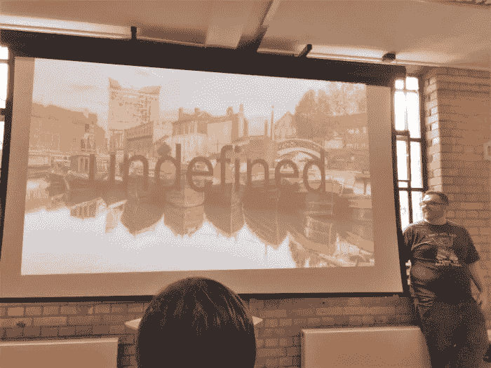
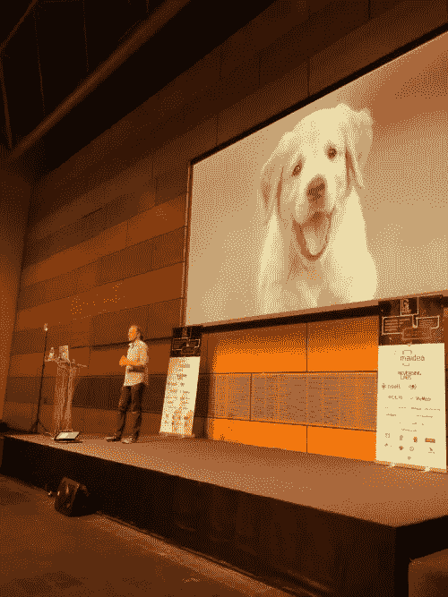

# 黑客大会 2018 摘要

> 原文：<https://medium.com/hackernoon/hackference-2018-recap-8896fe8403ff>

过去的这个周末，我有机会前往东中部地区，参观了伯明翰的 Hackference 2018。周五是双轨道会议(大致分为前端和后端)，然后周六和周日是黑客马拉松。

我在前端赛道闲逛..我发表了关于传递高性能(但仍然美丽)图像的演讲(这里是[平台](https://www.slideshare.net/dougsillars/hackference))。每场演讲都令人难以置信，从表情符号的历史，到网络虚拟现实/语音交互演示，用网络蓝牙控制无人机，一个伟大的 SVG 演示，以及推动每个人致力于 HTML5 标准。经过一天的谈话，我的脑海里充满了伟大的想法和理论。

周六早上，我们聚在一起开始黑客活动。许多大奖都岌岌可危，每个人都被激励着去建造东西。Cloudinary 要求我成为他们的代表，所以我在那里支持人们用 Cloudinary 的图像和视频 API 来构建东西。当我开始与人们交谈，并了解他们在构建什么时，我发现了 Hackference 的一个独特方面:每个项目都有一点吸引 Mike Elsmore(今年 Hackference 的组织者和唯一幕后人员)的地方。这一切都是善意的，但比赛的大奖将授予最佳的麦克巨魔(稍后将详细介绍)。

在大约 25-30 名黑客中，大约 10 名使用了 Cloudinary，他们提出了一些非常酷的东西。Cloudinary 奖(Cloudinary PRO 的一年)授予了团队垃圾和 Mike T 恤。

团队垃圾:使用网络摄像头，他们拍摄了垃圾的照片，并将图像上传到 Cloudinary。使用[谷歌自动标记](https://cloudinary.com/console/addons#google_tagging)，垃圾被识别，垃圾桶上方出现一个灯，表示垃圾应该被放入(塑料、金属、玻璃等)。

迈克 t 恤生成器构建了一个工具，[通过将迈克的随机图像叠加到 t 恤上来创建迈克的 t 恤](https://mike-shirt-generator.now.sh/)。

我最喜欢的 Cloudinary 集成赢得了 trolls 之王和其他一些奖项。它被称为“演讲者即服务”，它允许用户在演讲者的演讲中添加任何图像。这是迈克展示伯明翰的一张照片。

我在这里展示一只小狗

丹写了一篇博客，讲述他作为(睡眠剥夺)开发者的经历

无论如何，大家都度过了一段美好的时光，我要感谢迈克，一是为这么多人安排了一个美好的周末，二是。对所有黑客来说都是一项伟大的运动。

*原载于 2018 年 10 月 21 日*[*【dougsillars.com】*](http://dougsillars.com/2018/10/21/hackference-2018-recap/)*。*