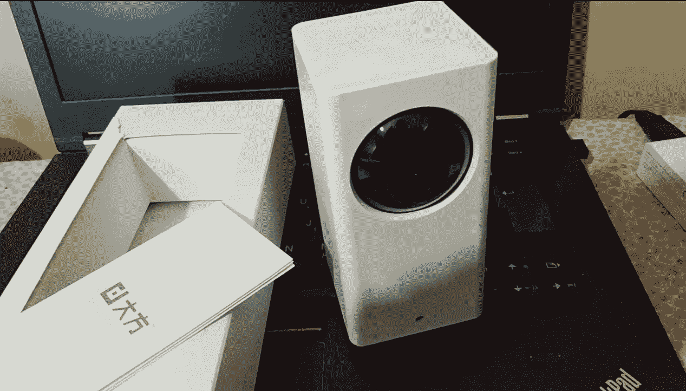
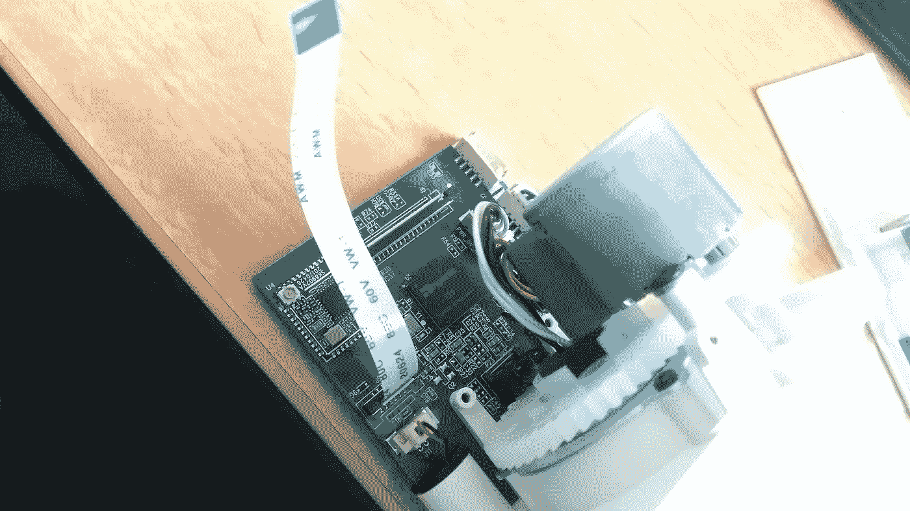
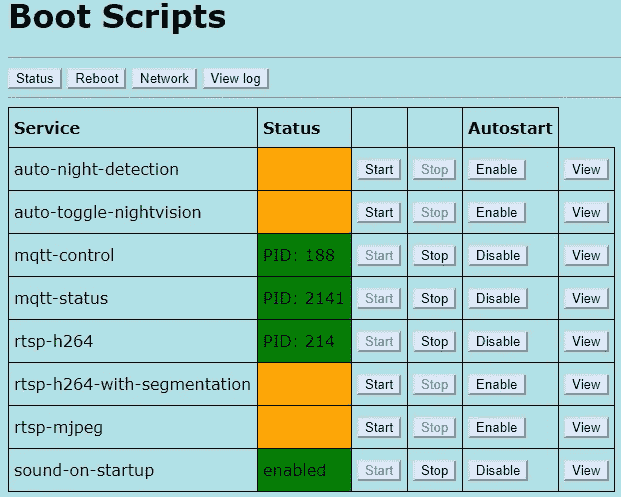
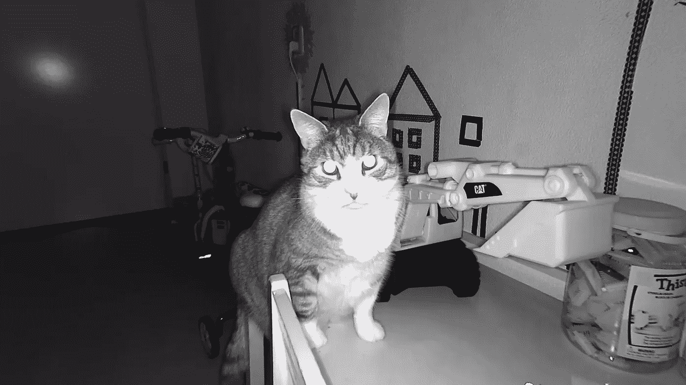

# 黑了一个 30 美元的物联网摄像头来做更多的事情。

> 原文：<https://medium.com/hackernoon/hacking-a-25-iot-camera-to-do-more-than-its-worth-41a8d4dc805c>

[小米大方 IP](http://bit.ly/2EwpHR1) 相机是一款室内机动 WiFi 相机，具有 1080P 分辨率和良好的夜视能力，价格便宜，但作为交换，你可以绑定到小米的 Mi Home 应用&云。



小米大方 IP 相机是[15 美元小米小方](/@tomac/rtsp-hack-for-a-15-xiaomi-wifi-ip-camera-453690396691)相机的继任者，并延续了小米一系列质优价廉的 IP 相机。新型号具有一系列新功能:更好的图像质量，MicroSD 端口，旋转万向节，背面的 USB 端口可用于为其他设备充电，以及各种报警传感器等。在这篇文章中，我们仔细看看相机 CFW 替代开源固件安装。



Mainboard (Ingenic XBurst **T20** SoC) and motor assembly.

对于最低价格(从中国发货)，请查看常见的零售商，如 [Gearbest 小米大方](https://www.gearbest.com/ip-cameras/pp_693217.html?lkid=11893441)或 [Dealextreme 小米大方](http://bit.ly/2EwpHR1)(额外 5%的优惠券代码以获得更好的价格，DX 优惠券:APRBRAND)。

# 开箱即用的限制

小米对这款开箱即用的相机进行了一些限制，因为相机镜头只能通过 MiHome 应用程序查看，并且需要 MiHome 帐户。

# 修正局限性

GitHub 上的 EliasKotlyar 发布了一组相机的修改(CFW):[https://github.com/EliasKotlyar/Xiaomi-Dafang-Hacks](https://github.com/EliasKotlyar/Xiaomi-Dafang-Hacks)

CFW 由两部分组成:

自定义固件，改变原来的固件从 microsd 启动。需要刷新而不是原来的固件。这部分不包含任何定制软件，它只允许你从 microsd 启动。您只需这样做一次。

CFW 文件，其中包含自定义软件。完成之前的步骤后，您必须将它们安装到您的 microsd 卡上。您可以通过更改 microsd 上的文件来轻松修改这一部分。

我可以将固件恢复到原来的版本吗？是的，你可以。但是，没有必要将其恢复。如果你的 SD 卡不包含 CFW 文件，你将只启动原来的软件。

# 如何闪现 CFW？

下载 CFW 二进制。[https://github . com/EliasKotlyar/Xiaomi-Dafang-Hacks/blob/master/Hacks/cfw/cfw-1.3 . bin](https://github.com/EliasKotlyar/Xiaomi-Dafang-Hacks/blob/master/hacks/cfw/cfw-1.3.bin)

确保下载的文件大小约为 11.1MB。

```
**Steps to flash the hacked loader firmware:**Turn off the cameraGet a firmware binay and rename it to "demo.bin". There should be a FAT filesystem and no more files in the sdcard.Insert the sdcard containing the firmware into the camera. Press and hold the reset camera (setup button), then turn on the camera. Wait until the light get blue, you can release the reset button.Wait until the firmware has finished flashing (like 5 minutes). Disconnect the power as soon as the base starts moving.**Steps to install CFW files:**Clone the repository from github. If you are on windows download the repository as zip file.Copy everything from "firmware_mod" folder into the root of the microSDIt should look like this:E:/
├── bin
├── config
├── run.sh
├── scripts
└── wwwModify the file config/wpa_supplicant.conf on the microSD to match your wifi-settings
Insert the microSD and start the camera.
```

就是这样。

# CFW 包含哪些特征？

*   H264/MJPEG 全工作 RTSP。基于[https://github.com/mpromonet/v4l2rtspserver](https://github.com/mpromonet/v4l2rtspserver)
*   SSH-服务器(dropbear)
*   FTP 服务器(bftpd)
*   网络服务器
*   图像捕捉(获取 Jpeg 图像)
*   水平/垂直电机旋转/移动到中间
*   打开/关闭蓝色/黄色/红外发光二极管/红外截止
*   可以进行本地 h264 录制
*   远程音频播放和录制
*   MQTT
*   家庭助理集成

# 连接到 CFW

按照说明进行安装和设置后，打开网络浏览器，在地址栏中输入摄像机的 IP 地址

选择您要运行的服务:



*   RTSP 流(使用 MJPEG RTSP 的样本):

```
Once the RTSP stream is up and running at rtsp://ip-address:8554/unicast, you can to connecting to it with VLC (File > Media > Open Network Stream)
```

*   可能进行本地 h264 录制:

```
/system/sdcard/bin/h264Snap > /system/sdcard/video.h264
```

*   音频录制/播放也是可能的:

```
Playing Audio:
/system/sdcard/bin/ossplay /usr/share/notify/CN/init_ok.wavRecording Audio:
/system/sdcard/bin/ossrecord /system/sdcard/test.wav
```

此外，您可以直接从 GPIOS 控制相机的一些功能，如蓝色/黄色 LED、红外滤光器和红外 LED、X 和 y 电机运动等

我用 Android 上的 TinyCam 在本地观看我的 RTSP 视频。你可以在 TinyCam 里找到基本的 PTZ 素材。查看 MasterPIC 在此帖子中的说明:[https://github . com/EliasKotlyar/Xiaomi-Dafang-Hacks/issues/41](https://github.com/EliasKotlyar/Xiaomi-Dafang-Hacks/issues/41)

我用 iSpy 测试了 CFW，但在互联网上，我是通过在我的 [VIM2](https://hackernoon.com/from-tv-box-to-high-performance-single-board-computer-running-linux-on-the-khadas-vim2-max-5c00f6e95aa4) 上运行的 MotionEye 来观看视频流的。



Sample night vision mode of Hanizzo

我会向所有人推荐这款相机！你再也找不到比这款看起来更棒的了，它以如此低廉的价格拥有如此多的额外功能！