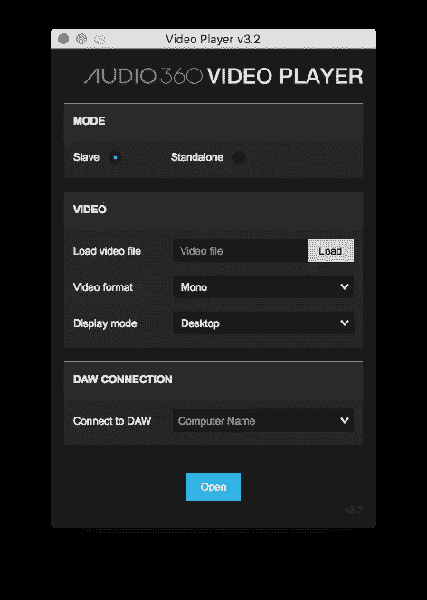

# 与 Powster 实验室一起入侵脸书:360 视频音频聚焦

> 原文：<https://medium.com/hackernoon/hacking-facebook-audio-focus-for-360-video-6856f256ec44>

“降噪耳机给了我灵感。”

最近在 [Powster 实验室](http://www.powster.com)的一个项目中，我们面临着一个看似不可能的挑战——为[脸书](https://www.facebook.com/)制作一个 360°视频，配有完全互动的音频。这个概念是一个 360 度的场景，四首约翰·威廉姆斯音乐同时播放。根据您观看的墙壁，您可以听到不同的轨道，并看到墙壁上播放的相应动画。

这在定制应用或网站中很容易，但这里的挑战是在脸书内部获得这一功能——一个拥有潜在巨大受众的平台，他们不太可能下载特殊的应用或甚至点击定制网站。

脸书提供了一套非常先进的 [360 音频工具](https://facebook360.fb.com/spatial-workstation/)，但是它们是严格按照真实世界建模的，在真实世界中，我们无法精确地集中我们的耳朵，我们总是听到我们周围发生的一些事情。他们的工具包让我们将失焦音频降低了-24db，这是一个好的开始，但远远不足以完全隔离音频。

通过实验和创造性思维，我们能够想出一个伟大的解决方案，我们相信这是世界上第一个。[点击这里查看](https://www.facebook.com/deccarecords/videos/10155629007169389/)。

# 灵感

将这四个音轨放入脸书的播放器听起来很混乱——就好像它们同时在播放一样。我们需要做的是找到一种方法来进一步降低我们没有看到的场景中的音频。

灵感来自于[降噪耳机](https://electronics.howstuffworks.com/gadgets/audio-music/noise-canceling-headphone3.htm)。

它们的工作原理是监测你周围的环境噪音，然后回放相同的音频，但进行反转，抵消背景噪音。这是一个叫做[相消干涉](http://www.phys.uconn.edu/~gibson/Notes/Section5_2/Sec5_2.htm)的巧妙把戏。

When two identical waves are played in sync, they create a larger wave. When identical waves are played inverted (out of phase), the result is no wave — silence

Powster 实验室试图在脸书播放器中复制这种效果，在场景的所有四个方向上创建背景音频的反转录音。我们对它的效果感到惊讶！

这种孤立的音频为 360 视频带来了如此多的创作可能性，超越了大多数 360 平台青睐的现实主义方法。它允许我们设计 360 个没有单一焦点的故事，并将几个并发的故事打包到一个场景中，就像我在 2012 年的应用程序[“In Limbo”](http://inlimbofilm.com/)中所做的那样。

我很高兴与大家分享我们在 [Powster](http://powster.com/) 研发的突破性技术，这项技术让这种新的电影制作方式在世界上最大的 360 视频平台上得以实现。

# 辅导的

*如果你想自己尝试，这里有一步一步的指导。*

*   使用脸书提供的[工具创建一个新的](https://facebook360.fb.com/spatial-workstation/)[收割者](http://reaper.fm/)空间项目。我们发现最好的方法是复制他们的示例项目并从那里开始工作。脸书有很好的视频教程，涵盖了使用他们的工具和收割机的基本工作流程。

*   为了简单起见，我们删除了除了一个橙色的空间轨迹之外的所有轨迹。检查它的工作，然后重复，直到你有 4 个工作的空间轨迹

Basic layout with only one spatial track

Layout with 4 duplicated spatial tracks

*   从脸书工具中打开 360 视频播放器应用程序，加载您的视频文件。视频回放与 reaper 中的播放头同步，因此您可以播放您的混音，然后切换到视频应用程序，听听它在空间上是如何工作的。

Monitoring a 360 video linked to Reaper with Facebook’s Video Player tool

*   布局你的主要组合。导入每个角度的音频轨道，并在每个图层上使用“fx”按钮来定位它们。我们发现最好使用整数，这样有助于对称整齐地布局，也有助于保持事物在地平线上。

Click the green FX button to open the spatial options for that track

The spatial layout plugin

Our final layout looks like the above, with all the spatial tracks evenly spread out around the room

*   最大限度地启用混合聚焦。打开控制插件轨道上的“fx”窗口，打开混音聚焦，聚焦面积 40，音量-24db。这个功能让我们完成了一半——调低我们没有看的音频的音量。问题是-24db 并不多，所以对于我们想要的效果来说，这是一个非常微妙的效果。

Very important to enable mix focus like this

*   播放视频并通过互动视频进行检查。这听起来很混乱，但是你应该能够判断出音频是否大致集中在正确的轨道上，以及在与视频同步等方面其他一切都很好。

*   确保你是快乐的——在这一点上，我们必须使用当前的混合手动创建反向层。现在不能回去！

Our mix is done and ready to create the noise cancellation tracks

*   逐一浏览每个轨道，并为每个轨道创建噪声消除轨道。
*   使目标轨道静音。

Note ‘M’ muted layer toggle

*   在视频播放器中，使摄像机尽可能靠近该曲目位置的中心。

I’ve muted the Jurassic Park audio, and have positioned the video player to look directly at the centre of the Jurassic park scene.

*   在 reaper 中，将混音渲染为立体声。选择主轨道，然后转到文件>渲染

*   复制目标轨道(精确复制位置数据)。
*   将导出的音轨导入此通道。

*   单击轨道上的按钮“”,反转相位。

*   用视频播放器试试吧。在调音台中调整新反转轨道的音量，直到声音消失。似乎每条略有不同的赛道都有一个神奇之处。

*   对每个音轨重复这个过程！静音，将摄像机转到静音轨道的中心，然后将音频渲染为立体声轨道。

The final layout with all noise cancellation tracks in place

*   当我们把文件渲染出来的时候，我们也让反转的音轨听得见。我们希望背景音频听起来尽可能接近最终混音的效果。
*   从 reaper 导出您的双声道混音。记得在导出设置中关闭“解码双耳”，输出时指定 9 个声道。这将创建正确的音频格式以添加到您的视频并上传。

*   使用脸书的工具混合音频和视频。确保选择“二阶环绕声”作为音频类型。为了启用“聚焦”功能，这种效果在很大程度上依赖于聚焦。

*   最后，检查脸书的结果！上传你的文件，也许将隐私设置为私人，然后检查听起来如何。我们发现 iOS 比 Android 有更好的结果，但这可能会随着脸书应用程序的更新而改善。

[Check out the final thing here](https://www.facebook.com/deccarecords/videos/10155629007169389/)

在 Powster 实验室，我们为客户做不可能的事情。我们是电影工作室和音乐公司的创新合作伙伴，提供世界第一和开创性的项目。从 3D 图库到网络浏览器中的多通道视频，再加上网络上的 AR 和 VR。

想从事这样的创新项目吗？？幸运的是，我们在洛杉矶办公室有一个创意开发的职位。请在这里申请，我们期待看到你的作品！

在[推特](https://twitter.com/powster)、 [Instagram](https://www.instagram.com/powster/) 、[脸书](https://www.facebook.com/Powster/)和 [LinkedIn](https://www.linkedin.com/company/powster) 上关注 Powster，了解更多有用的技巧。