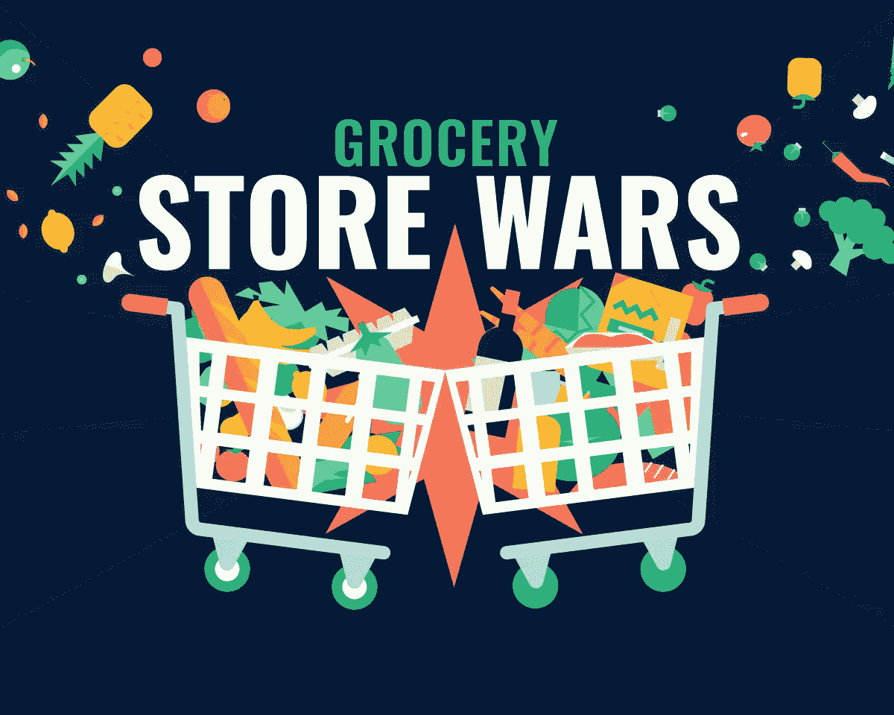
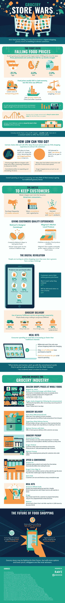

# 用科技破解杂货店战争

> 原文：<https://medium.com/hackernoon/hacking-the-grocery-store-wars-with-tech-4397e676014>

到现在为止，你肯定已经注意到食品杂货价格正在下降。我上次去商店时，一打鸡蛋的价格是 0.79 美元。部分原因是某些商品生产过剩，压低了价格。对中国和其他海外市场的出口减少，货物运输成本下降。这对你的杂货账单来说是一件好事，但这也意味着杂货店将不得不以其他方式争夺你的生意。这就是技术的用武之地:消费者在购物时最想要的是便利，而像网上订购、路边取货和送货这样的事情看起来比以往任何时候都要好！

亚马逊并不是唯一一家涉足杂货递送游戏的零售商。沃尔玛目前正致力于推出送货上门服务——是的，除了已经非常受欢迎的路边杂货店外，人们还会把你的杂货搬进去，当你不在家时帮你保管好。

但这并不是科技给你的购物体验带来便利的唯一方式。像亚马逊、山姆会员店和克罗格这样的零售商正在使用智能手机应用程序，让顾客在购物时扫描他们的食品杂货，跳过收银台。

从这张信息图中了解更多关于科技如何赢得杂货店战争的信息！

