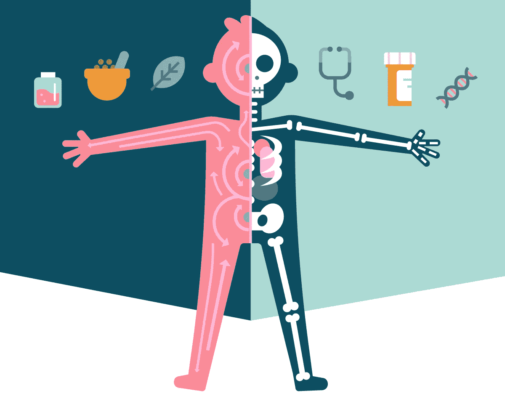
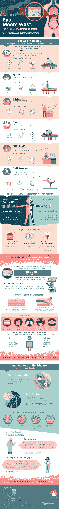

# 破解健康的全身方法

> 原文：<https://medium.com/hackernoon/hacking-the-whole-body-approach-to-health-64b31a8278e>

东方和西方的医疗实践方法经常被认为是完全相反的。事实上，许多研究表明这种观点是愚蠢的，东方，也被称为传统中医，实践证明有助于减轻从关节炎，妇科疼痛，偏头痛到癌症治疗副作用等疾病。一直是个谜，为什么针灸、瑜伽和其他中医疗法的实施似乎有效，但一项新的科学发现正在澄清困扰西方医生的东方医学现象。

今年三月，由 NYU 朗格内医学院的研究员和病理学博士 Neil Theise 领导的一组医生发现了他们所说的新器官。

它的名字是――间质。

使用 pCLE，一种革命性的显微镜形式，Theise 和他的公司发现了他们发现的遍布全身的充满液体的通道。这些通道本质上是淋巴和其他体液通道的内部高速公路，并可以解释为什么中医实践有效，以及癌症如何转移。

通过下面的信息图，了解更多关于[破解间质](https://urbanmonknutrition.com/interstitium-infographic/)以弥合东西方医学之间的差距，以及它如何改变我们对身体的理解。

