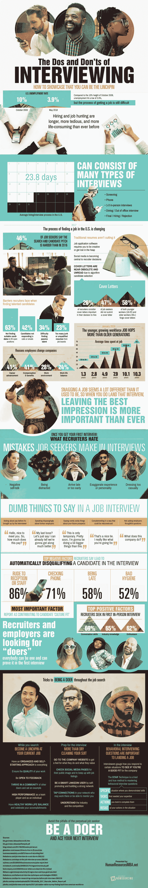

# 破解你的下一次工作面试

> 原文：<https://medium.com/hackernoon/hacking-your-next-job-interview-5e68c47ded42>

对信息安全和其他 IT 专业人员的需求从来没有像现在这样大。特别是随着 GDPR 最近生效，现在世界范围内对技术计算技能的需求将会更大。结合这一事实，即大多数人只会在一份工作上呆 1 到 10 年，你可能需要比你想象的更快地提高你的面试技巧。

如果你已经从大学毕业或者已经在现在的工作岗位上工作了 2 年以上，很有可能面试过程已经和你上次面试时发生了很大的变化。就在几年前，你会投简历，等电话，然后去面试，最终得到一份工作。如今，这个过程要漫长得多——你的简历和求职信远没有你的网上声誉和 LinkedIn 个人资料重要，在你得到这份工作之前，你可能会参加半打不同的面试。

以下是你在下一次工作面试中需要知道的:

*   在你开始寻找之前，清理并更新你的在线资料
*   面试时提前 5-10 分钟到场，不多也不少
*   穿合适的衣服，确保你的个人卫生符合标准
*   不要撒谎或夸大其词
*   在面试中展示你的技能和个性——你必须展示你能成为关键人物
*   对每个人都要有礼貌，包括门卫和前台服务员
*   通过调查工作和你将要工作的公司来准备你的面试

从这张信息图中了解更多关于[如何应对下一次求职面试](https://www.humanresourcesmba.net/interviewing/)的技巧。

