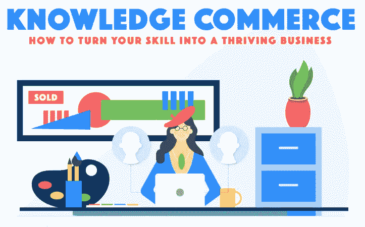

# 通过知识商务在自由职业经济中开辟一条道路

> 原文：<https://medium.com/hackernoon/hacking-your-way-through-the-freelance-economy-through-knowledge-commerce-348f16e4f68b>

去年，超过 5700 万美国人作为自由职业者工作，为经济增加了 1.4 万亿美元。自由职业者变得越来越普遍，自由职业者也更容易找到工作。如果你正在考虑做自由职业者，考虑成为一名信息企业家，通过教学、咨询或销售来销售你在某个主题上的专业知识。

很可能你有一个爱好或者对一个大多数人都知之甚少的主题充满热情。信息企业家抓住这个话题，不管它是什么，并把它变成一个收入流。无论你教授空手道、领导技能，还是如何制作被子，人们都渴望获得信息，并愿意付费学习。

从你的话题开始。找到适合你技能的主题，成为专家。参加在线课程或开始练习，让你的技能跟上速度。要成为专家，你不一定要完美，但你一定要足够好来教初学者。

一旦你找到了你的专长，是时候建立你的网上形象了。为博客或社交媒体创建内容，然后开始提供一对一的教学和独家内容来建立你的收入流。

阅读此信息图，了解更多关于[知识商务](https://blog.newkajabi.com/knowledge-commerce-infographic)的信息:

