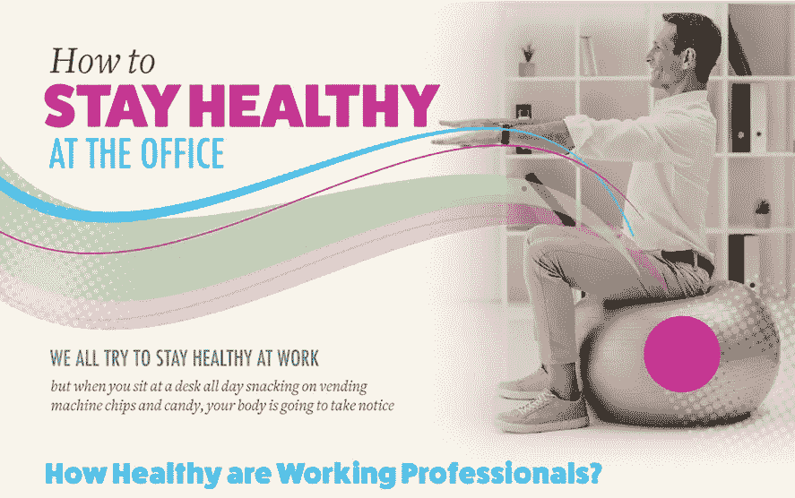
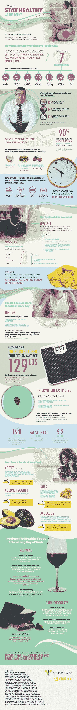

# 在办公室锻炼身体

> 原文：<https://medium.com/hackernoon/hacking-your-way-to-good-health-at-the-office-6f08f1712d85>

世界上可能没有哪一类员工比 IT 员工更喜欢久坐不动。你的工作就是整天坐在电脑前解决世界问题。如果你在午休时去买一些不是自动售货机里的健康食品，但愿不会如此——如果没有你，这个地方真的会被烧毁。做一名 IT 专业人员是一种吃力不讨好的生活——当事情进展顺利时，没有人会注意到，当事情出错时，他们会把一切都归咎于你。仅仅为了维持资金不足和超负荷工作的部门运转，很容易陷入忽视自身健康的陷阱。但是你需要在压力和不良习惯产生影响之前照顾好自己。毕竟，就像他们说的，你不能从一个空的容器里倒酒。

就在今天——开始做一些事情，让自己成为一个更健康的人:

*   多喝水，不要喝碳酸饮料
*   不要在你的咖啡里放那么多糖和乳制品——如果可以的话，喝黑咖啡
*   遵守 20–20–20 规则——每隔 20 分钟，将视线从屏幕移开 20 英尺，保持 20 秒
*   每小时一次，花五分钟时间散步、做瑜伽，或者只是在办公桌前做深蹲
*   扔掉自动售货机，开始带新鲜蔬菜和坚果作为午餐和小吃

从这张信息图中了解更多关于在工作中保持健康的信息。

