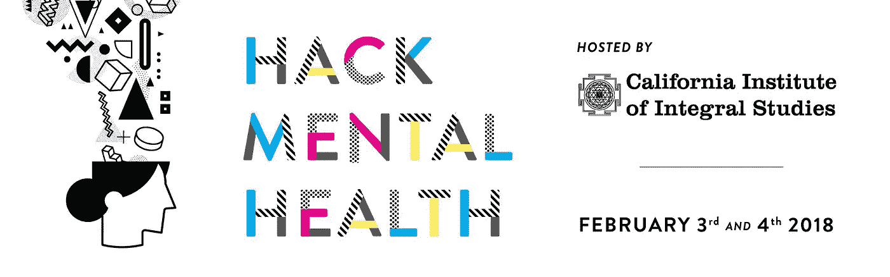
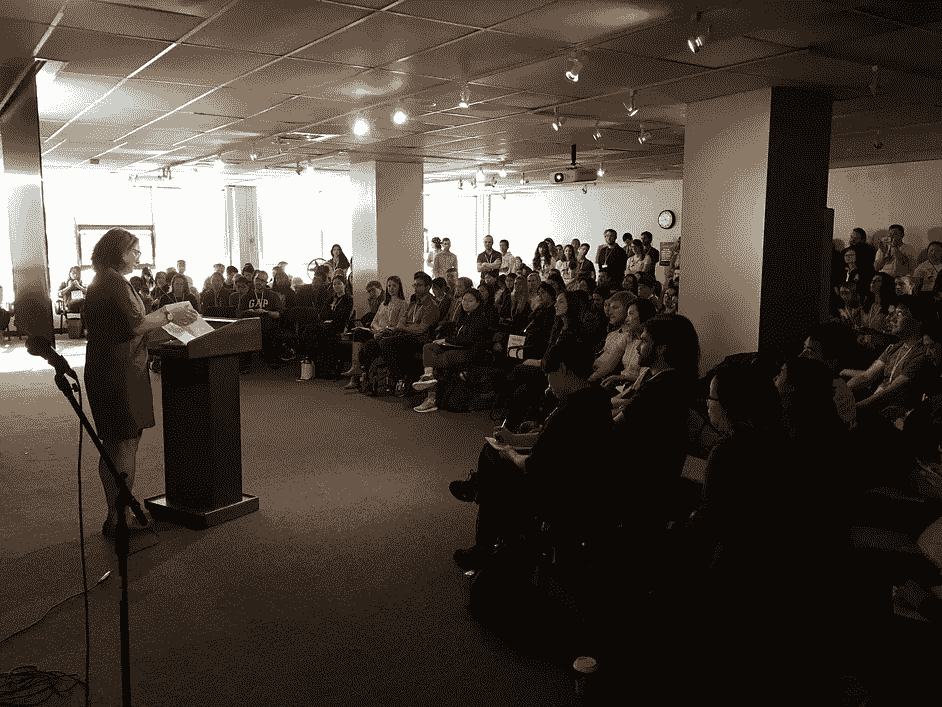
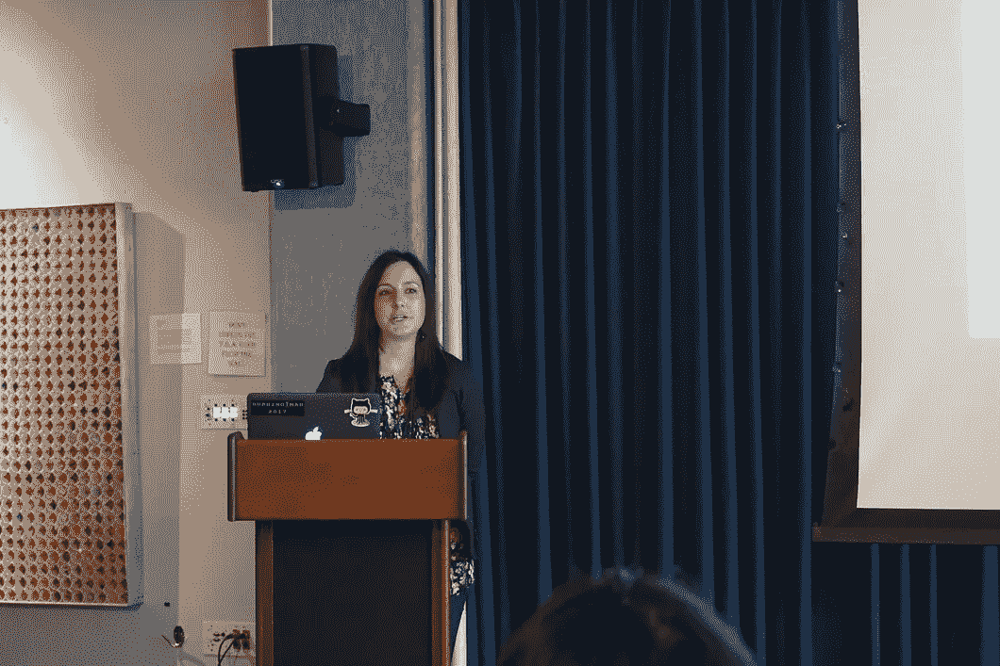
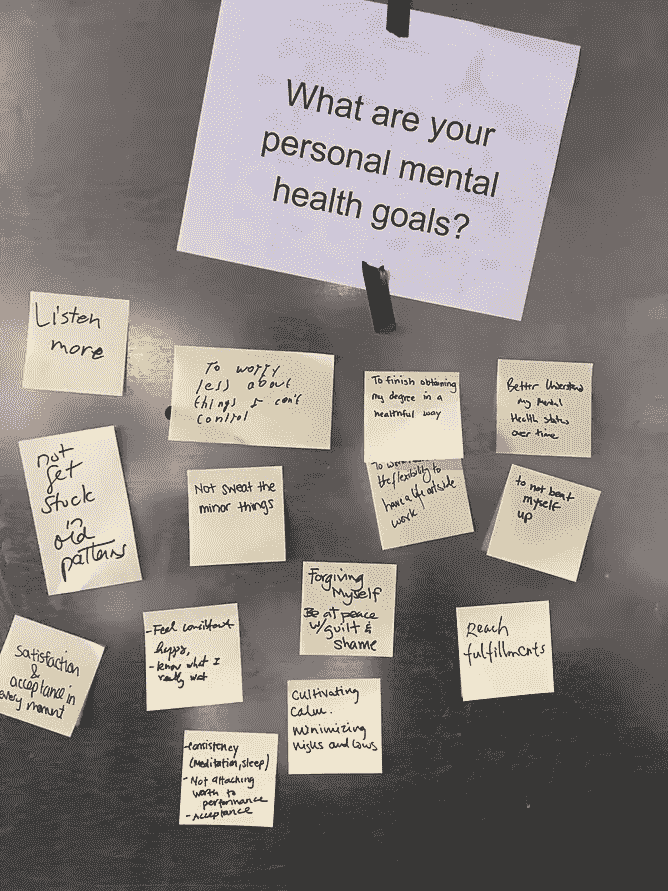
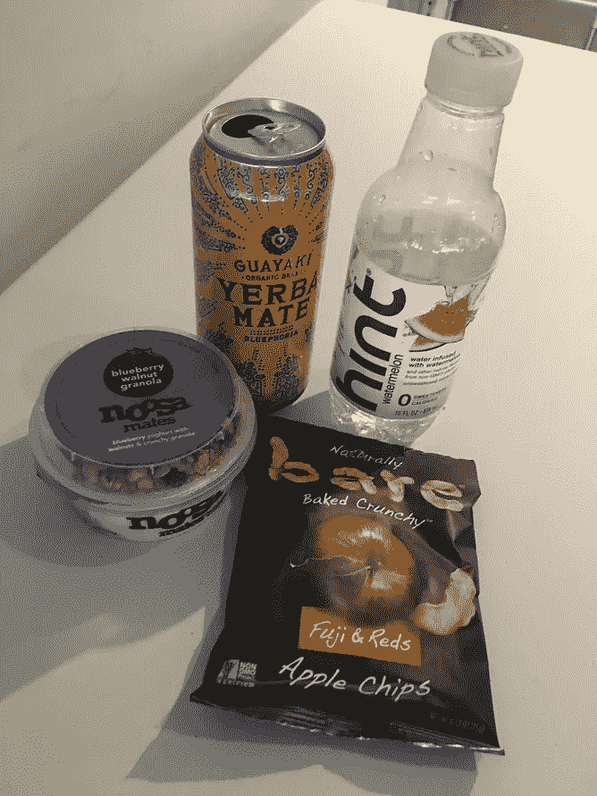
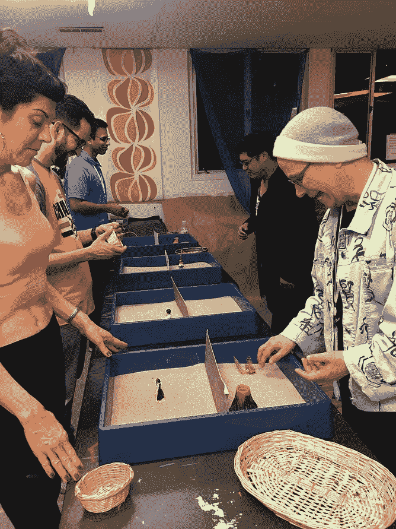
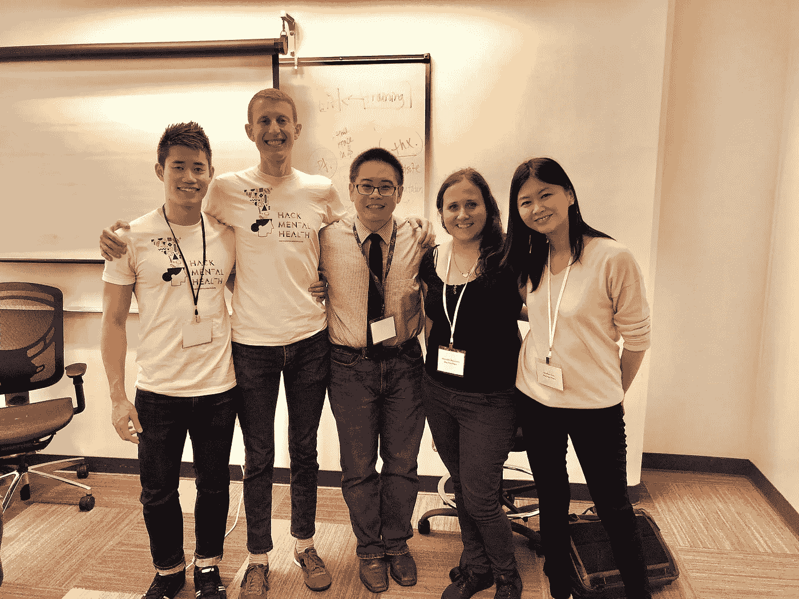
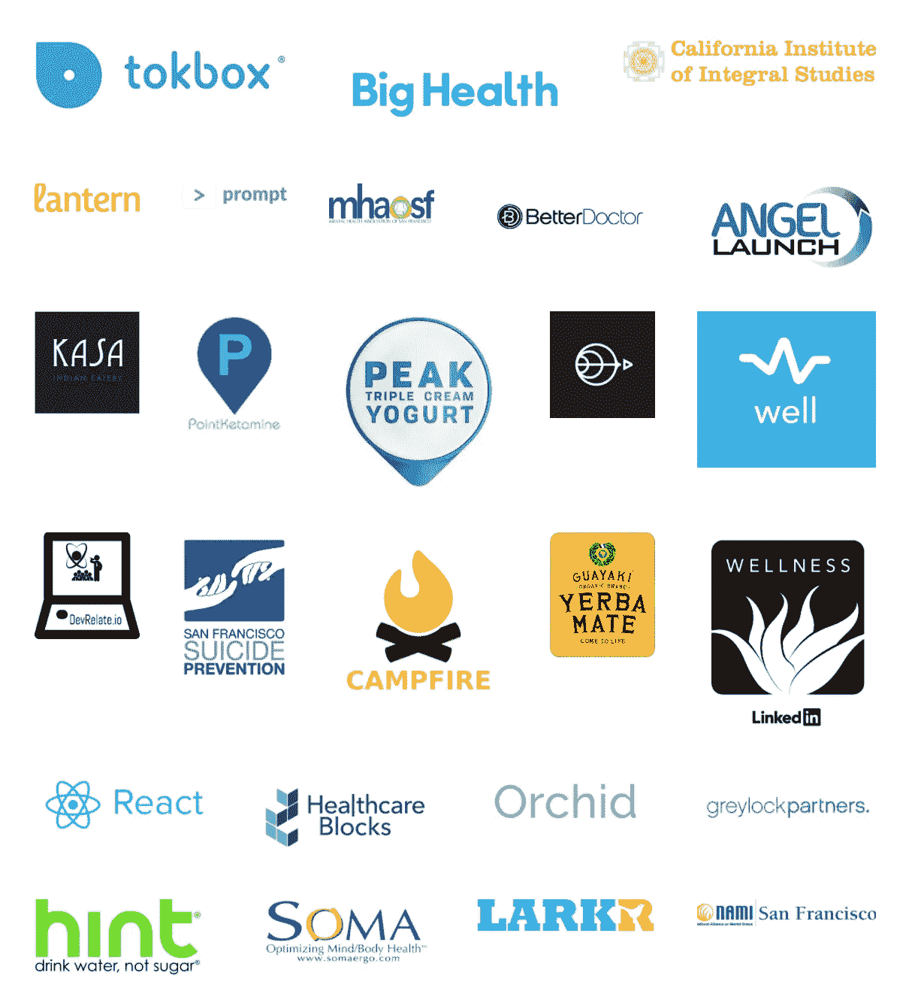
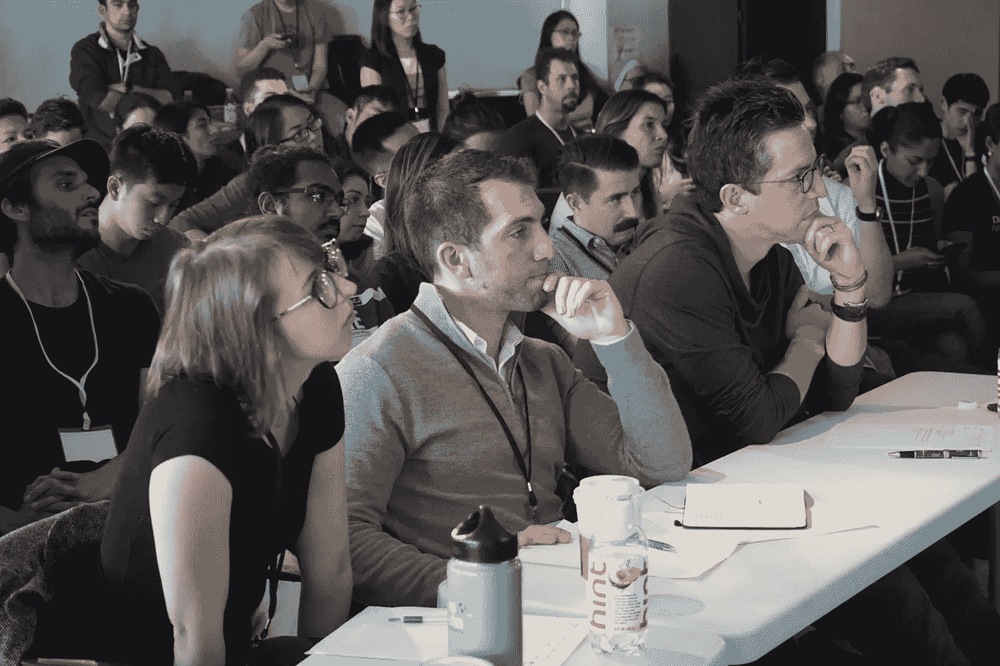
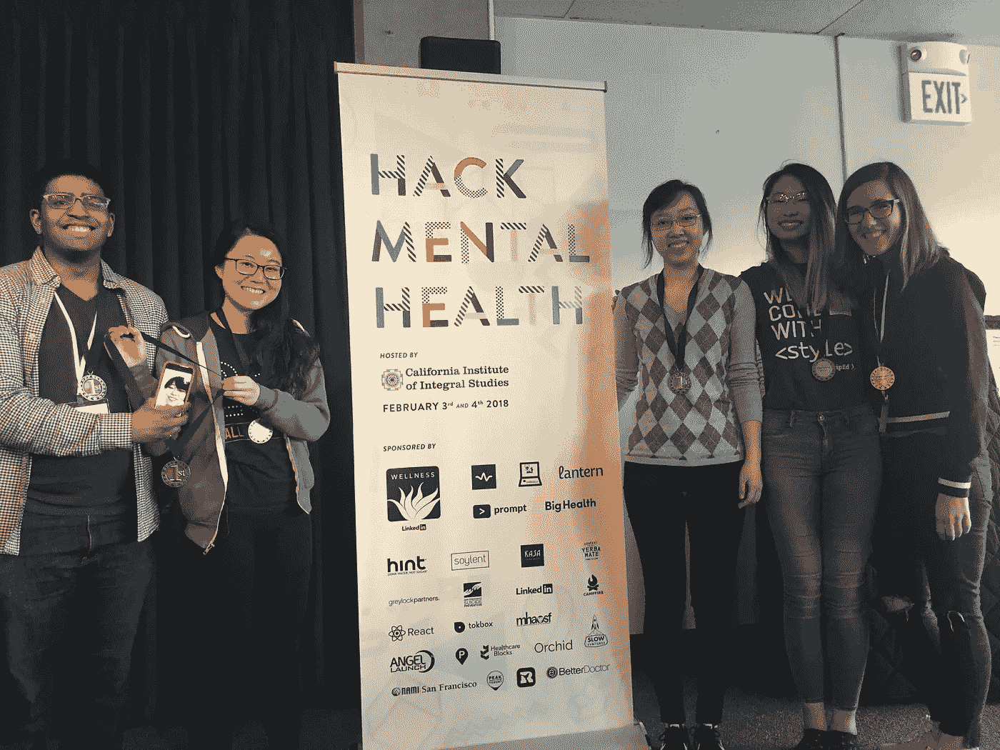

# HackMentalHealth 2018:“运动已经开始”

> 原文：<https://medium.com/hackernoon/hackmentalhealth-2018-the-movement-has-begun-effe82ea1932>

在即将到来的世纪，心理健康是我们国家面临的最大挑战之一。根据 [**全国精神病联盟**](https://nami.org/Learn-More/Mental-Health-By-the-Numbers) **:**

*   每五个美国成年人中就有一个在某一年经历过精神疾病。
*   自杀是美国 15-24 岁人群的第二大死因。
*   46%的无家可归成年人患有严重的精神疾病和/或物质滥用障碍。

# 走到一起

Speakers [Kelsey Crowe](http://www.helpeachotherout.com/talks-workshops/#events) and [Jennifer Akullian](https://www.linkedin.com/in/jenniferakullian) at the HackMentalHealth opening keynote with over 350+ attendees.

这就是为什么，2018 年 2 月 3 日至 4 日，我们在加州积分研究所举办了[硅谷有史以来最大的心理健康黑客马拉松](http://hackmentalhealth.care)，这是一场 24 小时的活动，专注于心理健康领域的实践学习和合作。

HackMentalHealth 团队被最终的数字震惊了，**有 350 多名与会者，30 多名赞助商和 20 多名导师**。这一令人难以置信的结果表明，在技术和心理健康的交叉领域，对创新的需求越来越大。

# 不是普通的黑客马拉松

这不是一场普通的黑客马拉松。为了与健康身心的原则保持一致，我们颠覆了黑客马拉松的公式。

*   对于饮料，我们提供了 Guayakí Yerba Mate 和[提示水](https://medium.com/u/bbf2165d4296?source=post_page-----effe82ea1932--------------------------------)而不是红牛。
*   我们制定了 7 小时的代码冻结，鼓励所有参与者在活动期间好好休息。
*   我们在参与者的姓名标签上加入了人称代词。
*   我们举办了几次以健康为导向的研讨会和活动，包括瑜伽休息、指导冥想，甚至还有一次表达艺术治疗会议。
*   我们还为初学者举办了一个编码研讨会，以帮助黑客马拉松向所有背景和经历的人开放。
*   我们主持了一个闪电谈话会议，介绍了各种主题，从自杀到治疗中的虚拟现实，发展中市场的心理健康到人际关系的重要性。

我们希望 HackMentalHealth 能够积极地改变黑客马拉松的文化，使其更加健康，压力更小。

# 弥合差距

From left to right: Ning Zhou, Matt Hirschtritt, Steven Chan, Meredith Meacham, and Jennifer Guo

HackMentalHealth 的使命是在心理健康专家和技术专家之间架起一座桥梁。这就是为什么我们在心理健康专业领域引入了三十多位导师，包括精神病学家、临床心理学家和其他医疗保健专业人士，由克莱尔·珀维斯领导。

每个团队都可以注册导师，并直接与治疗师和精神病学家接触。我们不是在真空中开发技术产品，而是希望确保黑客马拉松的最终结果在专业精神健康环境中确实有用和实用。

# 我们出色的合作伙伴

如果没有我们来自各种背景的优秀合作伙伴和赞助商，这项活动是不可能的。

*   **Tech** : [TokBox](https://medium.com/u/669a1133a124?source=post_page-----effe82ea1932--------------------------------) ， [BetterDoctor Data](https://betterdoctor.com/developers) ，LinkedIn Wellness， [Greylock Partners](https://medium.com/u/f3955f4bf101?source=post_page-----effe82ea1932--------------------------------) ， [DevRelate.io](http://devrelate.io) ， [Angel Launch](http://www.angellaunch.com/) ， [Healthcare Blocks](https://www.healthcareblocks.com/) ， [Slow Ventures](https://medium.com/u/c118cc4dcd75?source=post_page-----effe82ea1932--------------------------------) ， [React JS](https://reactjs.org/) ，
*   **心理健康:** [NAMI SF](https://www.namisf.org) ， [SF 自杀预防](http://www.sfsuicide.org/)，[大健康](https://medium.com/u/99d83dfc3e50?source=post_page-----effe82ea1932--------------------------------)，[灯笼](https://medium.com/u/411e9ef90668?source=post_page-----effe82ea1932--------------------------------)，[井](https://well-women.org/)， [MH 提示](http://mhprompt.org/)，[篝火](https://medium.com/u/6633f86d016e?source=post_page-----effe82ea1932--------------------------------)，[兰花](http://tryorchid.com/)，[心理健康协会 SF](http://Mentalhealthsf.org) ，[点氯胺酮](http://pointketamine.com)， [LARKR](https://larkr.com/)
*   **学术:**加州积分研究所
*   **个人:**杰西卡·利文斯顿， [Y Combinator](http://www.ycombinator.com/) 的创始合伙人
*   **食物&饮料:** [提水](https://medium.com/u/bbf2165d4296?source=post_page-----effe82ea1932--------------------------------)，[卡萨印度饮食店](https://kasaindian.com/)，[瓜亚基](http://guayaki.com/)，[匹克酸奶](http://www.peakyogurt.com/)，[诺萨](https://www.noosayoghurt.com/)
*   **其他:**SOMA

# 结果呢

> “运动已经开始了。你所做的是给人类的礼物。”戴夫·莫兰
> 
> “最棒的部分是遇到热情、有才华、善良的人们，他们想要有所作为。我感到鼓舞和充满活力。我为精神卫生保健的未来感到激动！”——周宁，UCSF 精神科住院医师

我们深受鼓舞的不仅仅是最终的演示，还有参与者对改变空间的热情。我们的评委是来自心理健康和技术领域的行业领袖。

Judges Courtney Brown, Seth Rosenberg, and Dave Morin. Not featured: Liz Beaven and Nicollette Maristela

**评委** : [戴夫·莫兰](https://medium.com/u/652de9fe92e3?source=post_page-----effe82ea1932--------------------------------)、创始人兼合伙人 [Slow Ventures](https://medium.com/u/c118cc4dcd75?source=post_page-----effe82ea1932--------------------------------) 和《日出》创始人| [利兹·比文](https://www.ciis.edu/faculty-and-staff-directory/liz-beaven)、加州综合研究学院院长| [塞斯·罗森伯格](https://medium.com/u/6a54160e13ba?source=post_page-----effe82ea1932--------------------------------)、[格雷洛克合伙公司投资人](https://medium.com/u/f3955f4bf101?source=post_page-----effe82ea1932--------------------------------) | [考特尼·布朗](https://medium.com/u/5801069d12e8?source=post_page-----effe82ea1932--------------------------------)、科幻自杀热线主管|尼克莱特·马里斯特拉、科幻心理健康协会[沟通专家](http://mentalhealthsf.org/)

**最终获奖者:**

Congrats to Huddle, the winners of HackMentalHealth 2018

*   **第一名:** [龟缩，触手可及的群体治疗](/hackmentalhealth/huddle-our-story-of-winning-the-hackmentalhealth-hackathon-6781f71767d1) | [Devpost 链接](https://hack-mental-health.devpost.com/submissions/87706-huddle)
*   **第二名/观众选择:** [EyeRIS，使用 Muse 头带进行临床数据](/hackmentalhealth/hackmentalhealths-team-eyeris-917d7bd71cd7) | [Devpost 链接](https://hack-mental-health.devpost.com/submissions/87711-eyeris)
*   **第三名:** [Itsy，针对慢性疼痛的聊天机器人中的认知行为疗法](/hackmentalhealth/itsy-healing-body-and-mind-1acdc5e713ca) | [Devpost 链接](https://hack-mental-health.devpost.com/submissions/87684-itsy)
*   **主办方选择奖:** [镜像健康，创造更深层次的心理健康洞察](/hackmentalhealth/mirror-health-our-journey-in-creating-deeper-mental-health-insights-ecc30360690a) | [Devpost 链接](https://hack-mental-health.devpost.com/submissions/87695-mirror-health)
*   **Tokbox API 奖:** peerLearn，带大家一起实践良好的心理健康| [Devpost 链接](https://devpost.com/software/peerlearn)

# 如何加入 HackMentalHealth 运动？

这并没有结束。我们从每月的时事通讯和全年持续的活动开始，但是我们需要你的帮助。请加入我们的运动。

*   社交媒体:[脸书](https://www.facebook.com/hackmentalhealth/)，[推特](https://twitter.com/hackmhealth)
*   社区:[脸书集团](https://www.facebook.com/groups/756324717898965/?ref=br_rs)，[媒体发布](https://medium.com/hackmentalhealth)(此处接受社区投稿[)](http://bit.ly/2E6oGji)
*   电子邮件简讯如下:

想要更多地参与进来吗？填写这张表格寻找领导机会。

HackMentalHealth 由[斯蒂芬·科格内塔](https://medium.com/u/829d5c865a60?source=post_page-----effe82ea1932--------------------------------)、[丹尼尔·普拉斯加尔](https://medium.com/u/6633f86d016e?source=post_page-----effe82ea1932--------------------------------)、[普拉加·巴乔里](https://medium.com/u/49a89570dcc5?source=post_page-----effe82ea1932--------------------------------)、[尼克·迪里恩佐](https://medium.com/u/b2d86527c3cd?source=post_page-----effe82ea1932--------------------------------)、[阿什温·库马尔](https://medium.com/u/13ca56953261?source=post_page-----effe82ea1932--------------------------------)、[克莱尔·珀维斯](https://medium.com/u/5359b6d06399?source=post_page-----effe82ea1932--------------------------------)、[阿莱克莎·梅耶](https://medium.com/u/a508b7dbb1ee?source=post_page-----effe82ea1932--------------------------------)、内哈·马丹[、扎克·利奇](https://medium.com/u/8500fff83e73?source=post_page-----effe82ea1932--------------------------------)和伊迪丝·博瑞巴赫领导和组织。