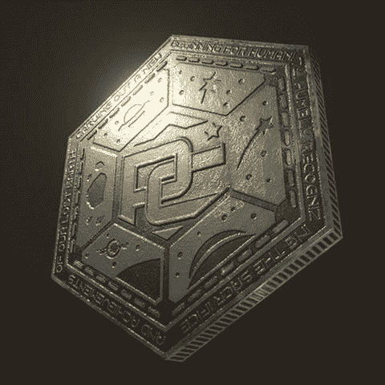

# 《半条命》变成了现实生活:区块链将如何革新游戏产业

> 原文：<https://medium.com/hackernoon/half-life-becomes-real-life-how-blockchain-will-revolutionize-the-gaming-industry-bb0499879b6e>

在[区块链](https://hackernoon.com/tagged/blockchain)将给我们的世界带来的所有疯狂的应用中，迄今为止最有趣的是它对游戏产业的影响。区块链和游戏是如此完美的契合；区块链允许你将资产完全数字化，并将其带入视频游戏，而以前这都是在易贝完成的。像“分散土地”这样的初创公司已经创造了完全由区块链担保的虚拟财产权。Parsec Frontiers 正在开发一种用于 MMO 的虚拟货币，这种货币将模糊游戏资产和真实资产之间的界限。区块链博彩业的未来将由虚拟资产定义，虚拟资产呈现出一种新的流动性、价值和不可改变的魅力。

虚拟经济的运作与我们在现实生活中看到的非常相似。哪里有可交易资产，哪里就有经济发展。Jagex 在其[游戏](https://hackernoon.com/tagged/game) Runescape 中开发了当时最具流动性和效率的经济体系之一，这实质上是游戏中每一个项目的工作股票交易所。

An image of the ‘grand exchange’; effectively the stock exchange for every virtual in-game item

这是游戏中最有趣的经济变化之一，也完全改变了游戏。许多人讨厌它，许多人喜欢它，但总的来说，你不能否认它没有使贸易对整个社会更加有益。交易进行得更快，你可以在交易的同时进行多任务处理。然而，这给游戏中的资产管理带来了一个全新的层面。现在，你实际上不得不担心你持有哪些资产的净值。作为一名球员，你不需要考虑哪些物品对你最有价值，你还需要考虑世界其他地方对它的评价。现在，这里的事情是，所有的价值仍然局限于游戏中的货币。现实世界和虚拟世界之间有一条分界线，大多数人不会跨越，因为他们可能会被踢出游戏。进来吧，区块链。

arsec Frontiers 正在彻底消除这条线。不仅允许在现实世界中交易货币，这也是游戏的核心设计特色。整个前提是，所有的交易将发生在区块链，并完全审计任何感兴趣的人。这包括收集资源、破坏他人财产和游戏内交易。这种货币将在区块链上流通，因此任何人都可以在任何时候交易，价格将随着市场需求而波动。你可能会问，这对游戏会有什么影响？

A parsec credit; an artist’s rendering of the blockchain based currency designed for Parsec Frontiers

1.  **绝对虚拟流动性** —在一些游戏中，即使使用游戏内的货币，也很难将你从游戏中获得的收益货币化。有了这个解决方案，你不仅可以将你的资产变现为游戏中的货币，还可以变现为美元。还没有广泛流行的游戏解决这个概念，因为大多数人选择使它非法，并试图消除黑市。 [CSGO 已经取缔了大范围的赌博团伙](https://www.polygon.com/2017/9/7/16271520/csgo-lotto-scandal-counter-strike-betting-ftc-endorsement-guidelines),[魔兽世界也一直存在机器人](https://kotaku.com/blizzard-bans-a-ton-of-world-of-warcraft-botters-1819443001)攫取巨额利润的问题。Parsec Frontiers 将不会对这些问题免疫，甚至可能面临更大的监管限制，因为他们计划支持这些用例。这将使游戏变得更加激烈 10 倍，因为游戏中的每一次损失都是现实生活中的损失。如果玩家是一股足够强大的力量，并且游戏获得了很高的采用率，他们或许可以靠游戏谋生。这是一个重要的虚拟现实。
2.  这里可能会发展出一种“付费赢”的模式，但问题是它假设游戏试图让人们平等参与。这个游戏将真正成为我们周围世界的延伸，而不是像我们期望的那样完全公平。虚拟货币将被视为一种资产，而不仅仅是一个玩具。整个组织将涌现出来管理战争、资源收集和探索。游戏之外的大型捐赠者将能够投资虚拟公司，并获得流动投资回报。我可能有点言过其实了，但我想说的是，这个游戏并不意味着要遵循之前游戏的规则。这是一种完全不同的动物。
3.  “RageQuit”一词的全新含义——这场比赛将比以往任何比赛都更加激烈，看起来像是世界末日。游戏规格尚未公布，但有一个不错的小广告，所谓的“互不侵犯条约”将于明年 12 月结束。我认为这意味着，在某个时候，人们将能够杀死对方，拿走他们的钱。拿走他们的钱。这一概念将创造一种绝对荒谬的游戏体验，每天都要冒巨大的风险进入太空。这在某种程度上已经存在，但游戏中进出的资金的流动性可能意味着游戏中物品的更高估价。

这种类型的游戏体现了虚拟现实这个词。区块链允许这种类型的大规模微交易，不允许游戏开发者在玩家不知情的情况下更改内容，也不允许黑客在人们不知情的情况下利用漏洞。它创造了当今市场上任何游戏中最高效、最有利可图的经济，并可能使游戏成为广大市场人群的实际生计。这就是区块链的力量。