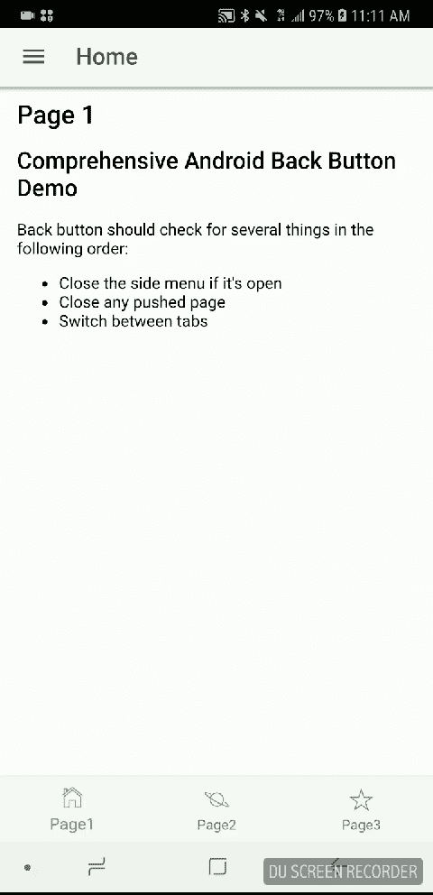

# 在 Ionic 中处理 Android 后退按钮

> 原文：<https://medium.com/hackernoon/handling-android-back-button-in-ionic-33f7cfbba4b9>

**总结**:这是一个在 Ionic 2 和 Ionic 3 中处理 Android 后退键的综合方法。后退按钮的行为会像 Instagram 一样:它会关闭侧边菜单或任何推送的页面，还会在最近使用的标签页之间循环。

**注意**:如果你是高级用户，只想看看结果，可以从[我的 github](https://github.com/ourarash/ionic3-android-back-button) 克隆演示项目。



Handling Android Back Button in Ionic

## 介绍

处理 Android 后退按钮的问题已经在几个地方解决了，比如这里的。但是我没有发现任何一个是全面完整的。我需要一种方法来完成以下任务:

*   关闭打开的侧菜单
*   关闭可能已经在任何选项卡页面的导航控制器上推送的任何页面
*   如果菜单是关闭的，并且没有推送的页面，它应该把用户带回前一个最近使用的标签。
*   如果没有以前最近使用的标签，一个警告框会询问用户是否要退出。

在本文中，我将快速解释如何执行上述操作。

## 计划概要

我们将执行以下操作:

*   我们创建了一个名为 **backbuttonService** 的新服务，这样每个标签页都可以将其 navCtrl 注册到这个服务的堆栈中。堆栈将用于环绕最近使用的选项卡
*   我们将创建一个函数来挂钩到 **app.component.ts** 文件中的后退按钮。
*   在钩子函数中，我们在 **backbuttonService** 的堆栈中检查菜单、navCtrl 上的任何推送页面。
*   我们还编写了一个函数，以编程方式在选项卡之间切换。

## 入门指南

您可以通过在命令行中运行以下命令来创建一个新的 ionic 3 项目，接受默认选项并将 cd 放入 backbutton 文件夹:

```
ionic start backbutton sidemenu
```

## 创建新的选项卡页面

现在，向该项目添加三个选项卡页面:

```
ionic generate page page1 --no-module
ionic generate page page2 --no-module
ionic generate page page3 --no-module
```

您需要将这些页面添加到**app . module . ts。**将以下内容添加到文件的开头:

```
import { Page1Page } from '../pages/page1/page1';
import { Page2Page } from '../pages/page2/page2';
import { Page3Page } from '../pages/page3/page3';
```

另外，将它们添加到同一个文件中的声明和 entryComponents:

```
declarations: [
MyApp,
HomePage,
ListPage,
Page1Page,  // Add this line!
Page2Page,  // Add this line!  
Page3Page,  // Add this line!
],...entryComponents: [
MyApp,
HomePage,
ListPage,
Page1Page,  // Add this line!
Page2Page,  // Add this line!
Page3Page,  // Add this line!
],
```

**创建新服务:BackbuttonService**

在 src 下创建一个新文件夹和文件:

```
src/services/backbutton.service.ts
```

**注意**:你可以从[我的 github](https://github.com/ourarash/ionic3-android-back-button/blob/master/src/services/backbutton.service.ts) 获取，而不是在这里复制完整的文件。

这个文件有两个简单的函数，用于选项卡页面的推送和弹出，这样我们就可以跟踪最近使用的选项卡页面。

您还需要在 **app.module.ts** 中注册服务:

```
import { BackbuttonService } from "../services/backbutton.service";
...
 providers: [
StatusBar,
SplashScreen,
BackbuttonService, // Add this line!
]
```

**为选项卡创建一个全局变量:**

创建一个名为**的新文件。你可以把它放在任何地方。我选择放在 src/app 下。它包含以下内容:**

```
//Enum variable for tab 
export var EN_TAB_PAGES = {
EN_TP_HOME: 0,
EN_TP_PLANET:1,
EN_TP_STAR: 2,
EN_TP_LENGTH: 3,
}//A global variable 
export var Globals = {//Nav ctrl of each tab page
navCtrls : new Array(EN_TAB_PAGES.EN_TP_LENGTH),tabIndex:0, //Index of the current tab
tabs: <any>{}, //Hook to the tab object
}
```

## 向 app.component.ts 添加钩子函数

我们向该文件添加了三个函数:

*   **registerBackButton** :挂钩 Cordova 处理 Android 返回按钮的功能。它首先检查侧菜单是否打开，如果打开，则关闭菜单。
*   **showAlert** :显示一个警告，询问用户是否确定要退出
*   **switchTab** :以编程方式在标签之间切换

由于改动比较长，我就不在这里复制了，不过你可以在 [my github](https://github.com/ourarash/ionic3-android-back-button/blob/master/src/app/app.component.ts) 上看到详细的改动。

## 将每个标签页推入堆栈

每当我们打开一个新的标签页，我们应该把它推到堆栈中。如果它已经存在于堆栈中，我们删除它并再次添加它。这将产生 Instagram 效果，我们在最近使用的标签周围打圈，但我们不会浏览同一个标签两次。为此，我们在每个标签页中注入 **backbuttonService** 并使用它。

在每个选项卡页面中添加以下内容:

```
import { BackbuttonService } from '../../services/backbutton.service';
import { EN_TAB_PAGES } from "../../app/app.config";...//Inject the service
constructor(public navCtrl: NavController, 
public navParams: NavParams,
private backbuttonService: BackbuttonService,) {}...ionViewWillEnter() {
   this.backbuttonService.pushPage(EN_TAB_PAGES.EN_TP_HOME,  
   this.navCtrl);
}
```

在上面的代码中，请注意，对于每个选项卡页面，您应该使用它自己的 EN_TAB_PAGES 值。

就是这样！如果你喜欢这个教程，请分享并鼓掌。我真的很感激！

另外，对于正确处理 Android 后退按钮的生产级 Ionic 应用程序，请检查我的以下应用程序:

*   比特币疯狂:[http://bitcoincrazyness.com](http://bitcoincrazyness.com)
*   plus one Social:[http://okPlusOne.com](http://okPlusOne.com)