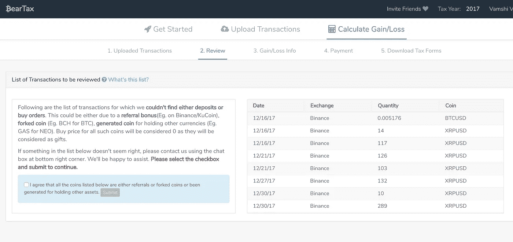

# 我们就是这样做的！BearTax 中的币安转介

> 原文：<https://medium.com/hackernoon/handling-binance-referrals-for-tax-purposes-on-beartax-4fb29fdb96da>

## 加密货币的早期交易者通过将人们推荐到交易平台获得了巨大的收益。追踪这些推荐奖金是困难的！以下是 [BearTax](https://bear.tax) 如何处理这些交易，而不会让你陷入负结余。

如果你正在使用币安和一个有很多推荐的在线影响者/博主，你很可能会在你的余额部分看到各种硬币的微小部分。这些硬币是你的推荐奖金——你推荐的用户支付的交易费的一部分。它们都是会议纪要，不在任何地方记录(除了您推荐仪表板)。

一旦你的推荐奖金达到一个相当大的数目，你要么用它们购买其他硬币，要么把它们从你的钱包里取出来，送到 HODL。

对于纳税季节，您需要合并所有交易。总的来说，其他平台无法匹配这种卖出或提取，最终会显示负余额，即“你的卖出多于你的买入”，然后洗手不干。

 [## BearTax -您的加密税务助理

### 轻松管理您的推荐、存款、取款和交易，以满足税务需求！使用 bear.tax 计算澳大利亚、美国、加拿大、欧洲和更多国家的加密货币资本收益。](https://bear.tax) 

[*BearTax*](https://bear.tax) 帮助您自动识别所有此类交易，并取得您的同意，为所有推荐奖金分配适当的来源。推荐奖金被视为礼品存款，成本基准为 0 美元。

# 这些是怎么处理的？

一条信息显示在您的“查看”屏幕上，如下所示:

> 以下是我们**找不到存款或购买订单**的交易列表。这可能是由于**推荐奖金**(如币安/库币)**分叉硬币**(如 BTC 的 BCH)**持有其他货币产生的硬币**(如 NEO 的天然气)。所有这些硬币的购买价格将被视为 0，因为它们将被视为礼物。
> 
> 如果下面列表中的某些东西看起来不对劲，请使用右下角的聊天框联系我们。我们很乐意帮忙。**请选择复选框并提交以继续。**

一旦您同意更改(通过选中复选框)并提交， [BearTax](https://bear.tax) 将自动创建适当的存款交易以匹配您的销售/提款，这确实会使一切变得干净并正确计算损益。