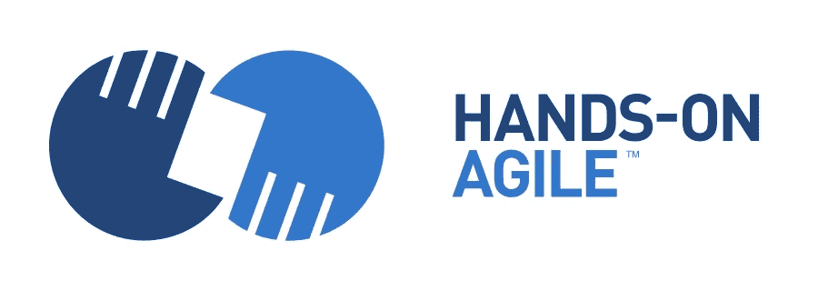

# 实践敏捷网络研讨会#2:敏捷成熟度和敏捷评估

> 原文：<https://medium.com/hackernoon/hands-on-agile-webinar-2-agile-maturity-and-agility-assessment-673ef9dab904>

# TL；DR:在线研讨会敏捷成熟度和敏捷性评估

参加我们的第二次网络研讨会敏捷成熟度，了解更多关于投票结果的信息，什么是敏捷组织，敏捷成熟度是否是一种时尚，以及 2018 年 4 月 24 日“敏捷评估框架”开源项目的内容，网址是:

*   CEST 时间下午 06:00 到 07:00(中欧夏令时)
*   美国东部时间下午 12:00 到 01:00(东部夏令时)
*   太平洋时间上午 09:00 至 10:00(太平洋夏令时)

网上研讨会“敏捷成熟度”大约需要 45 分钟，具有教育性质。因此，将不会有电子书或在线课程的销售。请注意，注册参加网上研讨会并不保证您会参加。网上研讨会的座位数量限制为 100 个。Zoom 将根据先到先得的原则分配座位。

# 参加 2018 年 4 月 24 日的“敏捷成熟度网络研讨会”

参加 2018 年 4 月 24 日**星期二**下午 6 点【CEST 东部时间晚上 12 点或太平洋时间早上 9 点】**和[的网络研讨会*敏捷成熟度&敏捷评估*下载邀请函](https://age-of-product.com/webinar-agile-maturity/)！**

Hands-on Agile Webinar #2: Agile Maturity and Agility Assessment — April 24th, 2018

# 📅动手敏捷网络研讨会

**下载您的邀请**:

2018 年 5 月 8 日:[网络研讨会#3:产品积压反模式](https://age-of-product.com/webinar-product-backlog/)

**注意:**所有网络研讨会的播出时间为 CEST 时间下午 06:00 至 07:00。(即美国东部时间下午 12:00 到 1:00，或太平洋时间上午 9:00 到 10:00。)

# 网上研讨会敏捷成熟度相关文章

[如何衡量组织和团队的敏捷性——敏捷成熟度调查的结果](https://age-of-product.com/measure-agility/)

[敏捷审计:你的敏捷转型进展如何？](https://age-of-product.com/agile-audit/)

# 你还想这样多读书吗？

好吧，那么:

*   📰*加入 16261 位同行和* [*报名我的每周简讯*](https://age-of-product.com/subscribe/?ref=Food4ThoughtMedium)
*   🐦*关注我的* [*推特*](https://twitter.com/stefanw) *订阅我的博客* [*产品时代*](https://age-of-product.com)
*   💬*或者，免费加入* [*Slack 团队【动手敏捷】*](https://goo.gl/forms/XIsABn0fLn9O0hqg2) *的 3000 多名同行。*

[网络研讨会#2:敏捷成熟度和敏捷评估——2018 年 4 月 24 日](https://age-of-product.com/webinar-agile-maturity/)首次在 Age-of-Product.com 发布。