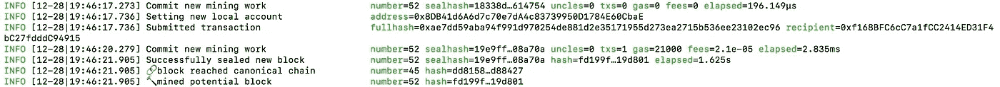

# 实践:创建自己的本地私有 Geth 节点(初学者友好)

> 原文：<https://medium.com/hackernoon/hands-on-creating-your-own-local-private-geth-node-beginner-friendly-3d45902cc612>


Source: [https://altcointoday.com/](https://altcointoday.com/ethereum-network-noted-major-growth-in-2017-analytics-firm-claims/)

如果你是区块链 T4 领域的新手，想要亲身体验这种开创性的有点神秘的技术 T5 T6，这份教程就是为你准备的。

这将是一个全面的循序渐进的教程，让你开始与以太坊区块链。所以，不要担心我会涵盖每一个步骤。


Source: [https://tenor.com/](https://tenor.com/view/thankgod-robertdowneyjr-facepalm-gif-4648661)

# 我们将建造什么？

一个使用 Geth 的本地试验网以太坊区块链。

*   *本地:*这个区块链将只在你的本地计算机上运行。
*   Testnet :这不会挖掘真正的乙醚。只有假的。它非常适合测试 dApps，或者只是玩玩。

# 先决条件

1.  马科斯
2.  家酿啤酒(下载链接:[https://brew.sh/](https://brew.sh/)
3.  XCode(从 AppStore 获取)

# 设置开发环境

## 步骤 0:使用自制软件下载 Geth

启动您的终端并输入以下命令。**确保你已经安装了 Homebrew，否则这个命令对你不起作用。**

```
$ brew tap ethereum/ethereum
```

此命令会将以太坊存储库克隆到 Mac 上的库文件夹中。

要安装 geth，请运行以下命令:

```
$ brew install ethereum
```

维奥拉，盖斯已经安装好了。

## 在继续之前，让我先弄清楚**什么是**

是在 Go 中实现的运行完整以太坊节点的命令行接口。你可以挖掘真实以太(如果你在 mainnet 上)，在地址之间转移资金，创建智能合同，进行交易，探索链条，使用 Web3 等。

要了解更多信息，请参阅以下资源:

[](https://github.com/ethereum/go-ethereum/wiki/geth) [## 以太坊/围棋以太坊

### 以太坊协议的官方 Go 实现-以太坊/Go-以太坊

github.com](https://github.com/ethereum/go-ethereum/wiki/geth) 

# 让我们开始狂欢吧，宝贝！

## 创世纪街区，特殊街区

每个区块链都有一个创世街区，那是第一街区。这个块的高度是 1。它不包含任何事务。所有后面的块都被附加到这个块上。

你可以在这里查看以太坊的 mainnet genesis block:[https://etherscan.io/block/0](https://etherscan.io/block/0)

对于我们的 testnet，我们必须创建 genesis 块。

用于创建创世块的工具:puppeth

# 步骤 1:创建创世纪块

创建您想要存储区块链数据的任何目录。

```
$ mkdir -p ethereum-tutorial && cd ethereum-tutorial
```

在这个目录下创建一个`private`文件夹，并将`cd`放入其中。

```
$ mkdir -p private && cd private
```

打开您的终端，写下以下命令:

```
$ puppeth
```


应该会出现类似这样的情况，您将被要求**指定一个网络名称来管理**。输入您的区块链的名称。我用的是 *niharikatestnet。你可以使用任何名字。*


会问一系列的问题。继续回答。


最后，使用 control + c 退出 puppeth 接口。

如果你现在阅读私人文件夹中的内容，你会看到多个文件。


我们会对`niharikatestnet.json`感兴趣

# 步骤 2:初始化创世模块

是时候为当地的区块链创造`chaindata`和`keystore`了。`chaindata`将存储与区块链相关的所有数据，`keystore`将存储与区块链上的账户相关的私钥。

使用终端输入以下命令:

```
$ geth --datadir ~/ethereum-tutorial/private init niharikatestnet.json
```


**成功写出创世纪状态。** Woohoo！

您应该会看到`chaindata`和`keystore`文件夹。

# 步骤 3:创建帐户

我们需要在这个区块链上创建帐户来玩它。

```
$ geth --datadir . account new
```

对于您创建的每个帐户，您必须输入密码才能访问该帐户。输入您选择的密码。


您将获得该帐户的唯一地址。

让我们使用相同的过程再创建 2 个帐户。

因此，要查看我们创建的所有帐户:

```
$ geth --datadir . account list
```


# 第四步:写一个 Shell 脚本启动区块链

在任何文本编辑器中，在`private`文件夹中创建一个名为`startnode.sh`的文件。

```
geth --networkid 4224 --mine --minerthreads 1 --datadir "~/Desktop/Playground/ethereum-tutorial/private" --nodiscover --rpc --rpcport "8545" --port "30303" --rpccorsdomain "*" --nat "any" --rpcapi eth,web3,personal,net --unlock 0 --password ~/ethereum-tutorial/private/password.sec --ipcpath "~/Library/Ethereum/geth.ipc"
```

确保你把这些都写在一行里。

在`private`文件夹中创建另一个名为`password.sec`的文件。

输入您创建的第一个帐户的密码并保存。

要使该脚本可执行，请在您的终端中编写:

```
$ chmod +x startnode.sh
```

执行此脚本:

```
$ ./startnode.sh
```


**这将开始一个永无止境的输出。这是区块链。我们的区块链开始了。**

等待所有 Dag 生成。在中间你可以看到采矿正在进行。这将把假醚放入第一个帐户。


# 步骤 5:连接到运行 geth

让我们用这个 geth 节点连接起来。在“终端”的另一个标签上，运行命令。

```
$ geth attach
```


您将进入 Geth Javascript 控制台。在这里，您可以运行 JavaScript 代码。

这意味着您已经成功连接！耶！


Source: [https://tenor.com/](https://tenor.com/search/excited-girl-gifs)

# 步骤 6:查询区块链

让我们看看这个区块链上有哪些账户。

```
> eth.accounts
```


这将显示我们之前创建的 3 个帐户。

要获得帐户余额，请执行以下操作:

```
> eth.getBalance(eth.accounts[0])
```


这在魏身上就显出了平衡。要将其转化为乙醚，请执行以下操作:

```
> web3.fromWei(eth.getBalance(eth.accounts[0]), "ether")
```


## 信息:停止采矿或开始采矿

如果您希望停止挖掘过程:

```
$ miner.stop()
```

如果您希望开始挖掘过程:

```
$ miner.start()
```

# 第七步:进行交易

让我们把一些乙醚从一个账户转到另一个账户。

我们将把以太坊从 coinbase 账户(开采以太的账户)发送到其他两个账户中的任何一个。

```
> eth.sendTransaction({from: eth.coinbase, to: eth.accounts[1], value: web3.toWei(10, "ether")})
```

这将返回事务哈希。


现在我们来看看第二个账户的余额。

```
> web3.fromWei(eth.getBalance(eth.accounts[1]), "ether")
```


现在，如果您切换回区块链运行的选项卡，您将看到一个事务。



因为 JavaScript 是在 Geth 控制台上执行的，所以您甚至可以在其上部署智能合约。

本教程到此结束。:)

希望你有一次顺利的经历。