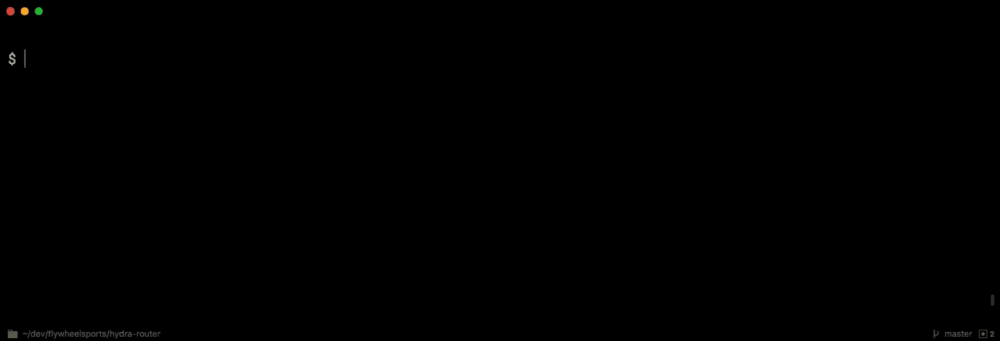

# 方便的码头工人别名

> 原文：<https://medium.com/hackernoon/handy-docker-aliases-4bd85089a3b8>

## 使用别名优化您的 docker 命令行工作流

如果你曾经在命令行中使用过 [Docker](https://hackernoon.com/tagged/docker) ，你无疑已经编写过命令快捷方式，或者至少考虑过这样做。

在这篇文章中，我假设你对使用 docker 命令比较熟悉，并且可能对潜在有用的[别名](https://hackernoon.com/tagged/aliases)有点兴趣。如果你是 Docker 的新手，那么这可能不是一个好的起点。

这篇文章是关于更长的非缩写命令的省时快捷方式或别名。因为让我们面对现实吧:

“没人有时间打出整个该死的命令！”

快捷方式可以通过多种方式实现。这里我们要考虑的两个是 bash shell 别名和 shell 脚本文件。我要分享的任何快捷方式都可以放在脚本文件或别名文件中。每种方法都有其优点和缺点。

这里有一个放在 shell 脚本中的便捷的`dkps` (docker ps)快捷方式。如果您选择这种方法，那么您将得到一个脚本集合，您需要将它复制到一个全局可访问的路径，比如`/usr/shared/bin`，使用 path 或类似的东西。您可能还需要系统特权来获得正确的结果。

dkps shell script

另一种方法是将别名命令放在您的主目录下的`.bash_profile`文件中。这使得快捷方式无需特殊许可即可移植。

.bash_aliases script

> 如果你是 bash 别名的新手，可以看看这篇[介绍](/@werbelow/intro-to-bash-aliases-116c4c60afd1)。

为了保持整洁，我将导入我的 docker 相关别名，而不是直接将它们添加到我的`.bash_profile`或`.bash_aliases`脚本中。在我的。bash_profile 脚本我将简单地添加以下代码来加载我的新`.docker_aliases`文件。

在我实际的`.bash_profile`脚本中，我加载了其他别名，比如一个`.git_aliases`脚本。

> 因此，您不必输入所有这些内容，本文末尾提供了一个示例文件`.docker_aliases`。

这种方法也很容易移植，因为你可以与朋友和家人分享你的 docker 别名。

在介绍我自己的方便的 docker 别名之前，让我们创建一个样本容器集，我们可以用它来测试别名。我们将使用 [Docker 栈命令](https://docs.docker.com/engine/reference/commandline/stack/)和两个著名的服务 Redis 和 MongoDB 来实现。如果你不熟悉它们，不要担心，我们实际上不会用到它们——把它们想象成现实世界中的占位符。

启动我们的测试堆栈只需要做一个`docker stack deploy`并传递上面的 compose 脚本。我们用堆栈的名称来结束命令，我们称之为“test”。

一旦堆栈加载，我们可以使用`docker ps`命令来验证它:

> 注意:为了简洁起见，我将缩写一些命令的输出。这有一个额外的好处，即创建较小的图像。所以请记住，上面 docker ps 命令的输出比显示的要长得多。

我们可以使用`docker stack rm`命令拆除堆栈。

[易皮斯](https://www.urbandictionary.com/define.php?term=Easy%20Peasy)、**、**对吗？

在这篇文章的剩余部分，我将使用上面的设置来显示截图。

现在谈谈我们的化名…这最好是好的，对吗？

我们要看的第一个别名只是提供了常用 docker 命令的缩写。

马上考虑一下，对于像`docker ps`这样的命令，每次用`dk`替换`docker`，或者使用`dks`处理像`docker service ls`这样的 docker 服务命令，可以节省多少时间。打字的节省`dks ls`加起来！

因此，你不用键入 docker: `docker logs`而是键入:`dkl`

`docker logs b7a8`变为`dkl b7a8`

使用`dklf`跟踪日志。所以你可以简单地使用`dklf b7a8`而不是`docker logs -f b7a8`

另一个方便的日志别名是`dkln` (docker log by name)命令。

它评估反勾号(`)内的管道命令，并将结果用作`docker logs`命令的参数。`grep`命令使用第一个参数过滤`docker ps`命令的结果。最后，`awk`命令将输出的第一个字段作为值参数。

好吧，这可能会让人困惑。让我们仔细看看。

`docker ps`命令返回正在运行的容器列表。

Abbreviated docker ps output

并且`docker ps | grep redis`返回:

Abbreviated output

最后，`docker ps | grep redis | awk '{print $1}'`返回 Redis 的容器 ID:f 5f 0ed 387073

这允许我们按名称查看任何容器的日志。

Abbreviated docker ps output

当然，您需要确保没有多个容器匹配一个名称。如果是这样，那么只需借助带有容器 ID 的`dkl`命令。

上例中的一个关键要点是，您可以通过组合 shell 命令来构建一些非常强大的别名。我们将在这篇文章的后面看到另一个例子，当我们看到一个构建和发布容器的别名时。

查看正在运行的容器的状态是构建和测试容器化服务的重要部分。以下别名使我们更容易做到这一点。

在这篇文章的前面，我们看了一下`dkps` (Docker PS)命令。

.bash_aliases script

下面是正在运行的命令:

Abbreviated docker ps output

另一个有用的别名是`dkstats` (docker stats)命令:

此命令测试是否提供了参数，如果提供了，则应用 grep 过滤器。

Abbreviated docker ps output

这使我们可以查看所有容器的统计信息，或者按特定的容器名称进行过滤。

`dktop`命令呈现类似顶部的显示，显示内存、CPU、网络 I/O 和块 I/O。

实际的别名非常简单:

你可以自由地用你想看到的值来定制它。我选择了一个基本设置，以使显示能够整齐地适应多窗格 iTerm2 屏幕。

在建造集装箱的过程中，有时有必要进入集装箱四处看看。这样做通常涉及:

*   docker ps 查看集装箱 id 列表
*   docker exec-it { container id }/bin/sh

使用我们的别名，这就变成了:

*   dkps
*   dke {容器 ID}

这里有一个视频例子:

有时需要重启服务。`dksb` (docker 服务反弹)命令允许我们这样做。

非别名方法需要使用`docker service scale`命令:

$ docker 服务规模 test_redis=0
$ docker 服务规模 test_redis=1

使用`dksb`，我们只需输入:

$ dksb test_redis 1

我们最后要看的是构建和发布 docker 容器的实例。虽然这个过程通常包括两个阶段的操作，即 docker 构建/ docker 推送，但是您可能希望执行其他任务来进一步自动化这个过程。在我的例子中，我构建了托管 NodeJS 微服务的 docker 容器。我的本地构建包括检查. dockerignore 文件是否存在，然后查看节点 package.json 文件内部以提取项目的名称和版本。然后，名称和版本用于形成 docker 标签。

下面是一个`dkp` (docker publish)别名的样子:

上面的别名使用 [jq](https://stedolan.github.io/jq/) (一个命令行 JSON 处理器)从 package.json 文件中提取版本信息。

使用`dkp`只是简单地输入一个节点项目目录，键入`dkp`,后跟 docker hub 存储库名称。在下面的例子中，我构建并发布了 [HydraRouter](https://github.com/flywheelsports/hydra-router) docker 容器。

我希望你在这篇文章中找到了一些方便的 docker 别名，或者至少它启发了你使用别名来优化你的命令行工作流。因为记住— *没有人有时间* …

这里是完整的`.docker_aliases`脚本，包括一些我们在这篇文章中没有提到的额外命令。

—

*感谢阅读！如果你喜欢你所读的，按住下面的拍手按钮，让其他人也能看到。也可以* [*在 Twitter 上关注我*](https://twitter.com/cjus) *。*