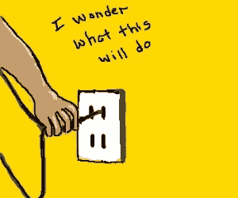
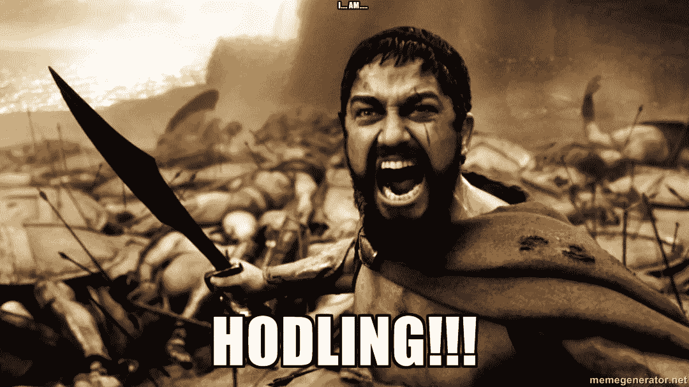
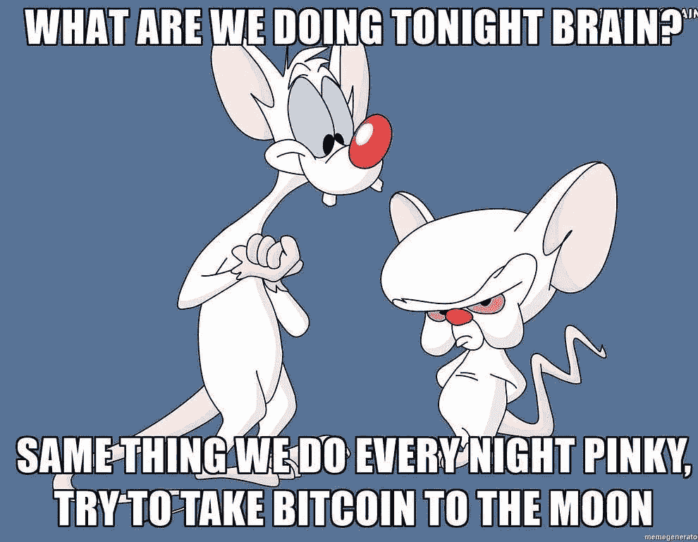
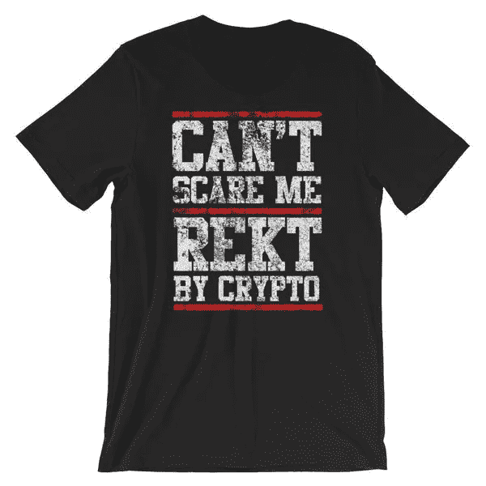
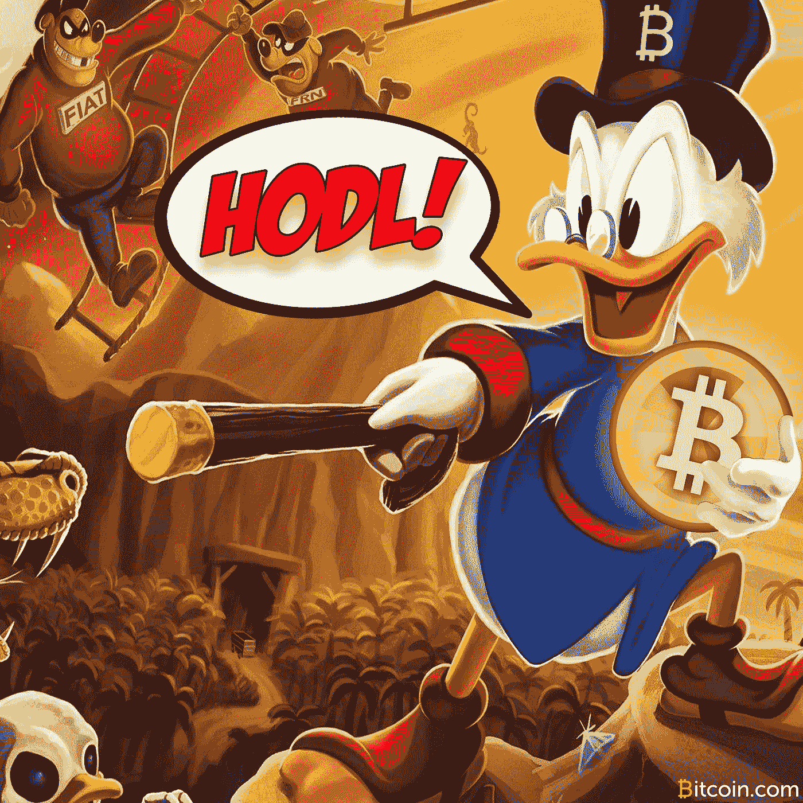

# 一本有趣的(&教育)密码和区块链术语词典

> 原文：<https://medium.com/hackernoon/happy-birthday-hodl-62a44c8faae5>

**从前** …准确的说是 2013 年 12 月 18 日，***gamekyubi 的*** 女友在一家女同酒吧。为什么？好吧，嗯，问他。

无论如何，像许多其他书呆子一样，在寒冷的夜晚，他独自一人坐在电脑前，为自己感到难过。我们心爱的比特币正在贬值。当 GameKyuubi 的女人“和女孩们一起闲逛”的时候，(我不会告诉他她真正在做什么)他发现自己在喝威士忌和网上聊天。#有罪

GF at a lesbian bar? I’ll let Kermit take this one. (www.redbubble.com)

他感到不太自信，于是登录 Bitcointalk.org，发布了一些相当有趣的内容，这些内容直到今天还在继续逗我们开心，或者让我们恼火。他的帖子标题是 ***“我是霍德林*** ”。他承认打错了标题，但在多次尝试纠正错误后，在一种陶醉和情绪化的状态下，他放弃了正确拼写“hold ”,继续完成他的帖子。

显然，没过多久，比特币爱好者们就开始在他的帖子上发表评论、大笑和创意。早期的 BTC 矿工和商人加入到支持 GameK 醉醺醺的建议中，并评论说他们也将和他一起去“T10”HODL。就在那时，发明了第一个密码俚语。

为了庆祝“ **HODLING** ”诞生 5 周年，我想分解一下其他加密货币俚语和术语的含义。别担心，我还会为加密货币和区块链世界中使用的交易和技术术语提供可靠的参考指南。这里什么都没有？

# **俚语“术语:**有些爱，我不是粉丝#讨厌者

寿星和先锋可以先走。

*   **HODL/霍德林**:持有/持有

例子:“我到死都在哭！”

*   **ATH** :“空前高涨”

例子:“去年《生活大爆炸》播出后，BTC 看到了 ATH。"

*   **Bagholder** :交易者在一种加密货币大幅贬值后持有该货币。

例子:“你拿着 Dogecoin 干嘛，你个包包！一文不值！”

*   看跌:预期价格将会下降

例如:“交易你的 NEO！我预测一个看跌的月份！”

*   看涨:预期价格将会上涨

例子:“我会大量投资 XRP，非常确定我们正在进入一个牛市”

*   BTFD:逢低买入！

例子；“我告诉你 BTFD 混蛋！你为什么不听！?"

*   热衷于将密码学作为社会变革手段的人。

例如:“雅各布·阿佩尔鲍姆是个巴派朋克！”

*   DYOR:自己做调查

例子:“如果你不 DYOR，你就是个白痴！！！!"

*   **翻转**:替代币的价值变化，不再主要基于比特币的价值

例子:“Eth 比 BCH 还低！那是轻率的，兄弟！”

*   **FOMO** :害怕错过

例子:“你们都在做什么，你知道，因为我患有严重的 FOMO，我需要知道。”

*   **FUD** :恐惧、不确定和怀疑(传播这种消极情绪的人被称为“老糊涂”)

例如:“与 FUD 相关的加密货币总体价格有所下降。”

*   蓝宝:兰博基尼的简称。

例子:“Alyze 说，”很少使用‘兰博’的人实际上是这种极其昂贵的车辆的所有者。"

*   **月**:价值大增。

例如:“什么时候月亮？”你会看到“文明月！?"通常，因为当你在赔钱的时候，拼写显然不重要。

*   **Nocoiner** :不拥有加密货币的人。

例子:“他凭什么认为自己可以给出理财建议？！Nocoiners 不能当真，这年头！”

*   **Noob** :对密码/游戏的侮辱或新人。

例子:“你不擅长交易，新手。”

*   **强迫症**:强迫症

例子:“我的家人今年没有邀请我去过感恩节，因为我有强迫症，他们厌倦了我。”

*   **泵&倾卸**:价格涨跌循环。

例如:“约翰·麦卡菲付给希尔的任何劣质硬币都是一个抽水和倾倒计划。”

*   **Rekt** :失事

例如:“我的投资组合是 rekt，就像一个 mofo！”

Source: SoulCotton.com

*   **【SAFU】:安稳如“傅**。**

例如:“今天投资加密，三年后，你将成为 SAFU！”

*   令人讨厌且不必要的广告

例子:“你为什么在我的电报频道上扔你的破硬币？蹩脚。”

*   **Sh** Coin** :没有内在价值的加密货币。

例句:“[**区块链**:一种数字账本，其中加密交易按时间顺序公开记录。](https://medium.com/u/d0e7ac35b894#opps)</li><li id=)

*   [**区块高度**:链上 genesis 区块(第一个开采的区块)之前的区块数。](https://medium.com/u/d0e7ac35b894#opps)</li><li id=)*   [**方块奖励**:为解决与方块相关的数学方程式而分配的报酬。(哈希+解决的问题=奖励)](https://medium.com/u/d0e7ac35b894#opps)</li><li id=)*   [**中央总账:**由单一网络、机构或个人控制的记录。(邪恶银行就是一个很好的例子)](https://medium.com/u/d0e7ac35b894#opps)</li><li id=)*   [**冷藏**:将加密货币“离线”移动的过程](https://medium.com/u/d0e7ac35b894#opps)</li><li id=)*   [**密码资产:**并非所有的密码都被用作货币手段，因此我们有这个术语。即 CryptoKitties，或不可替代的可收集代币。](https://medium.com/u/d0e7ac35b894#opps)</li><li id=)*   [**密码学**:编码和解码的科学或艺术。](https://medium.com/u/d0e7ac35b894#opps)</li><li id=)*   [**道**:去中心化的自治组织。一个组织，其中程序化的规则集取代了传统公司中最集中的部分。](https://medium.com/u/d0e7ac35b894#opps)</li><li id=)*   [DApp:一个分散的应用程序。通常存储在一个区块链上，托管在许多分布式服务器上。](https://medium.com/u/d0e7ac35b894#opps)</li><li id=)*   [**去中心化**:(通常是一个被行业营销人员过度使用的时髦词)不受一方控制的网络设计。移除第三方。(P2P)](https://medium.com/u/d0e7ac35b894#opps)</li><li id=)*   [**DEX** :去中心化交易所。](https://medium.com/u/d0e7ac35b894#opps)</li><li id=)*   [**分散**:存放在多个地点。](https://medium.com/u/d0e7ac35b894#opps)</li><li id=)*   [**分布式/共享分类账**:共享、可复制和同步数据的协议，分布在多个网络上。(P2P、去中心化、开源)](https://medium.com/u/d0e7ac35b894#opps)</li><li id=)*   [**DTL** :数字账本技术。像区块链这样的分布式分类账背后的技术类别。](https://medium.com/u/d0e7ac35b894#opps)</li><li id=)*   [锻造:在区块链港的加工过程，矿工没有集体奖励。伪造者保留交易费作为奖励。](https://medium.com/u/d0e7ac35b894#opps)</li><li id=)*   [分叉:当区块链永久分裂成两条独立的锁链时。](https://medium.com/u/d0e7ac35b894#opps)</li><li id=)

[在福克斯上，](https://medium.com/u/d0e7ac35b894#opps)</li><li id=)

[www.investopedia.com](https://medium.com/u/eb58c7ceaa96# 039；的领先来源的金融内容在网上，从市场新闻到…</h3>
<div class=)

# 生日快乐，HODL！

**原帖；**

*https://bitcointalk.org/index.php?topic=375643.0 这是 HODL 的原创迷因*

