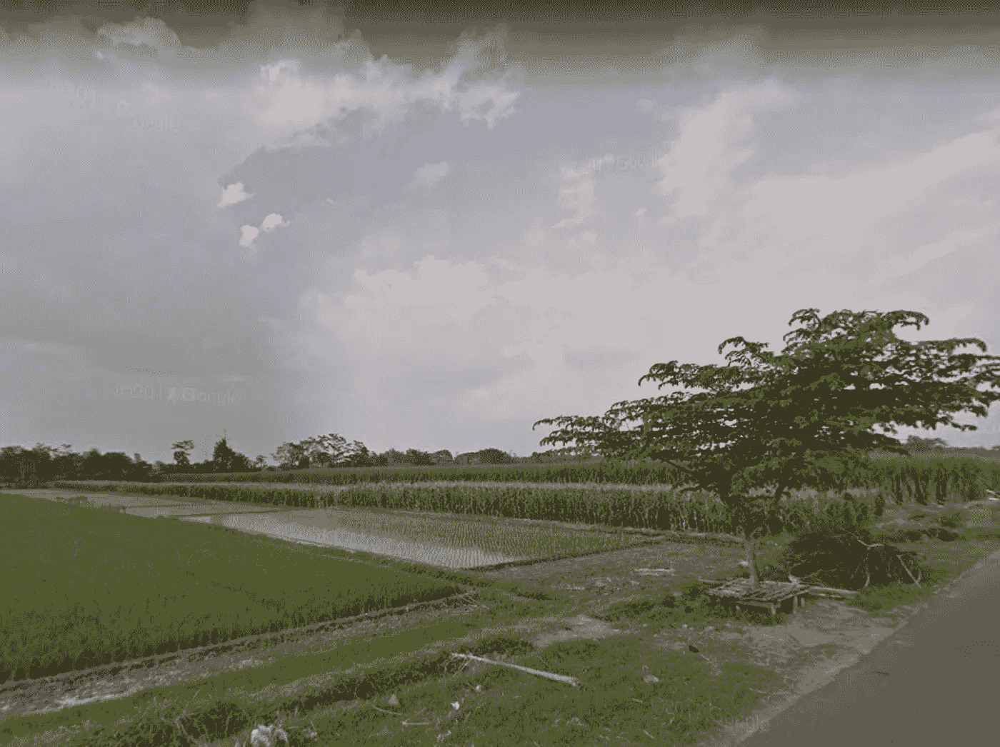

# 努力工作——我是如何成为一名软件工程师的

> 原文：<https://medium.com/hackernoon/hard-work-how-i-become-a-software-engineer-4bd6da9028fa>

My Hometown — Its still hard to have internet access here.

很多人问我如何才能成为现在的我。

“你怎么能这么容易就学会编程呢？”

“你怎么会这么擅长编程？”

“你怎么能理解这样的问题？”

“你为什么这么擅长这个和那个？'

诸如此类。

很多时候，我会说，“不断学习”。是的，这是事实。

# 我的软件工程之旅

我很幸运有一个支持我的家庭。我有一个哥哥，他让我摸他的电脑玩。那是 Windows 98 的美好时光。

我会玩屏保(还记得那个烟斗屏保吗？)，用颜料画画，或者玩游戏。

然后有一部关于黑客的很酷的电影。虽然我对黑客一无所知，但它看起来很酷。所以关掉电脑，我想象自己在黑。随意按下那个键盘。

然后我哥就装了 Windows XP。尽管我不明白 XP 和 98 的区别。我记得玩洛克人/超级大人物游戏。

后来我哥哥搬到了另一个城市学习设计。当他回家时，他带了一本书，是 Macromedia Flash 教程。

我当时 9 岁，作为一个孩子，看到这些华而不实的动画激起了我的兴趣。我学会了创造移动的球体，颤动(记得 Parampaa 吗？)，等等。

这对我来说是一个全新的世界，一切看起来都很酷，直到我遇到了 ActionScript。我不知道那是什么，为什么我要写它。我甚至不明白我写的剧本的意思。

然后我哥又带了一本书，是关于 3DS Max 的。我学习了 3D 建模和渲染。我试图从 3DS Max 渲染龙的例子。那是一台没有显卡的旧电脑，渲染它花了一个小时。却发现我不知道如何指定渲染的输出。

我父亲是音乐家，我哥哥也是。我学会了弹吉他、键盘和打鼓。那一天，我想象我会成为音乐家并出名。我从未想过，我会成为一名软件工程师。

我写了几首歌，和我初中的朋友组成了一个乐队。我们在当地的音乐会上表演，出名的感觉太棒了。

# 停顿

音乐家生活和学生生活，对我来说不是一个好的组合。我觉得我开始在学习上做得更差了。我在学习数学方面有困难，这是我初中的最后一年。

我不记得具体是如何，谁，什么，或者什么时候。但是我知道我必须去网吧，输入“虚拟基本”。

对，“虚拟”。感谢谷歌把我纠正到“Visual Basic”。我不记得怎么学的，但我觉得我必须学编程。尤其是当我的数学课有问题的时候。我知道编程可以帮助我更快地解决这个数学作业。

那一天，我暂停了作为音乐家和学生的生活。我会去学校，尽我所能学习。回到家，我会收拾行李，骑着自行车去最近的网吧。整个下午，我都在阅读编程教程。我记得是这个网站，[https://www.vbtutor.net/vbtutor.html.](https://www.vbtutor.net/vbtutor.html.)

我第一次学习编程的大部分时间都是为了开发数学作业的解决方案。这是一个简单的程序来解决代数，计算面积，体积等。

# 通往软件工程的艰难旅程

我没有很强的数学背景，对编程一窍不通。我哥哥是设计师，我父亲是音乐家。我家里没有人能给我提供编程的线索。

我住在一个与世隔绝的村庄。家里没网，网吧和我自行车 20 分钟路程。在这个问题上，我没有任何朋友能帮我。

我知道这很难，但我一刻也没有犹豫，我不能这样做。我知道我能，我祈祷我能，我希望我能。

从那天起。我会去网吧，下载一些教程网站的 html 页面，然后在家练习。在 35KBps — 75KBps 左右的网速下，我花了好几个小时下载 Visual Studio 等开发软件。

我会失败，会有我不理解的错误信息。家里没有网络意味着我必须独自修理它，或者等到明天在网上搜索它。

有时候，我能修好它，有时候我不得不等待明天。我花了这么多天看教程。我花了很多天练习。

但是没有什么比看到我的程序运行的感觉更好的了。每一个按钮的点击事件，每一个可见的提醒信息，都让我开心。

我遇到了面向对象的编程。令人困惑。我报名参加了一个编程夜校。却发现这个班教的是基础编程。比如 if 语句、for 语句等等。

很幸运，班上的讲师推荐我去职业高中。该校以有很好的软件工程课而闻名。所以我决定去那里。

我申请并被录取了。尽管学校已经在课堂上教了我软件工程的相关知识。我仍然不能停止按照自己的速度学习。所以我还是花了一下午看教程。整晚都在练习编程技巧。

我终于明白 OOP 是怎么回事了。我了解了框架是如何工作的，这样的库是如何工作的，我的部分代码是如何工作的。我尽可能避免使用框架和库。不是因为我讨厌他们，而是因为我害怕，如果我在一个没有互联网的环境，比如我的家乡。我能做什么？

这种恐惧逐渐消退，我搬到了一个网络连接更好的城市。我学会了如何使用某些框架来加速我的工作。

我不是天生的程序员，没有人是。没花 30 分钟看教程立马明白。我花了几年时间，学习和练习。它不是一夜之间发生的。

所以对于任何感觉自己做不到的程序员来说。你可以。学习过程是你将学到的最重要的经验。你的失败和你的成功一样重要。不断学习，不断练习。

它适用于任何事情，不仅仅是软件工程。你可以因为努力工作、学习和祈祷而变得伟大。有没有激情并不重要。没有努力的激情的人不会有多大作为。热情的人确实努力工作，他们只是面带微笑地工作。

我能成为现在的我，是因为我的努力。

或者，是吗？

如果我哥哥没有决定教我 Windows 98，我会成为一名软件工程师吗？

如果我的家人没有给我们买电脑，我会成为一名软件工程师吗？

如果我哥哥没有决定给我买 Macromedia Flash 和 3DS Max，我会成为一名软件工程师吗？

如果我的讲师没有推荐我去那所职业高中，我会成为一名软件工程师吗？

如果我的家人不支持我上职业高中，我会成为一名软件工程师吗？

如果我的一个同事没有给我介绍一个更好的公司，我会成为一名软件工程师吗？

如果我的兄弟、家人、朋友和伴侣不在这里支持我，我会是现在的我吗？

有时候，我想知道。努力工作我会做得很好。但是，如果没有我的家人、朋友和伴侣，我永远也做不好。我们认为理所当然的事情，但对我们的生活影响最大。

我能成为现在的我，是因为我的上帝、家人、朋友、伴侣，以及将会变得容易的努力工作。因为他们。

所以，谢谢你。敬你们所有人。