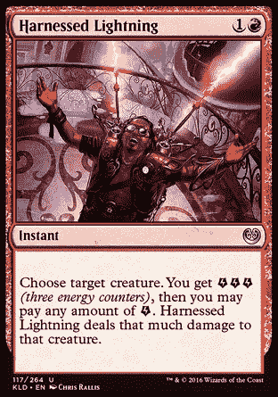

# 利用闪电进行即时比特币交易——教程

> 原文：<https://medium.com/hackernoon/harnessing-lightning-for-instant-bitcoin-transacting-a-tutorial-3b9dcdc00552>

## 快速文本+视频教程



Instawin when you play this card!

**更新:我收到了来自社区的一些非常感谢的反馈，以便在帖子中更突出地强调这一重要信息:**

在开始之前，请注意这个软件是实验性的，可能包含导致资金损失的错误。只使用你能承受损失的少量比特币。

比特币是一种分散的点对点支付网络，全球各地都在使用它进行无信任交易。该系统通过要求矿工将交易包含在以密码方式相互链接的块中，来实现无信任交易。然而，这意味着交易确认需要时间，并不是每个人都有时间。这种不便的答案是支付渠道，中本聪将其描述为实现渠道合作伙伴之间“高频交易”的一种方式，而不是等待大约 10 分钟的确认。 [Lightning 采用了这一理念，并大规模部署。](https://blockstream.com/2017/05/11/lightning-on-litecoin.html)除了只能向您的渠道合作伙伴付款，[您还可以立即向闪电网络上的任何人付款，闪电网络是一个支付渠道网络。](https://blockstream.com/2017/12/06/lightning-spec-electrifies-bitcoin-with-release-candidate.html)

近日， [Blockstream 发布了一个名为 Blockstream Store 的电商购物页面，该页面使用了他们新发布的 Wordpress 电商插件，该插件使用 Lightning Charge 构建。](https://blockstream.com/2018/01/16/lightning-charge.html)最令人兴奋的是，你只能在比特币的 mainnet 上用闪电网络支付*在 [Blockstream 商店](https://store.blockstream.com/)上购买东西。*这是一个关于如何使用`c-lightning`(block stream 的 Lightning 实现)设置自己的 Lightning 节点来购买物品或接收 Lightning 付款的教程。

## 必备条件:

*   Linux(本指南使用的是 Ubuntu 17.10)
*   比特币区块链的充足存储空间
*   初级到中级命令行知识
*   与 SegWit 完全同步的比特币节点
*   一些比特币

# 步骤 0:安装构建工具和依赖项

我们的第一步是通过`apt`安装所需的工具:

`sudo apt-get install -y autoconf automake build-essential git libtool libgmp-dev libsqlite3-dev python python3 net-tools tmux`

installing what we need to build lightningd

# 步骤 1:从比特币 PPA 安装 bitcoind

要么从源代码构建`bitcoind`，从[bitcoin.org](https://bitcoin.org/en/)下载并验证二进制文件(首选方法)，要么从比特币 PPA 安装:

`sudo apt-get install software-properties-common
sudo add-apt-repository ppa:bitcoin/bitcoin
sudo apt-get update
sudo apt-get install -y bitcoind`

installing bitcoind from the bitcoin ubuntu PPA

# 步骤 2:克隆 lightningd 存储库并构建:

现在获取`c-lightning`代码，然后构建它:

`mkdir builds && cd builds`

`git clone https://github.com/ElementsProject/lightning.git`

`cd lightning`

`make`

*使用* `*make -jn*` *加速编译。* `*n*` *为专用于构建的线程数。示例:* `*make -j10*` *针对 10 个或更多线程的处理器(如至强)。*

building lightningd

# 步骤 3:运行 bitcoind、lightningd 和 lightning-cli 来确认安装是否正确

启动`bitcoind`，然后`lightningd`，然后`lightning-cli`以确认一切安装正确:

*通过使用* `*tmux*` *使这个过程更干净，以保持一个终端中的一切整洁:*

`tmux`

*启动* `*bitcoind*` *，从日志中观察其启动，然后用* `*bitcoin-cli*` *:* 进行测试

`bitcoind`

`tail -f ~/.bitcoin/debug.log`

`bitcoin-cli -getinfo`

*同样，启动* `*lightningd*` *，用* `*lightning-cli*` *:* 测试

`./lightningd/lightningd --network bitcoin --log-level debug`

`./cli/lightning-cli help`

running bitcoind, then lightningd, then finally lightning-cli

# 步骤 4:连接到远程 lightning 对等机

在`lightningd`和`lightning-cli`成功建立后，连接到对等机并同步通道图。使用的对等体是块流的:

```
./cli/lightning-cli connect 02f6725f9c1c40333b67faea92fd211c183050f28df32cac3f9d69685fe9665432 104.198.32.198 9735
```

图形自动同步(`lightningd`日志输出) :

# 第 5 步:创建一个地址，以打开一个渠道:

开通闪电支付通道需要有资金支持的 UTXO。用`lightning-cli`生成一个比特币地址，向其发送一些比特币。

`./cli/lightning-cli newaddr`

向该地址发送一些比特币，*但要注意这是实验性软件。*

# 第六步:确认我们收到了 BTC

使用`lightning-cli`检查地址是否有资金:

`./cli/lightning-cli listfunds`

# 步骤 7:打开与我们之前连接的对等体的通道

要打开支付通道，找到节点的公钥或 id(在本例中是 Blockstream 的),然后使用`lightning-cli`开始打开通道:

*打印对等节点 id:*

`./cli/lightning-cli listpeers`

*复制 id 并用一些 satoshis 资助频道:*

```
./cli/lightning-cli fundchannel 02f6725f9c1c40333b67faea92fd211c183050f28df32cac3f9d69685fe9665432 amount_in_satoshis
```

# 步骤 8:监控资金交易确认的 lightningd 日志:

或者，使用`tmux`切换回`lightningd`窗口，观察您的融资交易是否被确认:

# 步骤 9:确认我们已经打开了一个渠道:

开通通道需要三次确认。一旦资金交易有三个确认，使用`lightning-cli`列出我们的新支付渠道。

`./cli/lightning-cli listchannels | grep your_nodes_pubkey`

# 恭喜你。您已经开通了您的第一个闪电网络支付通道！

您现在可以向他人开具发票以获得即时付款，也可以支付他人寄给您的发票！

`./cli/lightning-cli invoice amount_in_millisatoshis label description`

或者

`./cli/lightning-cli pay [bolt11_string](https://github.com/lightningnetwork/lightning-rfc/blob/master/11-payment-encoding.md)`

`c-lightning`的安装文档可以在[这里](https://github.com/ElementsProject/lightning)和[这里](https://github.com/ElementsProject/lightning/blob/master/doc/INSTALL.md)找到。

感谢阅读！

-格鲁布斯