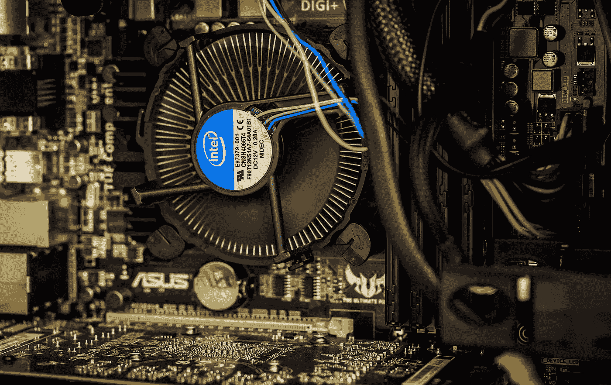

# 单核并行编程:SIMD 汇编性能提升和基准测试

> 原文：<https://medium.com/hackernoon/harnessing-the-power-of-simd-sse-assembly-instructions-for-good-fdaa8ce34e9a>



When things get this complicated, you know it’s usually Intel’s fault. Source: [Pixabay](https://pixabay.com/en/cooler-computer-fan-technology-pc-933691/)

SIMD 汇编指令允许你在一个内核中并行处理大量数据。我已经说过一次了，现在我要再说一次:编程是我们所拥有的最接近魔法的东西。

[Shell 命令](http://www.dataden.tech/programming/shell-first-steps-how-to-boost-your-productivity/)就像小的 cantrips，Python 脚本是没什么帮助的 Tulpas。我们甚至有自己的守护进程！但是，每当我们需要将性能压缩到最后一个字节时——当我们知道一个失误就会使程序大幅变慢……这时，最黑暗的黑魔法——汇编——就出现了。

我最近没有经常写信，你可能没有注意到(顺便说一句，如果这是你第一次读我，欢迎！很高兴见到你！).那是因为我上周有一个相当严厉的考试，我必须准备很多。这个主题叫做“计算机的组织 II”，要跟上它是一个巨大的挑战。
所以我决定把我练习时做的一个练习变成一篇文章。那样我可以一石二鸟(杀鸟不好，你应该难受)。

不再拖延，让我们直接切入正题。像往常一样，代码可以在这个 [Github 项目](https://github.com/StrikingLoo/average-char)中获得。

# 什么是处理器指令？

我们编写的所有代码，无论是 Python、Java 还是 C，最终都被解释或编译成微小的、原子的(从程序员的角度来看)CPU 指令。这些指令数以千计，每一个都做一件很小的事情，直接与硬件交互。

举例来说，一条指令可能会将一个值写入内存(这就是变量赋值的意思)，打开或关闭某个位，或者执行逻辑*和*。

我的电脑有一个英特尔处理器，这也是我们在课堂上学习的架构，所以对不起所有我的手臂使用读者，我今天不会足够包容。

编写这些指令的语言(1:1 翻译成文字二进制)称为汇编。

# 把 C 翻译成汇编:让我们暂时成为编译器。

在这篇文章中，我们将使用一个非常小的 C 函数。这是它的全部代码:

这个函数将一个指向字节流的指针(一个*字符*代表一个字节)、一个*字符*和一个*字符*作为参数。它将假设流以 0 结尾(如果不是这样，就会崩溃为分段错误)，并逐字节迭代，用 want 替换每个“have”实例。就 C 而言，这已经是最快的速度了——而且远远快于 Python(当我运行一些基准测试时，这个函数的 Python 版本花了两分钟，而在 C 中输入大小需要 6 秒)。

这个函数在汇编语言中是什么样子的，经过编译器？大概是这样的:

运行汇编函数而不是 C 版本不会提高我们的性能。它甚至可能降低它，因为编译器知道一些我们可能不知道的技巧，并对这种代码做了一些优化。

不过，有一种优化是它通常不会使用的，即使使用了，它也不会充分发挥它的潜力。

# SIMD 指令:单指令，多数据

每当我们想到并行，我们就会想到多核进程，甚至是集群。但是如果我们让一个单核同时做很多事情会怎么样呢？这是英特尔的人几十年前的想法，从那以后，图像处理的世界就不一样了。

你看，通常数据存储在通用寄存器中，就像我们刚刚使用的，在我们的 CPU 中。它们大部分是 64 位大小，因此可以存储一个 *long、*一个 *float、*或一个 *int。*嗯，从技术上来说是两个*int*，但仍然不足以让指令并行使用它们。

然而，大多数处理器有更大的可用寄存器: *XMMs* ，上面有 128 位。这足够 16 个完整字节了！


Let’s get this party started. source: [Pixabay](https://pixabay.com/en/cheers-beverage-drink-booze-839865/).

想象一下，如果我们可以一次处理 16 个字节，让我们的程序快 16 倍，我们会做些什么。从内存中读取一次并获取 16 个不同的字节？检查。成批处理它们，然后一次全部写入内存？检查。可能性是无限的。

特别是在图像或信号处理方面，这为加快普通的并行计算提供了可能。好像，快了整整一个数量级。你知道什么函数是普通的并发函数吗？处理相互之间没有依赖关系的字节流。

不过，这里有一个陷阱:如果常规的英特尔指令对你来说似乎违反直觉或者很难看，那就准备好接受 SIMD 指令吧。它们的名字叫 batpoop crazy，我们大多数人不查官方手册都写不出 5 个(谢天谢地[免费](https://software.intel.com/en-us/download/intel-64-and-ia-32-architectures-sdm-combined-volumes-2a-2b-2c-and-2d-instruction-set-reference-a-z))。

处理完所有这些注意事项后，让我来指导您完成我刚才展示的函数的 SIMD 实现。让我警告你:这并不漂亮，但也太快了。

# 第一个例子:用 SIMD 汇编指令得到一个字符串的长度。

首先，我迭代一次流来估计它的大小。为了简单起见，这个函数假设流的大小可以被 16 整除(结尾用零填充，至少有一个 0 字节表示流的结尾)，因为否则我只需添加一个新的 *if* 并运行 size 函数的非 SIMD 版本。
让我们假设我们的用户愿意在将他们的阵列传递给我们之前填充它们以使它们可分，以换取性能提升和节省治疗会话。

如果你们谁想呕吐，或者去洗澡，我会理解的。将这篇文章加入书签，一小时后回来。
但是，我们*是*每 16 个字节从内存中读取一次。这使得这个程序比 C 版本快 16 倍！

现在，对于第二部分，让我们实际上做我们被要求的:让我们替换一些字节！

就是这样。因为逐字节的布尔运算是并发的，比较也是并发的，所以我们实际上可以完全并行地处理每组 16 个字节。

声明:对于那些真正关心性能的人，请注意，我每次都进行两次内存读取来获取相同的数据:一次是计算长度，另一次是进行替换。

最好是一次完成所有的事情，但是代码会难看很多，也没有教育意义。这就是为什么我们应该期望这个程序只比 C 版本快 8 倍，而不是 16 倍。这仍然是一个非常好的改进。

# 使用 SIMD 有多快？基准！

为了运行这些基准测试，我只是在一个小程序中使用了 *time.h* C 库(可在 [Github 项目](https://github.com/StrikingLoo/average-char)中获得)。我所做的只是:

*   选择数组大小(16 的倍数)
*   用给定大小的交替值初始化字节数组
*   运行该函数的 C 版本，并测量完成该循环所需的时间。
*   对 SIMD 装配版进行同样的操作。

我用 1.6e7、1.6e8 和 1.6e9 的输入大小重复了这些步骤。我在这里停下来，因为下一个步骤会比我希望等待的时间长一些，但是趋势非常明显:

```
INPUT_SIZE | ASM  | C (Seconds)
  1.6e7  |  0.005 | 0.069 
  1.6e8  |  0.050 | 0.687 
  1.6e9  |  0.466 | 6.868
```

比我预想的还要线性！这个比率大约是 13，所以比我估计的还要好。我想这与减少内存读取有关，但请在评论中留下你自己的假设。

# 结论

我的第一个结论是，学习汇编很有趣。我的第二个结论是，我不可能通过考试。

出于实用性的考虑，我的第三个结论是编写 SIMD 程序是非常高效的，无论何时我们需要做一些更快的事情，我们都可以尝试使用它。

或者，如果你更喜欢高级语言，你可以寻找一个已经在实现中使用 SIMD 指令的框架(cough，NumPy，Pandas)。

无论如何，我认为了解底层的东西和我们处理器的内部工作方式可以帮助我们编写更好的代码，并更好地了解事情是如何在幕后工作的。

今天到此为止。我希望你觉得这篇文章有趣，甚至有用。如果您希望深入了解这个主题，我建议您考虑一个并行处理可能有用的问题，尝试使用 SIMD 编写它，然后每隔几个步骤查阅英特尔手册以了解新的指令。

像往常一样，如果你在我的代码中发现任何错误，或者我可以进一步优化的方法，甚至是一个打字错误，请在评论中告诉我！同样的道理也适用于任何积极的反馈，因为这总是值得赞赏的。

回头见，继续编码！

*关注我的* [*Twitter*](http://twitter.com/strikingloo) *或*[*Medium*](http://www.medium.com/@strikingloo)*继续接收更多文章和教程。请在你使用的任何社交媒体上分享这篇文章。
也许你有一个朋友最近想学习更多汇编语言？用这个打他！*

*原载于 2018 年 10 月 6 日*[*www . dataden . tech*](http://www.dataden.tech/programming/power-simd-assembly-instructions/)*。*