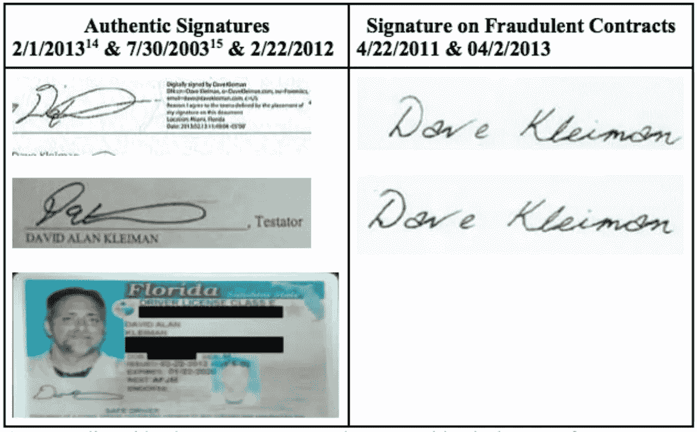

# 克雷格·赖特做了伪证吗？克雷曼案的新信息

> 原文：<https://medium.com/hackernoon/has-craig-wright-committed-perjury-new-information-in-the-kleiman-case-cbaaf2628e93>

代表艾拉·克雷曼(戴夫·克雷曼的兄弟)的律师事务所今天提交了一份最新诉状，内容涉及对克雷格·赖特的诉讼，后者曾自称是比特币未知创造者中本聪。

伪证指控是针对克雷格提交的驳回此案的动议提出的，他声称自己“与佛罗里达州或 W&K Info Defense Research LLC”没有任何联系，后者是克雷格和戴夫为开采比特币而成立的合资企业。

注意到“ **Craig 以宣誓声明支持这些说法，声明他从未是 W & K 的股东、成员、代理人、雇员或代表。他发誓，根据美国法律，他从未对 W & K 行使权力或控制，否则将受到伪证罪的处罚。”**

众所周知，克雷格此前“**向新南威尔士最高法院**提交了一份宣誓书，克雷格在宣誓书中确认:
W&K Info Defense LLC 的股权为:
**1。克雷格·s·赖特 50.0%
2。大卫·克雷曼 50.0%”**

以上，**明显与**他在申请撤销案件的动议中的宣誓声明相矛盾。

修正后的诉状称“ **Craig 在法庭上的粗体虚假陈述和伪证构成了他非法占有原告资产的重大欺诈行为的延续**。换句话说，克雷格在佛罗里达州法庭上的最新欺诈行为只是他在佛罗里达州诈骗戴夫·克雷曼的遗产和 W & K 的又一次行动

修正诉状中伪证罪指控的全部细节如下:

> **160。**在 Ira 的最初投诉中，就像在这份投诉中一样，他声称(i) Craig 和 Dave
> 在佛罗里达州一家名为 W & K 的有限责任公司中持有某种形式的利益,( ii)通过这家有限责任公司，他们挖掘了超过 110 万个比特币，并开发了极其有价值的知识产权，即(iii)在 Dave 去世后， Craig 非法占有了 Florida LLC 开采的所有比特币及其创造的知识产权(以及他们个人共同开采/开发的比特币和知识产权),( iv) Craig 随后试图通过欺骗澳大利亚法院进入同意令将 W & K 的知识产权转让给 Craig 来“清洗”这些被盗的知识产权； 克雷格需要归还被盗的财产。
> 
> **161。**作为对该投诉的回应，克雷格提交了一份驳回申请的动议，声称他与佛罗里达州或 W & K 没有任何关系。他的动议称原告的管辖权指控是“无意义的”和“应受制裁的”(ECF 第 12 卷第 36 页)。克雷格通过宣誓声明支持这些说法，声明他从未是 W & K .的股东、成员、代理人、雇员或代表。29 11–12).他发誓，根据美国法律，他从未对 W & K .行使过权力或控制。13).
> 
> **162。他做了伪证。**
> 
> **163。**为了获得其欺诈性的澳大利亚判决，Craig 向新南威尔士最高法院提交了一份宣誓书，其中 Craig 确认:
> i. Craig S. Wright 50.0%
> ii .大卫·克雷曼 50.0%”
> (例如。4 在 5)。
> 
> **164。** Craig 接着在这个所有权结构上加倍努力，进一步确认了
> “W&K Info Defense LLC 是一个有限合伙企业。所有股份共同持有。”(Id。).他随后证实，他在 2013 年 8 月 16 日召集了一次“股东大会”，只有他和杰米·威尔逊出席。(Id。).克雷格申明，他是提名杰米·威尔逊担任董事的唯一一票，“目的是同意订单和公司被关闭。”(Id。在 5 点 27 分
> 
> **165。这些宣誓证词与他在法庭上的宣誓证词直接矛盾，即(I)“我从来没有……。股东。。。在 W & K 中，“(ii)“我从未成为 W & K 的成员，”以及(iii)“我从未对 W & K 行使权力或控制。."(例如。29 11–13).**
> 
> **166。但是伪证并没有就此结束。**
> 
> **167。克雷格在他的澳大利亚宣誓书中附上了大量的记录。这些附件证明 Craig 作为 W & K 的“授权代表”签署了六(6)次(例如 4 在 56，63，70，76，83，90)，两次自称 W & K 的“首席研究员”(id。45–46 页)，其“技术联系人”六(6)次(id50，57，64，71，77，84)，将 W & K 的佛罗里达地址作为他的“邮寄地址”来关联他自己十二(12)次(id 第 49 页，第 56-57 页，第 63-64 页，第 70-71 页，第 76-77 页，第 83-84 页，第 90 页)，包括克雷格试图让 DHS 资助的计算机程序和研究的详细描述(同上。第 50-94 页)，包括四(4)封来自 DHS 的电子邮件，确认 Craig 代表 W & K 上传了各种提案，试图获得资金(Id 在 40–43 岁之间)。总的来说，这些文件清楚地证明了 Craig 参与经营佛罗里达州的 W & K 公司，从美国 DHS 招揽生意。**
> 
> **168。**显然，这些宣誓书附件与克雷格
> 向法庭宣誓的陈述直接冲突，即(I)“我从来没有……。W & K 的雇员或代表，“(ii)“我从来没有做过 W & K 的代理人，”(iii)“我从来没有。。。为与佛罗里达州业务相关的任何目的开发软件，包括 W & K，“(iv)“我从未在佛罗里达州宣传过服务，”(v)“我从未在佛罗里达州设立过办事处，”以及(vi)“我从未对 W & K 行使过权力或控制。."(例如。29 6, 8, 11- 13, 15).
> 
> **169。**如 120 中所述，Craig 还在澳大利亚提交了两份“清算索赔确认书”，并以 W & K 的“法定代理人和代表”及其“董事/澳大利亚代理人”的身份签字(例如。30).正如 138-139 所述，当他让他的代理人让他的公司 Coin-Exch 担任董事时，他也是 W & K 的“董事”。这些也和他上面的宣誓证词直接冲突。
> 
> **170。克雷格在法庭上粗体字的虚假陈述和伪证构成了他非法占有原告资产的大骗局的延续。换句话说，克雷格在佛罗里达州法庭上的最新欺诈行为只是他在佛罗里达州采取的又一次行动，以骗取戴夫的遗产和 W & K。**

附件 4 和 29 可在下面查看:

 [## 克雷曼诉讼-证据 4

### 证据 4 案例 9:18-cv-80176-BB 文件 24-4 记录在 FLSD 案卷号 05/14/2018 第 2 页，共 105 页案例 9:18-cv-80176-BB…

www.scribd.com](https://www.scribd.com/document/379265751/Kleiman-Lawsuit-Exhibit-4)  [## 克雷曼诉讼-附件 29 |诉讼|社会机构

### 附件 29 案例案例 9:18-cv-80176-BB 9:18-cv-80176-BB 文档文档 24-29 12-2 已输入 onFLSD FLSDDocket…

www.scribd.com](https://www.scribd.com/document/379265900/Kleiman-Lawsuit-Exhibit-29) 

修改后的投诉还包括与以下内容相关的大量更新:

1.  克雷格·赖特和戴夫·克雷曼早期涉足比特币
2.  克雷格·赖特和艾拉·克雷曼之间的通信

**关于戴夫·克雷曼早期涉足比特币:**

> **58。2009 年 11 月 26 日(感恩节)，艾拉·克雷曼和戴夫相约在他们父亲的家中共进晚餐。他和戴夫讨论了脸书最近的成功，艾拉问戴夫是否在研究什么有趣的东西。戴夫回应道，他告诉艾拉，他正在做比脸书“更大的事情”，他正在“创造自己的钱”**
> 
> **59。艾拉要求戴夫澄清，并开玩笑地问戴夫是否在制造假币。**
> 
> 60。戴夫回应说，他正在制造“数字货币”然后，他打开钱包，拿出一张名片，翻过来，画了一个“B ”,中间有一两条线穿过，然后评论“我们”是如何设计商标的。
> 
> 61。戴夫告诉艾拉，他正和一个相对富有的外国人一起工作，这个人
> 拥有一些房产。艾拉问戴夫为什么不与这个富有的人合伙。戴夫沉默不语，这是艾拉理解戴夫的让步，他们已经是合作伙伴。

**关于克雷格·赖特和克雷曼之间的通信:**

> **62。2014 年 5 月 20 日，Ira 通过电子邮件与 Craig 分享了这个故事。(例如。2).**
> 
> 63。Craig 在同一天回应说“我们是合作伙伴；)".(Id。).Craig 随后对"财产"进行了评论，除其他外，称他拥有 550 英亩土地。(Id。).然后他说，“我得看看我能挖到什么。我们做的旧比特币 logo 已经不用了。我有一本。”(Id。).克雷格后来向艾拉提供了这个比特币标志的副本。(Id。).
> 
> **64。**这份独立的证明表明戴夫在 2009 年与克雷格一起创造了“数字货币”,克雷格承认他和戴夫是这项事业的“合作伙伴”,是 Satoshi 团队的一部分，他们通过 W & K 挖掘比特币，所有这些都导致一个不可避免的结论，即他们在“创造”或“挖掘”比特币和知识产权方面的合作从 2009 年持续到戴夫在 2013 年去世。

该诉讼称，赖特和克雷曼在一家合资企业中开采了 55 万至 110 万比特币。据称，在戴夫·克雷曼去世后，赖特伪造并回溯了克雷曼去世后的文件，以签署放弃他的股份，并声称拥有他们的合资企业。

戴夫·克雷曼的遗产代理人维尔·弗里德曼和博伊斯·席勒·弗莱克斯纳的凯尔·罗奇正在寻求归还这些价值超过 100 亿美元的比特币。

该诉讼没有直接声称戴夫·克雷曼或克雷格·赖特是中本聪，但明确指出他们从 2009 年开始参与比特币交易。

您可以在此阅读完整的修订版投诉:

 [## 克雷曼诉讼-修正诉状|比特币|加密货币

### 美国佛罗里达州南区地方法院原告克雷格·赖特诉被告。天鹅绒(德文)…

www.scribd.com](https://www.scribd.com/document/379265957/Kleiman-Lawsuit-Amended-Complaint) 

我之前在我的播客《比特币做了什么》中采访了克雷格，以下是我的播客。虽然提到了，但没有详细讨论案情:
[https://www . whatbitcoindid . com/podcast/2018/04/20/wbd-013-interview-with-dr-Craig-s-Wright](https://www.whatbitcoindid.com/podcast/2018/04/20/wbd-013-interview-with-dr-craig-s-wright)