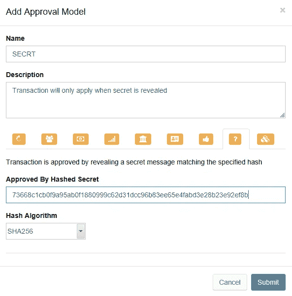
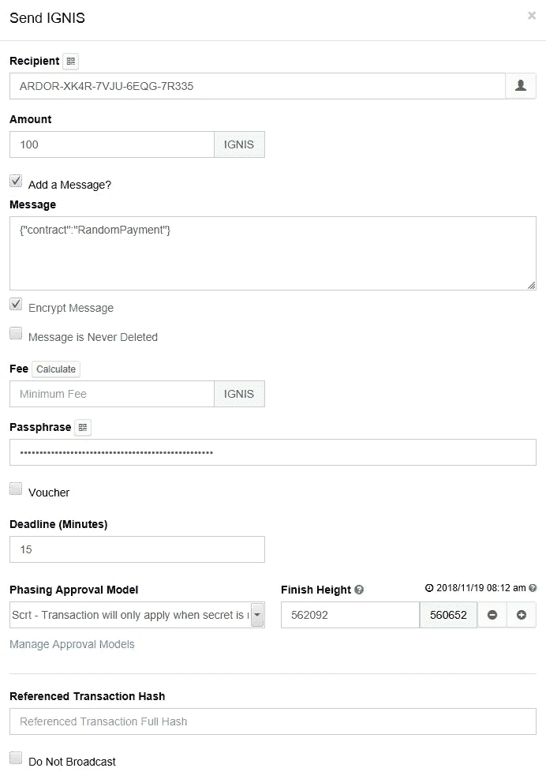
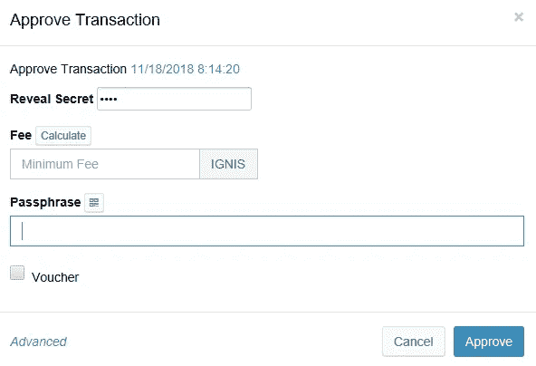

# 拯救散列秘密

> 原文：<https://medium.com/hackernoon/hashed-secrets-to-the-rescue-1ddc1daff83e>

## 防止热情合同锁定用户资金

Hashed Secrets — [Jared Rice](https://unsplash.com/photos/UwzalTDCpT4?utm_source=unsplash&utm_medium=referral&utm_content=creditCopyText) on [Unsplash](https://unsplash.com/search/photos/secret?utm_source=unsplash&utm_medium=referral&utm_content=creditCopyText)

**执行摘要**

轻量级合约在正确使用的情况下永远不会锁定用户资金。

**简介**

开始一个大型软件开发项目总是伴随着许多风险和不确定性。当我们在 2016 年开始制作[热情](https://hackernoon.com/tagged/ardor)时，风险是巨大的，但我们做到了。Ardor 于 2018 年 1 月在 mainnet 上推出，正如我们承诺的那样，它的第一个子链伊格尼丝实现了 NXT [区块链](https://hackernoon.com/tagged/blockchain)等的功能。从那以后，我们一直致力于为这款神奇的产品增加更多的功能和实用性。

一位智者曾经告诉我，当你需要交付一个大型软件项目时，不要花几个月时间做计划，直接开始就行了。你在一周内获得的相关知识和经验将比几个月的计划有用得多。所以我们在轻量级合同项目中这样做了。然而，我们不知道如何提前解决的一件事是，如果合同管理人未能(或不想)运行合同，如何防止合同锁定用户资金。正如我们之前讨论的，轻量级契约不是共识的一部分，只有选择这样做的契约运行器节点才会运行它们。但是，作为一个向合同发送资金的用户，我如何确定合同会执行并且不会锁定我的资金？现在，我们有了一个解决方案。

你看，大多数智能合同框架不需要担心锁定用户资金，因为合同运行是共识的一部分。如果一个节点在应该运行合同时没有运行，该节点将被留在分叉上。历史上的资金锁定事件是由于合同本身的缺陷，而不是执行框架的缺陷。一个显著的例子是以太坊 Paritytech multisig 契约，当开发人员忘记移除 [kill](https://github.com/paritytech/parity-ethereum/issues/6995) 方法时，它从独立状态变成了库。

但是这种要求每个节点执行每个契约的方法显然是不可伸缩的。所以人们想出了替代的想法，比如 [Plasma](https://plasma.io/plasma.pdf) 描述了一种将合同执行转移到子链的方法。如果这听起来很熟悉我们在热情中所做的事情，不要感到惊讶，英雄所见略同，但等离子设计师遇到了同样的问题，如果不是每个人都需要运行合同，你如何确保有人会运行它，而不只是锁定你的资金？plasma 白皮书提到了一个大规模退出的想法，以防有人在某个子链上恶意行为，每个人都可以从中逃脱。我们认为这是一个坏主意，因为它实现复杂，操作简单。相反，我们的方法是不同的:直到合同成功运行，我们才真正将资金发送到合同帐户。

**解决方案——通过散列秘密进行定相**

Ardor 的一个伟大之处在于，我们是在 NXT 丰富的功能之上构建它的。我们不像许多其他区块链解决方案那样从零开始。NXT 已经有了一个鲜为人知的特性，我们称之为“散列秘密定相”。其思想是将交易与由众所周知的散列函数生成的秘密散列一起提交。余额(或其他状态变化)仅在秘密被单独的批准交易披露后更新。如果秘密没有被特定的块高度泄露，则交易保留在区块链中，但是余额没有更新。该功能存在于 NXT 中，并从 2015 年开始在生产中运行。

现在，我们可以使用轻量级合同来利用这个小宝石。为合同提供资金的客户将指定一个只有他们知道的秘密的散列。基于该触发事务运行的契约将使用相同的“散列秘密”提交其自己的事务。一旦客户端揭示了秘密，两个事务将作为一个原子操作一起应用。如果客户决定不泄露秘密，这两笔交易都将保留在区块链中，但它们的余额变化将被忽略。因此，如果合同未能运行，客户不会泄露秘密，因此当达到阶段高度时，其资金将被释放。简单的局部解决方案，不需要大量退出等。

让我们看看这在实践中是如何工作的。客户端通过只有它自己知道的秘密的散列来定义批准模式。

Figure 1 — Define the Hashed Secret

现在，我们可以通过这个秘密散列触发一个契约并分阶段进行交易

Figure 2 — Hashed Secret Attached when Sending a Transaction to a Contract

契约使用相同的秘密散列来提交它自己的事务。它不知道秘密，它只回显由触发事务提供的秘密的相同散列。

客户端现在检查这两个交易，并通过透露散列秘密来批准它们。

Figure 3 — Approve Both Transactions by Revealing the Phased Secret

因此，两个交易余额更改都应用于同一个块，而没有锁定或操纵的风险。

**总结**

轻量级契约的一个预先设计挑战是锁定用户资金的风险。现在，通过使用合同执行框架中内置的原始 NXT“散列秘密定相”功能，这种风险得到了缓解。