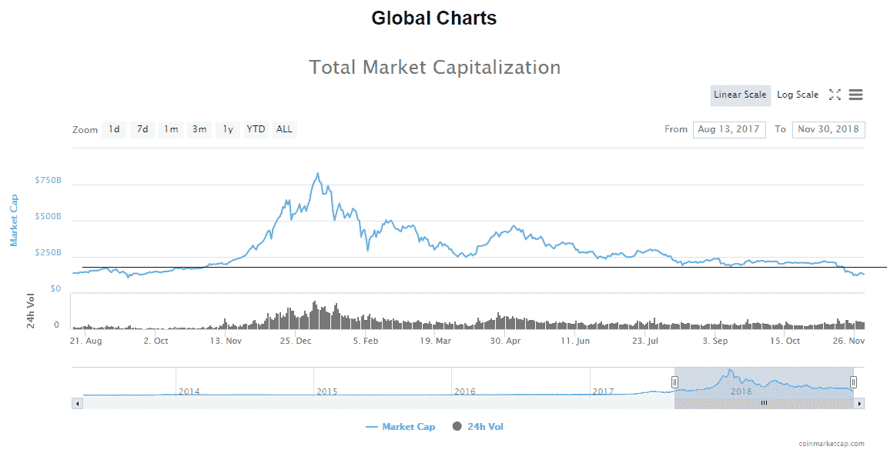
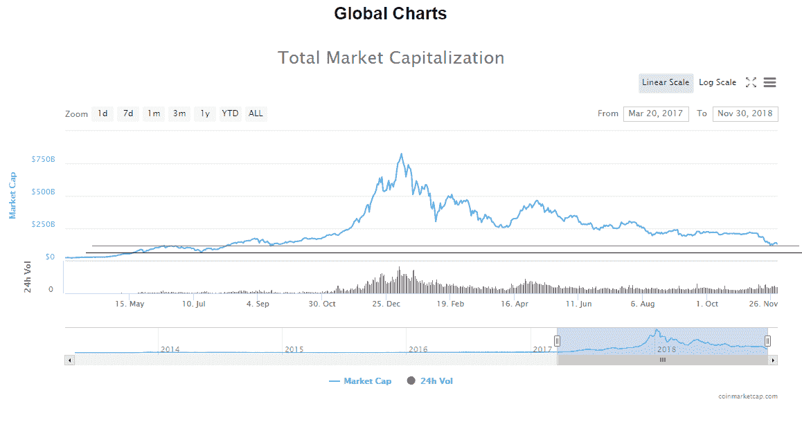
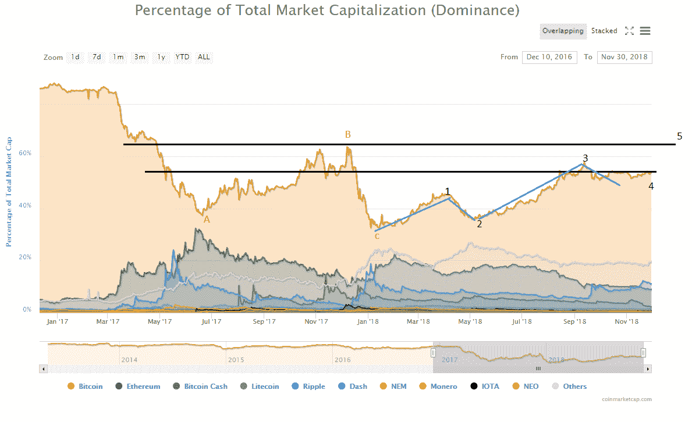
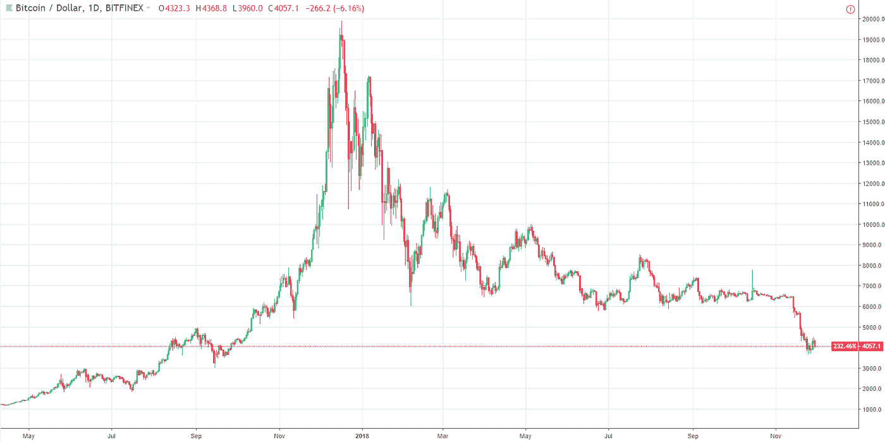
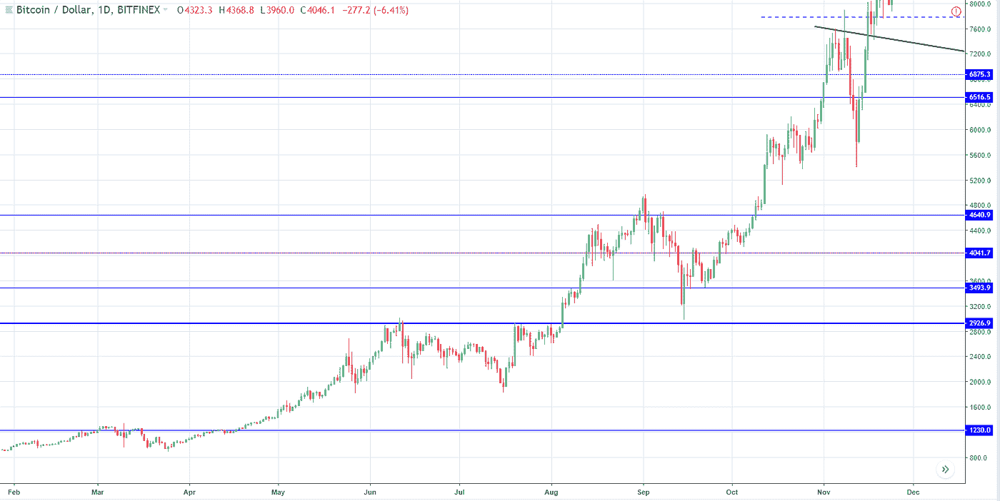
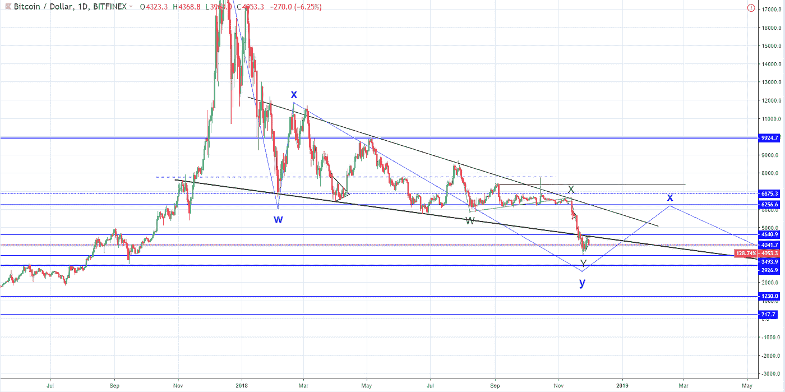
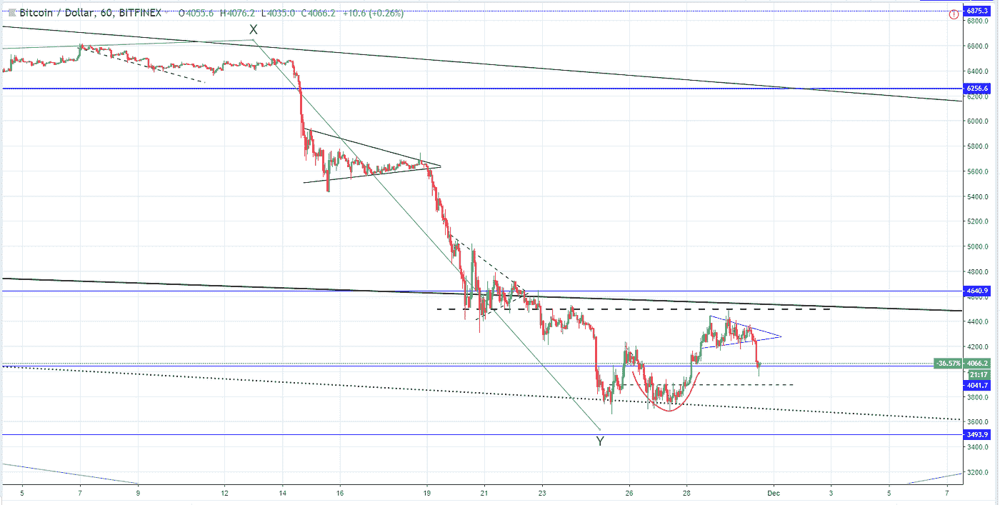
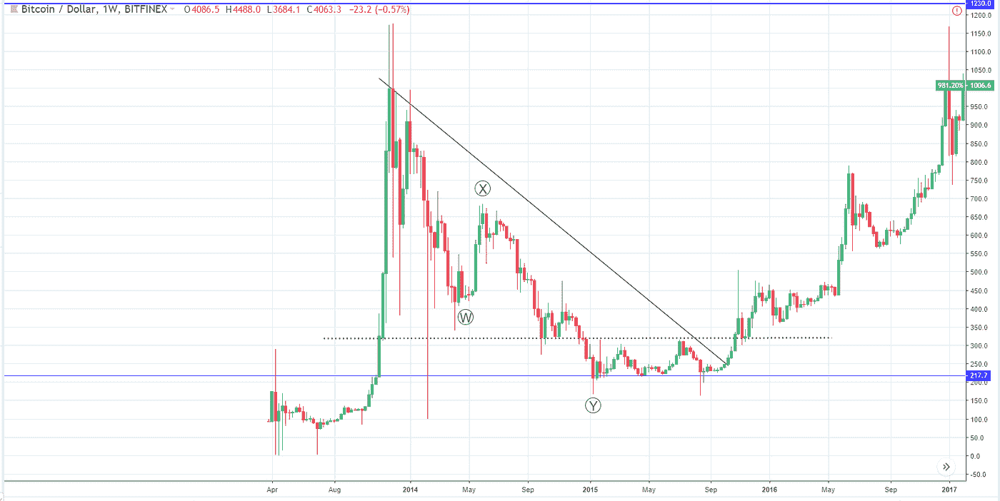
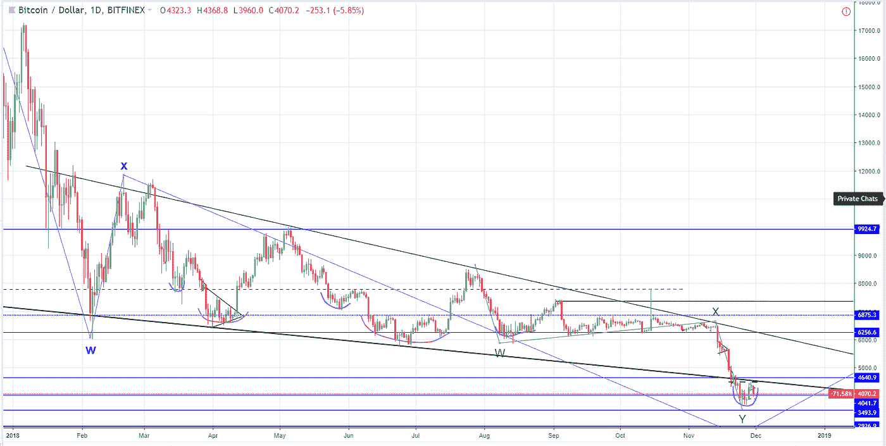

# 比特币价格是否已经触底，或者我们是否会在熊市结束前看到新的低点？

> 原文：<https://medium.com/hackernoon/have-the-bitcoin-prices-bottomed-out-or-are-we-going-to-see-new-lows-before-the-end-of-this-bear-f9e71101127e>

> 这项分析是代表 [PrimeXBT](https://primexbt.com) 完成的，它提供高达 100 倍的 BTC/美元杠杆交易和 5 个其他流行的加密对，所以如果你正在寻找底部并在即将到来的时期利用你的多头头寸，请查看[网站](https://primexbt.com)并注册一个账户。

# 概述

市值:109393681631 美元
24 小时成交量:17711506941 美元
BTC 优势:55.0%

由于市场评估从 1 月 7 日的历史高点 828，091，000，000 美元下降到目前的水平，并在最近达到年度低点 109，393，681，631 美元，相当于去年 9 月全球图表上的评估水平，问题是:价格已经触底，还是我们将在熊市结束前看到新的低点？

查看全球图表，您可以看到评估已经低于先前的区间阻力 114.5 亿美元，该阻力后来成为第二条支撑线，在 8 月 14 日低点首次互动之前从未互动。从最近的 9 月开始，评估在 11 月 13 日开始真正施加压力，最终导致第二天爆发。

目前，该评估位于去年 9 月重要水平的中间，上述 114.5 美元被视为阻力位。

下一个支撑水平在 700 亿美元左右，如果评估低于当前的支撑水平，我预计它将在下一个水平着陆。前提是市场还没有触底。

自今年年初以来，比特币的市场主导地位一直在上升，从 1 月 13 日的最低点 32.47%上升到 9 月 12 日的最高点 57.84%。

查看对比特币总市场主导地位百分比的评估，你可以看到该评估与全球图表上市值的评估呈负相关。这是因为在市场充满信心的时候，参与者会购买替代币，而在不确定的时候，他们会出售自己的替代币头寸，以便能够出售自己的比特币来换取现金或系绳，从而保护自己的资本。

正如你所看到的，目前的评估水平与去年 12 月的水平相当，而去年 12 月是历史最高水平，因此相关性显而易见。查看评估，我将三波移动标记为 ABC 修正，从其结束时的 32.47%左右，直到当前水平，作为 12345 波脉冲移动到上行，评估目前处于 4 阶段。

冲动性波动的 4 阶段是一个修正，通常以进一步上涨结束，因为第五波应该会开始发展，这就是为什么我认为在熊市结束之前市场主导地位会进一步上升，根据目前阻力水平的压力判断，我们可能会看到预期的上涨。

增加的目标是至少达到 63.7%，这是在矫正 B 波上的峰值。这将反过来意味着市值评估将进一步下降。

由于比特币超过当前市场估值的一半，通过检查其图表，我们可以得出结论，市场距离熊市结束还有多远，或者可以走多远，以及底部的迹象是什么。

# BTC/美元

从 19210 美元的历史高点到目前的 4057 美元，比特币的价格已经下跌了 78.84%。

看看日线图，你会发现比特币的价格处于去年 8 月至 9 月区间的一半。放大上述范围，我们可以看到价格正好位于水平支撑 4041 美元

这个区域没有显示出强有力的支撑，考虑到之前的下跌势头，我不认为它会成为支撑。我认为下一个足以阻止抛售势头的水平支撑位于 2926 美元，这是上述区间底部。

回到现在的日线图上，你可以看到我的艾略特波浪计数以及我对未来价格路径的预测。

我已经计算了整个修正中的波和子波，正如你所看到的，现在小 Y 波即将结束，其他更高程度的 Y 波也是如此。由于价格目前位于从其下侧开始的下降通道支撑线，它现在作为支撑，可能会拒绝该价格。

放大小时图，你可以看到这种情况今天已经发生了，因为价格开始围绕阻力位形成一个对称的三角形，并从下跌中突破。

现在，在经济真正复苏之前，价格可能会再创新低。

考虑到 Y 波应该很快结束的事实，我们可以说，它的结束可能会是熊市的结束，因为之前 2014 年的熊市以类似的模式结束。

正如你在 2014 年 5 月的周线图上看到的，修正结束时略高于之前的区间阻力，并在一个区间内触底。从高点到回调结束，加密货币的价格下跌了 82%。

这就是为什么我相信我们会看到比特币的价格会有所下降，因为还没有任何明显的底部迹象。

市场可以以两种方式见底——区间或激进的 V 型，或两者结合的杯形和手柄模式。价格现在已经形成了一个暂时的底部，就像前一段时间一样，我已经用紫色画笔勾勒出来了。

如你所见，事实上，价格每次都在下降，这就是为什么我会考虑底部的产品系列。不幸的是，底部很难预测，尤其是当市场反应过度的时候，但我很有信心，在熊市结束之前，我们会看到比特币低于目前的水平。