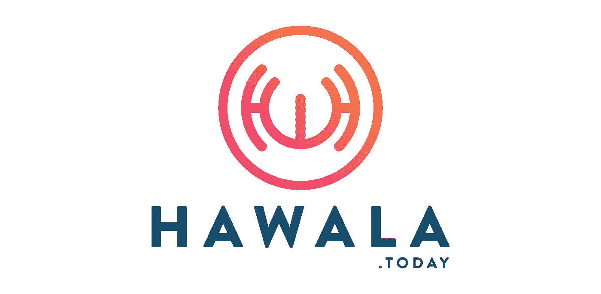

# 哈瓦拉。今天:一个 P2P 加密的菲亚特交换机

> 原文：<https://medium.com/hackernoon/hawala-today-a-p2p-crypto-fiat-exchange-fd25e9417cf1>

哈瓦拉。如今，P2P 是一个加密的法定货币交换平台，允许通过互联网连接在世界任何地方进行即时、安全的交换。

密码货币已经成为如此主流，以至于即使是那些没有交易知识或对金融没有任何兴趣的人现在也成功地将他们辛苦赚来的钱投资到了数字资产上，而且许多人做得非常好。

如今，比特币这个术语与道琼斯、纳斯达克和 FSTE 一样为公众所熟知，这些数字资产(如上述比特币(BTC)、litecin(LTC)和 Ether))的迅猛增长直接反映了许多投资者对密码货币运动的潜力和信心。

随着越来越多的密码货币进入市场，**哈瓦拉。今天的交换平台希望通过在一个单一的无缝应用程序中提供数字资产管理工具来进行竞争。**

# 关于哈瓦拉的 DYOR 信息。今天

**coin market cap URL:**[https://coinmarketcap.com/currencies/hawala-today/](https://coinmarketcap.com/currencies/hawala-today/)

**网页:**[https://www.hawala.today/](https://www.hawala.today/)

**币名:**哈瓦拉。今天

**总供应量:** — 7，000，000 HAT

**循环供给:** — 74，372 HAT

**市场上限:**——823，613 美元(71 BTC)

**Ico 价格:** — 1 HAT = 11.07 美元

**白皮书:**—[https://www.hawala.today/HAT_Whitepaper.pdf](https://www.hawala.today/HAT_Whitepaper.pdf)

**令牌类型:** ERC20 令牌

# 哈瓦拉怎么样？今天的工作

哈瓦拉。如今，该应用提供了一个直观的界面，交易员可以通过该界面进行互动，以法定货币和隐货币进行交易，并在彼此之间分享利润/回报。

通过用户友好的界面和功能，哈瓦拉。如今，我们的目标是用标准的法定货币尽可能容易地购买密码货币。

密码货币背后的驱动力，区块链，是如此多才多艺，它已经找到了许多现实世界的应用。[等用途的数据存储和基因组数据的传输](https://hackernoon.com/encrypgen-uses-blockchain-technology-to-store-and-manage-dna-profiles-a920e898b6a8)只是其中一个额外的领域，它已经应用于其中，而且还有更多的工作在进行中。

随着区块链被应用于几个不同的突破性研究领域，以及许多日常应用，该技术的未来看起来很有希望。由于越来越多的加密货币涌入市场，对能够管理所有数字资产交易的应用程序的需求变得越来越必要。

哈瓦拉。如今，交换平台本质上是法定货币和加密货币之间的网关，旨在解决阻碍该技术转向大规模采用的几个问题，如漫长的处理时间、有限的资产管理和可访问性，以及高成本。

全球通行的哈瓦拉汇款系统。如今，应用程序允许用户轻松兑换法定货币。P2P 网络将让用户自由进入市场，在那里他们可以完全控制自己的资产。接受所有主要代币，包括 BTC/LTC/ETH 和其他 ERC20 代币。

# 哈瓦拉。今日应用

随着该应用程序的测试版于 2018 年 1 月推出，该公司现在将面向大众市场开展全球活动，推出一系列课程和指南，以帮助用户更好地了解该应用程序及其功能。

一旦该平台被广泛采用，该公司计划从 2018 年第四季度开始推出其 Asses 管理服务(AMS)，即 2019 年 Q1，该平台旨在允许用户请求资产管理公司的帮助。

这款应用既有交易平台，也有钱包。P2P 意味着免费，尽管因为它是建立在区块链以太坊上，所以有少量的汽油费。最初供应的代币将仅限于 HAT，随着更多代币的加入，将来自 Q2。如果平台上还没有令牌，用户可以指定将其包括在内。如果它获得足够的支持，它将进入哈瓦拉交易所。使用非 HAT 代币进行的交易将产生少量手续费。

该应用可用于所有主要平台，并使之前没有加密货币知识的用户能够采用交易、投资或交换数字资产所需的技术。

该交易所显示实时数据，用户可以在这里建立联系、互动和跟踪货币。在发现模式下，该应用程序帮助查找用户当前位置附近的交易。基于 IFS 模型，用户被激励持有并下注他们的帽子代币，新的代币在这个过程中作为奖励被铸造出来。

哈瓦拉钱包管理所有个人资产，无论是代币还是法定货币。钱包可以与当地银行账户或信用卡挂钩；或者，用户也可以用从当地商店或超市购买的现金卡给钱包“充值”，就像给预付费手机充值一样。

可扩展的 API 使每个人，从企业家和天使投资者到小企业和大公司，都能开发他们自己的加密服务。无论目的是进行安全的互联网购买还是日间股票交易，该平台不仅仅是提供帮助，最终还希望鼓励人们体验大规模财务自由，并获得加密领域的知识。

由区块链推动的 P2P 交易所的概念非常简单，普通用户可以进行投资、交易、存储、消费，甚至可以因为你的努力而获得回报，这是这种技术正在接管在线金融业的又一个很好的例子，哈瓦拉也应该如此。今天成功地根据设定的时间表推出了数字资产管理平台，那么该团队手中应该有一个非常令人兴奋的实用产品。

**社交媒体信息:**

**脸书 **

网址:——[https://www.facebook.com/hawalatoday](https://www.facebook.com/hawalatoday)

喜欢:**394**喜欢和 **422** 关注者

过去 7 天有多少帖子/更新: **—** *帖子*

***推特***

网址:[https://twitter.com/hawalatoday](https://twitter.com/hawalatoday)

追随者:**4839**追随者

过去 7 天有多少条推文/转发: **24 条**32 条

***电报***

网址:——[https://t.me/hawala_chat](https://t.me/hawala_chat)

用户: **5 848** *成员*

***松弛***

网址:—[https://hawalotoday . slack . com/join/shared _ invite/enqtmjy 2 MTG 0 mze 0 njq 2 ltfjogrmzmq 4 ngzizweyndgwmtnjytu 5 OTC 3 zwmxmzy 4 yjg 2 ymnhztlntizzdfiyzrhzwm 1 ngkzdqxmmjlngi](https://hawalatoday.slack.com/join/shared_invite/enQtMjY2MTg0MzE0NjQ2LTFjOGRmZmQ4NGZiZWEyNDgwMTNjYTU5OTc3ZWMxMzY4Yjg2YmNhZTllNTIzZDFiYzRhZWM1NGRkZDQxMmJlNGI)

**Reddit**

网址:——[https://www.reddit.com/r/HawalaToday/](https://www.reddit.com/r/HawalaToday/)

读者:**724**读者

***中等***

网址:——[https://medium.com/@HawalaToday](/@HawalaToday)

***GitHub***

URL:—[https://github . com/ether delta/ether delta . github . io/blob/master/token guides/hat . ejs](https://github.com/etherdelta/etherdelta.github.io/blob/master/tokenGuides/HAT.ejs)