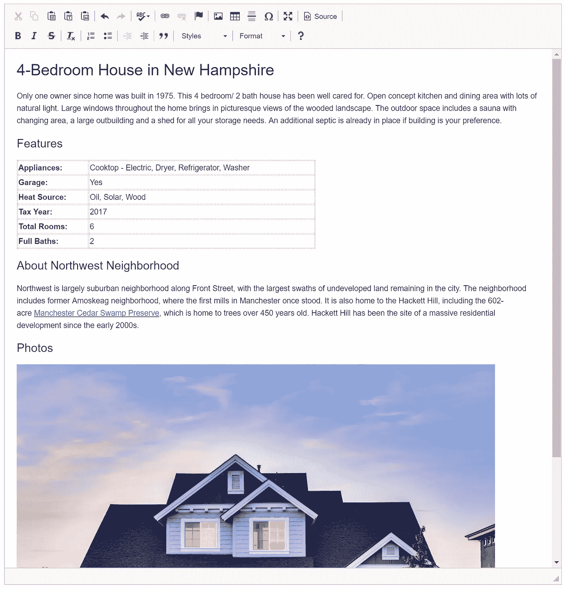
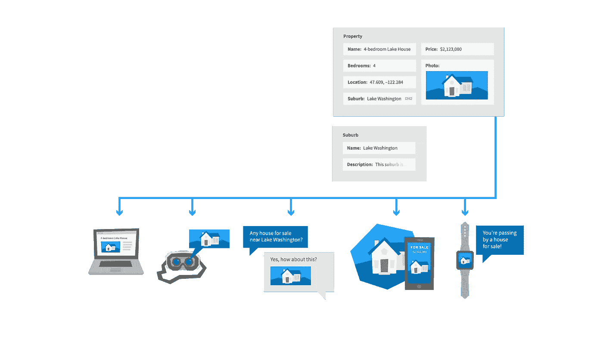
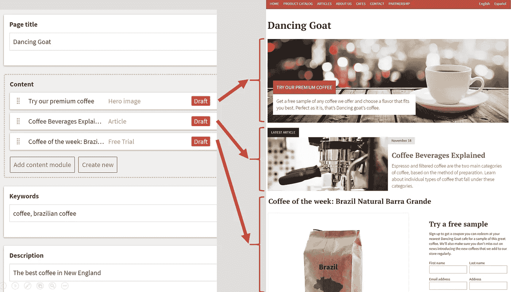
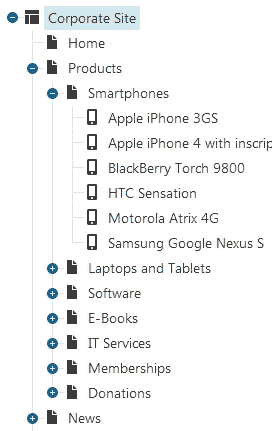
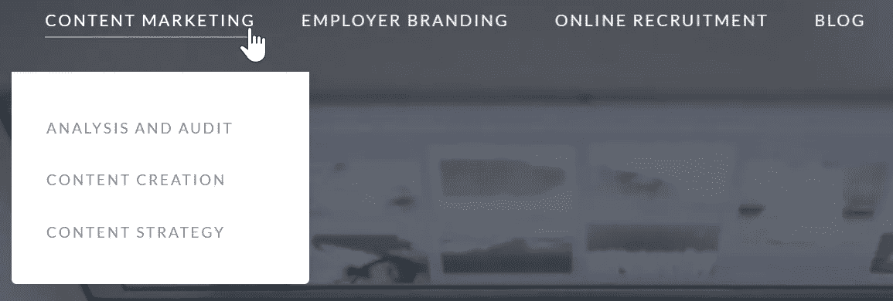
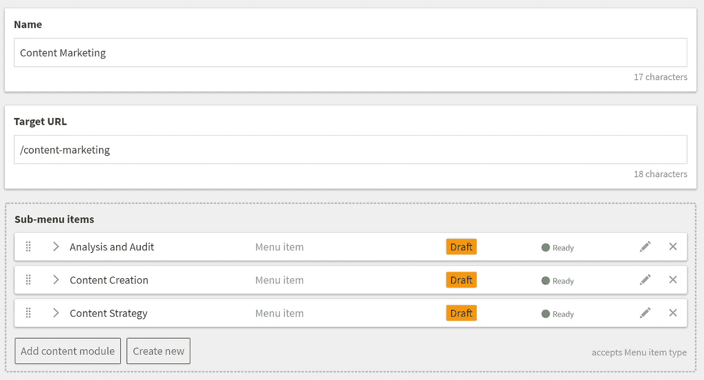

# 迁移到一个无头 CMS？首先改变你的心态！

> 原文：<https://medium.com/hackernoon/headless-cms-first-change-your-mindset-e9f6d8b6a41e>

**无头 CMS 迅速赢得开发者的芳心。然而，当你开始你的第一个项目时，你很快意识到它需要不同的思维方式。如果你不改变你对内容的看法，你的项目注定会失败。**

Source: [https://pixabay.com/en/ancient-meditation-architecture-1807518/](https://pixabay.com/en/ancient-meditation-architecture-1807518/)

在 CMS 行业呆了 15 年之后，我可以说 headless CMS 是真正的革命性产品。它通过将内容和表示严格分离，将我们带回到内容管理的根本。

很自然，这种变化会带来相当多的困惑和不确定性。

当我与第一次实现无头 CMS 的人交谈时，我经常听到这样的问题:

**“没有开发人员，我如何让营销人员创建新页面？”**

**“我们如何管理我们的航行？”**

**“我最喜欢的插件在哪里？”**

在开始第一个项目之前，理解 headless CMS 的概念是非常重要的。如果您跳过这一步，您将尝试弯曲 headless CMS 来像传统的 CMS 一样工作。

结果，您将最终得到一个糟糕的实现，而没有意识到无头方法的好处。

# #1:首先考虑内容，其次才是展示

许多与内容相关的项目从一开始就注定失败，因为它们从一个错误的目标开始:**“我们需要重新设计我们的网站！”**

所以你去设计你的关键页面，然后用内容填充它们。

这有什么不好？围绕演示文稿创建内容会浪费你的时间。

**后来，当你决定重新设计你的网站或构建一个手机应用程序或聊天机器人时，你可能需要从头再来。**

为了避免这种浪费，你应该退一步，从**一个清晰的内容策略**开始:

*   谁是我的观众？
*   他们的客户之旅是怎样的，每一步都需要哪些内容？
*   我们需要通过哪些渠道进行沟通？
*   我如何组织内容，以便可以在不同的地方和渠道重用它？

一旦有了内容策略，您就可以为每个频道创建内容，然后是呈现/交互层。

> Headless CMS 被设计为内容优先。这意味着你需要从“你想说什么”开始，而不是“如何表达”

# #2:设计跨渠道重用的内容模型

实际上，还有一个步骤:在开始编写内容之前，需要定义内容模型。

内容模型对于内容就像数据库结构对于数据一样。它描述了您创建的内容(内容类型)、内容的结构(属性)、描述方式(元数据)、分类方式(分类)以及各个内容类型之间的关系(关系)。

那么，使用无头 CMS 进行内容建模有什么不同呢？

关键是以一种易于重用的方式组织和构建内容。

如果你正在使用一些博客平台，你可能倾向于将所有内容视为一篇带有“博客文章标题”和单个“博客文章正文”字段的博客文章:

Unstructured content that can’t be reused

你可以对一个无头 CMS 使用同样的方法，但是你会错过无头概念的一个巨大优势——创建可以在任何设备和频道上使用的内容的能力。

您的内容应该尽可能地独立于其呈现方式，这意味着它应该经过适当的结构化、分类，并使用元数据进行增强:

Structured content that can be reused across channels

您只需创建一次，就可以在多个网站上使用它，包括您的移动应用、电子邮件营销、聊天机器人、数字助理、店内展示、AR/VR 应用等。

随着频道和设备数量的持续增长，以一种便于将来重复使用的方式创建内容变得更加重要。

> 经过深思熟虑的内容模型意味着更高的内容投资回报，因为您可以在多个应用程序中重用内容，并在多次重新设计中延长其生命周期。

# #3:打破所见即所得的瘾

内容编辑最关心的是他们**不能在他们网站**的上下文中编辑内容。

这并不奇怪，因为 WYSIWYG 编辑长期以来一直是传统 CMSs 的一大价值主张，旨在提供编辑页面的最准确视图。

太容易上瘾了！

**问题是，这种方法导致为特定的频道和设计创建内容，而不是创建可以轻松重用的内容。**

你希望你的内容编辑专注于他们想说什么，而不是如何显示，因为展示和渠道迟早会改变。

> 在你的内容编辑开始使用新的 CMS 之前，确保他们明白为什么他们需要关注内容，而不是表现。如果你没有得到他们的认可，你的项目就有风险。

# #4:以正确的方式授权给你的营销人员

多年来，CMS 供应商一直在竞争谁能提供最先进的拖放页面生成器，让营销人员能够在没有开发人员帮助的情况下构建登录页面。

由于营销人员发现这种功能非常重要，他们的第一个问题是:“我如何用一个无头 CMS 做到这一点？”

通过将页面分成关键元素，如英雄形象、最新文章或特色产品，您可以使用无头 CMS 获得相同的结果。然后，你的营销人员可以通过**组合可重用组件**来组装一个新页面。这里有一个例子:

Empower marketers with modular content

虽然这种方法看起来不如可视化页面生成器有吸引力，但它允许您以结构化、可重用的格式存储内容，同时增强营销人员的能力。

> 去 headless 可能会带来一些短期的不适，这些不适被可重用内容的长期好处所压倒，这些可重用内容将在多次重新设计后仍然存在。

# #5:重新思考导航

在传统的 CMS 世界中，内容通常被组织在页面的**树层次结构**中，它也定义了导航。它可能看起来像这样:

Web-oriented navigation in a traditional CMS

**虽然这对于内容编辑来说非常直观，但在你的网站之外可能就行不通了。你的移动应用或聊天机器人通常会使用不同的方式来导航用户。**

这就是为什么大多数无头 CMS 不会以这种方式组织内容。

尽管如此，在某些情况下，您需要授权用户能够显式地管理导航的某些部分。想象一个这样的网站菜单:

**当你的公司决定在主菜单上增加一项服务时会发生什么？** **你一定要让你的开发者改变代码中的导航吗？**

解决方案是将导航建模为内容。

您可以创建一个定制内容类型**,用名称、目标 URL 等属性来表示菜单项**。

到目前为止，一切顺利。但是如何定义子菜单呢？

幸运的是，今天大多数无头 CMS 提供了一些方法来定义内容项之间的关系。所以你可以用那些来定义**菜单项**之间的父子关系。

下面是一个如何从上图中定义第一个菜单项及其子菜单的示例:

Defining navigation using a custom content type in a headless CMS

通过这种方式，您可以为您的网站、移动应用程序或聊天机器人定义各种导航。与传统的 CMS 方法相比，它可能不够直观，但是它提供了更多的灵活性。

# #6:使用 API 而不是插件

Headless CMS 使用了一种非常不同的构建应用程序的哲学。

在传统的 CMS 模式中，您将安装 CMS，然后在其上构建您的网站，并且您将利用内置模块或第三方插件来实现您的应用程序中的某些功能。

你的网站需要一个受密码保护的部分吗？还是简单的购物车？还是时事通讯？有一个插件可以做到这一点！

**这种方法的问题是你被锁定在你的 CMS 和它的插件生态系统中。当您决定迁移到另一个 CMS 时，您唯一的选择就是完全重写您的应用程序。**

Headless CMS 专注于一件事，而且做得很好:通过它的 API 进行内容管理和内容交付。这意味着**你把你的应用作为一个独立的项目来构建，你只把 CMS 作为一个为你提供内容的 API**。

需要转到另一个 CMS？只需迁移您的内容并切换到另一个 API！

现在你的异议一定是“但是我需要自己写所有的东西！”

幸运的是，越来越多的服务提供了设计良好的 API，可以用来代替插件。Auth0、Stripe 或 SendGrid 只是几个例子。

> 在无头世界里，CMS 不再是你的开发平台。相反，您可以使用标准开发框架来构建您的应用程序，并利用各种 API，其中之一就是 CMS。这最初可能需要更多的工作，但它减少了供应商锁定，并导致更清晰的解决方案架构。

# 最后一条建议:从小处着手，避免大失败

如您所见，headless CMS 不仅仅是另一个内容管理系统。

它需要一种不同的方法来构建应用程序和思考内容。

为了最大限度地降低这种变化带来的风险，从一个小的试点项目开始，通过犯小错误来帮助你学习，而不是从一开始就冒大失败的风险。

如果你喜欢这篇文章，请鼓掌、分享或在下面发表你的评论。

*完全披露:我是 Kentico Software 的创始人，* [Kentico Cloud 背后的领先 CMS 供应商，云优先的无头 CMS](https://kenticocloud.com) ，以及*的作者。虽然我写这篇文章的初衷是好的，但我的观点可能有失偏颇。*

*如果你想了解更多关于无头 CMS 的概念，下载我的电子书* [无头 CMS 的终极指南](https://kenticocloud.com/headless-cms-guide) *它解释了无头 CMS 的架构、用例以及优缺点。*